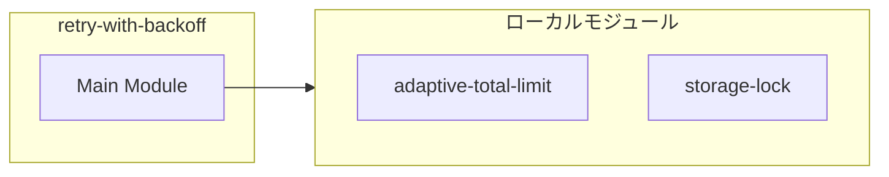
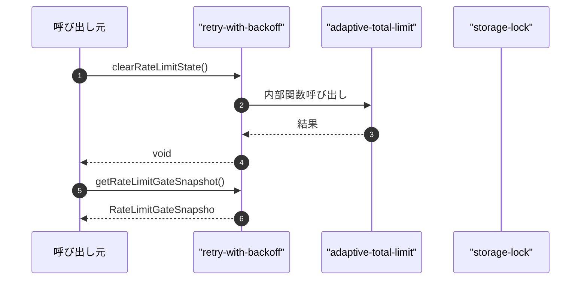

# retry-with-backoff

## 概要

`retry-with-backoff` モジュールのAPIリファレンス。

## インポート

```typescript
// from 'node:fs': existsSync, mkdirSync, readFileSync, ...
// from 'node:os': homedir
// from 'node:path': join
// from './adaptive-total-limit.js': recordTotalLimitObservation
// from './storage-lock.js': withFileLock
```

## エクスポート一覧

| 種別 | 名前 | 説明 |
|------|------|------|
| 関数 | `clearRateLimitState` | 状態をクリアする |
| 関数 | `getRateLimitGateSnapshot` | - |
| 関数 | `resolveRetryWithBackoffConfig` | 再試行設定の解決とマージ |
| 関数 | `extractRetryStatusCode` | エラーからステータスコード抽出 |
| 関数 | `isNetworkErrorRetryable` | ネットワークエラーが再試行可能か判定 |
| 関数 | `computeBackoffDelayMs` | バックオフ遅延時間計算 |
| 関数 | `retryWithBackoff` | 指数関数的バックオフで再試行 |
| インターフェース | `RetryWithBackoffConfig` | リトライ設定を定義 |
| インターフェース | `RetryAttemptContext` | - |
| インターフェース | `RateLimitGateSnapshot` | - |
| インターフェース | `RateLimitWaitContext` | - |
| 型 | `RetryJitterMode` | リトライ時のジッターモード |
| 型 | `RetryWithBackoffOverrides` | - |

## 図解

### クラス図

```mermaid
classDiagram
  class RetryWithBackoffConfig {
    <<interface>>
    +maxRetries: number
    +initialDelayMs: number
    +maxDelayMs: number
    +multiplier: number
    +jitter: RetryJitterMode
  }
  class RetryAttemptContext {
    <<interface>>
    +attempt: number
    +maxRetries: number
    +delayMs: number
    +statusCode: number
    +error: unknown
  }
  class RetryWithBackoffOptions {
    <<interface>>
    +cwd: string
    +overrides: RetryWithBackoffOver
    +signal: AbortSignal
    +now: number
    +rateLimitKey: string
  }
  class SharedRateLimitStateEntry {
    <<interface>>
    +untilMs: number
    +hits: number
    +updatedAtMs: number
  }
  class SharedRateLimitState {
    <<interface>>
    +entries: Map_string_SharedRat
  }
  class RateLimitGateSnapshot {
    <<interface>>
    +key: string
    +waitMs: number
    +hits: number
    +untilMs: number
  }
  class RateLimitWaitContext {
    <<interface>>
    +key: string
    +waitMs: number
    +hits: number
    +untilMs: number
  }
  class RetryTimeOptions {
    <<interface>>
    +now: number
  }
```



### 依存関係図



### 関数フロー

```mermaid
flowchart TD
  applyJitter["applyJitter()"]
  clampInteger["clampInteger()"]
  clearRateLimitState["clearRateLimitState()"]
  computeBackoffDelayMs["computeBackoffDelayMs()"]
  createAbortError["createAbortError()"]
  createRateLimitFastFailError["createRateLimitFastFailError()"]
  createRateLimitKeyScope["createRateLimitKeyScope()"]
  extractRetryStatusCode["extractRetryStatusCode()"]
  getRateLimitGateSnapshot["getRateLimitGateSnapshot()"]
  getSharedRateLimitState["getSharedRateLimitState()"]
  isNetworkErrorRetryable["isNetworkErrorRetryable()"]
  normalizeRateLimitKey["normalizeRateLimitKey()"]
  pruneRateLimitState["pruneRateLimitState()"]
  readConfigOverrides["readConfigOverrides()"]
  registerRateLimitGateHit["registerRateLimitGateHit()"]
  registerRateLimitGateSuccess["registerRateLimitGateSuccess()"]
  resolveRetryWithBackoffConfig["resolveRetryWithBackoffConfig()"]
  retryWithBackoff["retryWithBackoff()"]
  sanitizeOverrides["sanitizeOverrides()"]
  selectLongestRateLimitGate["selectLongestRateLimitGate()"]
  sleepWithAbort["sleepWithAbort()"]
  toOptionalNonNegativeInt["toOptionalNonNegativeInt()"]
  toOptionalPositiveInt["toOptionalPositiveInt()"]
  withSharedRateLimitState["withSharedRateLimitState()"]
  computeBackoffDelayMs --> applyJitter
  extractRetryStatusCode --> clampInteger
  getRateLimitGateSnapshot --> getSharedRateLimitState
  getRateLimitGateSnapshot --> normalizeRateLimitKey
  getRateLimitGateSnapshot --> withSharedRateLimitState
  isNetworkErrorRetryable --> extractRetryStatusCode
  resolveRetryWithBackoffConfig --> readConfigOverrides
  resolveRetryWithBackoffConfig --> sanitizeOverrides
  retryWithBackoff --> computeBackoffDelayMs
  retryWithBackoff --> createAbortError
  retryWithBackoff --> createRateLimitFastFailError
  retryWithBackoff --> createRateLimitKeyScope
  retryWithBackoff --> extractRetryStatusCode
  retryWithBackoff --> getRateLimitGateSnapshot
  retryWithBackoff --> isNetworkErrorRetryable
  retryWithBackoff --> normalizeRateLimitKey
  retryWithBackoff --> registerRateLimitGateHit
  retryWithBackoff --> registerRateLimitGateSuccess
  retryWithBackoff --> resolveRetryWithBackoffConfig
  retryWithBackoff --> selectLongestRateLimitGate
  retryWithBackoff --> sleepWithAbort
  retryWithBackoff --> toOptionalNonNegativeInt
  retryWithBackoff --> toOptionalPositiveInt
  withSharedRateLimitState --> getSharedRateLimitState
  withSharedRateLimitState --> pruneRateLimitState
```



### シーケンス図



## 関数

### clearRateLimitState

```typescript
clearRateLimitState(): void
```

状態をクリアする

**戻り値**: `void`

### scheduleWritePersistedState

```typescript
scheduleWritePersistedState(): void
```

**戻り値**: `void`

### toFiniteNumber

```typescript
toFiniteNumber(value: unknown): number | undefined
```

**パラメータ**

| 名前 | 型 | 必須 |
|------|-----|------|
| value | `unknown` | はい |

**戻り値**: `number | undefined`

### clampInteger

```typescript
clampInteger(value: number, min: number, max: number): number
```

**パラメータ**

| 名前 | 型 | 必須 |
|------|-----|------|
| value | `number` | はい |
| min | `number` | はい |
| max | `number` | はい |

**戻り値**: `number`

### clampFloat

```typescript
clampFloat(value: number, min: number, max: number): number
```

**パラメータ**

| 名前 | 型 | 必須 |
|------|-----|------|
| value | `number` | はい |
| min | `number` | はい |
| max | `number` | はい |

**戻り値**: `number`

### normalizeJitter

```typescript
normalizeJitter(value: unknown): RetryJitterMode | undefined
```

**パラメータ**

| 名前 | 型 | 必須 |
|------|-----|------|
| value | `unknown` | はい |

**戻り値**: `RetryJitterMode | undefined`

### sanitizeOverrides

```typescript
sanitizeOverrides(overrides: RetryWithBackoffOverrides | undefined): RetryWithBackoffOverrides
```

**パラメータ**

| 名前 | 型 | 必須 |
|------|-----|------|
| overrides | `RetryWithBackoffOverrides | undefined` | はい |

**戻り値**: `RetryWithBackoffOverrides`

### readConfigOverrides

```typescript
readConfigOverrides(cwd: string | undefined): RetryWithBackoffOverrides
```

**パラメータ**

| 名前 | 型 | 必須 |
|------|-----|------|
| cwd | `string | undefined` | はい |

**戻り値**: `RetryWithBackoffOverrides`

### normalizeRateLimitKey

```typescript
normalizeRateLimitKey(input: string | undefined): string
```

**パラメータ**

| 名前 | 型 | 必須 |
|------|-----|------|
| input | `string | undefined` | はい |

**戻り値**: `string`

### createRateLimitKeyScope

```typescript
createRateLimitKeyScope(rateLimitKey: string | undefined): string[]
```

**パラメータ**

| 名前 | 型 | 必須 |
|------|-----|------|
| rateLimitKey | `string | undefined` | はい |

**戻り値**: `string[]`

### selectLongestRateLimitGate

```typescript
selectLongestRateLimitGate(gates: RateLimitGateSnapshot[], nowMs: number): RateLimitGateSnapshot
```

**パラメータ**

| 名前 | 型 | 必須 |
|------|-----|------|
| gates | `RateLimitGateSnapshot[]` | はい |
| nowMs | `number` | はい |

**戻り値**: `RateLimitGateSnapshot`

### getSharedRateLimitState

```typescript
getSharedRateLimitState(): SharedRateLimitState
```

**戻り値**: `SharedRateLimitState`

### ensureRuntimeDir

```typescript
ensureRuntimeDir(): void
```

**戻り値**: `void`

### readPersistedRateLimitState

```typescript
readPersistedRateLimitState(nowMs: number): Map<string, SharedRateLimitStateEntry>
```

**パラメータ**

| 名前 | 型 | 必須 |
|------|-----|------|
| nowMs | `number` | はい |

**戻り値**: `Map<string, SharedRateLimitStateEntry>`

### writePersistedRateLimitState

```typescript
writePersistedRateLimitState(state: SharedRateLimitState): void
```

**パラメータ**

| 名前 | 型 | 必須 |
|------|-----|------|
| state | `SharedRateLimitState` | はい |

**戻り値**: `void`

### mergeEntriesInPlace

```typescript
mergeEntriesInPlace(target: Map<string, SharedRateLimitStateEntry>, incoming: Map<string, SharedRateLimitStateEntry>): void
```

**パラメータ**

| 名前 | 型 | 必須 |
|------|-----|------|
| target | `Map<string, SharedRateLimitStateEntry>` | はい |
| incoming | `Map<string, SharedRateLimitStateEntry>` | はい |

**戻り値**: `void`

### withSharedRateLimitState

```typescript
withSharedRateLimitState(nowMs: number, mutator: () => T): T
```

**パラメータ**

| 名前 | 型 | 必須 |
|------|-----|------|
| nowMs | `number` | はい |
| mutator | `() => T` | はい |

**戻り値**: `T`

### fallback

```typescript
fallback(): void
```

**戻り値**: `void`

### pruneRateLimitState

```typescript
pruneRateLimitState(nowMs: number, state: SharedRateLimitState): void
```

**パラメータ**

| 名前 | 型 | 必須 |
|------|-----|------|
| nowMs | `number` | はい |
| state | `SharedRateLimitState` | はい |

**戻り値**: `void`

### enforceRateLimitEntryCap

```typescript
enforceRateLimitEntryCap(state: SharedRateLimitState): void
```

**パラメータ**

| 名前 | 型 | 必須 |
|------|-----|------|
| state | `SharedRateLimitState` | はい |

**戻り値**: `void`

### getRateLimitGateSnapshot

```typescript
getRateLimitGateSnapshot(key: string | undefined, timeOptions: RetryTimeOptions): RateLimitGateSnapshot
```

**パラメータ**

| 名前 | 型 | 必須 |
|------|-----|------|
| key | `string | undefined` | はい |
| timeOptions | `RetryTimeOptions` | はい |

**戻り値**: `RateLimitGateSnapshot`

### registerRateLimitGateHit

```typescript
registerRateLimitGateHit(key: string | undefined, retryDelayMs: number, now: () => number): RateLimitGateSnapshot
```

**パラメータ**

| 名前 | 型 | 必須 |
|------|-----|------|
| key | `string | undefined` | はい |
| retryDelayMs | `number` | はい |
| now | `() => number` | はい |

**戻り値**: `RateLimitGateSnapshot`

### registerRateLimitGateSuccess

```typescript
registerRateLimitGateSuccess(key: string | undefined, now: () => number): void
```

**パラメータ**

| 名前 | 型 | 必須 |
|------|-----|------|
| key | `string | undefined` | はい |
| now | `() => number` | はい |

**戻り値**: `void`

### resolveRetryWithBackoffConfig

```typescript
resolveRetryWithBackoffConfig(cwd?: string, overrides?: RetryWithBackoffOverrides): RetryWithBackoffConfig
```

再試行設定の解決とマージ

**パラメータ**

| 名前 | 型 | 必須 |
|------|-----|------|
| cwd | `string` | いいえ |
| overrides | `RetryWithBackoffOverrides` | いいえ |

**戻り値**: `RetryWithBackoffConfig`

### extractRetryStatusCode

```typescript
extractRetryStatusCode(error: unknown): number | undefined
```

エラーからステータスコード抽出

**パラメータ**

| 名前 | 型 | 必須 |
|------|-----|------|
| error | `unknown` | はい |

**戻り値**: `number | undefined`

### isNetworkErrorRetryable

```typescript
isNetworkErrorRetryable(error: unknown, statusCode?: number): boolean
```

ネットワークエラーが再試行可能か判定

**パラメータ**

| 名前 | 型 | 必須 |
|------|-----|------|
| error | `unknown` | はい |
| statusCode | `number` | いいえ |

**戻り値**: `boolean`

### applyJitter

```typescript
applyJitter(delayMs: number, jitter: RetryJitterMode): number
```

**パラメータ**

| 名前 | 型 | 必須 |
|------|-----|------|
| delayMs | `number` | はい |
| jitter | `RetryJitterMode` | はい |

**戻り値**: `number`

### computeBackoffDelayMs

```typescript
computeBackoffDelayMs(attempt: number, config: RetryWithBackoffConfig): number
```

バックオフ遅延時間計算

**パラメータ**

| 名前 | 型 | 必須 |
|------|-----|------|
| attempt | `number` | はい |
| config | `RetryWithBackoffConfig` | はい |

**戻り値**: `number`

### createAbortError

```typescript
createAbortError(): Error
```

**戻り値**: `Error`

### createRateLimitFastFailError

```typescript
createRateLimitFastFailError(message: string): Error
```

**パラメータ**

| 名前 | 型 | 必須 |
|------|-----|------|
| message | `string` | はい |

**戻り値**: `Error`

### toOptionalNonNegativeInt

```typescript
toOptionalNonNegativeInt(value: unknown, fallback: number, max: any): number
```

**パラメータ**

| 名前 | 型 | 必須 |
|------|-----|------|
| value | `unknown` | はい |
| fallback | `number` | はい |
| max | `any` | はい |

**戻り値**: `number`

### toOptionalPositiveInt

```typescript
toOptionalPositiveInt(value: unknown, fallback: number): number
```

**パラメータ**

| 名前 | 型 | 必須 |
|------|-----|------|
| value | `unknown` | はい |
| fallback | `number` | はい |

**戻り値**: `number`

### sleepWithAbort

```typescript
sleepWithAbort(delayMs: number, signal?: AbortSignal): Promise<void>
```

**パラメータ**

| 名前 | 型 | 必須 |
|------|-----|------|
| delayMs | `number` | はい |
| signal | `AbortSignal` | いいえ |

**戻り値**: `Promise<void>`

### onAbort

```typescript
onAbort(): void
```

**戻り値**: `void`

### cleanup

```typescript
cleanup(): void
```

**戻り値**: `void`

### retryWithBackoff

```typescript
async retryWithBackoff(operation: () => Promise<T>, options: RetryWithBackoffOptions): Promise<T>
```

指数関数的バックオフで再試行

**パラメータ**

| 名前 | 型 | 必須 |
|------|-----|------|
| operation | `() => Promise<T>` | はい |
| options | `RetryWithBackoffOptions` | はい |

**戻り値**: `Promise<T>`

## インターフェース

### RetryWithBackoffConfig

```typescript
interface RetryWithBackoffConfig {
  maxRetries: number;
  initialDelayMs: number;
  maxDelayMs: number;
  multiplier: number;
  jitter: RetryJitterMode;
}
```

リトライ設定を定義

### RetryAttemptContext

```typescript
interface RetryAttemptContext {
  attempt: number;
  maxRetries: number;
  delayMs: number;
  statusCode?: number;
  error: unknown;
}
```

### RetryWithBackoffOptions

```typescript
interface RetryWithBackoffOptions {
  cwd?: string;
  overrides?: RetryWithBackoffOverrides;
  signal?: AbortSignal;
  now?: () => number;
  rateLimitKey?: string;
  maxRateLimitRetries?: number;
  maxRateLimitWaitMs?: number;
  onRateLimitWait?: (context: RateLimitWaitContext) => void;
  onRetry?: (context: RetryAttemptContext) => void;
  shouldRetry?: (error: unknown, statusCode?: number) => boolean;
}
```

### SharedRateLimitStateEntry

```typescript
interface SharedRateLimitStateEntry {
  untilMs: number;
  hits: number;
  updatedAtMs: number;
}
```

### SharedRateLimitState

```typescript
interface SharedRateLimitState {
  entries: Map<string, SharedRateLimitStateEntry>;
}
```

### RateLimitGateSnapshot

```typescript
interface RateLimitGateSnapshot {
  key: string;
  waitMs: number;
  hits: number;
  untilMs: number;
}
```

### RateLimitWaitContext

```typescript
interface RateLimitWaitContext {
  key: string;
  waitMs: number;
  hits: number;
  untilMs: number;
}
```

### RetryTimeOptions

```typescript
interface RetryTimeOptions {
  now?: () => number;
}
```

## 型定義

### RetryJitterMode

```typescript
type RetryJitterMode = "full" | "partial" | "none"
```

リトライ時のジッターモード

### RetryWithBackoffOverrides

```typescript
type RetryWithBackoffOverrides = Partial<RetryWithBackoffConfig>
```

### PersistedRateLimitState

```typescript
type PersistedRateLimitState = {
  version: number;
  updatedAt: string;
  entries: Record<string, SharedRateLimitStateEntry>;
}
```

---
*自動生成: 2026-02-24T17:08:02.753Z*
