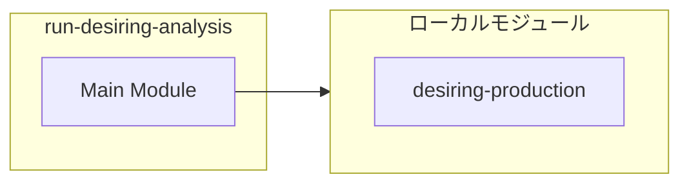

# run-desiring-analysis

## 概要

`run-desiring-analysis` モジュールのAPIリファレンス。

## インポート

```typescript
// from './desiring-production.js': analyzeDesiringProduction, getRhizomeReport, findDisconfirmingEvidence
```

## エクスポート一覧

| 種別 | 名前 | 説明 |
|------|------|------|
| 関数 | `runDesiringAnalysis` | 欲望-生産分析を実行し、レポートを表示 |

## 図解

### 依存関係図



## 関数

### runDesiringAnalysis

```typescript
runDesiringAnalysis(): void
```

欲望-生産分析を実行し、レポートを表示

**戻り値**: `void`

---
*自動生成: 2026-02-24T17:08:02.754Z*
