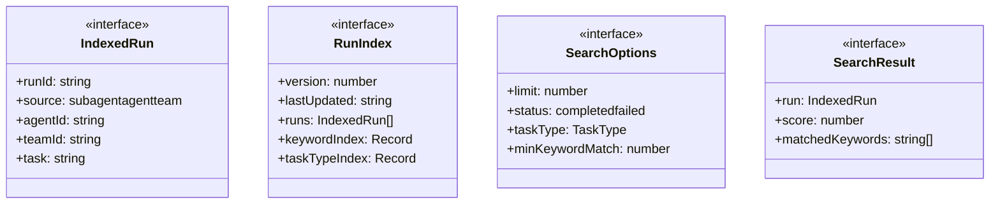
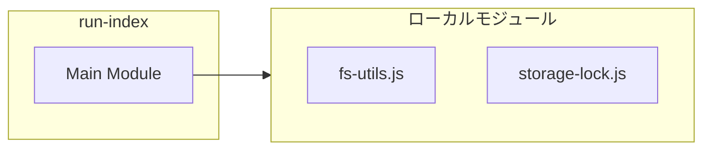
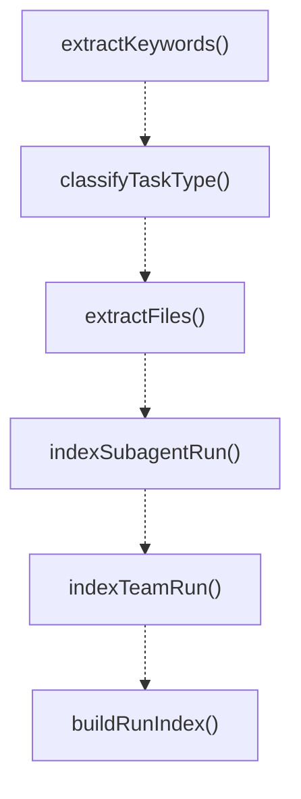
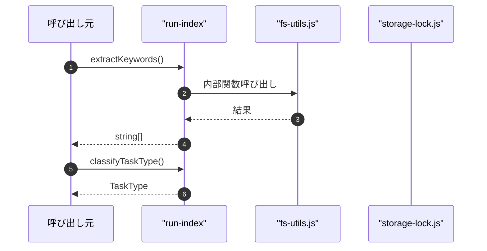

# run-index

## 概要

`run-index` モジュールのAPIリファレンス。

## インポート

```typescript
import { existsSync, readFileSync } from 'node:fs';
import { join } from 'node:path';
import { ensureDir } from './fs-utils.js';
import { atomicWriteTextFile } from './storage-lock.js';
```

## エクスポート一覧

| 種別 | 名前 | 説明 |
|------|------|------|
| 関数 | `extractKeywords` | Extract keywords from text using simple heuristics |
| 関数 | `classifyTaskType` | Classify task type based on keywords. |
| 関数 | `extractFiles` | Extract file paths from text. |
| 関数 | `indexSubagentRun` | Build an indexed run from a subagent run record. |
| 関数 | `indexTeamRun` | Build an indexed run from a team run record. |
| 関数 | `buildRunIndex` | Build the complete run index from storage files. |
| 関数 | `getRunIndexPath` | Get the path to the run index file. |
| 関数 | `loadRunIndex` | Load the run index from disk. |
| 関数 | `saveRunIndex` | Save the run index to disk. |
| 関数 | `getOrBuildRunIndex` | Get or build the run index. |
| 関数 | `searchRuns` | Search for runs matching a query. |
| 関数 | `findSimilarRuns` | Find similar past runs based on task description. |
| 関数 | `getRunsByType` | Get runs by task type. |
| 関数 | `getSuccessfulPatterns` | Get successful patterns for a given task type. |
| インターフェース | `IndexedRun` | Indexed run record with extracted keywords and tag |
| インターフェース | `RunIndex` | Run index structure. |
| インターフェース | `SearchOptions` | Search options for querying the index. |
| インターフェース | `SearchResult` | Search result with relevance score. |
| 型 | `TaskType` | Task type classification. |

## 図解

### クラス図



### 依存関係図



### 関数フロー



### シーケンス図



## 関数

### extractKeywords

```typescript
extractKeywords(text: string): string[]
```

Extract keywords from text using simple heuristics.

**パラメータ**

| 名前 | 型 | 必須 |
|------|-----|------|
| text | `string` | はい |

**戻り値**: `string[]`

### classifyTaskType

```typescript
classifyTaskType(task: string, summary: string): TaskType
```

Classify task type based on keywords.

**パラメータ**

| 名前 | 型 | 必須 |
|------|-----|------|
| task | `string` | はい |
| summary | `string` | はい |

**戻り値**: `TaskType`

### extractFiles

```typescript
extractFiles(text: string): string[]
```

Extract file paths from text.

**パラメータ**

| 名前 | 型 | 必須 |
|------|-----|------|
| text | `string` | はい |

**戻り値**: `string[]`

### indexSubagentRun

```typescript
indexSubagentRun(run: {
    runId: string;
    agentId: string;
    task: string;
    summary: string;
    status: "completed" | "failed";
    startedAt: string;
    finishedAt: string;
  }): IndexedRun
```

Build an indexed run from a subagent run record.

**パラメータ**

| 名前 | 型 | 必須 |
|------|-----|------|
| run | `{
    runId: string;
    agentId: string;
    task: string;
    summary: string;
    status: "completed" | "failed";
    startedAt: string;
    finishedAt: string;
  }` | はい |

**戻り値**: `IndexedRun`

### indexTeamRun

```typescript
indexTeamRun(run: {
    runId: string;
    teamId: string;
    task: string;
    summary: string;
    status: "completed" | "failed";
    startedAt: string;
    finishedAt: string;
  }): IndexedRun
```

Build an indexed run from a team run record.

**パラメータ**

| 名前 | 型 | 必須 |
|------|-----|------|
| run | `{
    runId: string;
    teamId: string;
    task: string;
    summary: string;
    status: "completed" | "failed";
    startedAt: string;
    finishedAt: string;
  }` | はい |

**戻り値**: `IndexedRun`

### buildRunIndex

```typescript
buildRunIndex(cwd: string): RunIndex
```

Build the complete run index from storage files.

**パラメータ**

| 名前 | 型 | 必須 |
|------|-----|------|
| cwd | `string` | はい |

**戻り値**: `RunIndex`

### getRunIndexPath

```typescript
getRunIndexPath(cwd: string): string
```

Get the path to the run index file.

**パラメータ**

| 名前 | 型 | 必須 |
|------|-----|------|
| cwd | `string` | はい |

**戻り値**: `string`

### loadRunIndex

```typescript
loadRunIndex(cwd: string): RunIndex | null
```

Load the run index from disk.

**パラメータ**

| 名前 | 型 | 必須 |
|------|-----|------|
| cwd | `string` | はい |

**戻り値**: `RunIndex | null`

### saveRunIndex

```typescript
saveRunIndex(cwd: string, index: RunIndex): void
```

Save the run index to disk.

**パラメータ**

| 名前 | 型 | 必須 |
|------|-----|------|
| cwd | `string` | はい |
| index | `RunIndex` | はい |

**戻り値**: `void`

### getOrBuildRunIndex

```typescript
getOrBuildRunIndex(cwd: string, maxAgeMs: number): RunIndex
```

Get or build the run index.
Returns cached index if available and recent, otherwise rebuilds.

**パラメータ**

| 名前 | 型 | 必須 |
|------|-----|------|
| cwd | `string` | はい |
| maxAgeMs | `number` | はい |

**戻り値**: `RunIndex`

### searchRuns

```typescript
searchRuns(index: RunIndex, query: string, options: SearchOptions): SearchResult[]
```

Search for runs matching a query.

**パラメータ**

| 名前 | 型 | 必須 |
|------|-----|------|
| index | `RunIndex` | はい |
| query | `string` | はい |
| options | `SearchOptions` | はい |

**戻り値**: `SearchResult[]`

### findSimilarRuns

```typescript
findSimilarRuns(index: RunIndex, task: string, limit: number): SearchResult[]
```

Find similar past runs based on task description.

**パラメータ**

| 名前 | 型 | 必須 |
|------|-----|------|
| index | `RunIndex` | はい |
| task | `string` | はい |
| limit | `number` | はい |

**戻り値**: `SearchResult[]`

### getRunsByType

```typescript
getRunsByType(index: RunIndex, taskType: TaskType): IndexedRun[]
```

Get runs by task type.

**パラメータ**

| 名前 | 型 | 必須 |
|------|-----|------|
| index | `RunIndex` | はい |
| taskType | `TaskType` | はい |

**戻り値**: `IndexedRun[]`

### getSuccessfulPatterns

```typescript
getSuccessfulPatterns(index: RunIndex, taskType: TaskType, limit: number): IndexedRun[]
```

Get successful patterns for a given task type.

**パラメータ**

| 名前 | 型 | 必須 |
|------|-----|------|
| index | `RunIndex` | はい |
| taskType | `TaskType` | はい |
| limit | `number` | はい |

**戻り値**: `IndexedRun[]`

## インターフェース

### IndexedRun

```typescript
interface IndexedRun {
  runId: string;
  source: "subagent" | "agent-team";
  agentId?: string;
  teamId?: string;
  task: string;
  summary: string;
  status: "completed" | "failed";
  keywords: string[];
  taskType: TaskType;
  files: string[];
  timestamp: string;
  successPattern?: string;
  failurePattern?: string;
}
```

Indexed run record with extracted keywords and tags.

### RunIndex

```typescript
interface RunIndex {
  version: number;
  lastUpdated: string;
  runs: IndexedRun[];
  keywordIndex: Record<string, string[]>;
  taskTypeIndex: Record<TaskType, string[]>;
}
```

Run index structure.

### SearchOptions

```typescript
interface SearchOptions {
  limit?: number;
  status?: "completed" | "failed";
  taskType?: TaskType;
  minKeywordMatch?: number;
}
```

Search options for querying the index.

### SearchResult

```typescript
interface SearchResult {
  run: IndexedRun;
  score: number;
  matchedKeywords: string[];
}
```

Search result with relevance score.

## 型定義

### TaskType

```typescript
type TaskType = | "code-review"
  | "bug-fix"
  | "feature-implementation"
  | "refactoring"
  | "research"
  | "documentation"
  | "testing"
  | "architecture"
  | "analysis"
  | "optimization"
  | "security"
  | "configuration"
  | "unknown"
```

Task type classification.

---
*自動生成: 2026-02-17T22:24:18.965Z*
