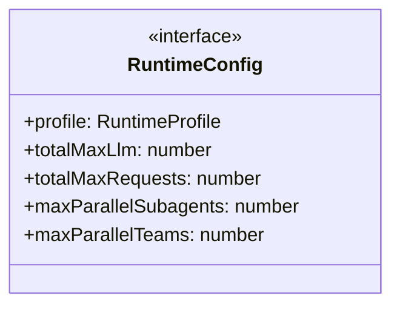
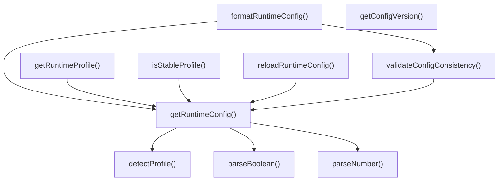

# runtime-config

## 概要

`runtime-config` モジュールのAPIリファレンス。

## エクスポート一覧

| 種別 | 名前 | 説明 |
|------|------|------|
| 関数 | `getRuntimeConfig` | ランタイム設定取得 |
| 関数 | `getConfigVersion` | 設定バージョンを取得 |
| 関数 | `reloadRuntimeConfig` | ランタイム設定を再読込 |
| 関数 | `getRuntimeProfile` | 現在のランタイムプロファイルを取得する |
| 関数 | `isStableProfile` | 安定版プロファイルか判定する |
| 関数 | `validateConfigConsistency` | 設定の一貫性を検証する |
| 関数 | `formatRuntimeConfig` | ランタイム設定を整形する |
| インターフェース | `RuntimeConfig` | ランタイム設定のインターフェース |
| 型 | `RuntimeProfile` | ランタイムプロファイルの型定義 |

## 図解

### クラス図



### 関数フロー



## 関数

### parseBoolean

```typescript
parseBoolean(value: string | undefined): boolean | undefined
```

**パラメータ**

| 名前 | 型 | 必須 |
|------|-----|------|
| value | `string | undefined` | はい |

**戻り値**: `boolean | undefined`

### parseNumber

```typescript
parseNumber(value: string | undefined, min?: number, max?: number): number | undefined
```

**パラメータ**

| 名前 | 型 | 必須 |
|------|-----|------|
| value | `string | undefined` | はい |
| min | `number` | いいえ |
| max | `number` | いいえ |

**戻り値**: `number | undefined`

### detectProfile

```typescript
detectProfile(): RuntimeProfile
```

**戻り値**: `RuntimeProfile`

### getRuntimeConfig

```typescript
getRuntimeConfig(): RuntimeConfig
```

ランタイム設定取得

**戻り値**: `RuntimeConfig`

### getConfigVersion

```typescript
getConfigVersion(): number
```

設定バージョンを取得

**戻り値**: `number`

### reloadRuntimeConfig

```typescript
reloadRuntimeConfig(): RuntimeConfig
```

ランタイム設定を再読込

**戻り値**: `RuntimeConfig`

### getRuntimeProfile

```typescript
getRuntimeProfile(): RuntimeProfile
```

現在のランタイムプロファイルを取得する

**戻り値**: `RuntimeProfile`

### isStableProfile

```typescript
isStableProfile(): boolean
```

安定版プロファイルか判定する

**戻り値**: `boolean`

### validateConfigConsistency

```typescript
validateConfigConsistency(): {
  consistent: boolean;
  warnings: string[];
  details: Record<string, unknown>;
}
```

設定の一貫性を検証する

**戻り値**: `{
  consistent: boolean;
  warnings: string[];
  details: Record<string, unknown>;
}`

### formatRuntimeConfig

```typescript
formatRuntimeConfig(): string
```

ランタイム設定を整形する

**戻り値**: `string`

## インターフェース

### RuntimeConfig

```typescript
interface RuntimeConfig {
  profile: RuntimeProfile;
  totalMaxLlm: number;
  totalMaxRequests: number;
  maxParallelSubagents: number;
  maxParallelTeams: number;
  maxParallelTeammates: number;
  maxConcurrentOrchestrations: number;
  adaptiveEnabled: boolean;
  predictiveEnabled: boolean;
  heartbeatIntervalMs: number;
  heartbeatTimeoutMs: number;
  recoveryIntervalMs: number;
  reductionFactor: number;
  recoveryFactor: number;
  maxConcurrentPerModel: number;
  maxTotalConcurrent: number;
  capacityWaitMs: number;
  capacityPollMs: number;
}
```

ランタイム設定のインターフェース

## 型定義

### RuntimeProfile

```typescript
type RuntimeProfile = "stable" | "default"
```

ランタイムプロファイルの型定義

---
*自動生成: 2026-02-23T06:29:42.406Z*
