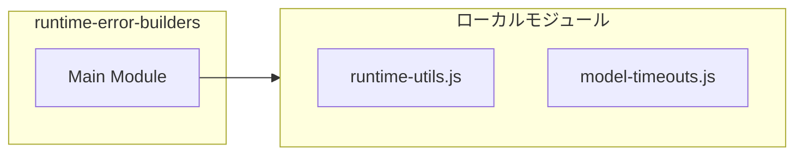

# runtime-error-builders

## 概要

`runtime-error-builders` モジュールのAPIリファレンス。

## インポート

```typescript
import { normalizeTimeoutMs } from './runtime-utils.js';
import { computeModelTimeoutMs } from './model-timeouts.js';
```

## エクスポート一覧

| 種別 | 名前 | 説明 |
|------|------|------|
| 関数 | `resolveEffectiveTimeoutMs` | Resolve effective timeout with model-specific adju |

## 図解

### 依存関係図



## 関数

### resolveEffectiveTimeoutMs

```typescript
resolveEffectiveTimeoutMs(userTimeoutMs: unknown, modelId: string | undefined, fallback: number): number
```

Resolve effective timeout with model-specific adjustment.
Priority: max(user-specified, model-specific) > default

This ensures that slow models (e.g., GLM-5) always get sufficient timeout,
even if the caller specifies a shorter timeout intended for faster models.

**パラメータ**

| 名前 | 型 | 必須 |
|------|-----|------|
| userTimeoutMs | `unknown` | はい |
| modelId | `string | undefined` | はい |
| fallback | `number` | はい |

**戻り値**: `number`

---
*自動生成: 2026-02-17T21:48:27.751Z*
