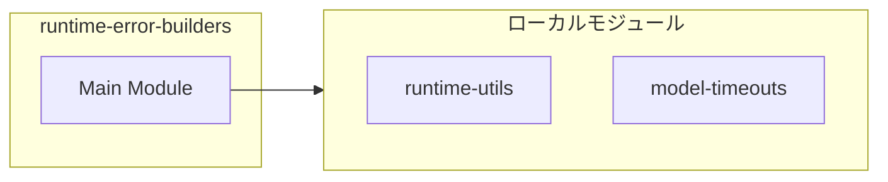

# runtime-error-builders

## 概要

`runtime-error-builders` モジュールのAPIリファレンス。

## インポート

```typescript
// from './runtime-utils.js': normalizeTimeoutMs
// from './model-timeouts.js': computeModelTimeoutMs
```

## エクスポート一覧

| 種別 | 名前 | 説明 |
|------|------|------|
| 関数 | `resolveEffectiveTimeoutMs` | タイムアウト解決 |

## 図解

### 依存関係図



## 関数

### resolveEffectiveTimeoutMs

```typescript
resolveEffectiveTimeoutMs(userTimeoutMs: unknown, modelId: string | undefined, fallback: number): number
```

タイムアウト解決

**パラメータ**

| 名前 | 型 | 必須 |
|------|-----|------|
| userTimeoutMs | `unknown` | はい |
| modelId | `string | undefined` | はい |
| fallback | `number` | はい |

**戻り値**: `number`

---
*自動生成: 2026-02-24T17:08:02.756Z*
