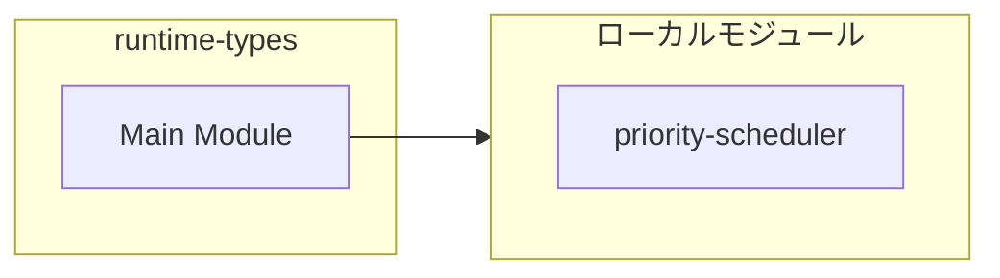

# runtime-types

## 概要

`runtime-types` モジュールのAPIリファレンス。

## インポート

```typescript
// from './priority-scheduler.js': TaskPriority, PriorityTaskMetadata
```

## エクスポート一覧

| 種別 | 名前 | 説明 |
|------|------|------|
| インターフェース | `AgentRuntimeLimits` | エージェント実行制限値 |
| インターフェース | `RuntimeQueueEntry` | ランタイムキューエントリ |
| インターフェース | `RuntimeCapacityReservationRecord` | 容量予約レコード |
| インターフェース | `RuntimePriorityStats` | 優先度統計 |
| インターフェース | `AgentRuntimeState` | エージェントランタイム状態 |
| インターフェース | `RuntimeStateProvider` | ランタイム状態を提供 |
| インターフェース | `AgentRuntimeSnapshot` | ランタイムスナップショット |
| インターフェース | `RuntimeStatusLineOptions` | ランタイムステータスラインの表示オプション |
| インターフェース | `RuntimeCapacityCheckInput` | 容量チェック入力 |
| インターフェース | `RuntimeCapacityCheck` | 容量チェック結果 |
| インターフェース | `RuntimeCapacityWaitInput` | 容量待機入力 |
| インターフェース | `RuntimeCapacityWaitResult` | 容量待機の結果 |
| インターフェース | `RuntimeCapacityReservationLease` | キャパシティ予約リース |
| インターフェース | `RuntimeCapacityReserveInput` | キャパシティ予約入力 |
| インターフェース | `RuntimeCapacityReserveResult` | キャパシティ予約結果 |
| インターフェース | `RuntimeOrchestrationWaitInput` | オーケストレーションの待機入力 |
| インターフェース | `RuntimeOrchestrationLease` | オーケストレーションのリース情報 |
| インターフェース | `RuntimeOrchestrationWaitResult` | オーケストレーション待機結果 |
| インターフェース | `RuntimeDispatchCandidate` | ディスパッチ候補 |
| インターフェース | `RuntimeDispatchPermitInput` | 統合ディスパッチ許可入力 |
| インターフェース | `RuntimeDispatchPermitLease` | 統合ディスパッチリース |
| インターフェース | `RuntimeDispatchPermitResult` | 統合ディスパッチ許可結果 |
| 型 | `RuntimeQueueClass` | ランタイムキュークラス |
| 型 | `GlobalScopeWithRuntime` | グローバルスコープ拡張型 |

## 図解

### クラス図


### 依存関係図



## インターフェース

### AgentRuntimeLimits

```typescript
interface AgentRuntimeLimits {
  maxTotalActiveLlm: number;
  maxTotalActiveRequests: number;
  maxParallelSubagentsPerRun: number;
  maxParallelTeamsPerRun: number;
  maxParallelTeammatesPerTeam: number;
  maxConcurrentOrchestrations: number;
  capacityWaitMs: number;
  capacityPollMs: number;
}
```

エージェント実行制限値

### RuntimeQueueEntry

```typescript
interface RuntimeQueueEntry {
  queueClass: RuntimeQueueClass;
  tenantKey: string;
  additionalRequests: number;
  additionalLlm: number;
  skipCount: number;
}
```

ランタイムキューエントリ

### RuntimeCapacityReservationRecord

```typescript
interface RuntimeCapacityReservationRecord {
  id: string;
  toolName: string;
  additionalRequests: number;
  additionalLlm: number;
  createdAtMs: number;
  heartbeatAtMs: number;
  expiresAtMs: number;
  consumedAtMs?: number;
}
```

容量予約レコード

### RuntimePriorityStats

```typescript
interface RuntimePriorityStats {
  critical: number;
  high: number;
  normal: number;
  low: number;
  background: number;
}
```

優先度統計

### AgentRuntimeState

```typescript
interface AgentRuntimeState {
  subagents: {
    activeRunRequests: number;
    activeAgents: number;
  };
  teams: {
    activeTeamRuns: number;
    activeTeammates: number;
  };
  queue: {
    activeOrchestrations: number;
    pending: RuntimeQueueEntry[];
    lastDispatchedTenantKey?: string;
    consecutiveDispatchesByTenant: number;
    evictedEntries: number;
    /** Priority queue statistics (updated on enqueue/dequeue) */
    priorityStats?: RuntimePriorityStats;
  };
  reservations: {
    active: RuntimeCapacityReservationRecord[];
  };
  limits: AgentRuntimeLimits;
  limitsVersion: string;
}
```

エージェントランタイム状態

### RuntimeStateProvider

```typescript
interface RuntimeStateProvider {
  getState();
  resetState();
}
```

ランタイム状態を提供

### AgentRuntimeSnapshot

```typescript
interface AgentRuntimeSnapshot {
  subagentActiveRequests: number;
  subagentActiveAgents: number;
  teamActiveRuns: number;
  teamActiveAgents: number;
  reservedRequests: number;
  reservedLlm: number;
  activeReservations: number;
  activeOrchestrations: number;
  queuedOrchestrations: number;
  queuedTools: string[];
  queueEvictions: number;
  totalActiveRequests: number;
  totalActiveLlm: number;
  limits: AgentRuntimeLimits;
  limitsVersion: string;
  priorityStats?: RuntimePriorityStats;
}
```

ランタイムスナップショット

### RuntimeStatusLineOptions

```typescript
interface RuntimeStatusLineOptions {
  title?: string;
  storedRuns?: number;
  adaptivePenalty?: number;
  adaptivePenaltyMax?: number;
}
```

ランタイムステータスラインの表示オプション

### RuntimeCapacityCheckInput

```typescript
interface RuntimeCapacityCheckInput {
  additionalRequests: number;
  additionalLlm: number;
}
```

容量チェック入力

### RuntimeCapacityCheck

```typescript
interface RuntimeCapacityCheck {
  allowed: boolean;
  reasons: string[];
  projectedRequests: number;
  projectedLlm: number;
  snapshot: AgentRuntimeSnapshot;
}
```

容量チェック結果

### RuntimeCapacityWaitInput

```typescript
interface RuntimeCapacityWaitInput {
  maxWaitMs?: number;
  pollIntervalMs?: number;
  signal?: AbortSignal;
}
```

容量待機入力

### RuntimeCapacityWaitResult

```typescript
interface RuntimeCapacityWaitResult {
  waitedMs: number;
  attempts: number;
  timedOut: boolean;
}
```

容量待機の結果

### RuntimeCapacityReservationLease

```typescript
interface RuntimeCapacityReservationLease {
  id: string;
  toolName: string;
  additionalRequests: number;
  additionalLlm: number;
  expiresAtMs: number;
  consume: () => void;
  heartbeat: (ttlMs?: number) => void;
  release: () => void;
}
```

キャパシティ予約リース

### RuntimeCapacityReserveInput

```typescript
interface RuntimeCapacityReserveInput {
  toolName?: string;
  maxWaitMs?: number;
  pollIntervalMs?: number;
  reservationTtlMs?: number;
  signal?: AbortSignal;
}
```

キャパシティ予約入力

### RuntimeCapacityReserveResult

```typescript
interface RuntimeCapacityReserveResult {
  waitedMs: number;
  attempts: number;
  timedOut: boolean;
  aborted: boolean;
  reservation?: RuntimeCapacityReservationLease;
}
```

キャパシティ予約結果

### RuntimeOrchestrationWaitInput

```typescript
interface RuntimeOrchestrationWaitInput {
  toolName: string;
  priority?: TaskPriority;
  estimatedDurationMs?: number;
  estimatedRounds?: number;
  deadlineMs?: number;
  source?: PriorityTaskMetadata["source"];
  maxWaitMs?: number;
  pollIntervalMs?: number;
  signal?: AbortSignal;
}
```

オーケストレーションの待機入力

### RuntimeOrchestrationLease

```typescript
interface RuntimeOrchestrationLease {
  id: string;
  release: () => void;
}
```

オーケストレーションのリース情報

### RuntimeOrchestrationWaitResult

```typescript
interface RuntimeOrchestrationWaitResult {
  allowed: boolean;
  waitedMs: number;
  attempts: number;
  timedOut: boolean;
  aborted: boolean;
  queuePosition: number;
  queuedAhead: number;
  orchestrationId: string;
  lease?: RuntimeOrchestrationLease;
}
```

オーケストレーション待機結果

### RuntimeDispatchCandidate

```typescript
interface RuntimeDispatchCandidate {
  additionalRequests: number;
  additionalLlm: number;
}
```

ディスパッチ候補

### RuntimeDispatchPermitInput

```typescript
interface RuntimeDispatchPermitInput {
  toolName: string;
  candidate: RuntimeDispatchCandidate;
  source?: PriorityTaskMetadata["source"];
  priority?: TaskPriority;
  queueClass?: RuntimeQueueClass;
  tenantKey?: string;
  estimatedDurationMs?: number;
  estimatedRounds?: number;
  deadlineMs?: number;
  maxWaitMs?: number;
  pollIntervalMs?: number;
  reservationTtlMs?: number;
  signal?: AbortSignal;
}
```

統合ディスパッチ許可入力

### RuntimeDispatchPermitLease

```typescript
interface RuntimeDispatchPermitLease {
  id: string;
  toolName: string;
  additionalRequests: number;
  additionalLlm: number;
  expiresAtMs: number;
  consume: () => void;
  heartbeat: (ttlMs?: number) => void;
  release: () => void;
}
```

統合ディスパッチリース

### RuntimeDispatchPermitResult

```typescript
interface RuntimeDispatchPermitResult {
  allowed: boolean;
  waitedMs: number;
  attempts: number;
  timedOut: boolean;
  aborted: boolean;
  queuePosition: number;
  queuedAhead: number;
  orchestrationId: string;
  projectedRequests: number;
  projectedLlm: number;
  reasons: string[];
  lease?: RuntimeDispatchPermitLease;
}
```

統合ディスパッチ許可結果

## 型定義

### RuntimeQueueClass

```typescript
type RuntimeQueueClass = "interactive" | "standard" | "batch"
```

ランタイムキュークラス

### GlobalScopeWithRuntime

```typescript
type GlobalScopeWithRuntime = typeof globalThis & {
  __PI_SHARED_AGENT_RUNTIME_STATE__?: AgentRuntimeState;
}
```

グローバルスコープ拡張型

---
*自動生成: 2026-02-22T19:27:00.706Z*
