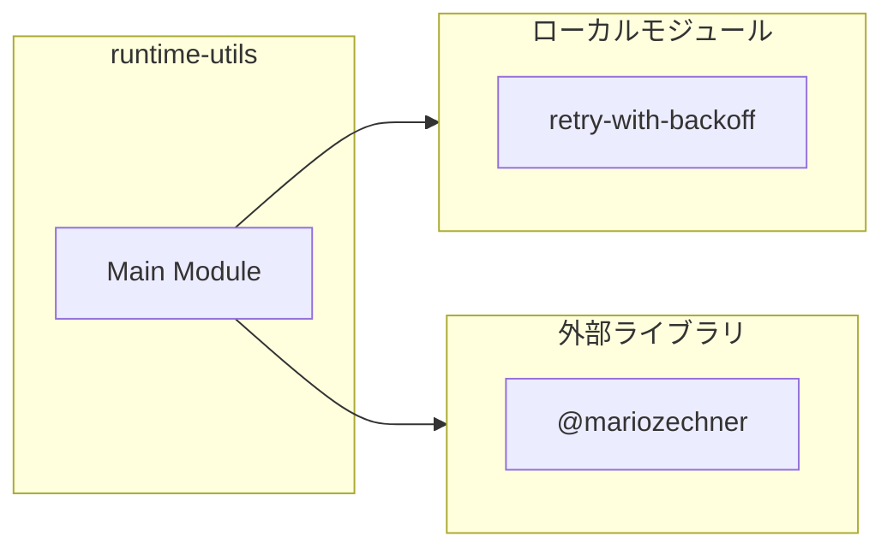
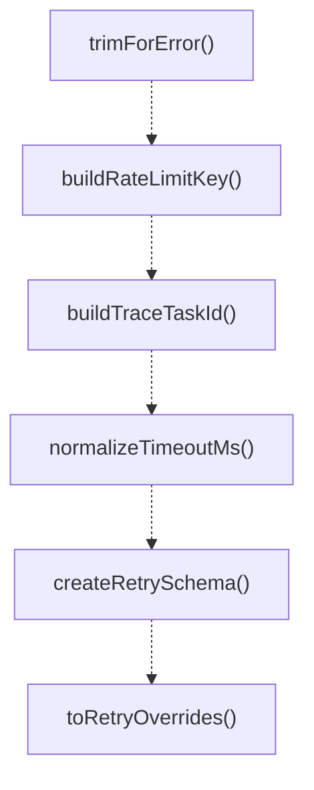
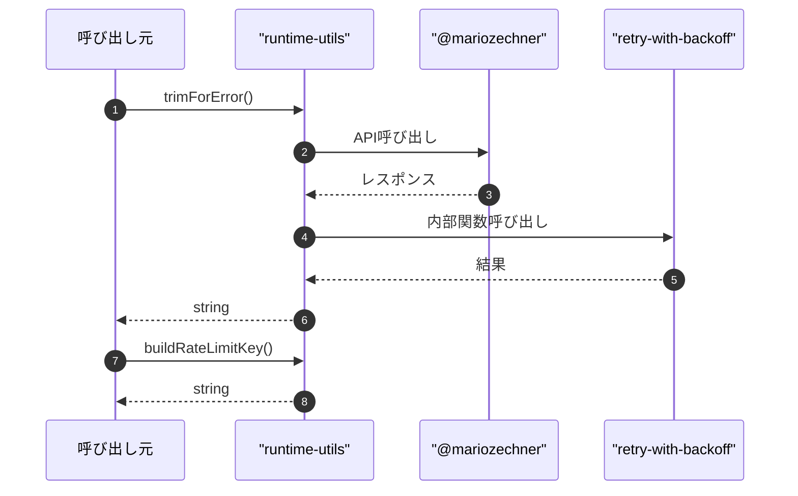

# runtime-utils

## 概要

`runtime-utils` モジュールのAPIリファレンス。

## インポート

```typescript
import { Type } from '@mariozechner/pi-ai';
import { RetryWithBackoffOverrides } from './retry-with-backoff.js';
```

## エクスポート一覧

| 種別 | 名前 | 説明 |
|------|------|------|
| 関数 | `trimForError` | エラー表示用にメッセージを整形・短縮 |
| 関数 | `buildRateLimitKey` | プロバイダとモデルからレート制限キーを生成 |
| 関数 | `buildTraceTaskId` | トレースタスクIDを生成する |
| 関数 | `normalizeTimeoutMs` | タイムアウト値（ミリ秒）を正規化します。 |
| 関数 | `createRetrySchema` | リトライ設定のスキーマを作成する |
| 関数 | `toRetryOverrides` | リトライ入力値をRetryWithBackoffOverridesに変換する。 |
| 関数 | `toConcurrencyLimit` | 同時実行数の入力値を数値に変換する。 |

## 図解

### 依存関係図



### 関数フロー



### シーケンス図



## 関数

### trimForError

```typescript
trimForError(message: string, maxLength: any): string
```

エラー表示用にメッセージを整形・短縮

**パラメータ**

| 名前 | 型 | 必須 |
|------|-----|------|
| message | `string` | はい |
| maxLength | `any` | はい |

**戻り値**: `string`

### buildRateLimitKey

```typescript
buildRateLimitKey(provider: string, model: string): string
```

プロバイダとモデルからレート制限キーを生成

**パラメータ**

| 名前 | 型 | 必須 |
|------|-----|------|
| provider | `string` | はい |
| model | `string` | はい |

**戻り値**: `string`

### buildTraceTaskId

```typescript
buildTraceTaskId(traceId: string | undefined, delegateId: string, sequence: number): string
```

トレースタスクIDを生成する

**パラメータ**

| 名前 | 型 | 必須 |
|------|-----|------|
| traceId | `string | undefined` | はい |
| delegateId | `string` | はい |
| sequence | `number` | はい |

**戻り値**: `string`

### normalizeTimeoutMs

```typescript
normalizeTimeoutMs(value: unknown, fallback: number): number
```

タイムアウト値（ミリ秒）を正規化します。

**パラメータ**

| 名前 | 型 | 必須 |
|------|-----|------|
| value | `unknown` | はい |
| fallback | `number` | はい |

**戻り値**: `number`

### createRetrySchema

```typescript
createRetrySchema(): void
```

リトライ設定のスキーマを作成する

**戻り値**: `void`

### toRetryOverrides

```typescript
toRetryOverrides(value: unknown): RetryWithBackoffOverrides | undefined
```

リトライ入力値をRetryWithBackoffOverridesに変換する。

**パラメータ**

| 名前 | 型 | 必須 |
|------|-----|------|
| value | `unknown` | はい |

**戻り値**: `RetryWithBackoffOverrides | undefined`

### toConcurrencyLimit

```typescript
toConcurrencyLimit(value: unknown, fallback: number): number
```

同時実行数の入力値を数値に変換する。

**パラメータ**

| 名前 | 型 | 必須 |
|------|-----|------|
| value | `unknown` | はい |
| fallback | `number` | はい |

**戻り値**: `number`

---
*自動生成: 2026-02-18T07:17:30.481Z*
