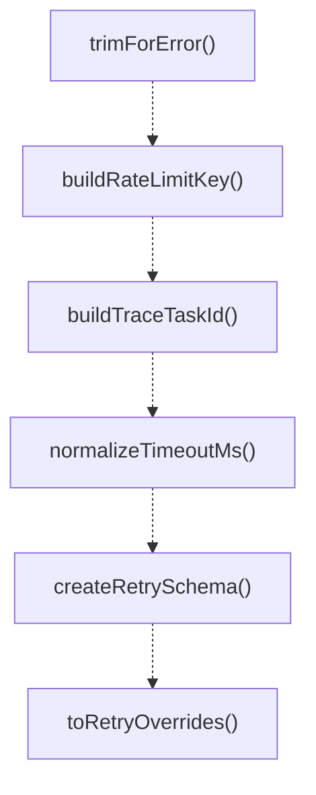

# runtime-utils

## 概要

`runtime-utils` モジュールのAPIリファレンス。

## インポート

```typescript
import { Type } from '@mariozechner/pi-ai';
import { RetryWithBackoffOverrides } from './retry-with-backoff.js';
```

## エクスポート一覧

| 種別 | 名前 | 説明 |
|------|------|------|
| 関数 | `trimForError` | Trim message for error display, normalizing whites |
| 関数 | `buildRateLimitKey` | Build rate limit key from provider and model. |
| 関数 | `buildTraceTaskId` | Build trace task ID for debugging and logging. |
| 関数 | `normalizeTimeoutMs` | Normalize timeout value in milliseconds. |
| 関数 | `createRetrySchema` | Create retry schema for tool input validation. |
| 関数 | `toRetryOverrides` | Convert retry input value to RetryWithBackoffOverr |
| 関数 | `toConcurrencyLimit` | Convert concurrency limit input to number. |

## 図解

### 依存関係図

```mermaid
flowchart LR
  subgraph this[runtime-utils]
    main[Main Module]
  end
  subgraph local[ローカルモジュール]
    retry_with_backoff_js[retry-with-backoff.js]
  end
  main --> local
  subgraph external[外部ライブラリ]
    _mariozechner[@mariozechner]
  end
  main --> external
```

### 関数フロー



## 関数

### trimForError

```typescript
trimForError(message: string, maxLength: any): string
```

Trim message for error display, normalizing whitespace.

**パラメータ**

| 名前 | 型 | 必須 |
|------|-----|------|
| message | `string` | はい |
| maxLength | `any` | はい |

**戻り値**: `string`

### buildRateLimitKey

```typescript
buildRateLimitKey(provider: string, model: string): string
```

Build rate limit key from provider and model.

**パラメータ**

| 名前 | 型 | 必須 |
|------|-----|------|
| provider | `string` | はい |
| model | `string` | はい |

**戻り値**: `string`

### buildTraceTaskId

```typescript
buildTraceTaskId(traceId: string | undefined, delegateId: string, sequence: number): string
```

Build trace task ID for debugging and logging.

**パラメータ**

| 名前 | 型 | 必須 |
|------|-----|------|
| traceId | `string | undefined` | はい |
| delegateId | `string` | はい |
| sequence | `number` | はい |

**戻り値**: `string`

### normalizeTimeoutMs

```typescript
normalizeTimeoutMs(value: unknown, fallback: number): number
```

Normalize timeout value in milliseconds.

**パラメータ**

| 名前 | 型 | 必須 |
|------|-----|------|
| value | `unknown` | はい |
| fallback | `number` | はい |

**戻り値**: `number`

### createRetrySchema

```typescript
createRetrySchema(): void
```

Create retry schema for tool input validation.

**戻り値**: `void`

### toRetryOverrides

```typescript
toRetryOverrides(value: unknown): RetryWithBackoffOverrides | undefined
```

Convert retry input value to RetryWithBackoffOverrides.

Note: This is the "unstable" version that does NOT check STABLE_*_RUNTIME.
Extensions (subagents.ts, agent-teams.ts) have their own local versions that
return undefined in stable mode. If you want to use this function from extensions,
you must handle stable mode check in the caller.

**パラメータ**

| 名前 | 型 | 必須 |
|------|-----|------|
| value | `unknown` | はい |

**戻り値**: `RetryWithBackoffOverrides | undefined`

### toConcurrencyLimit

```typescript
toConcurrencyLimit(value: unknown, fallback: number): number
```

Convert concurrency limit input to number.

**パラメータ**

| 名前 | 型 | 必須 |
|------|-----|------|
| value | `unknown` | はい |
| fallback | `number` | はい |

**戻り値**: `number`

---
*自動生成: 2026-02-17T21:48:27.752Z*
