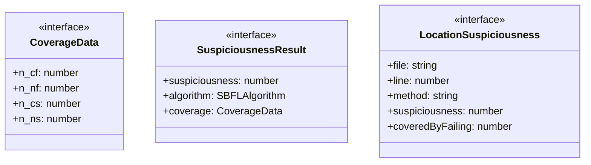
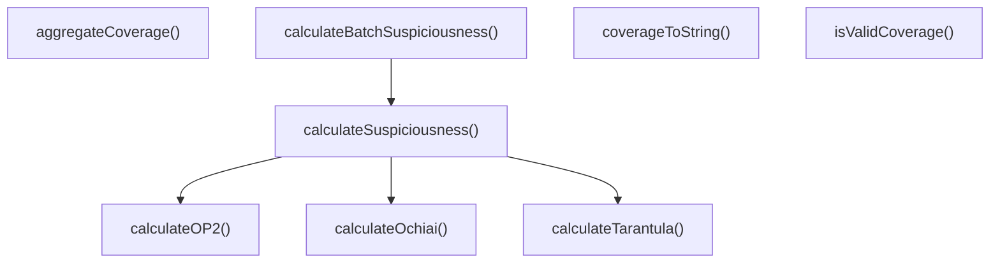

# sbfl

## 概要

`sbfl` モジュールのAPIリファレンス。

## エクスポート一覧

| 種別 | 名前 | 説明 |
|------|------|------|
| 関数 | `calculateOchiai` | Ochiaiアルゴリズムでsuspiciousnessを計算 |
| 関数 | `calculateTarantula` | Tarantulaアルゴリズムでsuspiciousnessを計算 |
| 関数 | `calculateOP2` | OP2アルゴリズムでsuspiciousnessを計算 |
| 関数 | `calculateSuspiciousness` | 指定したアルゴリズムでsuspiciousnessを計算 |
| 関数 | `calculateBatchSuspiciousness` | 複数の位置のsuspiciousnessを一括計算 |
| 関数 | `aggregateCoverage` | テスト結果からカバレッジデータを集計 |
| 関数 | `isValidCoverage` | カバレッジデータが有効かどうかを判定 |
| 関数 | `coverageToString` | カバレッジデータを文字列表現に変換 |
| インターフェース | `CoverageData` | 単一コード要素のカバレッジデータ |
| インターフェース | `SuspiciousnessResult` | 怪しさ計算結果 |
| インターフェース | `LocationSuspiciousness` | コード位置の怪しさ情報 |
| 型 | `SBFLAlgorithm` | SBFLアルゴリズムの種類 |

## 図解

### クラス図



### 関数フロー



## 関数

### calculateOchiai

```typescript
calculateOchiai(coverage: CoverageData): number
```

Ochiaiアルゴリズムでsuspiciousnessを計算

**パラメータ**

| 名前 | 型 | 必須 |
|------|-----|------|
| coverage | `CoverageData` | はい |

**戻り値**: `number`

### calculateTarantula

```typescript
calculateTarantula(coverage: CoverageData): number
```

Tarantulaアルゴリズムでsuspiciousnessを計算

**パラメータ**

| 名前 | 型 | 必須 |
|------|-----|------|
| coverage | `CoverageData` | はい |

**戻り値**: `number`

### calculateOP2

```typescript
calculateOP2(coverage: CoverageData): number
```

OP2アルゴリズムでsuspiciousnessを計算

**パラメータ**

| 名前 | 型 | 必須 |
|------|-----|------|
| coverage | `CoverageData` | はい |

**戻り値**: `number`

### calculateSuspiciousness

```typescript
calculateSuspiciousness(coverage: CoverageData, algorithm: SBFLAlgorithm): SuspiciousnessResult
```

指定したアルゴリズムでsuspiciousnessを計算

**パラメータ**

| 名前 | 型 | 必須 |
|------|-----|------|
| coverage | `CoverageData` | はい |
| algorithm | `SBFLAlgorithm` | はい |

**戻り値**: `SuspiciousnessResult`

### calculateBatchSuspiciousness

```typescript
calculateBatchSuspiciousness(locations: Array<{
		file: string;
		line: number;
		method?: string;
		coverage: CoverageData;
	}>, algorithm: SBFLAlgorithm, threshold: number): LocationSuspiciousness[]
```

複数の位置のsuspiciousnessを一括計算

**パラメータ**

| 名前 | 型 | 必須 |
|------|-----|------|
| locations | `Array<{
		file: string;
		line: number;
		metho...` | はい |
| algorithm | `SBFLAlgorithm` | はい |
| threshold | `number` | はい |

**戻り値**: `LocationSuspiciousness[]`

### aggregateCoverage

```typescript
aggregateCoverage(testResults: Array<{
		passed: boolean;
		coveredLines: Array<{ file: string; line: number }>;
	}>): Map<string, Map<number, CoverageData>>
```

テスト結果からカバレッジデータを集計

**パラメータ**

| 名前 | 型 | 必須 |
|------|-----|------|
| testResults | `Array<{
		passed: boolean;
		coveredLines: Arra...` | はい |

**戻り値**: `Map<string, Map<number, CoverageData>>`

### isValidCoverage

```typescript
isValidCoverage(coverage: CoverageData): boolean
```

カバレッジデータが有効かどうかを判定

**パラメータ**

| 名前 | 型 | 必須 |
|------|-----|------|
| coverage | `CoverageData` | はい |

**戻り値**: `boolean`

### coverageToString

```typescript
coverageToString(coverage: CoverageData): string
```

カバレッジデータを文字列表現に変換

**パラメータ**

| 名前 | 型 | 必須 |
|------|-----|------|
| coverage | `CoverageData` | はい |

**戻り値**: `string`

## インターフェース

### CoverageData

```typescript
interface CoverageData {
  n_cf: number;
  n_nf: number;
  n_cs: number;
  n_ns: number;
}
```

単一コード要素のカバレッジデータ

### SuspiciousnessResult

```typescript
interface SuspiciousnessResult {
  suspiciousness: number;
  algorithm: SBFLAlgorithm;
  coverage: CoverageData;
}
```

怪しさ計算結果

### LocationSuspiciousness

```typescript
interface LocationSuspiciousness {
  file: string;
  line: number;
  method?: string;
  suspiciousness: number;
  coveredByFailing: number;
  coveredByPassing: number;
}
```

コード位置の怪しさ情報

## 型定義

### SBFLAlgorithm

```typescript
type SBFLAlgorithm = "ochiai" | "tarantula" | "op2"
```

SBFLアルゴリズムの種類

---
*自動生成: 2026-02-24T17:08:02.758Z*
