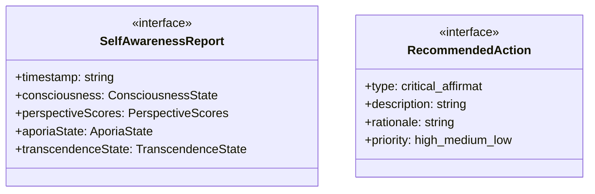
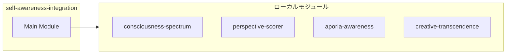
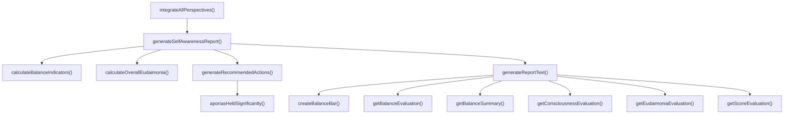
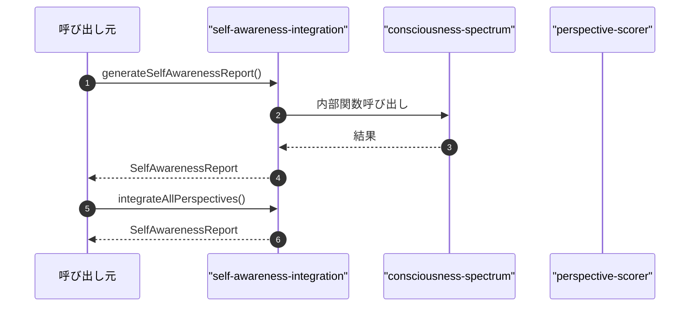

# self-awareness-integration

## 概要

`self-awareness-integration` モジュールのAPIリファレンス。

## インポート

```typescript
// from './consciousness-spectrum.js': ConsciousnessState, getConsciousnessReport
// from './perspective-scorer.js': PerspectiveScores, scorePerspectives
// from './aporia-awareness.js': AporiaState, getAporiaReport, createInitialAporiaState
// from './creative-transcendence.js': TranscendenceState, getTranscendenceReport, createInitialTranscendenceState, ...
```

## エクスポート一覧

| 種別 | 名前 | 説明 |
|------|------|------|
| 関数 | `generateSelfAwarenessReport` | 全視点を統合した自己認識レポートを生成 |
| 関数 | `integrateAllPerspectives` | 全視点からの統合分析を実行 |
| インターフェース | `SelfAwarenessReport` | 自己認識レポート |
| インターフェース | `RecommendedAction` | 推奨アクション |

## 図解

### クラス図



### 依存関係図



### 関数フロー



### シーケンス図



## 関数

### generateSelfAwarenessReport

```typescript
generateSelfAwarenessReport(text: string, context?: {
    taskType?: string;
    previousState?: Partial<SelfAwarenessReport>;
  }): SelfAwarenessReport
```

全視点を統合した自己認識レポートを生成

**パラメータ**

| 名前 | 型 | 必須 |
|------|-----|------|
| text | `string` | はい |
| context | `object` | いいえ |
| &nbsp;&nbsp;↳ taskType | `string` | いいえ |
| &nbsp;&nbsp;↳ previousState | `Partial<SelfAwarenessReport>` | いいえ |

**戻り値**: `SelfAwarenessReport`

### calculateBalanceIndicators

```typescript
calculateBalanceIndicators(perspectiveScores: PerspectiveScores, aporiaState: AporiaState, transcendenceState: TranscendenceState): SelfAwarenessReport['balanceIndicators']
```

バランス指標を計算

**パラメータ**

| 名前 | 型 | 必須 |
|------|-----|------|
| perspectiveScores | `PerspectiveScores` | はい |
| aporiaState | `AporiaState` | はい |
| transcendenceState | `TranscendenceState` | はい |

**戻り値**: `SelfAwarenessReport['balanceIndicators']`

### calculateOverallEudaimonia

```typescript
calculateOverallEudaimonia(consciousness: ConsciousnessState, perspectiveScores: PerspectiveScores, transcendenceState: TranscendenceState, balanceIndicators: SelfAwarenessReport['balanceIndicators']): number
```

全体的エウダイモニア値を計算

**パラメータ**

| 名前 | 型 | 必須 |
|------|-----|------|
| consciousness | `ConsciousnessState` | はい |
| perspectiveScores | `PerspectiveScores` | はい |
| transcendenceState | `TranscendenceState` | はい |
| balanceIndicators | `SelfAwarenessReport['balanceIndicators']` | はい |

**戻り値**: `number`

### generateRecommendedActions

```typescript
generateRecommendedActions(perspectiveScores: PerspectiveScores, aporiaState: AporiaState, transcendenceState: TranscendenceState, balanceIndicators: SelfAwarenessReport['balanceIndicators']): RecommendedAction[]
```

推奨アクションを生成

**パラメータ**

| 名前 | 型 | 必須 |
|------|-----|------|
| perspectiveScores | `PerspectiveScores` | はい |
| aporiaState | `AporiaState` | はい |
| transcendenceState | `TranscendenceState` | はい |
| balanceIndicators | `SelfAwarenessReport['balanceIndicators']` | はい |

**戻り値**: `RecommendedAction[]`

### aporiasHeldSignificantly

```typescript
aporiasHeldSignificantly(aporiaState: AporiaState): boolean
```

アポリアが有意に保持されているか

**パラメータ**

| 名前 | 型 | 必須 |
|------|-----|------|
| aporiaState | `AporiaState` | はい |

**戻り値**: `boolean`

### generateReportText

```typescript
generateReportText(consciousness: ConsciousnessState, perspectiveScores: PerspectiveScores, aporiaState: AporiaState, transcendenceState: TranscendenceState, balanceIndicators: SelfAwarenessReport['balanceIndicators'], overallEudaimonia: number, recommendedActions: RecommendedAction[]): string
```

レポート本文を生成

**パラメータ**

| 名前 | 型 | 必須 |
|------|-----|------|
| consciousness | `ConsciousnessState` | はい |
| perspectiveScores | `PerspectiveScores` | はい |
| aporiaState | `AporiaState` | はい |
| transcendenceState | `TranscendenceState` | はい |
| balanceIndicators | `SelfAwarenessReport['balanceIndicators']` | はい |
| overallEudaimonia | `number` | はい |
| recommendedActions | `RecommendedAction[]` | はい |

**戻り値**: `string`

### getConsciousnessEvaluation

```typescript
getConsciousnessEvaluation(level: number): string
```

**パラメータ**

| 名前 | 型 | 必須 |
|------|-----|------|
| level | `number` | はい |

**戻り値**: `string`

### getScoreEvaluation

```typescript
getScoreEvaluation(score: number): string
```

**パラメータ**

| 名前 | 型 | 必須 |
|------|-----|------|
| score | `number` | はい |

**戻り値**: `string`

### getEudaimoniaEvaluation

```typescript
getEudaimoniaEvaluation(value: number): string
```

**パラメータ**

| 名前 | 型 | 必須 |
|------|-----|------|
| value | `number` | はい |

**戻り値**: `string`

### getBalanceSummary

```typescript
getBalanceSummary(indicators: SelfAwarenessReport['balanceIndicators']): string
```

**パラメータ**

| 名前 | 型 | 必須 |
|------|-----|------|
| indicators | `SelfAwarenessReport['balanceIndicators']` | はい |

**戻り値**: `string`

### getBalanceEvaluation

```typescript
getBalanceEvaluation(indicators: SelfAwarenessReport['balanceIndicators']): string
```

**パラメータ**

| 名前 | 型 | 必須 |
|------|-----|------|
| indicators | `SelfAwarenessReport['balanceIndicators']` | はい |

**戻り値**: `string`

### createBalanceBar

```typescript
createBalanceBar(value: number): string
```

**パラメータ**

| 名前 | 型 | 必須 |
|------|-----|------|
| value | `number` | はい |

**戻り値**: `string`

### integrateAllPerspectives

```typescript
integrateAllPerspectives(text: string): SelfAwarenessReport
```

全視点からの統合分析を実行

**パラメータ**

| 名前 | 型 | 必須 |
|------|-----|------|
| text | `string` | はい |

**戻り値**: `SelfAwarenessReport`

## インターフェース

### SelfAwarenessReport

```typescript
interface SelfAwarenessReport {
  timestamp: string;
  consciousness: ConsciousnessState;
  perspectiveScores: PerspectiveScores;
  aporiaState: AporiaState;
  transcendenceState: TranscendenceState;
  balanceIndicators: {
    /** 批判と肯定のバランス（0.0=批判偏重、1.0=肯定偏重、0.5=バランス） */
    criticalAffirmativeBalance: number;
    /** 分析と行動のバランス（0.0=過分析、1.0=即行動、0.5=バランス） */
    analysisActionBalance: number;
    /** 現実と理想のバランス（0.0=現実埋没、1.0=理想逃避、0.5=バランス） */
    realityIdealBalance: number;
  };
  overallEudaimonia: number;
  recommendedNextActions: RecommendedAction[];
  reportText: string;
}
```

自己認識レポート

### RecommendedAction

```typescript
interface RecommendedAction {
  type: 'critical' | 'affirmative' | 'integrative' | 'transcendent';
  description: string;
  rationale: string;
  priority: 'high' | 'medium' | 'low';
}
```

推奨アクション

---
*自動生成: 2026-02-22T19:27:00.713Z*
