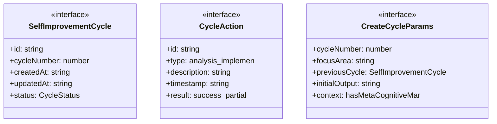
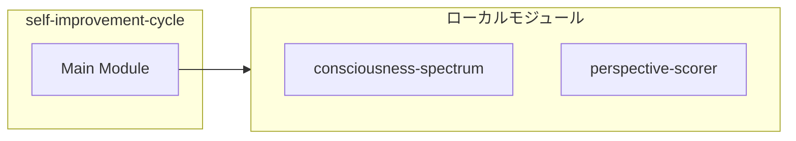
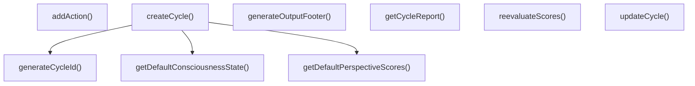
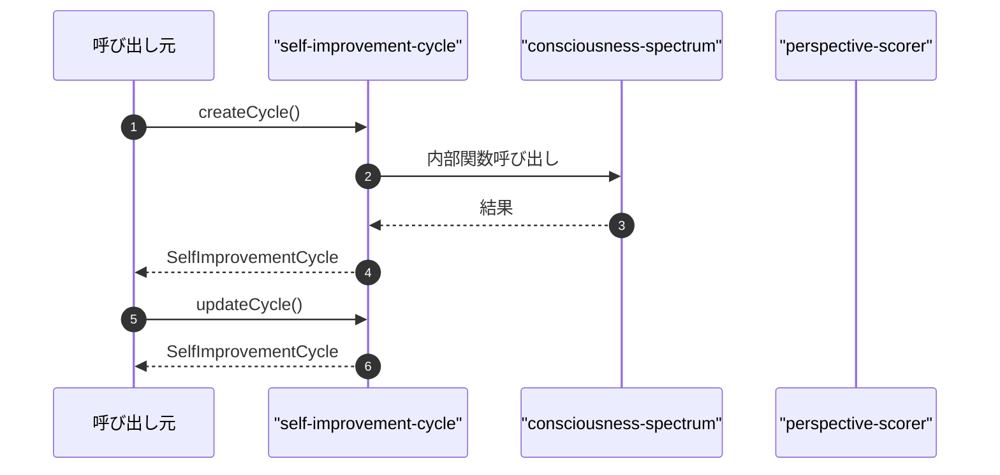

# self-improvement-cycle

## 概要

`self-improvement-cycle` モジュールのAPIリファレンス。

## インポート

```typescript
// from './consciousness-spectrum.js': ConsciousnessState, ConsciousnessStage, evaluateConsciousnessLevel, ...
// from './perspective-scorer.js': PerspectiveScores, scoreAllPerspectives, getPerspectiveReport, ...
```

## エクスポート一覧

| 種別 | 名前 | 説明 |
|------|------|------|
| 関数 | `createCycle` | 新しいサイクルを作成 |
| 関数 | `updateCycle` | サイクルを更新 |
| 関数 | `addAction` | アクションを追加 |
| 関数 | `reevaluateScores` | スコアを再評価して更新 |
| 関数 | `getCycleReport` | サイクルレポートを生成 |
| 関数 | `generateOutputFooter` | 出力終了用のフォーマットを生成 |
| インターフェース | `SelfImprovementCycle` | 自己改善サイクル |
| インターフェース | `CycleAction` | サイクル内のアクション |
| インターフェース | `CreateCycleParams` | サイクルの初期化パラメータ |
| 型 | `CycleStatus` | サイクルの状態 |

## 図解

### クラス図



### 依存関係図



### 関数フロー



### シーケンス図



## 関数

### createCycle

```typescript
createCycle(params: CreateCycleParams): SelfImprovementCycle
```

新しいサイクルを作成

**パラメータ**

| 名前 | 型 | 必須 |
|------|-----|------|
| params | `CreateCycleParams` | はい |

**戻り値**: `SelfImprovementCycle`

### updateCycle

```typescript
updateCycle(cycle: SelfImprovementCycle, updates: Partial<SelfImprovementCycle>): SelfImprovementCycle
```

サイクルを更新

**パラメータ**

| 名前 | 型 | 必須 |
|------|-----|------|
| cycle | `SelfImprovementCycle` | はい |
| updates | `Partial<SelfImprovementCycle>` | はい |

**戻り値**: `SelfImprovementCycle`

### addAction

```typescript
addAction(cycle: SelfImprovementCycle, action: Omit<CycleAction, 'id' | 'timestamp'>): SelfImprovementCycle
```

アクションを追加

**パラメータ**

| 名前 | 型 | 必須 |
|------|-----|------|
| cycle | `SelfImprovementCycle` | はい |
| action | `Omit<CycleAction, 'id' | 'timestamp'>` | はい |

**戻り値**: `SelfImprovementCycle`

### reevaluateScores

```typescript
reevaluateScores(cycle: SelfImprovementCycle, output: string, context: {
    hasMetaCognitiveMarkers?: boolean;
    hasSelfReference?: boolean;
    hasTemporalContinuity?: boolean;
    hasValueExpression?: boolean;
    previousOutputs?: string[];
    taskType?: string;
  }): SelfImprovementCycle
```

スコアを再評価して更新

**パラメータ**

| 名前 | 型 | 必須 |
|------|-----|------|
| cycle | `SelfImprovementCycle` | はい |
| output | `string` | はい |
| context | `object` | はい |
| &nbsp;&nbsp;↳ hasMetaCognitiveMarkers | `boolean` | いいえ |
| &nbsp;&nbsp;↳ hasSelfReference | `boolean` | いいえ |
| &nbsp;&nbsp;↳ hasTemporalContinuity | `boolean` | いいえ |
| &nbsp;&nbsp;↳ hasValueExpression | `boolean` | いいえ |
| &nbsp;&nbsp;↳ previousOutputs | `string[]` | いいえ |
| &nbsp;&nbsp;↳ taskType | `string` | いいえ |

**戻り値**: `SelfImprovementCycle`

### getCycleReport

```typescript
getCycleReport(cycle: SelfImprovementCycle): string
```

サイクルレポートを生成

**パラメータ**

| 名前 | 型 | 必須 |
|------|-----|------|
| cycle | `SelfImprovementCycle` | はい |

**戻り値**: `string`

### generateCycleId

```typescript
generateCycleId(cycleNumber: number, timestamp: string): string
```

サイクルIDを生成

**パラメータ**

| 名前 | 型 | 必須 |
|------|-----|------|
| cycleNumber | `number` | はい |
| timestamp | `string` | はい |

**戻り値**: `string`

### getDefaultPerspectiveScores

```typescript
getDefaultPerspectiveScores(): PerspectiveScores
```

デフォルトの視座スコア

**戻り値**: `PerspectiveScores`

### getDefaultConsciousnessState

```typescript
getDefaultConsciousnessState(): ConsciousnessState
```

デフォルトの意識状態

**戻り値**: `ConsciousnessState`

### generateOutputFooter

```typescript
generateOutputFooter(cycleNumber: number, loopStatus: 'continue' | 'pause' | 'complete', nextFocus: string, scores: PerspectiveScores): string
```

出力終了用のフォーマットを生成

**パラメータ**

| 名前 | 型 | 必須 |
|------|-----|------|
| cycleNumber | `number` | はい |
| loopStatus | `'continue' | 'pause' | 'complete'` | はい |
| nextFocus | `string` | はい |
| scores | `PerspectiveScores` | はい |

**戻り値**: `string`

## インターフェース

### SelfImprovementCycle

```typescript
interface SelfImprovementCycle {
  id: string;
  cycleNumber: number;
  createdAt: string;
  updatedAt: string;
  status: CycleStatus;
  focusArea: string;
  perspectiveScores: PerspectiveScores;
  consciousnessState: ConsciousnessState;
  improvementPriorities: ImprovementPriority[];
  actions: CycleAction[];
  nextFocus: string;
  metadata?: {
    previousCycleId?: string;
    improvementTrend?: 'improving' | 'stable' | 'declining';
    scoreChange?: Record<Perspective, number>;
  };
}
```

自己改善サイクル

### CycleAction

```typescript
interface CycleAction {
  id: string;
  type: 'analysis' | 'implementation' | 'verification' | 'documentation';
  description: string;
  timestamp: string;
  result?: 'success' | 'partial' | 'failed';
  output?: string;
}
```

サイクル内のアクション

### CreateCycleParams

```typescript
interface CreateCycleParams {
  cycleNumber: number;
  focusArea: string;
  previousCycle?: SelfImprovementCycle;
  initialOutput?: string;
  context?: {
    hasMetaCognitiveMarkers?: boolean;
    hasSelfReference?: boolean;
    hasTemporalContinuity?: boolean;
    hasValueExpression?: boolean;
    previousOutputs?: string[];
    taskType?: string;
  };
}
```

サイクルの初期化パラメータ

## 型定義

### CycleStatus

```typescript
type CycleStatus = | 'initialized'   // 初期化
  | 'analyzing'     // 分析中
  | 'implementing'  // 実装中
  | 'verifying'     // 検証中
  | 'completed'     // 完了
  | 'failed'
```

サイクルの状態

---
*自動生成: 2026-02-22T18:55:29.003Z*
