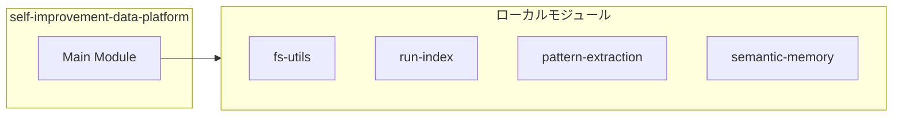
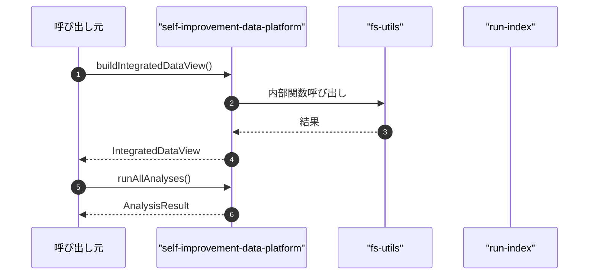

# self-improvement-data-platform

## 概要

`self-improvement-data-platform` モジュールのAPIリファレンス。

## インポート

```typescript
// from 'node:fs': existsSync, mkdirSync, readdirSync, ...
// from 'node:path': join
// from './fs-utils.js': ensureDir
// from './run-index.js': getOrBuildRunIndex, RunIndex, IndexedRun, ...
// from './pattern-extraction.js': loadPatternStorage, PatternStorage, ExtractedPattern
// ... and 1 more imports
```

## エクスポート一覧

| 種別 | 名前 | 説明 |
|------|------|------|
| 関数 | `buildIntegratedDataView` | 統合データビューを構築する |
| 関数 | `runAllAnalyses` | 全ての分析を実行する |
| 関数 | `generatePhilosophicalReflections` | データから哲学的考察を生成する |
| 関数 | `generateInsightReport` | 完全な洞察レポートを生成する |
| 関数 | `saveInsightReport` | 洞察レポートを保存する |
| 関数 | `loadLatestInsightReport` | 最新の洞察レポートを読み込む |
| 関数 | `listInsightReports` | 洞察レポート一覧を取得する |
| 関数 | `formatInsightReportAsText` | 洞察レポートをテキスト形式でフォーマットする |
| 関数 | `generatePlatformSummary` | データ基盤のサマリーを生成する |
| インターフェース | `IntegratedDataView` | 統合データビュー |
| インターフェース | `UsageStatsSummary` | 使用統計サマリー |
| インターフェース | `AnalysisResult` | 分析結果 |
| インターフェース | `PhilosophicalReflection` | 哲学的考察 |
| インターフェース | `InsightReport` | 洞察レポート |
| インターフェース | `PlatformConfig` | プラットフォーム設定 |
| 型 | `PhilosophicalPerspective` | 7つの哲学的視座 |
| 型 | `InsightSeverity` | 洞察の重要度 |
| 型 | `InsightCategory` | 洞察のカテゴリ |

## 図解

### クラス図

```mermaid
classDiagram
  class IntegratedDataView {
    <<interface>>
    +timestamp: string
    +runIndex: RunIndex_null
    +patterns: PatternStorage_null
    +semanticMemory: SemanticMemoryStorag
    +usageStats: UsageStatsSummary_nu
  }
  class UsageStatsSummary {
    <<interface>>
    +totalToolCalls: number
    +totalErrors: number
    +errorRate: number
    +avgContextRatio: number_null
    +topExtensions: Array_extension_str
  }
  class AnalysisResult {
    <<interface>>
    +timestamp: string
    +category: InsightCategory
    +title: string
    +description: string
    +evidence: Array_source_string
  }
  class PhilosophicalReflection {
    <<interface>>
    +perspective: PhilosophicalPerspec
    +question: string
    +observation: string
    +implication: string
    +suggestedAction: string
  }
  class InsightReport {
    <<interface>>
    +version: number
    +generatedAt: string
    +dataView: IntegratedDataView
    +analyses: AnalysisResult
    +philosophicalReflections: PhilosophicalReflect
  }
  class PlatformConfig {
    <<interface>>
    +enableSemanticAnalysis: boolean
    +enablePatternAnalysis: boolean
    +enableUsageAnalysis: boolean
    +enablePhilosophicalReflection: boolean
    +maxInsightsPerReport: number
  }
```



### 依存関係図



### 関数フロー

```mermaid
flowchart TD
  analyzeContextUsage["analyzeContextUsage()"]
  analyzeErrorRateAnomalies["analyzeErrorRateAnomalies()"]
  analyzeFailurePatterns["analyzeFailurePatterns()"]
  analyzeImprovementOpportunities["analyzeImprovementOpportunities()"]
  analyzeLearningOpportunities["analyzeLearningOpportunities()"]
  analyzeSuccessPatterns["analyzeSuccessPatterns()"]
  analyzeTaskTypeTrends["analyzeTaskTypeTrends()"]
  buildIntegratedDataView["buildIntegratedDataView()"]
  calculateMetrics["calculateMetrics()"]
  calculateSchizoMetrics["calculateSchizoMetrics()"]
  collectUsageStats["collectUsageStats()"]
  formatInsightReportAsText["formatInsightReportAsText()"]
  generateActionableInsights["generateActionableInsights()"]
  generateInsightReport["generateInsightReport()"]
  generatePhilosophicalReflections["generatePhilosophicalReflections()"]
  generatePlatformSummary["generatePlatformSummary()"]
  listInsightReports["listInsightReports()"]
  loadLatestInsightReport["loadLatestInsightReport()"]
  runAllAnalyses["runAllAnalyses()"]
  saveInsightReport["saveInsightReport()"]
  buildIntegratedDataView --> collectUsageStats
  formatInsightReportAsText --> calculateSchizoMetrics
  generateInsightReport --> buildIntegratedDataView
  generateInsightReport --> calculateMetrics
  generateInsightReport --> generateActionableInsights
  generateInsightReport --> generatePhilosophicalReflections
  generateInsightReport --> runAllAnalyses
  generatePlatformSummary --> buildIntegratedDataView
  runAllAnalyses --> analyzeContextUsage
  runAllAnalyses --> analyzeErrorRateAnomalies
  runAllAnalyses --> analyzeFailurePatterns
  runAllAnalyses --> analyzeImprovementOpportunities
  runAllAnalyses --> analyzeLearningOpportunities
  runAllAnalyses --> analyzeSuccessPatterns
  runAllAnalyses --> analyzeTaskTypeTrends
```



### シーケンス図



## 関数

### collectUsageStats

```typescript
collectUsageStats(cwd: string): UsageStatsSummary | null
```

使用統計を収集する

**パラメータ**

| 名前 | 型 | 必須 |
|------|-----|------|
| cwd | `string` | はい |

**戻り値**: `UsageStatsSummary | null`

### buildIntegratedDataView

```typescript
buildIntegratedDataView(cwd: string, config: PlatformConfig): IntegratedDataView
```

統合データビューを構築する

**パラメータ**

| 名前 | 型 | 必須 |
|------|-----|------|
| cwd | `string` | はい |
| config | `PlatformConfig` | はい |

**戻り値**: `IntegratedDataView`

### analyzeErrorRateAnomalies

```typescript
analyzeErrorRateAnomalies(dataView: IntegratedDataView): AnalysisResult[]
```

エラー率の異常を検出する

**パラメータ**

| 名前 | 型 | 必須 |
|------|-----|------|
| dataView | `IntegratedDataView` | はい |

**戻り値**: `AnalysisResult[]`

### analyzeContextUsage

```typescript
analyzeContextUsage(dataView: IntegratedDataView): AnalysisResult[]
```

コンテキスト使用状況を分析する

**パラメータ**

| 名前 | 型 | 必須 |
|------|-----|------|
| dataView | `IntegratedDataView` | はい |

**戻り値**: `AnalysisResult[]`

### analyzeSuccessPatterns

```typescript
analyzeSuccessPatterns(dataView: IntegratedDataView): AnalysisResult[]
```

成功パターンを分析する

**パラメータ**

| 名前 | 型 | 必須 |
|------|-----|------|
| dataView | `IntegratedDataView` | はい |

**戻り値**: `AnalysisResult[]`

### analyzeFailurePatterns

```typescript
analyzeFailurePatterns(dataView: IntegratedDataView): AnalysisResult[]
```

失敗パターンを分析する

**パラメータ**

| 名前 | 型 | 必須 |
|------|-----|------|
| dataView | `IntegratedDataView` | はい |

**戻り値**: `AnalysisResult[]`

### analyzeTaskTypeTrends

```typescript
analyzeTaskTypeTrends(dataView: IntegratedDataView): AnalysisResult[]
```

タスクタイプ別の傾向を分析する

**パラメータ**

| 名前 | 型 | 必須 |
|------|-----|------|
| dataView | `IntegratedDataView` | はい |

**戻り値**: `AnalysisResult[]`

### analyzeLearningOpportunities

```typescript
analyzeLearningOpportunities(dataView: IntegratedDataView): AnalysisResult[]
```

学習機会を分析する（思考分類学の視点から）

**パラメータ**

| 名前 | 型 | 必須 |
|------|-----|------|
| dataView | `IntegratedDataView` | はい |

**戻り値**: `AnalysisResult[]`

### analyzeImprovementOpportunities

```typescript
analyzeImprovementOpportunities(dataView: IntegratedDataView): AnalysisResult[]
```

改善の機会を分析する（思考分類学の視点から）

**パラメータ**

| 名前 | 型 | 必須 |
|------|-----|------|
| dataView | `IntegratedDataView` | はい |

**戻り値**: `AnalysisResult[]`

### runAllAnalyses

```typescript
runAllAnalyses(dataView: IntegratedDataView, config: PlatformConfig): AnalysisResult[]
```

全ての分析を実行する

**パラメータ**

| 名前 | 型 | 必須 |
|------|-----|------|
| dataView | `IntegratedDataView` | はい |
| config | `PlatformConfig` | はい |

**戻り値**: `AnalysisResult[]`

### generatePhilosophicalReflections

```typescript
generatePhilosophicalReflections(dataView: IntegratedDataView, analyses: AnalysisResult[], config: PlatformConfig): PhilosophicalReflection[]
```

データから哲学的考察を生成する

**パラメータ**

| 名前 | 型 | 必須 |
|------|-----|------|
| dataView | `IntegratedDataView` | はい |
| analyses | `AnalysisResult[]` | はい |
| config | `PlatformConfig` | はい |

**戻り値**: `PhilosophicalReflection[]`

### generateActionableInsights

```typescript
generateActionableInsights(analyses: AnalysisResult[], reflections: PhilosophicalReflection[]): InsightReport["actionableInsights"]
```

問い志向の洞察を生成する（スキゾ分析のアプローチ）

「すべきこと」ではなく「問うべきこと」を生成する。
これは「反動的」な修正志向から「革命的」な探求志向への転換である。

**パラメータ**

| 名前 | 型 | 必須 |
|------|-----|------|
| analyses | `AnalysisResult[]` | はい |
| reflections | `PhilosophicalReflection[]` | はい |

**戻り値**: `InsightReport["actionableInsights"]`

### calculateMetrics

```typescript
calculateMetrics(dataView: IntegratedDataView, analyses: AnalysisResult[], reflections: PhilosophicalReflection[]): InsightReport["metrics"]
```

メトリクスを計算する（スキゾ分析的指標を含む）

**パラメータ**

| 名前 | 型 | 必須 |
|------|-----|------|
| dataView | `IntegratedDataView` | はい |
| analyses | `AnalysisResult[]` | はい |
| reflections | `PhilosophicalReflection[]` | はい |

**戻り値**: `InsightReport["metrics"]`

### calculateSchizoMetrics

```typescript
calculateSchizoMetrics(analyses: AnalysisResult[], insights: InsightReport["actionableInsights"]): {
  reactivityScore: number; // 反動度（0-1）
  creativityScore: number; // 革命度（0-1）
  affirmationScore: number; // 肯定度（0-1）
}
```

スキゾ分析的メトリクスを計算する

**パラメータ**

| 名前 | 型 | 必須 |
|------|-----|------|
| analyses | `AnalysisResult[]` | はい |
| insights | `InsightReport["actionableInsights"]` | はい |

**戻り値**: `{
  reactivityScore: number; // 反動度（0-1）
  creativityScore: number; // 革命度（0-1）
  affirmationScore: number; // 肯定度（0-1）
}`

### generateInsightReport

```typescript
generateInsightReport(cwd: string, config: PlatformConfig): InsightReport
```

完全な洞察レポートを生成する

**パラメータ**

| 名前 | 型 | 必須 |
|------|-----|------|
| cwd | `string` | はい |
| config | `PlatformConfig` | はい |

**戻り値**: `InsightReport`

### saveInsightReport

```typescript
saveInsightReport(cwd: string, report: InsightReport): string
```

洞察レポートを保存する

**パラメータ**

| 名前 | 型 | 必須 |
|------|-----|------|
| cwd | `string` | はい |
| report | `InsightReport` | はい |

**戻り値**: `string`

### loadLatestInsightReport

```typescript
loadLatestInsightReport(cwd: string): InsightReport | null
```

最新の洞察レポートを読み込む

**パラメータ**

| 名前 | 型 | 必須 |
|------|-----|------|
| cwd | `string` | はい |

**戻り値**: `InsightReport | null`

### listInsightReports

```typescript
listInsightReports(cwd: string): string[]
```

洞察レポート一覧を取得する

**パラメータ**

| 名前 | 型 | 必須 |
|------|-----|------|
| cwd | `string` | はい |

**戻り値**: `string[]`

### formatInsightReportAsText

```typescript
formatInsightReportAsText(report: InsightReport): string
```

洞察レポートをテキスト形式でフォーマットする

**パラメータ**

| 名前 | 型 | 必須 |
|------|-----|------|
| report | `InsightReport` | はい |

**戻り値**: `string`

### generatePlatformSummary

```typescript
generatePlatformSummary(cwd: string): string
```

データ基盤のサマリーを生成する

**パラメータ**

| 名前 | 型 | 必須 |
|------|-----|------|
| cwd | `string` | はい |

**戻り値**: `string`

## インターフェース

### IntegratedDataView

```typescript
interface IntegratedDataView {
  timestamp: string;
  runIndex: RunIndex | null;
  patterns: PatternStorage | null;
  semanticMemory: SemanticMemoryStorage | null;
  usageStats: UsageStatsSummary | null;
}
```

統合データビュー

### UsageStatsSummary

```typescript
interface UsageStatsSummary {
  totalToolCalls: number;
  totalErrors: number;
  errorRate: number;
  avgContextRatio: number | null;
  topExtensions: Array<{
    extension: string;
    calls: number;
    errors: number;
    errorRate: number;
  }>;
}
```

使用統計サマリー

### AnalysisResult

```typescript
interface AnalysisResult {
  timestamp: string;
  category: InsightCategory;
  title: string;
  description: string;
  evidence: Array<{
    source: string;
    data: string;
    location?: string;
  }>;
  confidence: number;
  severity: InsightSeverity;
}
```

分析結果

### PhilosophicalReflection

```typescript
interface PhilosophicalReflection {
  perspective: PhilosophicalPerspective;
  question: string;
  observation: string;
  implication: string;
  suggestedAction?: string;
}
```

哲学的考察

### InsightReport

```typescript
interface InsightReport {
  version: number;
  generatedAt: string;
  dataView: IntegratedDataView;
  analyses: AnalysisResult[];
  philosophicalReflections: PhilosophicalReflection[];
  actionableInsights: Array<{
    insight: string;
    rationale: string;
    priority: "immediate" | "short_term" | "medium_term" | "long_term";
    estimatedEffort: "low" | "medium" | "high";
  }>;
  metrics: {
    dataQualityScore: number;
    analysisCoverage: number;
    insightActionability: number;
  };
}
```

洞察レポート

### PlatformConfig

```typescript
interface PlatformConfig {
  enableSemanticAnalysis: boolean;
  enablePatternAnalysis: boolean;
  enableUsageAnalysis: boolean;
  enablePhilosophicalReflection: boolean;
  maxInsightsPerReport: number;
  dataRetentionDays: number;
}
```

プラットフォーム設定

## 型定義

### PhilosophicalPerspective

```typescript
type PhilosophicalPerspective = | "deconstruction" // 脱構築
  | "schizoanalysis" // スキゾ分析
  | "eudaimonia" // 幸福論
  | "utopia_dystopia" // ユートピア/ディストピア
  | "philosophy_of_thought" // 思考哲学
  | "taxonomy_of_thought" // 思考分類学
  | "logic"
```

7つの哲学的視座

### InsightSeverity

```typescript
type InsightSeverity = "critical" | "high" | "medium" | "low"
```

洞察の重要度

### InsightCategory

```typescript
type InsightCategory = | "performance" // パフォーマンス
  | "quality" // 品質
  | "reliability" // 信頼性
  | "efficiency" // 効率性
  | "learning" // 学習
  | "risk" // リスク
  | "opportunity" // 機会
  | "pattern" // パターン
  | "anomaly" // 異常
  | "trend"
```

洞察のカテゴリ

---
*自動生成: 2026-02-24T17:08:02.766Z*
