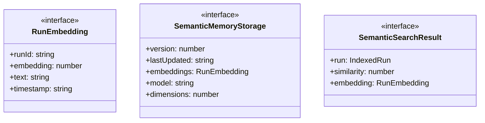
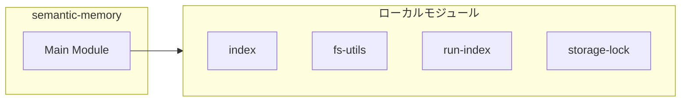
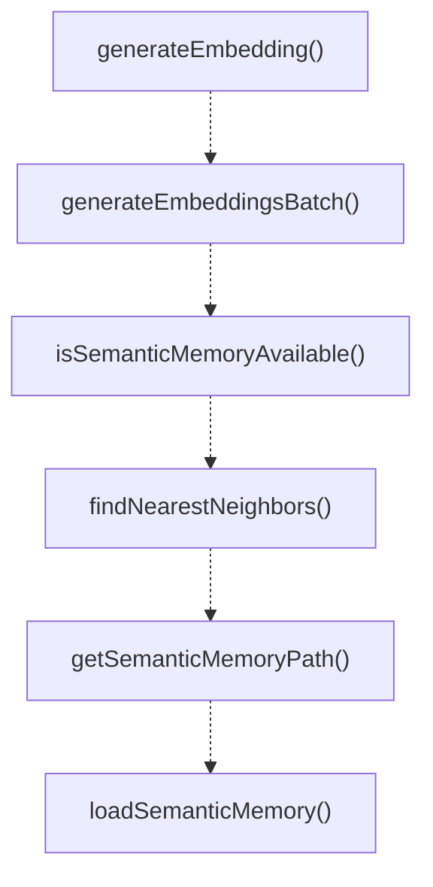
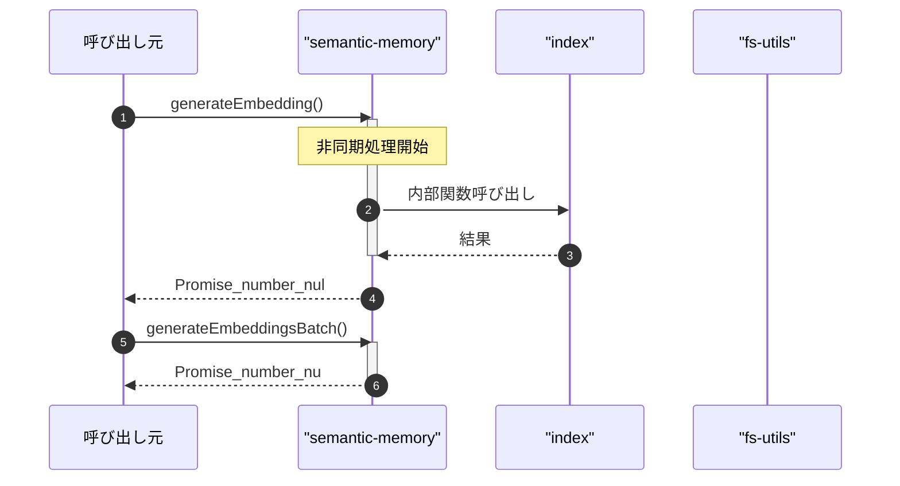

# semantic-memory

## 概要

`semantic-memory` モジュールのAPIリファレンス。

## インポート

```typescript
import { existsSync, readFileSync } from 'node:fs';
import { join } from 'node:path';
import { embeddingsGenerateEmbedding, embeddingsGenerateEmbeddingsBatch, cosineSimilarity... } from './embeddings/index.js';
import { ensureDir } from './fs-utils.js';
import { IndexedRun, RunIndex, getOrBuildRunIndex } from './run-index.js';
// ... and 1 more imports
```

## エクスポート一覧

| 種別 | 名前 | 説明 |
|------|------|------|
| 関数 | `generateEmbedding` | テキストの埋め込みベクトルを生成する（非推奨） |
| 関数 | `generateEmbeddingsBatch` | 複数テキストのベクトルを一括生成 |
| 関数 | `isSemanticMemoryAvailable` | セマンティックメモリが利用可能か確認 |
| 関数 | `findNearestNeighbors` | Find the k nearest neighbors to a query vector. |
| 関数 | `getSemanticMemoryPath` | セマンティックメモリのストレージファイルパスを取得 |
| 関数 | `loadSemanticMemory` | ディスクからセマンティックメモリを読み込む |
| 関数 | `saveSemanticMemory` | セマンティックメモリをディスクに保存する |
| 関数 | `buildSemanticMemoryIndex` | ランインデックスからセマンティックメモリを構築 |
| 関数 | `addRunToSemanticMemory` | 実行履歴をセマンティックメモリに追加 |
| 関数 | `semanticSearch` | 類似した実行をセマンティック検索します。 |
| 関数 | `findSimilarRunsById` | 指定された実行IDに類似した実行を検索する。 |
| 関数 | `getSemanticMemoryStats` | セマンティックメモリの統計情報を取得する |
| 関数 | `clearSemanticMemory` | セマンティックメモリをクリアする。 |
| インターフェース | `RunEmbedding` | 実行のベクトル埋め込み |
| インターフェース | `SemanticMemoryStorage` | セマンティックメモリストレージ。 |
| インターフェース | `SemanticSearchResult` | セマンティック検索の結果 |

## 図解

### クラス図



### 依存関係図



### 関数フロー



### シーケンス図



## 関数

### generateEmbedding

```typescript
async generateEmbedding(text: string): Promise<number[] | null>
```

テキストの埋め込みベクトルを生成する（非推奨）

**パラメータ**

| 名前 | 型 | 必須 |
|------|-----|------|
| text | `string` | はい |

**戻り値**: `Promise<number[] | null>`

### generateEmbeddingsBatch

```typescript
async generateEmbeddingsBatch(texts: string[]): Promise<(number[] | null)[]>
```

複数テキストのベクトルを一括生成

**パラメータ**

| 名前 | 型 | 必須 |
|------|-----|------|
| texts | `string[]` | はい |

**戻り値**: `Promise<(number[] | null)[]>`

### isSemanticMemoryAvailable

```typescript
isSemanticMemoryAvailable(): boolean
```

セマンティックメモリが利用可能か確認

**戻り値**: `boolean`

### findNearestNeighbors

```typescript
findNearestNeighbors(queryVector: number[], embeddings: RunEmbedding[], k: number): Array<{ embedding: RunEmbedding; similarity: number }>
```

Find the k nearest neighbors to a query vector.

**パラメータ**

| 名前 | 型 | 必須 |
|------|-----|------|
| queryVector | `number[]` | はい |
| embeddings | `RunEmbedding[]` | はい |
| k | `number` | はい |

**戻り値**: `Array<{ embedding: RunEmbedding; similarity: number }>`

### getSemanticMemoryPath

```typescript
getSemanticMemoryPath(cwd: string): string
```

セマンティックメモリのストレージファイルパスを取得

**パラメータ**

| 名前 | 型 | 必須 |
|------|-----|------|
| cwd | `string` | はい |

**戻り値**: `string`

### loadSemanticMemory

```typescript
loadSemanticMemory(cwd: string): SemanticMemoryStorage
```

ディスクからセマンティックメモリを読み込む

**パラメータ**

| 名前 | 型 | 必須 |
|------|-----|------|
| cwd | `string` | はい |

**戻り値**: `SemanticMemoryStorage`

### saveSemanticMemory

```typescript
saveSemanticMemory(cwd: string, storage: SemanticMemoryStorage): void
```

セマンティックメモリをディスクに保存する

**パラメータ**

| 名前 | 型 | 必須 |
|------|-----|------|
| cwd | `string` | はい |
| storage | `SemanticMemoryStorage` | はい |

**戻り値**: `void`

### buildEmbeddingText

```typescript
buildEmbeddingText(run: IndexedRun): string
```

Build text to embed from a run.

**パラメータ**

| 名前 | 型 | 必須 |
|------|-----|------|
| run | `IndexedRun` | はい |

**戻り値**: `string`

### buildSemanticMemoryIndex

```typescript
async buildSemanticMemoryIndex(cwd: string, batchSize: number): Promise<SemanticMemoryStorage>
```

ランインデックスからセマンティックメモリを構築

**パラメータ**

| 名前 | 型 | 必須 |
|------|-----|------|
| cwd | `string` | はい |
| batchSize | `number` | はい |

**戻り値**: `Promise<SemanticMemoryStorage>`

### addRunToSemanticMemory

```typescript
async addRunToSemanticMemory(cwd: string, run: IndexedRun): Promise<void>
```

実行履歴をセマンティックメモリに追加

**パラメータ**

| 名前 | 型 | 必須 |
|------|-----|------|
| cwd | `string` | はい |
| run | `IndexedRun` | はい |

**戻り値**: `Promise<void>`

### semanticSearch

```typescript
async semanticSearch(cwd: string, query: string, options: {
    limit?: number;
    status?: "completed" | "failed";
    minSimilarity?: number;
  }): Promise<SemanticSearchResult[]>
```

類似した実行をセマンティック検索します。

**パラメータ**

| 名前 | 型 | 必須 |
|------|-----|------|
| cwd | `string` | はい |
| query | `string` | はい |
| options | `object` | はい |
| &nbsp;&nbsp;↳ limit | `number` | いいえ |
| &nbsp;&nbsp;↳ status | `"completed" | "failed"` | いいえ |
| &nbsp;&nbsp;↳ minSimilarity | `number` | いいえ |

**戻り値**: `Promise<SemanticSearchResult[]>`

### findSimilarRunsById

```typescript
findSimilarRunsById(cwd: string, runId: string, limit: number): SemanticSearchResult[]
```

指定された実行IDに類似した実行を検索する。

**パラメータ**

| 名前 | 型 | 必須 |
|------|-----|------|
| cwd | `string` | はい |
| runId | `string` | はい |
| limit | `number` | はい |

**戻り値**: `SemanticSearchResult[]`

### getSemanticMemoryStats

```typescript
getSemanticMemoryStats(cwd: string): {
  totalEmbeddings: number;
  lastUpdated: string;
  model: string;
  isAvailable: boolean;
}
```

セマンティックメモリの統計情報を取得する

**パラメータ**

| 名前 | 型 | 必須 |
|------|-----|------|
| cwd | `string` | はい |

**戻り値**: `{
  totalEmbeddings: number;
  lastUpdated: string;
  model: string;
  isAvailable: boolean;
}`

### clearSemanticMemory

```typescript
clearSemanticMemory(cwd: string): void
```

セマンティックメモリをクリアする。

**パラメータ**

| 名前 | 型 | 必須 |
|------|-----|------|
| cwd | `string` | はい |

**戻り値**: `void`

## インターフェース

### RunEmbedding

```typescript
interface RunEmbedding {
  runId: string;
  embedding: number[];
  text: string;
  timestamp: string;
}
```

実行のベクトル埋め込み

### SemanticMemoryStorage

```typescript
interface SemanticMemoryStorage {
  version: number;
  lastUpdated: string;
  embeddings: RunEmbedding[];
  model: string;
  dimensions: number;
}
```

セマンティックメモリストレージ。

### SemanticSearchResult

```typescript
interface SemanticSearchResult {
  run: IndexedRun;
  similarity: number;
  embedding: RunEmbedding;
}
```

セマンティック検索の結果

---
*自動生成: 2026-02-18T07:48:45.196Z*
