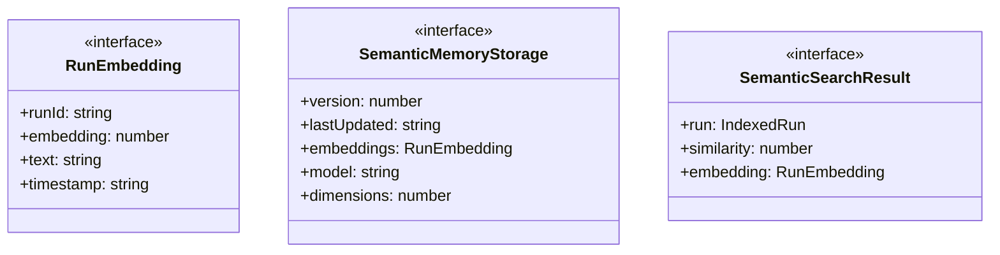
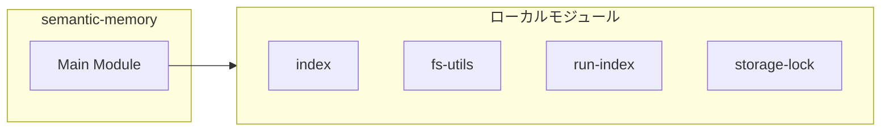
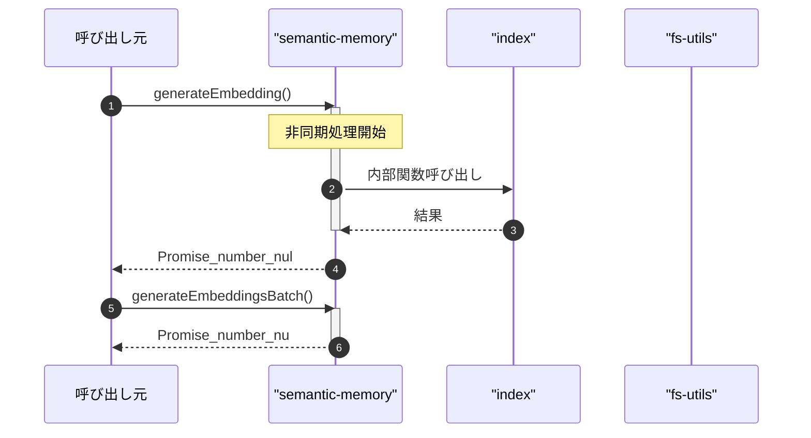

# semantic-memory

## 概要

`semantic-memory` モジュールのAPIリファレンス。

## インポート

```typescript
// from 'node:fs': existsSync, readFileSync
// from 'node:path': join
// from './embeddings/index.js': embeddingsGenerateEmbedding, embeddingsGenerateEmbeddingsBatch, cosineSimilarity, ...
// from './fs-utils.js': ensureDir
// from './run-index.js': IndexedRun, RunIndex, getOrBuildRunIndex
// ... and 1 more imports
```

## エクスポート一覧

| 種別 | 名前 | 説明 |
|------|------|------|
| 関数 | `generateEmbedding` | テキストの埋め込みベクトルを生成 |
| 関数 | `generateEmbeddingsBatch` | - |
| 関数 | `isSemanticMemoryAvailable` | - |
| 関数 | `findNearestNeighbors` | - |
| 関数 | `getSemanticMemoryPath` | - |
| 関数 | `loadSemanticMemory` | - |
| 関数 | `saveSemanticMemory` | セマンティックメモリを保存 |
| 関数 | `buildSemanticMemoryIndex` | セマンティックメモリのインデックスを構築 |
| 関数 | `addRunToSemanticMemory` | 実行記録をセマンティックメモリに追加 |
| 関数 | `semanticSearch` | セマンティック検索を実行 |
| 関数 | `findSimilarRunsById` | 類似実行をIDで検索 |
| 関数 | `getSemanticMemoryStats` | 意味メモリ統計取得 |
| 関数 | `clearSemanticMemory` | 意味メモリクリア |
| インターフェース | `RunEmbedding` | 実行単位の埋め込みデータ |
| インターフェース | `SemanticMemoryStorage` | セマンティックメモリのストレージ構造 |
| インターフェース | `SemanticSearchResult` | セマンティック検索の結果 |

## 図解

### クラス図



### 依存関係図



### 関数フロー

```mermaid
flowchart TD
  addRunToSemanticMemory["addRunToSemanticMemory()"]
  buildEmbeddingText["buildEmbeddingText()"]
  buildSemanticMemoryIndex["buildSemanticMemoryIndex()"]
  clearSemanticMemory["clearSemanticMemory()"]
  findNearestNeighbors["findNearestNeighbors()"]
  findSimilarRunsById["findSimilarRunsById()"]
  generateEmbedding["generateEmbedding()"]
  generateEmbeddingsBatch["generateEmbeddingsBatch()"]
  getSemanticMemoryPath["getSemanticMemoryPath()"]
  getSemanticMemoryStats["getSemanticMemoryStats()"]
  isSemanticMemoryAvailable["isSemanticMemoryAvailable()"]
  loadSemanticMemory["loadSemanticMemory()"]
  saveSemanticMemory["saveSemanticMemory()"]
  semanticSearch["semanticSearch()"]
  addRunToSemanticMemory --> buildEmbeddingText
  addRunToSemanticMemory --> generateEmbedding
  addRunToSemanticMemory --> loadSemanticMemory
  addRunToSemanticMemory --> saveSemanticMemory
  buildSemanticMemoryIndex --> generateEmbeddingsBatch
  buildSemanticMemoryIndex --> loadSemanticMemory
  buildSemanticMemoryIndex --> saveSemanticMemory
  clearSemanticMemory --> saveSemanticMemory
  findSimilarRunsById --> findNearestNeighbors
  findSimilarRunsById --> loadSemanticMemory
  generateEmbedding --> generateEmbedding
  generateEmbeddingsBatch --> generateEmbeddingsBatch
  getSemanticMemoryStats --> loadSemanticMemory
  loadSemanticMemory --> getSemanticMemoryPath
  saveSemanticMemory --> getSemanticMemoryPath
  semanticSearch --> findNearestNeighbors
  semanticSearch --> generateEmbedding
  semanticSearch --> loadSemanticMemory
```



### シーケンス図



## 関数

### generateEmbedding

```typescript
async generateEmbedding(text: string): Promise<number[] | null>
```

テキストの埋め込みベクトルを生成

**パラメータ**

| 名前 | 型 | 必須 |
|------|-----|------|
| text | `string` | はい |

**戻り値**: `Promise<number[] | null>`

### generateEmbeddingsBatch

```typescript
async generateEmbeddingsBatch(texts: string[]): Promise<(number[] | null)[]>
```

**パラメータ**

| 名前 | 型 | 必須 |
|------|-----|------|
| texts | `string[]` | はい |

**戻り値**: `Promise<(number[] | null)[]>`

### isSemanticMemoryAvailable

```typescript
isSemanticMemoryAvailable(): boolean
```

**戻り値**: `boolean`

### findNearestNeighbors

```typescript
findNearestNeighbors(queryVector: number[], embeddings: RunEmbedding[], k: number): Array<{ embedding: RunEmbedding; similarity: number }>
```

**パラメータ**

| 名前 | 型 | 必須 |
|------|-----|------|
| queryVector | `number[]` | はい |
| embeddings | `RunEmbedding[]` | はい |
| k | `number` | はい |

**戻り値**: `Array<{ embedding: RunEmbedding; similarity: number }>`

### getSemanticMemoryPath

```typescript
getSemanticMemoryPath(cwd: string): string
```

**パラメータ**

| 名前 | 型 | 必須 |
|------|-----|------|
| cwd | `string` | はい |

**戻り値**: `string`

### loadSemanticMemory

```typescript
loadSemanticMemory(cwd: string): SemanticMemoryStorage
```

**パラメータ**

| 名前 | 型 | 必須 |
|------|-----|------|
| cwd | `string` | はい |

**戻り値**: `SemanticMemoryStorage`

### saveSemanticMemory

```typescript
saveSemanticMemory(cwd: string, storage: SemanticMemoryStorage): void
```

セマンティックメモリを保存

**パラメータ**

| 名前 | 型 | 必須 |
|------|-----|------|
| cwd | `string` | はい |
| storage | `SemanticMemoryStorage` | はい |

**戻り値**: `void`

### buildEmbeddingText

```typescript
buildEmbeddingText(run: IndexedRun): string
```

Build text to embed from a run.

**パラメータ**

| 名前 | 型 | 必須 |
|------|-----|------|
| run | `IndexedRun` | はい |

**戻り値**: `string`

### buildSemanticMemoryIndex

```typescript
async buildSemanticMemoryIndex(cwd: string, batchSize: number): Promise<SemanticMemoryStorage>
```

セマンティックメモリのインデックスを構築

**パラメータ**

| 名前 | 型 | 必須 |
|------|-----|------|
| cwd | `string` | はい |
| batchSize | `number` | はい |

**戻り値**: `Promise<SemanticMemoryStorage>`

### addRunToSemanticMemory

```typescript
async addRunToSemanticMemory(cwd: string, run: IndexedRun): Promise<void>
```

実行記録をセマンティックメモリに追加

**パラメータ**

| 名前 | 型 | 必須 |
|------|-----|------|
| cwd | `string` | はい |
| run | `IndexedRun` | はい |

**戻り値**: `Promise<void>`

### semanticSearch

```typescript
async semanticSearch(cwd: string, query: string, options: {
    limit?: number;
    status?: "completed" | "failed";
    minSimilarity?: number;
  }): Promise<SemanticSearchResult[]>
```

セマンティック検索を実行

**パラメータ**

| 名前 | 型 | 必須 |
|------|-----|------|
| cwd | `string` | はい |
| query | `string` | はい |
| options | `object` | はい |
| &nbsp;&nbsp;↳ limit | `number` | いいえ |
| &nbsp;&nbsp;↳ status | `"completed" | "failed"` | いいえ |
| &nbsp;&nbsp;↳ minSimilarity | `number` | いいえ |

**戻り値**: `Promise<SemanticSearchResult[]>`

### findSimilarRunsById

```typescript
findSimilarRunsById(cwd: string, runId: string, limit: number): SemanticSearchResult[]
```

類似実行をIDで検索

**パラメータ**

| 名前 | 型 | 必須 |
|------|-----|------|
| cwd | `string` | はい |
| runId | `string` | はい |
| limit | `number` | はい |

**戻り値**: `SemanticSearchResult[]`

### getSemanticMemoryStats

```typescript
getSemanticMemoryStats(cwd: string): {
  totalEmbeddings: number;
  lastUpdated: string;
  model: string;
  isAvailable: boolean;
}
```

意味メモリ統計取得

**パラメータ**

| 名前 | 型 | 必須 |
|------|-----|------|
| cwd | `string` | はい |

**戻り値**: `{
  totalEmbeddings: number;
  lastUpdated: string;
  model: string;
  isAvailable: boolean;
}`

### clearSemanticMemory

```typescript
clearSemanticMemory(cwd: string): void
```

意味メモリクリア

**パラメータ**

| 名前 | 型 | 必須 |
|------|-----|------|
| cwd | `string` | はい |

**戻り値**: `void`

## インターフェース

### RunEmbedding

```typescript
interface RunEmbedding {
  runId: string;
  embedding: number[];
  text: string;
  timestamp: string;
}
```

実行単位の埋め込みデータ

### SemanticMemoryStorage

```typescript
interface SemanticMemoryStorage {
  version: number;
  lastUpdated: string;
  embeddings: RunEmbedding[];
  model: string;
  dimensions: number;
}
```

セマンティックメモリのストレージ構造

### SemanticSearchResult

```typescript
interface SemanticSearchResult {
  run: IndexedRun;
  similarity: number;
  embedding: RunEmbedding;
}
```

セマンティック検索の結果

---
*自動生成: 2026-02-24T17:08:02.769Z*
