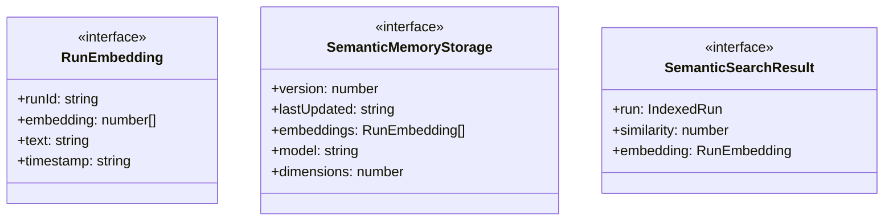
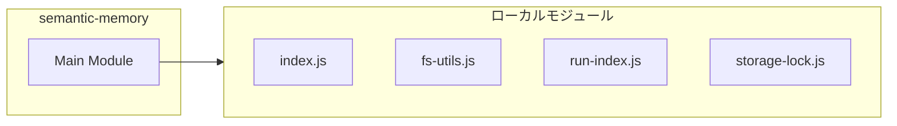
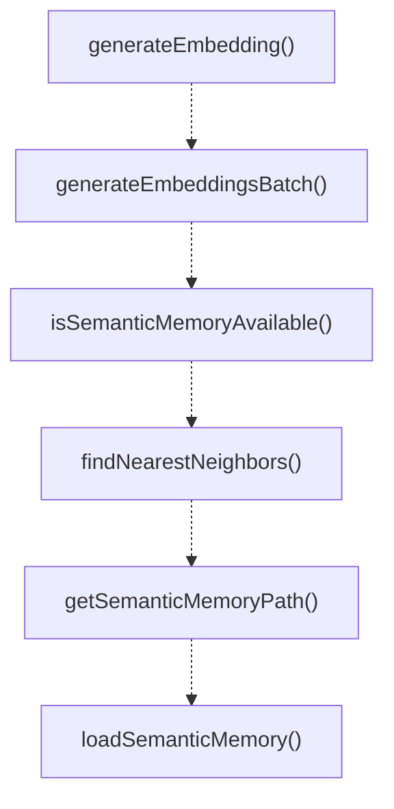

# semantic-memory

## 概要

`semantic-memory` モジュールのAPIリファレンス。

## インポート

```typescript
import { existsSync, readFileSync } from 'node:fs';
import { join } from 'node:path';
import { embeddingsGenerateEmbedding, embeddingsGenerateEmbeddingsBatch, cosineSimilarity... } from './embeddings/index.js';
import { ensureDir } from './fs-utils.js';
import { IndexedRun, RunIndex, getOrBuildRunIndex } from './run-index.js';
// ... and 1 more imports
```

## エクスポート一覧

| 種別 | 名前 | 説明 |
|------|------|------|
| 関数 | `generateEmbedding` | Generate embedding for text using the configured p |
| 関数 | `generateEmbeddingsBatch` | Generate embeddings for multiple texts in batch. |
| 関数 | `isSemanticMemoryAvailable` | Check if semantic memory is available (any provide |
| 関数 | `findNearestNeighbors` | Find the k nearest neighbors to a query vector. |
| 関数 | `getSemanticMemoryPath` | Get the path to the semantic memory storage file. |
| 関数 | `loadSemanticMemory` | Load semantic memory storage from disk. |
| 関数 | `saveSemanticMemory` | Save semantic memory storage to disk. |
| 関数 | `buildSemanticMemoryIndex` | Build semantic memory index from run index. |
| 関数 | `addRunToSemanticMemory` | Add a single run to semantic memory. |
| 関数 | `semanticSearch` | Search for similar runs using semantic similarity. |
| 関数 | `findSimilarRunsById` | Find runs similar to a given run ID. |
| 関数 | `getSemanticMemoryStats` | Get semantic memory statistics. |
| 関数 | `clearSemanticMemory` | Clear semantic memory index. |
| インターフェース | `RunEmbedding` | Vector embedding for a run. |
| インターフェース | `SemanticMemoryStorage` | Semantic memory storage. |
| インターフェース | `SemanticSearchResult` | Semantic search result. |

## 図解

### クラス図



### 依存関係図



### 関数フロー



### シーケンス図


## 関数

### generateEmbedding

```typescript
async generateEmbedding(text: string): Promise<number[] | null>
```

Generate embedding for text using the configured provider.

**パラメータ**

| 名前 | 型 | 必須 |
|------|-----|------|
| text | `string` | はい |

**戻り値**: `Promise<number[] | null>`

### generateEmbeddingsBatch

```typescript
async generateEmbeddingsBatch(texts: string[]): Promise<(number[] | null)[]>
```

Generate embeddings for multiple texts in batch.

**パラメータ**

| 名前 | 型 | 必須 |
|------|-----|------|
| texts | `string[]` | はい |

**戻り値**: `Promise<(number[] | null)[]>`

### isSemanticMemoryAvailable

```typescript
isSemanticMemoryAvailable(): boolean
```

Check if semantic memory is available (any provider configured).

**戻り値**: `boolean`

### findNearestNeighbors

```typescript
findNearestNeighbors(queryVector: number[], embeddings: RunEmbedding[], k: number): Array<{ embedding: RunEmbedding; similarity: number }>
```

Find the k nearest neighbors to a query vector.

**パラメータ**

| 名前 | 型 | 必須 |
|------|-----|------|
| queryVector | `number[]` | はい |
| embeddings | `RunEmbedding[]` | はい |
| k | `number` | はい |

**戻り値**: `Array<{ embedding: RunEmbedding; similarity: number }>`

### getSemanticMemoryPath

```typescript
getSemanticMemoryPath(cwd: string): string
```

Get the path to the semantic memory storage file.

**パラメータ**

| 名前 | 型 | 必須 |
|------|-----|------|
| cwd | `string` | はい |

**戻り値**: `string`

### loadSemanticMemory

```typescript
loadSemanticMemory(cwd: string): SemanticMemoryStorage
```

Load semantic memory storage from disk.

**パラメータ**

| 名前 | 型 | 必須 |
|------|-----|------|
| cwd | `string` | はい |

**戻り値**: `SemanticMemoryStorage`

### saveSemanticMemory

```typescript
saveSemanticMemory(cwd: string, storage: SemanticMemoryStorage): void
```

Save semantic memory storage to disk.

**パラメータ**

| 名前 | 型 | 必須 |
|------|-----|------|
| cwd | `string` | はい |
| storage | `SemanticMemoryStorage` | はい |

**戻り値**: `void`

### buildEmbeddingText

```typescript
buildEmbeddingText(run: IndexedRun): string
```

Build text to embed from a run.

**パラメータ**

| 名前 | 型 | 必須 |
|------|-----|------|
| run | `IndexedRun` | はい |

**戻り値**: `string`

### buildSemanticMemoryIndex

```typescript
async buildSemanticMemoryIndex(cwd: string, batchSize: number): Promise<SemanticMemoryStorage>
```

Build semantic memory index from run index.
Generates embeddings for all runs.

**パラメータ**

| 名前 | 型 | 必須 |
|------|-----|------|
| cwd | `string` | はい |
| batchSize | `number` | はい |

**戻り値**: `Promise<SemanticMemoryStorage>`

### addRunToSemanticMemory

```typescript
async addRunToSemanticMemory(cwd: string, run: IndexedRun): Promise<void>
```

Add a single run to semantic memory.

**パラメータ**

| 名前 | 型 | 必須 |
|------|-----|------|
| cwd | `string` | はい |
| run | `IndexedRun` | はい |

**戻り値**: `Promise<void>`

### semanticSearch

```typescript
async semanticSearch(cwd: string, query: string, options: {
    limit?: number;
    status?: "completed" | "failed";
    minSimilarity?: number;
  }): Promise<SemanticSearchResult[]>
```

Search for similar runs using semantic similarity.

**パラメータ**

| 名前 | 型 | 必須 |
|------|-----|------|
| cwd | `string` | はい |
| query | `string` | はい |
| options | `{
    limit?: number;
    status?: "completed" | "failed";
    minSimilarity?: number;
  }` | はい |

**戻り値**: `Promise<SemanticSearchResult[]>`

### findSimilarRunsById

```typescript
findSimilarRunsById(cwd: string, runId: string, limit: number): SemanticSearchResult[]
```

Find runs similar to a given run ID.

**パラメータ**

| 名前 | 型 | 必須 |
|------|-----|------|
| cwd | `string` | はい |
| runId | `string` | はい |
| limit | `number` | はい |

**戻り値**: `SemanticSearchResult[]`

### getSemanticMemoryStats

```typescript
getSemanticMemoryStats(cwd: string): {
  totalEmbeddings: number;
  lastUpdated: string;
  model: string;
  isAvailable: boolean;
}
```

Get semantic memory statistics.

**パラメータ**

| 名前 | 型 | 必須 |
|------|-----|------|
| cwd | `string` | はい |

**戻り値**: `{
  totalEmbeddings: number;
  lastUpdated: string;
  model: string;
  isAvailable: boolean;
}`

### clearSemanticMemory

```typescript
clearSemanticMemory(cwd: string): void
```

Clear semantic memory index.

**パラメータ**

| 名前 | 型 | 必須 |
|------|-----|------|
| cwd | `string` | はい |

**戻り値**: `void`

## インターフェース

### RunEmbedding

```typescript
interface RunEmbedding {
  runId: string;
  embedding: number[];
  text: string;
  timestamp: string;
}
```

Vector embedding for a run.

### SemanticMemoryStorage

```typescript
interface SemanticMemoryStorage {
  version: number;
  lastUpdated: string;
  embeddings: RunEmbedding[];
  model: string;
  dimensions: number;
}
```

Semantic memory storage.

### SemanticSearchResult

```typescript
interface SemanticSearchResult {
  run: IndexedRun;
  similarity: number;
  embedding: RunEmbedding;
}
```

Semantic search result.

---
*自動生成: 2026-02-17T22:24:18.967Z*
