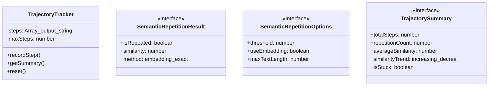
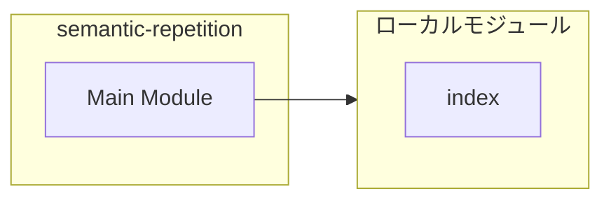
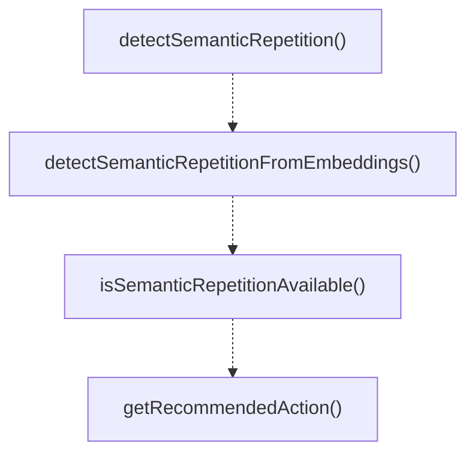
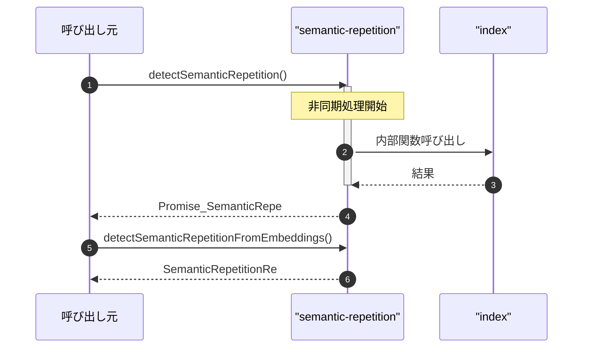

# semantic-repetition

## 概要

`semantic-repetition` モジュールのAPIリファレンス。

## インポート

```typescript
import { generateEmbedding, cosineSimilarity, getEmbeddingProvider } from './embeddings/index.js';
```

## エクスポート一覧

| 種別 | 名前 | 説明 |
|------|------|------|
| 関数 | `detectSemanticRepetition` | Detect semantic repetition between two outputs. |
| 関数 | `detectSemanticRepetitionFromEmbeddings` | Synchronous version using pre-computed embeddings. |
| 関数 | `isSemanticRepetitionAvailable` | Check if semantic repetition detection is availabl |
| 関数 | `getRecommendedAction` | Get recommended action based on repetition score. |
| クラス | `TrajectoryTracker` | Simple trajectory tracker for monitoring session p |
| インターフェース | `SemanticRepetitionResult` | Result of semantic repetition detection. |
| インターフェース | `SemanticRepetitionOptions` | Options for semantic repetition detection. |
| インターフェース | `TrajectorySummary` | Session trajectory summary for monitoring. |

## 図解

### クラス図



### 依存関係図



### 関数フロー



### シーケンス図



## 関数

### detectSemanticRepetition

```typescript
async detectSemanticRepetition(current: string, previous: string, options: SemanticRepetitionOptions): Promise<SemanticRepetitionResult>
```

Detect semantic repetition between two outputs.

This function compares consecutive outputs using either:
1. Embedding-based cosine similarity (if OPENAI_API_KEY available)
2. Exact string match (fallback)

**パラメータ**

| 名前 | 型 | 必須 |
|------|-----|------|
| current | `string` | はい |
| previous | `string` | はい |
| options | `SemanticRepetitionOptions` | はい |

**戻り値**: `Promise<SemanticRepetitionResult>`

### detectSemanticRepetitionFromEmbeddings

```typescript
detectSemanticRepetitionFromEmbeddings(currentEmbedding: number[], previousEmbedding: number[], threshold: number): SemanticRepetitionResult
```

Synchronous version using pre-computed embeddings.
Use when embeddings are already available.

**パラメータ**

| 名前 | 型 | 必須 |
|------|-----|------|
| currentEmbedding | `number[]` | はい |
| previousEmbedding | `number[]` | はい |
| threshold | `number` | はい |

**戻り値**: `SemanticRepetitionResult`

### normalizeText

```typescript
normalizeText(text: string, maxLength: number): string
```

Normalize text for comparison.

**パラメータ**

| 名前 | 型 | 必須 |
|------|-----|------|
| text | `string` | はい |
| maxLength | `number` | はい |

**戻り値**: `string`

### isSemanticRepetitionAvailable

```typescript
async isSemanticRepetitionAvailable(): Promise<boolean>
```

Check if semantic repetition detection is available.
Uses the embeddings module's provider registry.

**戻り値**: `Promise<boolean>`

### getRecommendedAction

```typescript
getRecommendedAction(repetitionCount: number, totalSteps: number, isStuck: boolean): "continue" | "pivot" | "early_stop"
```

Get recommended action based on repetition score.
Based on paper findings: high repetition indicates stagnation.

**パラメータ**

| 名前 | 型 | 必須 |
|------|-----|------|
| repetitionCount | `number` | はい |
| totalSteps | `number` | はい |
| isStuck | `boolean` | はい |

**戻り値**: `"continue" | "pivot" | "early_stop"`

## クラス

### TrajectoryTracker

Simple trajectory tracker for monitoring session progress.
Implements memory bounds to prevent DoS via unbounded accumulation.

**プロパティ**

| 名前 | 型 | 可視性 |
|------|-----|--------|
| steps | `Array<{
    output: string;
    similarity?: number;
    isRepeated: boolean;
  }>` | private |
| maxSteps | `number` | private |

**メソッド**

| 名前 | シグネチャ |
|------|------------|
| recordStep | `recordStep(output, options): Promise<SemanticRepetitionResult>` |
| getSummary | `getSummary(): TrajectorySummary` |
| reset | `reset(): void` |

## インターフェース

### SemanticRepetitionResult

```typescript
interface SemanticRepetitionResult {
  isRepeated: boolean;
  similarity: number;
  method: "embedding" | "exact" | "unavailable";
}
```

Result of semantic repetition detection.

### SemanticRepetitionOptions

```typescript
interface SemanticRepetitionOptions {
  threshold?: number;
  useEmbedding?: boolean;
  maxTextLength?: number;
}
```

Options for semantic repetition detection.

### TrajectorySummary

```typescript
interface TrajectorySummary {
  totalSteps: number;
  repetitionCount: number;
  averageSimilarity: number;
  similarityTrend: "increasing" | "decreasing" | "stable";
  isStuck: boolean;
}
```

Session trajectory summary for monitoring.

---
*自動生成: 2026-02-18T00:15:35.755Z*
