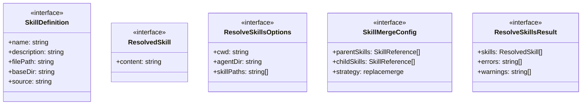
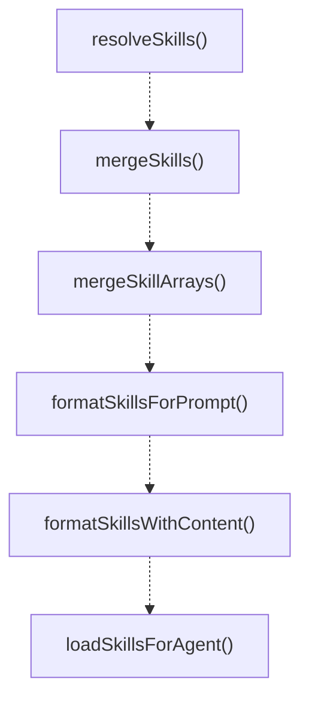
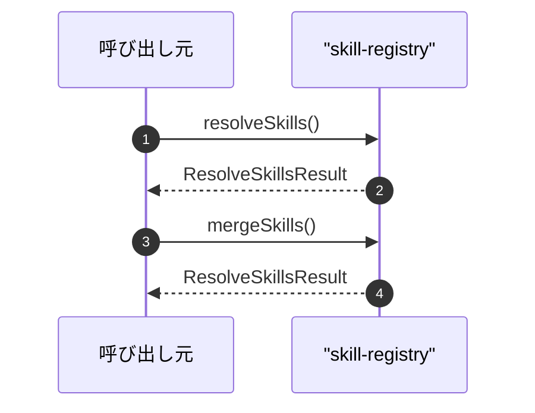

# skill-registry

## 概要

`skill-registry` モジュールのAPIリファレンス。

## インポート

```typescript
import { existsSync, readFileSync } from 'node:fs';
import { homedir } from 'node:os';
import { dirname, join } from 'node:path';
```

## エクスポート一覧

| 種別 | 名前 | 説明 |
|------|------|------|
| 関数 | `resolveSkills` | Resolve multiple skills by reference |
| 関数 | `mergeSkills` | Merge skills according to inheritance rules |
| 関数 | `mergeSkillArrays` | Merge skill arrays handling the inheritance patter |
| 関数 | `formatSkillsForPrompt` | Format resolved skills for prompt injection |
| 関数 | `formatSkillsWithContent` | Format resolved skills with full content for immed |
| 関数 | `loadSkillsForAgent` | Load and resolve skills for a subagent or team mem |
| 関数 | `validateSkillReferences` | Validate skill references without loading content |
| インターフェース | `SkillDefinition` | Skill definition matching pi-core Skill interface |
| インターフェース | `ResolvedSkill` | Resolved skill with content loaded |
| インターフェース | `ResolveSkillsOptions` | Skill resolution options |
| インターフェース | `SkillMergeConfig` | Skill merge configuration for inheritance |
| インターフェース | `ResolveSkillsResult` | Result of skill resolution |
| 型 | `SkillReference` | Skill reference - can be a skill name or path |

## 図解

### クラス図



### 関数フロー



### シーケンス図



## 関数

### getDefaultAgentDir

```typescript
getDefaultAgentDir(): string
```

Get the default agent directory (~/.pi/agent)

**戻り値**: `string`

### getSkillSearchPaths

```typescript
getSkillSearchPaths(cwd: string, agentDir?: string): string[]
```

Get candidate skill directories to search

**パラメータ**

| 名前 | 型 | 必須 |
|------|-----|------|
| cwd | `string` | はい |
| agentDir | `string` | いいえ |

**戻り値**: `string[]`

### parseSkillFrontmatter

```typescript
parseSkillFrontmatter(content: string): {
  frontmatter: Record<string, unknown>;
  body: string;
}
```

Parse YAML frontmatter from skill content

**パラメータ**

| 名前 | 型 | 必須 |
|------|-----|------|
| content | `string` | はい |

**戻り値**: `{
  frontmatter: Record<string, unknown>;
  body: string;
}`

### loadSkillFromFile

```typescript
loadSkillFromFile(filePath: string, source: string): { skill: SkillDefinition | null; error?: string }
```

Load a single skill from its SKILL.md file

**パラメータ**

| 名前 | 型 | 必須 |
|------|-----|------|
| filePath | `string` | はい |
| source | `string` | はい |

**戻り値**: `{ skill: SkillDefinition | null; error?: string }`

### discoverSkillsFromDir

```typescript
discoverSkillsFromDir(skillsDir: string, source: string): { skills: SkillDefinition[]; errors: string[] }
```

Discover skills from a directory

**パラメータ**

| 名前 | 型 | 必須 |
|------|-----|------|
| skillsDir | `string` | はい |
| source | `string` | はい |

**戻り値**: `{ skills: SkillDefinition[]; errors: string[] }`

### buildSkillIndex

```typescript
buildSkillIndex(cwd: string, agentDir?: string, additionalPaths?: string[]): Map<string, SkillDefinition>
```

Build a skill index for fast lookup

**パラメータ**

| 名前 | 型 | 必須 |
|------|-----|------|
| cwd | `string` | はい |
| agentDir | `string` | いいえ |
| additionalPaths | `string[]` | いいえ |

**戻り値**: `Map<string, SkillDefinition>`

### resolveSkillContent

```typescript
resolveSkillContent(skill: SkillDefinition): {
  content: string;
  error?: string;
}
```

Resolve skill content from file

**パラメータ**

| 名前 | 型 | 必須 |
|------|-----|------|
| skill | `SkillDefinition` | はい |

**戻り値**: `{
  content: string;
  error?: string;
}`

### resolveSkills

```typescript
resolveSkills(references: SkillReference[], options: ResolveSkillsOptions): ResolveSkillsResult
```

Resolve multiple skills by reference

**パラメータ**

| 名前 | 型 | 必須 |
|------|-----|------|
| references | `SkillReference[]` | はい |
| options | `ResolveSkillsOptions` | はい |

**戻り値**: `ResolveSkillsResult`

### mergeSkills

```typescript
mergeSkills(config: SkillMergeConfig, options: ResolveSkillsOptions): ResolveSkillsResult
```

Merge skills according to inheritance rules

Rules:
- Empty array [] is ignored (treated as "not specified")
- Parent skills are inherited by default
- Child skills are merged with parent skills
- "replace" strategy ignores parent skills

**パラメータ**

| 名前 | 型 | 必須 |
|------|-----|------|
| config | `SkillMergeConfig` | はい |
| options | `ResolveSkillsOptions` | はい |

**戻り値**: `ResolveSkillsResult`

### mergeSkillArrays

```typescript
mergeSkillArrays(parentSkills: SkillReference[] | undefined, childSkills: SkillReference[] | undefined): SkillReference[]
```

Merge skill arrays handling the inheritance pattern
Used by subagents and agent teams

**パラメータ**

| 名前 | 型 | 必須 |
|------|-----|------|
| parentSkills | `SkillReference[] | undefined` | はい |
| childSkills | `SkillReference[] | undefined` | はい |

**戻り値**: `SkillReference[]`

### formatSkillsForPrompt

```typescript
formatSkillsForPrompt(skills: ResolvedSkill[]): string
```

Format resolved skills for prompt injection

**パラメータ**

| 名前 | 型 | 必須 |
|------|-----|------|
| skills | `ResolvedSkill[]` | はい |

**戻り値**: `string`

### formatSkillsWithContent

```typescript
formatSkillsWithContent(skills: ResolvedSkill[]): string
```

Format resolved skills with full content for immediate use

**パラメータ**

| 名前 | 型 | 必須 |
|------|-----|------|
| skills | `ResolvedSkill[]` | はい |

**戻り値**: `string`

### escapeXml

```typescript
escapeXml(str: string): string
```

Escape special characters for XML

**パラメータ**

| 名前 | 型 | 必須 |
|------|-----|------|
| str | `string` | はい |

**戻り値**: `string`

### loadSkillsForAgent

```typescript
loadSkillsForAgent(skillReferences: SkillReference[] | undefined, parentSkillReferences: SkillReference[] | undefined, cwd: string): { promptSection: string; skills: ResolvedSkill[]; errors: string[] }
```

Load and resolve skills for a subagent or team member

**パラメータ**

| 名前 | 型 | 必須 |
|------|-----|------|
| skillReferences | `SkillReference[] | undefined` | はい |
| parentSkillReferences | `SkillReference[] | undefined` | はい |
| cwd | `string` | はい |

**戻り値**: `{ promptSection: string; skills: ResolvedSkill[]; errors: string[] }`

### validateSkillReferences

```typescript
validateSkillReferences(references: SkillReference[], cwd: string): { valid: string[]; invalid: string[] }
```

Validate skill references without loading content

**パラメータ**

| 名前 | 型 | 必須 |
|------|-----|------|
| references | `SkillReference[]` | はい |
| cwd | `string` | はい |

**戻り値**: `{ valid: string[]; invalid: string[] }`

## インターフェース

### SkillDefinition

```typescript
interface SkillDefinition {
  name: string;
  description: string;
  filePath: string;
  baseDir: string;
  source: string;
  disableModelInvocation: boolean;
}
```

Skill definition matching pi-core Skill interface

### ResolvedSkill

```typescript
interface ResolvedSkill {
  content: string;
}
```

Resolved skill with content loaded

### ResolveSkillsOptions

```typescript
interface ResolveSkillsOptions {
  cwd: string;
  agentDir?: string;
  skillPaths?: string[];
}
```

Skill resolution options

### SkillMergeConfig

```typescript
interface SkillMergeConfig {
  parentSkills?: SkillReference[];
  childSkills?: SkillReference[];
  strategy?: "replace" | "merge";
}
```

Skill merge configuration for inheritance

### ResolveSkillsResult

```typescript
interface ResolveSkillsResult {
  skills: ResolvedSkill[];
  errors: string[];
  warnings: string[];
}
```

Result of skill resolution

## 型定義

### SkillReference

```typescript
type SkillReference = string
```

Skill reference - can be a skill name or path

---
*自動生成: 2026-02-17T22:24:18.971Z*
