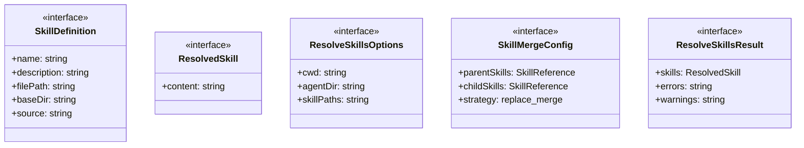
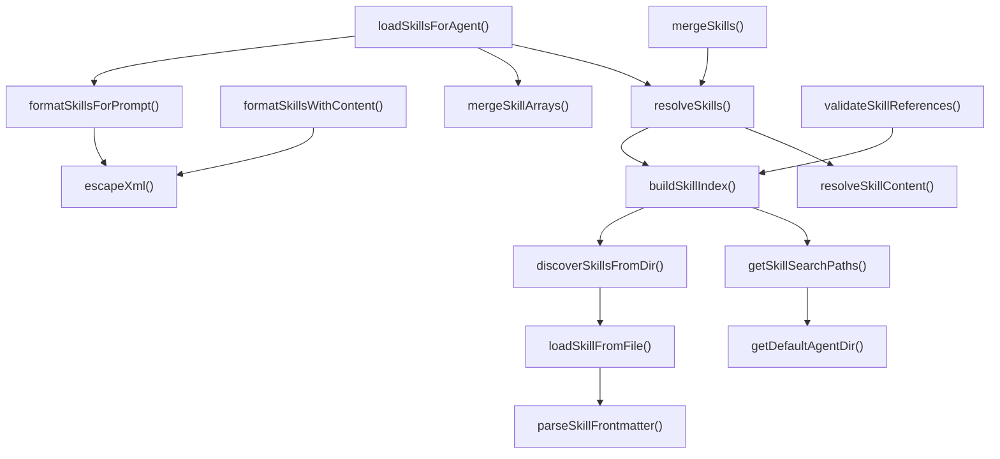
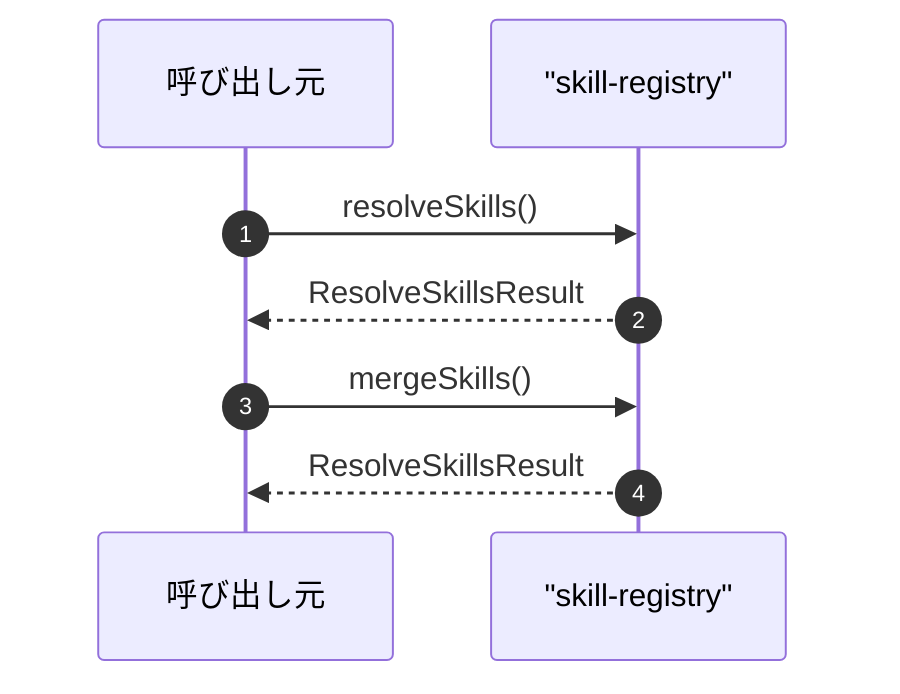

# skill-registry

## 概要

`skill-registry` モジュールのAPIリファレンス。

## インポート

```typescript
// from 'node:fs': existsSync, readFileSync
// from 'node:os': homedir
// from 'node:path': dirname, join
```

## エクスポート一覧

| 種別 | 名前 | 説明 |
|------|------|------|
| 関数 | `resolveSkills` | 複数のスキルを参照から解決する |
| 関数 | `mergeSkills` | 継承ルールに従ってスキルをマージする |
| 関数 | `mergeSkillArrays` | スキル配列をマージする |
| 関数 | `formatSkillsForPrompt` | 解決済みスキルをプロンプト用に整形する |
| 関数 | `formatSkillsWithContent` | 解決済みスキルをフルコンテンツ付きでフォーマットする |
| 関数 | `loadSkillsForAgent` | サブエージェント用のスキルを読み込み解決する |
| 関数 | `validateSkillReferences` | スキル参照を検証 |
| インターフェース | `SkillDefinition` | pi-coreのSkillインターフェースに対応する定義 |
| インターフェース | `ResolvedSkill` | コンテンツが読み込まれた解決済みスキル |
| インターフェース | `ResolveSkillsOptions` | スキル解決のオプション |
| インターフェース | `SkillMergeConfig` | スキル継承のマージ設定 |
| インターフェース | `ResolveSkillsResult` | スキル解決の結果 |
| 型 | `SkillReference` | スキル名またはパスを表す文字列 |

## 図解

### クラス図



### 関数フロー



### シーケンス図



## 関数

### getDefaultAgentDir

```typescript
getDefaultAgentDir(): string
```

Get the default agent directory (~/.pi/agent)

**戻り値**: `string`

### getSkillSearchPaths

```typescript
getSkillSearchPaths(cwd: string, agentDir?: string): string[]
```

Get candidate skill directories to search

**パラメータ**

| 名前 | 型 | 必須 |
|------|-----|------|
| cwd | `string` | はい |
| agentDir | `string` | いいえ |

**戻り値**: `string[]`

### parseSkillFrontmatter

```typescript
parseSkillFrontmatter(content: string): {
  frontmatter: Record<string, unknown>;
  body: string;
}
```

Parse YAML frontmatter from skill content

**パラメータ**

| 名前 | 型 | 必須 |
|------|-----|------|
| content | `string` | はい |

**戻り値**: `{
  frontmatter: Record<string, unknown>;
  body: string;
}`

### loadSkillFromFile

```typescript
loadSkillFromFile(filePath: string, source: string): { skill: SkillDefinition | null; error?: string }
```

Load a single skill from its SKILL.md file

**パラメータ**

| 名前 | 型 | 必須 |
|------|-----|------|
| filePath | `string` | はい |
| source | `string` | はい |

**戻り値**: `{ skill: SkillDefinition | null; error?: string }`

### discoverSkillsFromDir

```typescript
discoverSkillsFromDir(skillsDir: string, source: string): { skills: SkillDefinition[]; errors: string[] }
```

Discover skills from a directory

**パラメータ**

| 名前 | 型 | 必須 |
|------|-----|------|
| skillsDir | `string` | はい |
| source | `string` | はい |

**戻り値**: `{ skills: SkillDefinition[]; errors: string[] }`

### buildSkillIndex

```typescript
buildSkillIndex(cwd: string, agentDir?: string, additionalPaths?: string[]): Map<string, SkillDefinition>
```

Build a skill index for fast lookup

**パラメータ**

| 名前 | 型 | 必須 |
|------|-----|------|
| cwd | `string` | はい |
| agentDir | `string` | いいえ |
| additionalPaths | `string[]` | いいえ |

**戻り値**: `Map<string, SkillDefinition>`

### resolveSkillContent

```typescript
resolveSkillContent(skill: SkillDefinition): {
  content: string;
  error?: string;
}
```

Resolve skill content from file

**パラメータ**

| 名前 | 型 | 必須 |
|------|-----|------|
| skill | `SkillDefinition` | はい |

**戻り値**: `{
  content: string;
  error?: string;
}`

### resolveSkills

```typescript
resolveSkills(references: SkillReference[], options: ResolveSkillsOptions): ResolveSkillsResult
```

複数のスキルを参照から解決する

**パラメータ**

| 名前 | 型 | 必須 |
|------|-----|------|
| references | `SkillReference[]` | はい |
| options | `ResolveSkillsOptions` | はい |

**戻り値**: `ResolveSkillsResult`

### mergeSkills

```typescript
mergeSkills(config: SkillMergeConfig, options: ResolveSkillsOptions): ResolveSkillsResult
```

継承ルールに従ってスキルをマージする

**パラメータ**

| 名前 | 型 | 必須 |
|------|-----|------|
| config | `SkillMergeConfig` | はい |
| options | `ResolveSkillsOptions` | はい |

**戻り値**: `ResolveSkillsResult`

### mergeSkillArrays

```typescript
mergeSkillArrays(parentSkills: SkillReference[] | undefined, childSkills: SkillReference[] | undefined): SkillReference[]
```

スキル配列をマージする

**パラメータ**

| 名前 | 型 | 必須 |
|------|-----|------|
| parentSkills | `SkillReference[] | undefined` | はい |
| childSkills | `SkillReference[] | undefined` | はい |

**戻り値**: `SkillReference[]`

### formatSkillsForPrompt

```typescript
formatSkillsForPrompt(skills: ResolvedSkill[]): string
```

解決済みスキルをプロンプト用に整形する

**パラメータ**

| 名前 | 型 | 必須 |
|------|-----|------|
| skills | `ResolvedSkill[]` | はい |

**戻り値**: `string`

### formatSkillsWithContent

```typescript
formatSkillsWithContent(skills: ResolvedSkill[]): string
```

解決済みスキルをフルコンテンツ付きでフォーマットする

**パラメータ**

| 名前 | 型 | 必須 |
|------|-----|------|
| skills | `ResolvedSkill[]` | はい |

**戻り値**: `string`

### escapeXml

```typescript
escapeXml(str: string): string
```

Escape special characters for XML

**パラメータ**

| 名前 | 型 | 必須 |
|------|-----|------|
| str | `string` | はい |

**戻り値**: `string`

### loadSkillsForAgent

```typescript
loadSkillsForAgent(skillReferences: SkillReference[] | undefined, parentSkillReferences: SkillReference[] | undefined, cwd: string): { promptSection: string; skills: ResolvedSkill[]; errors: string[] }
```

サブエージェント用のスキルを読み込み解決する

**パラメータ**

| 名前 | 型 | 必須 |
|------|-----|------|
| skillReferences | `SkillReference[] | undefined` | はい |
| parentSkillReferences | `SkillReference[] | undefined` | はい |
| cwd | `string` | はい |

**戻り値**: `{ promptSection: string; skills: ResolvedSkill[]; errors: string[] }`

### validateSkillReferences

```typescript
validateSkillReferences(references: SkillReference[], cwd: string): { valid: string[]; invalid: string[] }
```

スキル参照を検証

**パラメータ**

| 名前 | 型 | 必須 |
|------|-----|------|
| references | `SkillReference[]` | はい |
| cwd | `string` | はい |

**戻り値**: `{ valid: string[]; invalid: string[] }`

## インターフェース

### SkillDefinition

```typescript
interface SkillDefinition {
  name: string;
  description: string;
  filePath: string;
  baseDir: string;
  source: string;
  disableModelInvocation: boolean;
}
```

pi-coreのSkillインターフェースに対応する定義

### ResolvedSkill

```typescript
interface ResolvedSkill {
  content: string;
}
```

コンテンツが読み込まれた解決済みスキル

### ResolveSkillsOptions

```typescript
interface ResolveSkillsOptions {
  cwd: string;
  agentDir?: string;
  skillPaths?: string[];
}
```

スキル解決のオプション

### SkillMergeConfig

```typescript
interface SkillMergeConfig {
  parentSkills?: SkillReference[];
  childSkills?: SkillReference[];
  strategy?: "replace" | "merge";
}
```

スキル継承のマージ設定

### ResolveSkillsResult

```typescript
interface ResolveSkillsResult {
  skills: ResolvedSkill[];
  errors: string[];
  warnings: string[];
}
```

スキル解決の結果

## 型定義

### SkillReference

```typescript
type SkillReference = string
```

スキル名またはパスを表す文字列

---
*自動生成: 2026-02-18T14:31:31.026Z*
