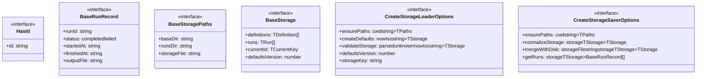
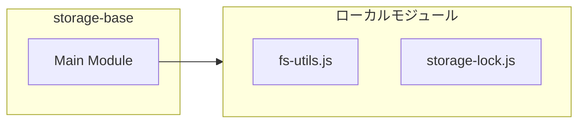
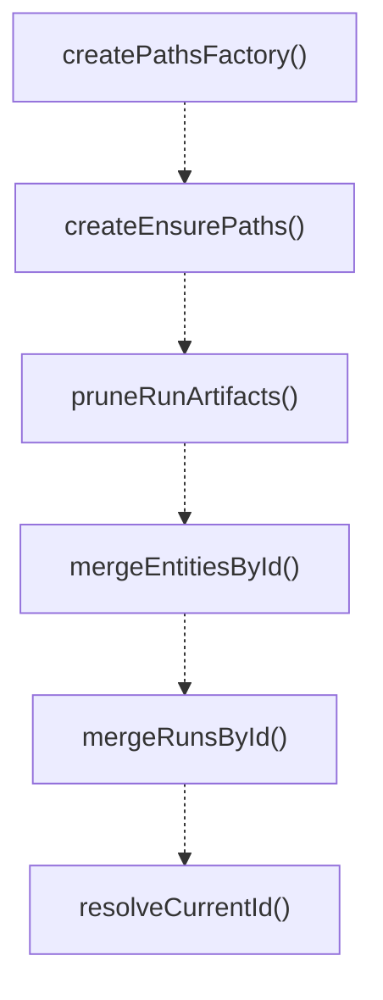

# storage-base

## 概要

`storage-base` モジュールのAPIリファレンス。

## インポート

```typescript
import { existsSync, readdirSync, readFileSync... } from 'node:fs';
import { basename, join } from 'node:path';
import { ensureDir } from './fs-utils.js';
import { atomicWriteTextFile, withFileLock } from './storage-lock.js';
```

## エクスポート一覧

| 種別 | 名前 | 説明 |
|------|------|------|
| 関数 | `createPathsFactory` | Create a paths factory for a given subdirectory. |
| 関数 | `createEnsurePaths` | Create an ensurePaths function that creates direct |
| 関数 | `pruneRunArtifacts` | Prune old run artifacts from disk. |
| 関数 | `mergeEntitiesById` | Merge two arrays of entities by ID, preferring the |
| 関数 | `mergeRunsById` | Merge two arrays of run records by runId, preferri |
| 関数 | `resolveCurrentId` | Resolve the current ID, ensuring it exists in the  |
| 関数 | `resolveDefaultsVersion` | Extract defaults version from disk storage. |
| 関数 | `createStorageLoader` | Create a storage loader function. |
| 関数 | `createStorageSaver` | Create a storage saver function. |
| 関数 | `toId` | Convert string to ID format (lowercase, hyphen-sep |
| 関数 | `mergeSubagentStorageWithDisk` | Merge subagent storage with disk state. |
| 関数 | `mergeTeamStorageWithDisk` | Merge team storage with disk state. |
| インターフェース | `HasId` | Base interface for entities that have an ID. |
| インターフェース | `BaseRunRecord` | Base interface for run records. |
| インターフェース | `BaseStoragePaths` | Base interface for storage paths. |
| インターフェース | `BaseStorage` | Base interface for storage with definitions and ru |
| インターフェース | `CreateStorageLoaderOptions` | Options for creating a storage loader. |
| インターフェース | `CreateStorageSaverOptions` | Options for creating a storage saver. |

## 図解

### クラス図



### 依存関係図



### 関数フロー



## 関数

### createPathsFactory

```typescript
createPathsFactory(subdir: string): void
```

Create a paths factory for a given subdirectory.

**パラメータ**

| 名前 | 型 | 必須 |
|------|-----|------|
| subdir | `string` | はい |

**戻り値**: `void`

### createEnsurePaths

```typescript
createEnsurePaths(getPaths: (cwd: string) => TPaths): (cwd: string) => TPaths
```

Create an ensurePaths function that creates directories.

**パラメータ**

| 名前 | 型 | 必須 |
|------|-----|------|
| getPaths | `(cwd: string) => TPaths` | はい |

**戻り値**: `(cwd: string) => TPaths`

### pruneRunArtifacts

```typescript
pruneRunArtifacts(paths: BaseStoragePaths, runs: TRun[]): void
```

Prune old run artifacts from disk.
Generic version that works with any run record type.

**パラメータ**

| 名前 | 型 | 必須 |
|------|-----|------|
| paths | `BaseStoragePaths` | はい |
| runs | `TRun[]` | はい |

**戻り値**: `void`

### mergeEntitiesById

```typescript
mergeEntitiesById(disk: TEntity[], next: TEntity[]): TEntity[]
```

Merge two arrays of entities by ID, preferring the second array for duplicates.

**パラメータ**

| 名前 | 型 | 必須 |
|------|-----|------|
| disk | `TEntity[]` | はい |
| next | `TEntity[]` | はい |

**戻り値**: `TEntity[]`

### mergeRunsById

```typescript
mergeRunsById(disk: TRun[], next: TRun[], maxRuns: number): TRun[]
```

Merge two arrays of run records by runId, preferring the second array for duplicates.
Also sorts by finishedAt/startedAt and limits to maxRuns.

**パラメータ**

| 名前 | 型 | 必須 |
|------|-----|------|
| disk | `TRun[]` | はい |
| next | `TRun[]` | はい |
| maxRuns | `number` | はい |

**戻り値**: `TRun[]`

### resolveCurrentId

```typescript
resolveCurrentId(nextId: string | undefined, diskId: string | undefined, definitions: TEntity[]): string | undefined
```

Resolve the current ID, ensuring it exists in the merged definitions.

**パラメータ**

| 名前 | 型 | 必須 |
|------|-----|------|
| nextId | `string | undefined` | はい |
| diskId | `string | undefined` | はい |
| definitions | `TEntity[]` | はい |

**戻り値**: `string | undefined`

### resolveDefaultsVersion

```typescript
resolveDefaultsVersion(diskVersion: unknown, currentVersion: number): number
```

Extract defaults version from disk storage.

**パラメータ**

| 名前 | 型 | 必須 |
|------|-----|------|
| diskVersion | `unknown` | はい |
| currentVersion | `number` | はい |

**戻り値**: `number`

### createStorageLoader

```typescript
createStorageLoader(options: CreateStorageLoaderOptions<TStorage, TPaths>): (cwd: string) => TStorage
```

Create a storage loader function.

**パラメータ**

| 名前 | 型 | 必須 |
|------|-----|------|
| options | `CreateStorageLoaderOptions<TStorage, TPaths>` | はい |

**戻り値**: `(cwd: string) => TStorage`

### createStorageSaver

```typescript
createStorageSaver(options: CreateStorageSaverOptions<TStorage, TPaths>): (cwd: string, storage: TStorage) => void
```

Create a storage saver function.

**パラメータ**

| 名前 | 型 | 必須 |
|------|-----|------|
| options | `CreateStorageSaverOptions<TStorage, TPaths>` | はい |

**戻り値**: `(cwd: string, storage: TStorage) => void`

### toId

```typescript
toId(input: string): string
```

Convert string to ID format (lowercase, hyphen-separated).

**パラメータ**

| 名前 | 型 | 必須 |
|------|-----|------|
| input | `string` | はい |

**戻り値**: `string`

### mergeSubagentStorageWithDisk

```typescript
mergeSubagentStorageWithDisk(storageFile: string, next: {
    agents: Array<{ id: string }>;
    runs: Array<{ runId: string; startedAt?: string; finishedAt?: string }>;
    currentAgentId?: string;
    defaultsVersion?: number;
  }, defaultsVersion: number, maxRuns: number): typeof next
```

Merge subagent storage with disk state.
Note: This is exported for direct use by subagents/storage.ts during migration.

**パラメータ**

| 名前 | 型 | 必須 |
|------|-----|------|
| storageFile | `string` | はい |
| next | `{
    agents: Array<{ id: string }>;
    runs: Array<{ runId: string; startedAt?: string; finishedAt?: string }>;
    currentAgentId?: string;
    defaultsVersion?: number;
  }` | はい |
| defaultsVersion | `number` | はい |
| maxRuns | `number` | はい |

**戻り値**: `typeof next`

### mergeTeamStorageWithDisk

```typescript
mergeTeamStorageWithDisk(storageFile: string, next: {
    teams: Array<{ id: string }>;
    runs: Array<{ runId: string; startedAt?: string; finishedAt?: string }>;
    currentTeamId?: string;
    defaultsVersion?: number;
  }, defaultsVersion: number, maxRuns: number): typeof next
```

Merge team storage with disk state.
Note: This is exported for direct use by agent-teams/storage.ts during migration.

**パラメータ**

| 名前 | 型 | 必須 |
|------|-----|------|
| storageFile | `string` | はい |
| next | `{
    teams: Array<{ id: string }>;
    runs: Array<{ runId: string; startedAt?: string; finishedAt?: string }>;
    currentTeamId?: string;
    defaultsVersion?: number;
  }` | はい |
| defaultsVersion | `number` | はい |
| maxRuns | `number` | はい |

**戻り値**: `typeof next`

## インターフェース

### HasId

```typescript
interface HasId {
  id: string;
}
```

Base interface for entities that have an ID.

### BaseRunRecord

```typescript
interface BaseRunRecord {
  runId: string;
  status: "completed" | "failed";
  startedAt: string;
  finishedAt: string;
  outputFile: string;
  error?: string;
}
```

Base interface for run records.
Note: Uses runId as the unique identifier (not id).

### BaseStoragePaths

```typescript
interface BaseStoragePaths {
  baseDir: string;
  runsDir: string;
  storageFile: string;
}
```

Base interface for storage paths.

### BaseStorage

```typescript
interface BaseStorage {
  definitions: TDefinition[];
  runs: TRun[];
  currentId?: TCurrentKey;
  defaultsVersion?: number;
}
```

Base interface for storage with definitions and runs.

### CreateStorageLoaderOptions

```typescript
interface CreateStorageLoaderOptions {
  ensurePaths: (cwd: string) => TPaths;
  createDefaults: (nowIso: string) => TStorage;
  validateStorage: (parsed: unknown, nowIso: string) => TStorage;
  defaultsVersion: number;
  storageKey: string;
}
```

Options for creating a storage loader.

### CreateStorageSaverOptions

```typescript
interface CreateStorageSaverOptions {
  ensurePaths: (cwd: string) => TPaths;
  normalizeStorage: (storage: TStorage) => TStorage;
  mergeWithDisk: (storageFile: string, storage: TStorage) => TStorage;
  getRuns: (storage: TStorage) => BaseRunRecord[];
}
```

Options for creating a storage saver.

---
*自動生成: 2026-02-17T21:48:27.761Z*
