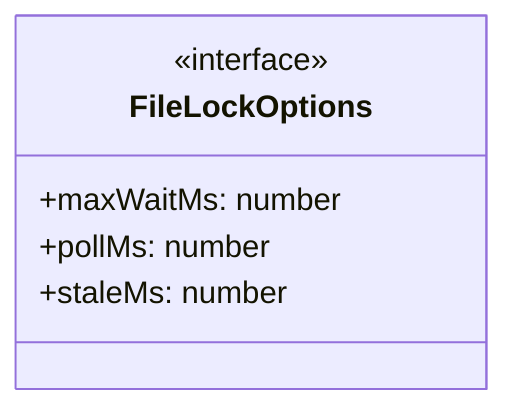
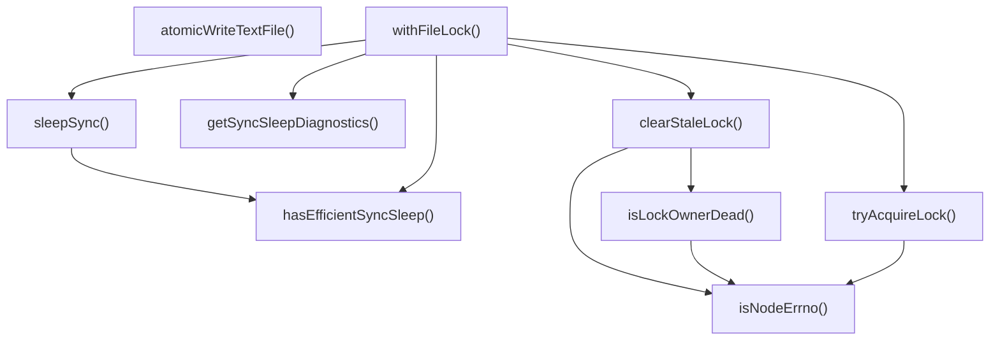
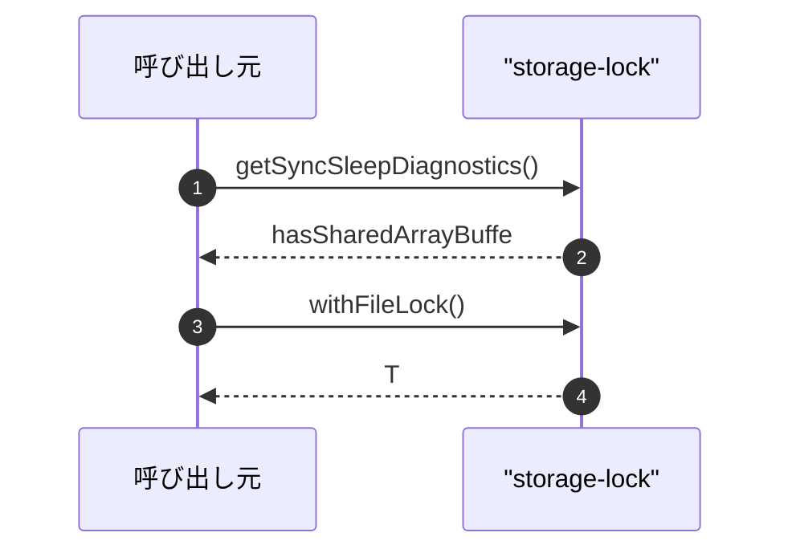

# storage-lock

## 概要

`storage-lock` モジュールのAPIリファレンス。

## インポート

```typescript
// from 'node:crypto': randomBytes
// from 'node:fs': closeSync, openSync, readFileSync, ...
```

## エクスポート一覧

| 種別 | 名前 | 説明 |
|------|------|------|
| 関数 | `getSyncSleepDiagnostics` | SharedArrayBuffer利用可否の詳細情報を取得 |
| 関数 | `withFileLock` | - |
| 関数 | `atomicWriteTextFile` | - |
| インターフェース | `FileLockOptions` | - |

## 図解

### クラス図



### 関数フロー



### シーケンス図



## 関数

### hasEfficientSyncSleep

```typescript
hasEfficientSyncSleep(): boolean
```

Check if efficient synchronous sleep is available.
SharedArrayBuffer + Atomics.wait is required for non-blocking sleep.

**戻り値**: `boolean`

### sleepSync

```typescript
sleepSync(ms: number): boolean
```

Synchronous sleep using Atomics.wait on SharedArrayBuffer.
Returns true if sleep was successful, false if efficient sleep is unavailable.
WARNING: Never uses busy-wait to avoid CPU spin.

**パラメータ**

| 名前 | 型 | 必須 |
|------|-----|------|
| ms | `number` | はい |

**戻り値**: `boolean`

### getSyncSleepDiagnostics

```typescript
getSyncSleepDiagnostics(): {
  hasSharedArrayBuffer: boolean;
  hasAtomics: boolean;
  hasAtomicsWait: boolean;
  isAvailable: boolean;
  reason: string;
}
```

SharedArrayBuffer利用可否の詳細情報を取得

**戻り値**: `{
  hasSharedArrayBuffer: boolean;
  hasAtomics: boolean;
  hasAtomicsWait: boolean;
  isAvailable: boolean;
  reason: string;
}`

### isNodeErrno

```typescript
isNodeErrno(error: unknown, code: string): boolean
```

**パラメータ**

| 名前 | 型 | 必須 |
|------|-----|------|
| error | `unknown` | はい |
| code | `string` | はい |

**戻り値**: `boolean`

### tryAcquireLock

```typescript
tryAcquireLock(lockFile: string): boolean
```

**パラメータ**

| 名前 | 型 | 必須 |
|------|-----|------|
| lockFile | `string` | はい |

**戻り値**: `boolean`

### clearStaleLock

```typescript
clearStaleLock(lockFile: string, staleMs: number): void
```

**パラメータ**

| 名前 | 型 | 必須 |
|------|-----|------|
| lockFile | `string` | はい |
| staleMs | `number` | はい |

**戻り値**: `void`

### isLockOwnerDead

```typescript
isLockOwnerDead(): boolean
```

**戻り値**: `boolean`

### withFileLock

```typescript
withFileLock(targetFile: string, fn: () => T, options?: FileLockOptions): T
```

**パラメータ**

| 名前 | 型 | 必須 |
|------|-----|------|
| targetFile | `string` | はい |
| fn | `() => T` | はい |
| options | `FileLockOptions` | いいえ |

**戻り値**: `T`

### atomicWriteTextFile

```typescript
atomicWriteTextFile(filePath: string, content: string): void
```

**パラメータ**

| 名前 | 型 | 必須 |
|------|-----|------|
| filePath | `string` | はい |
| content | `string` | はい |

**戻り値**: `void`

## インターフェース

### FileLockOptions

```typescript
interface FileLockOptions {
  maxWaitMs?: number;
  pollMs?: number;
  staleMs?: number;
}
```

---
*自動生成: 2026-02-22T19:27:00.724Z*
