# structured-analysis-output

## 概要

`structured-analysis-output` モジュールのAPIリファレンス。

## エクスポート一覧

| 種別 | 名前 | 説明 |
|------|------|------|
| 関数 | `parseAnalysisJson` | ANALYSIS_JSONをパース |
| 関数 | `parsePremiseAnalysisJson` | 前提分析JSONをパース |
| 関数 | `extractAnalysisJson` | ANALYSIS_JSONブロックを抽出して返す |
| 関数 | `excellencePursuitToLabel` | 卓越性追求タイプを日本語表示に変換 |
| 関数 | `meaningfulGrowthToLabel` | 意味ある成長タイプを日本語表示に変換 |
| 関数 | `worldCreatedToLabel` | 世界創造タイプを日本語表示に変換 |
| 関数 | `thinkingModeToLabel` | 思考モードを日本語表示に変換 |
| インターフェース | `DeconstructionAnalysisOutput` | 脱構築分析結果 |
| インターフェース | `SchizoAnalysisOutput` | スキゾ分析結果 |
| インターフェース | `EudaimoniaOutput` | エウダイモニア評価結果 |
| インターフェース | `UtopiaDystopiaOutput` | ユートピア/ディストピア分析結果 |
| インターフェース | `PhilosophyOfThoughtOutput` | 思考哲学分析結果 |
| インターフェース | `TaxonomyOutput` | 思考分類学分析結果 |
| インターフェース | `LogicOutput` | 論理学分析結果 |
| インターフェース | `PremiseTypeOutput` | 前提タイプ判定結果 |
| インターフェース | `AnalysisJson` | 完全な分析出力フォーマット |
| インターフェース | `PremiseAnalysisJson` | 前提分析出力フォーマット |

## 図解

### クラス図

```mermaid
classDiagram
  class DeconstructionAnalysisOutput {
    <<interface>>
    +binaryOppositions: string
    +exclusions: string
  }
  class SchizoAnalysisOutput {
    <<interface>>
    +desireProductions: string
    +innerFascismSigns: string
  }
  class EudaimoniaOutput {
    <<interface>>
    +excellencePursuit: quality_efficienc
    +pleasureTrap: boolean
    +meaningfulGrowth: learning_discover
    +stoicAutonomy: number
  }
  class UtopiaDystopiaOutput {
    <<interface>>
    +worldCreated: automated_efficient
    +totalitarianRisks: string
    +powerDynamics: string
    +lastManTendency: number
  }
  class PhilosophyOfThoughtOutput {
    <<interface>>
    +isThinking: boolean
    +metacognitionLevel: number
    +autopilotSigns: string
  }
  class TaxonomyOutput {
    <<interface>>
    +currentMode: white_red_black
    +recommendedMode: white_red_black
    +missingModes: string
  }
  class LogicOutput {
    <<interface>>
    +fallacies: string
    +validInferences: string
    +invalidInferences: string
  }
  class PremiseTypeOutput {
    <<interface>>
    +type: epistemic_normati
    +confidence: number
  }
  class AnalysisJson {
    <<interface>>
    +deconstruction: DeconstructionAnalys
    +schizoAnalysis: SchizoAnalysisOutput
    +eudaimonia: EudaimoniaOutput
    +utopiaDystopia: UtopiaDystopiaOutput
    +philosophyOfThought: PhilosophyOfThoughtO
  }
  class PremiseAnalysisJson {
    <<interface>>
    +premiseType: PremiseTypeOutput
    +applicableMethods: string
  }
```



### 関数フロー

```mermaid
flowchart TD
  excellencePursuitToLabel["excellencePursuitToLabel()"]
  extractAnalysisJson["extractAnalysisJson()"]
  extractJsonBlock["extractJsonBlock()"]
  meaningfulGrowthToLabel["meaningfulGrowthToLabel()"]
  normalizeBoolean["normalizeBoolean()"]
  normalizeEnum["normalizeEnum()"]
  normalizeScore["normalizeScore()"]
  normalizeStringArray["normalizeStringArray()"]
  parseAnalysisJson["parseAnalysisJson()"]
  parseDeconstruction["parseDeconstruction()"]
  parseEudaimonia["parseEudaimonia()"]
  parseLogic["parseLogic()"]
  parsePhilosophyOfThought["parsePhilosophyOfThought()"]
  parsePremiseAnalysisJson["parsePremiseAnalysisJson()"]
  parseSchizoAnalysis["parseSchizoAnalysis()"]
  parseTaxonomy["parseTaxonomy()"]
  parseUtopiaDystopia["parseUtopiaDystopia()"]
  thinkingModeToLabel["thinkingModeToLabel()"]
  worldCreatedToLabel["worldCreatedToLabel()"]
  extractAnalysisJson --> extractJsonBlock
  parseAnalysisJson --> extractJsonBlock
  parseAnalysisJson --> parseDeconstruction
  parseAnalysisJson --> parseEudaimonia
  parseAnalysisJson --> parseLogic
  parseAnalysisJson --> parsePhilosophyOfThought
  parseAnalysisJson --> parseSchizoAnalysis
  parseAnalysisJson --> parseTaxonomy
  parseAnalysisJson --> parseUtopiaDystopia
  parseDeconstruction --> normalizeStringArray
  parseEudaimonia --> normalizeBoolean
  parseEudaimonia --> normalizeEnum
  parseEudaimonia --> normalizeScore
  parseLogic --> normalizeStringArray
  parsePhilosophyOfThought --> normalizeBoolean
  parsePhilosophyOfThought --> normalizeScore
  parsePhilosophyOfThought --> normalizeStringArray
  parsePremiseAnalysisJson --> extractJsonBlock
  parsePremiseAnalysisJson --> normalizeEnum
  parsePremiseAnalysisJson --> normalizeScore
  parsePremiseAnalysisJson --> normalizeStringArray
  parseSchizoAnalysis --> normalizeStringArray
  parseTaxonomy --> normalizeEnum
  parseTaxonomy --> normalizeStringArray
  parseUtopiaDystopia --> normalizeEnum
  parseUtopiaDystopia --> normalizeScore
  parseUtopiaDystopia --> normalizeStringArray
```



## 関数

### normalizeScore

```typescript
normalizeScore(value: unknown, defaultValue: any): number
```

数値を0.0-1.0の範囲に正規化

**パラメータ**

| 名前 | 型 | 必須 |
|------|-----|------|
| value | `unknown` | はい |
| defaultValue | `any` | はい |

**戻り値**: `number`

### normalizeStringArray

```typescript
normalizeStringArray(value: unknown): string[]
```

文字列配列を正規化

**パラメータ**

| 名前 | 型 | 必須 |
|------|-----|------|
| value | `unknown` | はい |

**戻り値**: `string[]`

### normalizeEnum

```typescript
normalizeEnum(value: unknown, allowed: readonly T[], defaultValue: T): T
```

列挙値を正規化

**パラメータ**

| 名前 | 型 | 必須 |
|------|-----|------|
| value | `unknown` | はい |
| allowed | `readonly T[]` | はい |
| defaultValue | `T` | はい |

**戻り値**: `T`

### normalizeBoolean

```typescript
normalizeBoolean(value: unknown, defaultValue: any): boolean
```

真偽値を正規化

**パラメータ**

| 名前 | 型 | 必須 |
|------|-----|------|
| value | `unknown` | はい |
| defaultValue | `any` | はい |

**戻り値**: `boolean`

### extractJsonBlock

```typescript
extractJsonBlock(text: string, marker: string): string | null
```

JSONブロックを抽出

**パラメータ**

| 名前 | 型 | 必須 |
|------|-----|------|
| text | `string` | はい |
| marker | `string` | はい |

**戻り値**: `string | null`

### parseDeconstruction

```typescript
parseDeconstruction(obj: unknown): DeconstructionAnalysisOutput
```

脱構築分析をパース

**パラメータ**

| 名前 | 型 | 必須 |
|------|-----|------|
| obj | `unknown` | はい |

**戻り値**: `DeconstructionAnalysisOutput`

### parseSchizoAnalysis

```typescript
parseSchizoAnalysis(obj: unknown): SchizoAnalysisOutput
```

スキゾ分析をパース

**パラメータ**

| 名前 | 型 | 必須 |
|------|-----|------|
| obj | `unknown` | はい |

**戻り値**: `SchizoAnalysisOutput`

### parseEudaimonia

```typescript
parseEudaimonia(obj: unknown): EudaimoniaOutput
```

エウダイモニア評価をパース

**パラメータ**

| 名前 | 型 | 必須 |
|------|-----|------|
| obj | `unknown` | はい |

**戻り値**: `EudaimoniaOutput`

### parseUtopiaDystopia

```typescript
parseUtopiaDystopia(obj: unknown): UtopiaDystopiaOutput
```

ユートピア/ディストピア分析をパース

**パラメータ**

| 名前 | 型 | 必須 |
|------|-----|------|
| obj | `unknown` | はい |

**戻り値**: `UtopiaDystopiaOutput`

### parsePhilosophyOfThought

```typescript
parsePhilosophyOfThought(obj: unknown): PhilosophyOfThoughtOutput
```

思考哲学分析をパース

**パラメータ**

| 名前 | 型 | 必須 |
|------|-----|------|
| obj | `unknown` | はい |

**戻り値**: `PhilosophyOfThoughtOutput`

### parseTaxonomy

```typescript
parseTaxonomy(obj: unknown): TaxonomyOutput
```

思考分類学分析をパース

**パラメータ**

| 名前 | 型 | 必須 |
|------|-----|------|
| obj | `unknown` | はい |

**戻り値**: `TaxonomyOutput`

### parseLogic

```typescript
parseLogic(obj: unknown): LogicOutput
```

論理学分析をパース

**パラメータ**

| 名前 | 型 | 必須 |
|------|-----|------|
| obj | `unknown` | はい |

**戻り値**: `LogicOutput`

### parseAnalysisJson

```typescript
parseAnalysisJson(output: string): AnalysisJson
```

ANALYSIS_JSONをパース

**パラメータ**

| 名前 | 型 | 必須 |
|------|-----|------|
| output | `string` | はい |

**戻り値**: `AnalysisJson`

### parsePremiseAnalysisJson

```typescript
parsePremiseAnalysisJson(output: string): PremiseAnalysisJson
```

前提分析JSONをパース

**パラメータ**

| 名前 | 型 | 必須 |
|------|-----|------|
| output | `string` | はい |

**戻り値**: `PremiseAnalysisJson`

### extractAnalysisJson

```typescript
extractAnalysisJson(output: string): string | null
```

ANALYSIS_JSONブロックを抽出して返す

**パラメータ**

| 名前 | 型 | 必須 |
|------|-----|------|
| output | `string` | はい |

**戻り値**: `string | null`

### excellencePursuitToLabel

```typescript
excellencePursuitToLabel(value: EudaimoniaOutput["excellencePursuit"]): string
```

卓越性追求タイプを日本語表示に変換

**パラメータ**

| 名前 | 型 | 必須 |
|------|-----|------|
| value | `EudaimoniaOutput["excellencePursuit"]` | はい |

**戻り値**: `string`

### meaningfulGrowthToLabel

```typescript
meaningfulGrowthToLabel(value: EudaimoniaOutput["meaningfulGrowth"]): string
```

意味ある成長タイプを日本語表示に変換

**パラメータ**

| 名前 | 型 | 必須 |
|------|-----|------|
| value | `EudaimoniaOutput["meaningfulGrowth"]` | はい |

**戻り値**: `string`

### worldCreatedToLabel

```typescript
worldCreatedToLabel(value: UtopiaDystopiaOutput["worldCreated"]): string
```

世界創造タイプを日本語表示に変換

**パラメータ**

| 名前 | 型 | 必須 |
|------|-----|------|
| value | `UtopiaDystopiaOutput["worldCreated"]` | はい |

**戻り値**: `string`

### thinkingModeToLabel

```typescript
thinkingModeToLabel(value: TaxonomyOutput["currentMode"] | TaxonomyOutput["recommendedMode"]): string
```

思考モードを日本語表示に変換

**パラメータ**

| 名前 | 型 | 必須 |
|------|-----|------|
| value | `TaxonomyOutput["currentMode"] | TaxonomyOutput[...` | はい |

**戻り値**: `string`

## インターフェース

### DeconstructionAnalysisOutput

```typescript
interface DeconstructionAnalysisOutput {
  binaryOppositions: string[];
  exclusions: string[];
}
```

脱構築分析結果

### SchizoAnalysisOutput

```typescript
interface SchizoAnalysisOutput {
  desireProductions: string[];
  innerFascismSigns: string[];
}
```

スキゾ分析結果

### EudaimoniaOutput

```typescript
interface EudaimoniaOutput {
  excellencePursuit: "quality" | "efficiency" | "task_completion";
  pleasureTrap: boolean;
  meaningfulGrowth: "learning" | "discovery" | "deepening";
  stoicAutonomy: number;
}
```

エウダイモニア評価結果

### UtopiaDystopiaOutput

```typescript
interface UtopiaDystopiaOutput {
  worldCreated: "automated_efficient" | "collaborative" | "task_execution";
  totalitarianRisks: string[];
  powerDynamics: string[];
  lastManTendency: number;
}
```

ユートピア/ディストピア分析結果

### PhilosophyOfThoughtOutput

```typescript
interface PhilosophyOfThoughtOutput {
  isThinking: boolean;
  metacognitionLevel: number;
  autopilotSigns: string[];
}
```

思考哲学分析結果

### TaxonomyOutput

```typescript
interface TaxonomyOutput {
  currentMode: "white" | "red" | "black" | "yellow" | "green" | "blue";
  recommendedMode: "white" | "red" | "black" | "yellow" | "green" | "blue";
  missingModes: string[];
}
```

思考分類学分析結果

### LogicOutput

```typescript
interface LogicOutput {
  fallacies: string[];
  validInferences: string[];
  invalidInferences: string[];
}
```

論理学分析結果

### PremiseTypeOutput

```typescript
interface PremiseTypeOutput {
  type: "epistemic" | "normative" | "ontological" | "methodological" | "contextual" | "implicit";
  confidence: number;
}
```

前提タイプ判定結果

### AnalysisJson

```typescript
interface AnalysisJson {
  deconstruction: DeconstructionAnalysisOutput;
  schizoAnalysis: SchizoAnalysisOutput;
  eudaimonia: EudaimoniaOutput;
  utopiaDystopia: UtopiaDystopiaOutput;
  philosophyOfThought: PhilosophyOfThoughtOutput;
  taxonomy: TaxonomyOutput;
  logic: LogicOutput;
}
```

完全な分析出力フォーマット

### PremiseAnalysisJson

```typescript
interface PremiseAnalysisJson {
  premiseType: PremiseTypeOutput;
  applicableMethods: string[];
}
```

前提分析出力フォーマット

---
*自動生成: 2026-02-24T17:08:02.779Z*
