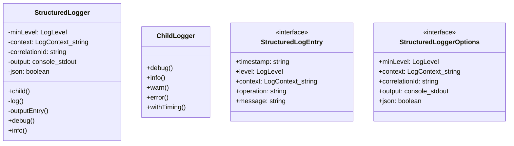

# structured-logger

## 概要

`structured-logger` モジュールのAPIリファレンス。

## エクスポート一覧

| 種別 | 名前 | 説明 |
|------|------|------|
| 関数 | `getMinLogLevel` | 最小ログレベルを取得 |
| 関数 | `resetMinLogLevelCache` | 最小ログレベルキャッシュをリセット |
| 関数 | `formatTimestamp` | 日付をISO8601形式に変換 |
| 関数 | `shouldLog` | - |
| 関数 | `formatError` | エラーを構造化形式に変換 |
| 関数 | `serializeLogEntry` | エントリをシリアライズ |
| 関数 | `formatReadableEntry` | エントリを整形 |
| 関数 | `getDefaultLogger` | デフォルトロガー取得 |
| 関数 | `resetDefaultLogger` | デフォルトロガー初期化 |
| 関数 | `createLogger` | 指定されたコンテキストでロガーを作成 |
| 関数 | `getSubagentLogger` | サブロガー生成 |
| 関数 | `getAgentTeamsLogger` | AgentTeamsロガー取得 |
| 関数 | `getStorageLogger` | ストレージロガー取得 |
| 関数 | `logInfo` | INFOレベルのログを出力 |
| 関数 | `logWarn` | クイックWARNログ |
| 関数 | `logError` | クイックERRORログ |
| 関数 | `logDebug` | DEBUGレベルのログを出力 |
| クラス | `StructuredLogger` | 構造化ロガークラス |
| クラス | `ChildLogger` | 子ロガークラス |
| インターフェース | `StructuredLogEntry` | 構造化ログエントリ |
| インターフェース | `StructuredLoggerOptions` | ロガー設定オプション |
| 型 | `LogLevel` | ログレベルの種別 |
| 型 | `LogContext` | ログコンテキストの種別 |

## 図解

### クラス図



### 関数フロー

```mermaid
flowchart TD
  createLogger["createLogger()"]
  formatError["formatError()"]
  formatReadableEntry["formatReadableEntry()"]
  formatTimestamp["formatTimestamp()"]
  getAgentTeamsLogger["getAgentTeamsLogger()"]
  getDefaultLogger["getDefaultLogger()"]
  getMinLogLevel["getMinLogLevel()"]
  getStorageLogger["getStorageLogger()"]
  getSubagentLogger["getSubagentLogger()"]
  logDebug["logDebug()"]
  logError["logError()"]
  logInfo["logInfo()"]
  logWarn["logWarn()"]
  resetDefaultLogger["resetDefaultLogger()"]
  resetMinLogLevelCache["resetMinLogLevelCache()"]
  serializeLogEntry["serializeLogEntry()"]
  shouldLog["shouldLog()"]
  getAgentTeamsLogger --> createLogger
  getStorageLogger --> createLogger
  getSubagentLogger --> createLogger
  logDebug --> createLogger
  logError --> createLogger
  logInfo --> createLogger
  logWarn --> createLogger
```



## 関数

### getMinLogLevel

```typescript
getMinLogLevel(): LogLevel
```

最小ログレベルを取得

**戻り値**: `LogLevel`

### resetMinLogLevelCache

```typescript
resetMinLogLevelCache(): void
```

最小ログレベルキャッシュをリセット

**戻り値**: `void`

### formatTimestamp

```typescript
formatTimestamp(date: Date): string
```

日付をISO8601形式に変換

**パラメータ**

| 名前 | 型 | 必須 |
|------|-----|------|
| date | `Date` | はい |

**戻り値**: `string`

### shouldLog

```typescript
shouldLog(level: LogLevel, minLevel: LogLevel): boolean
```

**パラメータ**

| 名前 | 型 | 必須 |
|------|-----|------|
| level | `LogLevel` | はい |
| minLevel | `LogLevel` | はい |

**戻り値**: `boolean`

### formatError

```typescript
formatError(error: Error | unknown): StructuredLogEntry["error"]
```

エラーを構造化形式に変換

**パラメータ**

| 名前 | 型 | 必須 |
|------|-----|------|
| error | `Error | unknown` | はい |

**戻り値**: `StructuredLogEntry["error"]`

### serializeLogEntry

```typescript
serializeLogEntry(entry: StructuredLogEntry): string
```

エントリをシリアライズ

**パラメータ**

| 名前 | 型 | 必須 |
|------|-----|------|
| entry | `StructuredLogEntry` | はい |

**戻り値**: `string`

### formatReadableEntry

```typescript
formatReadableEntry(entry: StructuredLogEntry): string
```

エントリを整形

**パラメータ**

| 名前 | 型 | 必須 |
|------|-----|------|
| entry | `StructuredLogEntry` | はい |

**戻り値**: `string`

### getDefaultLogger

```typescript
getDefaultLogger(): StructuredLogger
```

デフォルトロガー取得

**戻り値**: `StructuredLogger`

### resetDefaultLogger

```typescript
resetDefaultLogger(): void
```

デフォルトロガー初期化

**戻り値**: `void`

### createLogger

```typescript
createLogger(context: LogContext | string, options?: Omit<StructuredLoggerOptions, "context">): StructuredLogger
```

指定されたコンテキストでロガーを作成

**パラメータ**

| 名前 | 型 | 必須 |
|------|-----|------|
| context | `LogContext | string` | はい |
| options | `Omit<StructuredLoggerOptions, "context">` | いいえ |

**戻り値**: `StructuredLogger`

### getSubagentLogger

```typescript
getSubagentLogger(): StructuredLogger
```

サブロガー生成

**戻り値**: `StructuredLogger`

### getAgentTeamsLogger

```typescript
getAgentTeamsLogger(): StructuredLogger
```

AgentTeamsロガー取得

**戻り値**: `StructuredLogger`

### getStorageLogger

```typescript
getStorageLogger(): StructuredLogger
```

ストレージロガー取得

**戻り値**: `StructuredLogger`

### logInfo

```typescript
logInfo(context: LogContext | string, operation: string, message: string, metadata?: Record<string, unknown>): void
```

INFOレベルのログを出力

**パラメータ**

| 名前 | 型 | 必須 |
|------|-----|------|
| context | `LogContext | string` | はい |
| operation | `string` | はい |
| message | `string` | はい |
| metadata | `Record<string, unknown>` | いいえ |

**戻り値**: `void`

### logWarn

```typescript
logWarn(context: LogContext | string, operation: string, message: string, metadata?: Record<string, unknown>): void
```

クイックWARNログ

**パラメータ**

| 名前 | 型 | 必須 |
|------|-----|------|
| context | `LogContext | string` | はい |
| operation | `string` | はい |
| message | `string` | はい |
| metadata | `Record<string, unknown>` | いいえ |

**戻り値**: `void`

### logError

```typescript
logError(context: LogContext | string, operation: string, message: string, error?: Error | unknown, metadata?: Record<string, unknown>): void
```

クイックERRORログ

**パラメータ**

| 名前 | 型 | 必須 |
|------|-----|------|
| context | `LogContext | string` | はい |
| operation | `string` | はい |
| message | `string` | はい |
| error | `Error | unknown` | いいえ |
| metadata | `Record<string, unknown>` | いいえ |

**戻り値**: `void`

### logDebug

```typescript
logDebug(context: LogContext | string, operation: string, message: string, metadata?: Record<string, unknown>): void
```

DEBUGレベルのログを出力

**パラメータ**

| 名前 | 型 | 必須 |
|------|-----|------|
| context | `LogContext | string` | はい |
| operation | `string` | はい |
| message | `string` | はい |
| metadata | `Record<string, unknown>` | いいえ |

**戻り値**: `void`

## クラス

### StructuredLogger

構造化ロガークラス

**プロパティ**

| 名前 | 型 | 可視性 |
|------|-----|--------|
| minLevel | `LogLevel` | private |
| context | `LogContext | string` | private |
| correlationId | `string` | private |
| output | `"console" | "stdout" | "stderr"` | private |
| json | `boolean` | private |
| includeTimestamp | `boolean` | private |

**メソッド**

| 名前 | シグネチャ |
|------|------------|
| child | `child(operation, additionalContext): ChildLogger` |
| log | `log(level, operation, message, metadata, error, durationMs): void` |
| outputEntry | `outputEntry(entry, level): void` |
| debug | `debug(operation, message, metadata): void` |
| info | `info(operation, message, metadata): void` |
| warn | `warn(operation, message, metadata): void` |
| error | `error(operation, message, error, metadata): void` |
| withTiming | `withTiming(operation, message, fn, metadata): Promise<T>` |
| withTimingSync | `withTimingSync(operation, message, fn, metadata): T` |

### ChildLogger

子ロガークラス

**メソッド**

| 名前 | シグネチャ |
|------|------------|
| debug | `debug(message, metadata): void` |
| info | `info(message, metadata): void` |
| warn | `warn(message, metadata): void` |
| error | `error(message, error, metadata): void` |
| withTiming | `withTiming(message, fn, metadata): Promise<T>` |
| withContext | `withContext(metadata): Record<string, unknown> | undefined` |

## インターフェース

### StructuredLogEntry

```typescript
interface StructuredLogEntry {
  timestamp: string;
  level: LogLevel;
  context: LogContext | string;
  operation: string;
  message: string;
  metadata?: Record<string, unknown>;
  correlationId?: string;
  durationMs?: number;
  error?: {
    name: string;
    message: string;
    stack?: string;
  };
}
```

構造化ログエントリ

### StructuredLoggerOptions

```typescript
interface StructuredLoggerOptions {
  minLevel?: LogLevel;
  context?: LogContext | string;
  correlationId?: string;
  output?: "console" | "stdout" | "stderr";
  json?: boolean;
  includeTimestamp?: boolean;
}
```

ロガー設定オプション

## 型定義

### LogLevel

```typescript
type LogLevel = "DEBUG" | "INFO" | "WARN" | "ERROR"
```

ログレベルの種別

### LogContext

```typescript
type LogContext = | "subagents"
  | "agent-teams"
  | "scheduler"
  | "storage"
  | "metrics"
  | "checkpoint"
  | "embedding"
  | "memory"
  | "skills"
  | "tools"
  | "extensions"
  | "general"
```

ログコンテキストの種別

---
*自動生成: 2026-02-24T17:08:02.780Z*
