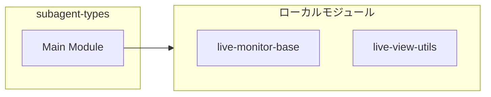

# subagent-types

## 概要

`subagent-types` モジュールのAPIリファレンス。

## インポート

```typescript
// from './tui/live-monitor-base.js': LiveStreamView, LiveViewMode
// from './live-view-utils.js': LiveStatus
```

## エクスポート一覧

| 種別 | 名前 | 説明 |
|------|------|------|
| インターフェース | `SubagentLiveItem` | 実行中のサブエージェント項目 |
| インターフェース | `SubagentMonitorLifecycle` | ライフサイクル管理インターフェース |
| インターフェース | `SubagentMonitorStream` | ストリーム監視インターフェース |
| インターフェース | `SubagentMonitorResource` | モニターのリソース管理を行うインターフェース |
| インターフェース | `SubagentLiveMonitorController` | ライブモニターの制御およびライフサイクル管理を行う |
| インターフェース | `SubagentNormalizedOutput` | サブエージェントの出力正規化データを表す |
| インターフェース | `SubagentParallelCapacityResolution` | サブエージェントの並列実行解決情報を表す |
| インターフェース | `DelegationState` | 委任状態を表すインターフェース |
| インターフェース | `PrintCommandResult` | コマンド実行結果 |
| 型 | `SubagentLiveViewMode` | ライブビューの表示モード |
| 型 | `SubagentLiveStreamView` | ライブストリームビューの別名 |

## 図解

### クラス図


### 依存関係図



## インターフェース

### SubagentLiveItem

```typescript
interface SubagentLiveItem {
  id: string;
  name: string;
  status: LiveStatus;
  startedAtMs?: number;
  finishedAtMs?: number;
  lastChunkAtMs?: number;
  summary?: string;
  error?: string;
  stdoutTail: string;
  stderrTail: string;
  stdoutBytes: number;
  stderrBytes: number;
  stdoutNewlineCount: number;
  stderrNewlineCount: number;
  stdoutEndsWithNewline: boolean;
  stderrEndsWithNewline: boolean;
}
```

実行中のサブエージェント項目

### SubagentMonitorLifecycle

```typescript
interface SubagentMonitorLifecycle {
  markStarted: (agentId: string) => void;
  markFinished: (
    agentId: string,
    status: "completed" | "failed",
    summary: string,
    error?: string,
  ) => void;
}
```

ライフサイクル管理インターフェース

### SubagentMonitorStream

```typescript
interface SubagentMonitorStream {
  appendChunk: (agentId: string, stream: SubagentLiveStreamView, chunk: string) => void;
}
```

ストリーム監視インターフェース

### SubagentMonitorResource

```typescript
interface SubagentMonitorResource {
  close: () => void;
  wait: () => Promise<void>;
}
```

モニターのリソース管理を行うインターフェース

### SubagentLiveMonitorController

```typescript
interface SubagentLiveMonitorController {
}
```

ライブモニターの制御およびライフサイクル管理を行う

### SubagentNormalizedOutput

```typescript
interface SubagentNormalizedOutput {
  summary: string;
  output: string;
  hasResult: boolean;
}
```

サブエージェントの出力正規化データを表す

### SubagentParallelCapacityResolution

```typescript
interface SubagentParallelCapacityResolution {
  agentId: string;
  approvedParallelism: number;
  approved: boolean;
  reason?: string;
}
```

サブエージェントの並列実行解決情報を表す

### DelegationState

```typescript
interface DelegationState {
  delegatedThisRequest: boolean;
  directWriteConfirmedThisRequest: boolean;
  pendingDirectWriteConfirmUntilMs: number;
  sessionDelegationCalls: number;
}
```

委任状態を表すインターフェース

### PrintCommandResult

```typescript
interface PrintCommandResult {
  output: string;
  latencyMs: number;
}
```

コマンド実行結果

## 型定義

### SubagentLiveViewMode

```typescript
type SubagentLiveViewMode = LiveViewMode
```

ライブビューの表示モード

### SubagentLiveStreamView

```typescript
type SubagentLiveStreamView = LiveStreamView
```

ライブストリームビューの別名

---
*自動生成: 2026-02-18T15:54:41.526Z*
