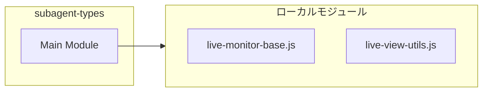

# subagent-types

## 概要

`subagent-types` モジュールのAPIリファレンス。

## インポート

```typescript
import { LiveStatus, LiveStreamView, LiveViewMode } from './live-monitor-base.js';
import { LiveStatusBase } from './live-view-utils.js';
```

## エクスポート一覧

| 種別 | 名前 | 説明 |
|------|------|------|
| インターフェース | `SubagentLiveItem` | Live item tracking for subagent execution. |
| インターフェース | `SubagentMonitorLifecycle` | Lifecycle operations for marking agent execution s |
| インターフェース | `SubagentMonitorStream` | Stream output operations for appending stdout/stde |
| インターフェース | `SubagentMonitorResource` | Resource cleanup and termination operations. |
| インターフェース | `SubagentLiveMonitorController` | Full monitor controller combining all capabilities |
| インターフェース | `SubagentNormalizedOutput` | Normalized output structure for subagent execution |
| インターフェース | `SubagentParallelCapacityResolution` | Resolution result for subagent parallel capacity. |
| インターフェース | `DelegationState` | State tracking for delegation-first policy enforce |
| インターフェース | `PrintCommandResult` | Print command execution result. |
| 型 | `SubagentLiveViewMode` | View mode for subagent live monitoring interface. |
| 型 | `SubagentLiveStreamView` | Stream view selection for subagent output display. |

## 図解

### クラス図

```mermaid
classDiagram
  class SubagentLiveItem {
    <<interface>>
    +id: string
    +name: string
    +status: LiveStatus
    +startedAtMs: number
    +finishedAtMs: number
  }
  class SubagentMonitorLifecycle {
    <<interface>>
    +markStarted: agentIdstring>void
    +markFinished: agentIdstringstatuscompletedfailedsummarystringerrorstring>void
  }
  class SubagentMonitorStream {
    <<interface>>
    +appendChunk: agentIdstringstreamSubagentLiveStreamViewchunkstring>void
  }
  class SubagentMonitorResource {
    <<interface>>
    +close: >void
    +wait: >Promise<void>
  }
  class SubagentLiveMonitorController {
    <<interface>>
  }
  class SubagentNormalizedOutput {
    <<interface>>
    +summary: string
    +output: string
    +hasResult: boolean
  }
  class SubagentParallelCapacityResolution {
    <<interface>>
    +agentId: string
    +approvedParallelism: number
    +approved: boolean
    +reason: string
  }
  class DelegationState {
    <<interface>>
    +delegatedThisRequest: boolean
    +directWriteConfirmedThisRequest: boolean
    +pendingDirectWriteConfirmUntilMs: number
    +sessionDelegationCalls: number
  }
  class PrintCommandResult {
    <<interface>>
    +output: string
    +latencyMs: number
  }
```



### 依存関係図



## インターフェース

### SubagentLiveItem

```typescript
interface SubagentLiveItem {
  id: string;
  name: string;
  status: LiveStatus;
  startedAtMs?: number;
  finishedAtMs?: number;
  lastChunkAtMs?: number;
  summary?: string;
  error?: string;
  stdoutTail: string;
  stderrTail: string;
  stdoutBytes: number;
  stderrBytes: number;
  stdoutNewlineCount: number;
  stderrNewlineCount: number;
  stdoutEndsWithNewline: boolean;
  stderrEndsWithNewline: boolean;
}
```

Live item tracking for subagent execution.
Maintains real-time state for TUI rendering.

### SubagentMonitorLifecycle

```typescript
interface SubagentMonitorLifecycle {
  markStarted: (agentId: string) => void;
  markFinished: (
    agentId: string,
    status: "completed" | "failed",
    summary: string,
    error?: string,
  ) => void;
}
```

Lifecycle operations for marking agent execution states.
Used by code that only needs to track start/finish transitions.

### SubagentMonitorStream

```typescript
interface SubagentMonitorStream {
  appendChunk: (agentId: string, stream: SubagentLiveStreamView, chunk: string) => void;
}
```

Stream output operations for appending stdout/stderr chunks.
Used by code that only needs to handle output streaming.

### SubagentMonitorResource

```typescript
interface SubagentMonitorResource {
  close: () => void;
  wait: () => Promise<void>;
}
```

Resource cleanup and termination operations.
Used by code that only needs to manage monitor lifecycle.

### SubagentLiveMonitorController

```typescript
interface SubagentLiveMonitorController {
}
```

Full monitor controller combining all capabilities.
Extends partial interfaces to maintain backward compatibility.
Clients should use narrower interfaces when possible.

### SubagentNormalizedOutput

```typescript
interface SubagentNormalizedOutput {
  summary: string;
  output: string;
  hasResult: boolean;
}
```

Normalized output structure for subagent execution.
Used for parsing and validating subagent outputs.

### SubagentParallelCapacityResolution

```typescript
interface SubagentParallelCapacityResolution {
  agentId: string;
  approvedParallelism: number;
  approved: boolean;
  reason?: string;
}
```

Resolution result for subagent parallel capacity.
Determines actual parallelism after capacity negotiation.

### DelegationState

```typescript
interface DelegationState {
  delegatedThisRequest: boolean;
  directWriteConfirmedThisRequest: boolean;
  pendingDirectWriteConfirmUntilMs: number;
  sessionDelegationCalls: number;
}
```

State tracking for delegation-first policy enforcement.
Monitors whether delegation has occurred and direct write confirmations.

### PrintCommandResult

```typescript
interface PrintCommandResult {
  output: string;
  latencyMs: number;
}
```

Print command execution result.
Used for print mode execution tracking.

## 型定義

### SubagentLiveViewMode

```typescript
type SubagentLiveViewMode = LiveViewMode
```

View mode for subagent live monitoring interface.
Alias for base LiveViewMode for semantic clarity.

### SubagentLiveStreamView

```typescript
type SubagentLiveStreamView = LiveStreamView
```

Stream view selection for subagent output display.
Alias for base LiveStreamView for semantic clarity.

---
*自動生成: 2026-02-17T21:54:59.837Z*
