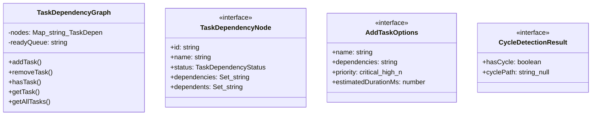

# task-dependencies

## 概要

`task-dependencies` モジュールのAPIリファレンス。

## エクスポート一覧

| 種別 | 名前 | 説明 |
|------|------|------|
| 関数 | `formatDependencyGraphStats` | グラフ統計情報を整形する |
| クラス | `TaskDependencyGraph` | タスク依存関係グラフ |
| インターフェース | `TaskDependencyNode` | タスク依存ノード定義 |
| インターフェース | `AddTaskOptions` | - |
| インターフェース | `CycleDetectionResult` | - |
| 型 | `TaskDependencyStatus` | タスクの依存状態 |

## 図解

### クラス図



## 関数

### dfs

```typescript
dfs(nodeId: string): string[] | null
```

**パラメータ**

| 名前 | 型 | 必須 |
|------|-----|------|
| nodeId | `string` | はい |

**戻り値**: `string[] | null`

### visit

```typescript
visit(nodeId: string): void
```

**パラメータ**

| 名前 | 型 | 必須 |
|------|-----|------|
| nodeId | `string` | はい |

**戻り値**: `void`

### getDepth

```typescript
getDepth(id: string): number
```

**パラメータ**

| 名前 | 型 | 必須 |
|------|-----|------|
| id | `string` | はい |

**戻り値**: `number`

### formatDependencyGraphStats

```typescript
formatDependencyGraphStats(stats: ReturnType<TaskDependencyGraph["getStats"]>): string
```

グラフ統計情報を整形する

**パラメータ**

| 名前 | 型 | 必須 |
|------|-----|------|
| stats | `ReturnType<TaskDependencyGraph["getStats"]>` | はい |

**戻り値**: `string`

## クラス

### TaskDependencyGraph

タスク依存関係グラフ

**プロパティ**

| 名前 | 型 | 可視性 |
|------|-----|--------|
| nodes | `Map<string, TaskDependencyNode>` | private |
| readyQueue | `string[]` | private |

**メソッド**

| 名前 | シグネチャ |
|------|------------|
| addTask | `addTask(id, options): TaskDependencyNode` |
| removeTask | `removeTask(id): boolean` |
| hasTask | `hasTask(id): boolean` |
| getTask | `getTask(id): TaskDependencyNode | undefined` |
| getAllTasks | `getAllTasks(): TaskDependencyNode[]` |
| isTaskReady | `isTaskReady(id): boolean` |
| getReadyTasks | `getReadyTasks(): TaskDependencyNode[]` |
| getReadyTaskIds | `getReadyTaskIds(): string[]` |
| markRunning | `markRunning(id): void` |
| markCompleted | `markCompleted(id): void` |
| markFailed | `markFailed(id, error): void` |
| markCancelled | `markCancelled(id): void` |
| detectCycle | `detectCycle(): CycleDetectionResult` |
| getTopologicalOrder | `getTopologicalOrder(): string[] | null` |
| getStats | `getStats(): {
    total: number;
    byStatus: Record<TaskDependencyStatus, number>;
    readyCount: number;
    blockedCount: number;
    completedCount: number;
    failedCount: number;
    maxDepth: number;
  }` |
| clear | `clear(): void` |
| export | `export(): {
    tasks: Array<{
      id: string;
      name?: string;
      status: TaskDependencyStatus;
      dependencies: string[];
      priority?: string;
    }>;
  }` |
| import | `import(data): void` |

## インターフェース

### TaskDependencyNode

```typescript
interface TaskDependencyNode {
  id: string;
  name?: string;
  status: TaskDependencyStatus;
  dependencies: Set<string>;
  dependents: Set<string>;
  addedAt: number;
  startedAt?: number;
  completedAt?: number;
  error?: Error;
  priority?: "critical" | "high" | "normal" | "low";
  estimatedDurationMs?: number;
}
```

タスク依存ノード定義

### AddTaskOptions

```typescript
interface AddTaskOptions {
  name?: string;
  dependencies?: string[];
  priority?: "critical" | "high" | "normal" | "low";
  estimatedDurationMs?: number;
}
```

### CycleDetectionResult

```typescript
interface CycleDetectionResult {
  hasCycle: boolean;
  cyclePath: string[] | null;
}
```

## 型定義

### TaskDependencyStatus

```typescript
type TaskDependencyStatus = "pending" | "ready" | "running" | "completed" | "failed" | "cancelled"
```

タスクの依存状態

---
*自動生成: 2026-02-18T15:54:41.528Z*
