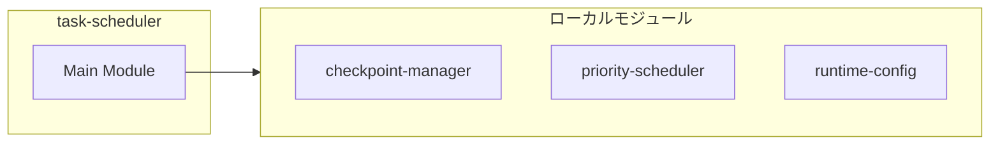
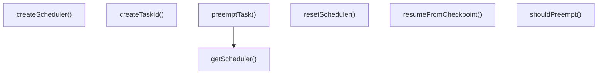
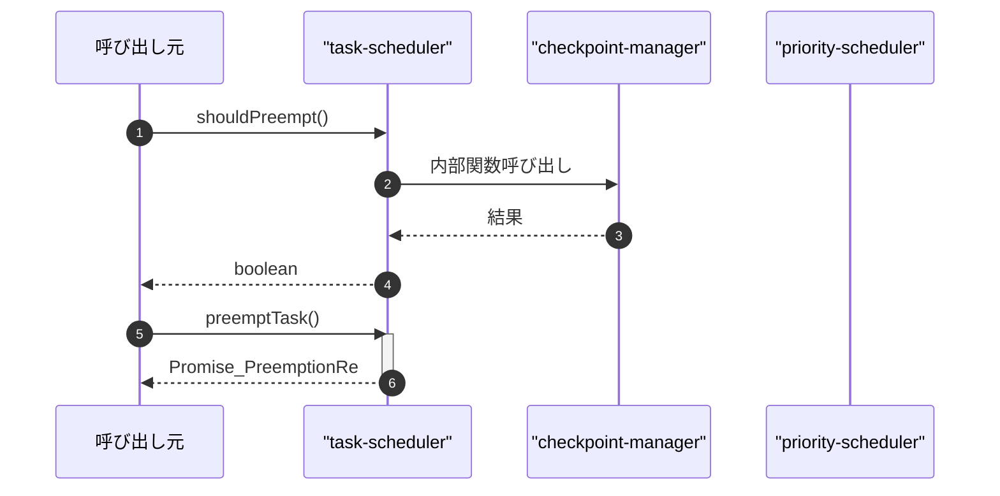

# task-scheduler

## 概要

`task-scheduler` モジュールのAPIリファレンス。

## インポート

```typescript
// from './checkpoint-manager': getCheckpointManager, Checkpoint, PreemptionResult, ...
// from './priority-scheduler': TaskPriority, PriorityTaskQueue, comparePriority, ...
// from './runtime-config.js': getRuntimeConfig, RuntimeConfig
// from './priority-scheduler': PRIORITY_VALUES
```

## エクスポート一覧

| 種別 | 名前 | 説明 |
|------|------|------|
| 関数 | `shouldPreempt` | 実行中タスクを割り込むか判定 |
| 関数 | `preemptTask` | - |
| 関数 | `resumeFromCheckpoint` | - |
| 関数 | `createTaskId` | タスクIDを生成する |
| 関数 | `getScheduler` | スケジューラを取得する |
| 関数 | `createScheduler` | スケジューラを作成する |
| 関数 | `resetScheduler` | シングルトンのスケジューラーをリセットする |
| インターフェース | `TaskCostEstimate` | - |
| インターフェース | `ScheduledTask` | - |
| インターフェース | `TaskResult` | タスク実行結果 |
| インターフェース | `QueueStats` | キュー統計情報 |
| インターフェース | `SchedulerConfig` | スケジューラ設定 |
| インターフェース | `HybridSchedulerConfig` | ハイブリッドスケジューラ設定 |
| 型 | `TaskSource` | - |

## 図解

### クラス図

```mermaid
classDiagram
  class TaskSchedulerImpl {
    -config: SchedulerConfig
    -queues: Map_string_TaskQueue
    -activeExecutions: Map_string_TaskQueue
    -eventTarget: EventTarget
    -taskIdCounter: any
    +submit()
    +getStats()
    -getQueueKey()
    -sortQueue()
    -promoteStarvingTasks()
  }
  class TaskCostEstimate {
    <<interface>>
    +estimatedTokens: number
    +estimatedDurationMs: number
  }
  class ScheduledTask {
    <<interface>>
    +id: string
    +source: TaskSource
    +provider: string
    +model: string
    +priority: TaskPriority
  }
  class TaskResult {
    <<interface>>
    +taskId: string
    +success: boolean
    +result: TResult
    +error: string
    +waitedMs: number
  }
  class QueueStats {
    <<interface>>
    +totalQueued: number
    +byPriority: Record_TaskPriority
    +byProvider: Record_string_number
    +avgWaitMs: number
    +maxWaitMs: number
  }
  class TaskQueueEntry {
    <<interface>>
    +task: ScheduledTask_unknow
    +enqueuedAtMs: number
    +startedAtMs: number
    +completedAtMs: number
    +skipCount: number
  }
  class SchedulerConfig {
    <<interface>>
    +maxConcurrentPerModel: number
    +maxTotalConcurrent: number
    +defaultTimeoutMs: number
    +starvationThresholdMs: number
    +maxSkipCount: number
  }
  class HybridSchedulerConfig {
    <<interface>>
    +priorityWeight: number
    +sjfWeight: number
    +fairQueueWeight: number
    +maxDurationForNormalization: number
    +starvationPenaltyPerSkip: number
  }
```



### 依存関係図



### 関数フロー



### シーケンス図



## 関数

### shouldPreempt

```typescript
shouldPreempt(runningTask: ScheduledTask, incomingTask: ScheduledTask): boolean
```

実行中タスクを割り込むか判定

**パラメータ**

| 名前 | 型 | 必須 |
|------|-----|------|
| runningTask | `ScheduledTask` | はい |
| incomingTask | `ScheduledTask` | はい |

**戻り値**: `boolean`

### preemptTask

```typescript
async preemptTask(taskId: string, reason: string, state?: unknown, progress?: number): Promise<PreemptionResult>
```

**パラメータ**

| 名前 | 型 | 必須 |
|------|-----|------|
| taskId | `string` | はい |
| reason | `string` | はい |
| state | `unknown` | いいえ |
| progress | `number` | いいえ |

**戻り値**: `Promise<PreemptionResult>`

### resumeFromCheckpoint

```typescript
async resumeFromCheckpoint(checkpointId: string, execute: (checkpoint: Checkpoint) => Promise<TResult>): Promise<TaskResult<TResult>>
```

**パラメータ**

| 名前 | 型 | 必須 |
|------|-----|------|
| checkpointId | `string` | はい |
| execute | `(checkpoint: Checkpoint) => Promise<TResult>` | はい |

**戻り値**: `Promise<TaskResult<TResult>>`

### getDefaultSchedulerConfig

```typescript
getDefaultSchedulerConfig(): SchedulerConfig
```

Get default scheduler config from centralized RuntimeConfig.

**戻り値**: `SchedulerConfig`

### createTaskId

```typescript
createTaskId(prefix: string): string
```

タスクIDを生成する

**パラメータ**

| 名前 | 型 | 必須 |
|------|-----|------|
| prefix | `string` | はい |

**戻り値**: `string`

### priorityToValue

```typescript
priorityToValue(priority: TaskPriority): number
```

Get numeric priority value for comparison.

**パラメータ**

| 名前 | 型 | 必須 |
|------|-----|------|
| priority | `TaskPriority` | はい |

**戻り値**: `number`

### computeSJFScore

```typescript
computeSJFScore(estimatedDurationMs: number, maxDurationMs: number): number
```

Compute SJF (Shortest Job First) score.
Normalized to [0, 1] where higher score = shorter job.
Edge case: maxDuration = 0 returns 1.0 (shortest possible).

**パラメータ**

| 名前 | 型 | 必須 |
|------|-----|------|
| estimatedDurationMs | `number` | はい |
| maxDurationMs | `number` | はい |

**戻り値**: `number`

### computeFairQueueScore

```typescript
computeFairQueueScore(enqueuedAtMs: number, estimatedTokens: number, priority: TaskPriority, currentTimeMs: number, maxTokens: number): number
```

Compute Fair Queue score based on Virtual Finish Time (VFT).
Tasks with higher wait time and fewer tokens get higher scores.
VFT = arrivalTime + (tokens / weight), where weight is based on priority.

**パラメータ**

| 名前 | 型 | 必須 |
|------|-----|------|
| enqueuedAtMs | `number` | はい |
| estimatedTokens | `number` | はい |
| priority | `TaskPriority` | はい |
| currentTimeMs | `number` | はい |
| maxTokens | `number` | はい |

**戻り値**: `number`

### computeHybridScore

```typescript
computeHybridScore(entry: TaskQueueEntry, config: HybridSchedulerConfig, currentTimeMs: number): number
```

Compute hybrid scheduling score combining all factors.
finalScore = (priority * 0.5) + (SJF * 0.3) + (FairQueue * 0.2) - starvationPenalty

**パラメータ**

| 名前 | 型 | 必須 |
|------|-----|------|
| entry | `TaskQueueEntry` | はい |
| config | `HybridSchedulerConfig` | はい |
| currentTimeMs | `number` | はい |

**戻り値**: `number`

### compareHybridEntries

```typescript
compareHybridEntries(a: TaskQueueEntry, b: TaskQueueEntry, config: HybridSchedulerConfig): number
```

Compare two task entries using hybrid scheduling score.
Higher score = should be scheduled first.

**パラメータ**

| 名前 | 型 | 必須 |
|------|-----|------|
| a | `TaskQueueEntry` | はい |
| b | `TaskQueueEntry` | はい |
| config | `HybridSchedulerConfig` | はい |

**戻り値**: `number`

### compareTaskEntries

```typescript
compareTaskEntries(a: TaskQueueEntry, b: TaskQueueEntry): number
```

Compare two task entries for priority ordering.

**パラメータ**

| 名前 | 型 | 必須 |
|------|-----|------|
| a | `TaskQueueEntry` | はい |
| b | `TaskQueueEntry` | はい |

**戻り値**: `number`

### checkAndExecute

```typescript
async checkAndExecute(): void
```

**戻り値**: `void`

### onEvent

```typescript
onEvent(): void
```

**戻り値**: `void`

### onAbort

```typescript
onAbort(): void
```

**戻り値**: `void`

### cleanup

```typescript
cleanup(): void
```

**戻り値**: `void`

### handler

```typescript
handler(event: Event): void
```

**パラメータ**

| 名前 | 型 | 必須 |
|------|-----|------|
| event | `Event` | はい |

**戻り値**: `void`

### getScheduler

```typescript
getScheduler(): TaskSchedulerImpl
```

スケジューラを取得する

**戻り値**: `TaskSchedulerImpl`

### createScheduler

```typescript
createScheduler(config?: Partial<SchedulerConfig>): TaskSchedulerImpl
```

スケジューラを作成する

**パラメータ**

| 名前 | 型 | 必須 |
|------|-----|------|
| config | `Partial<SchedulerConfig>` | いいえ |

**戻り値**: `TaskSchedulerImpl`

### resetScheduler

```typescript
resetScheduler(): void
```

シングルトンのスケジューラーをリセットする

**戻り値**: `void`

## クラス

### TaskSchedulerImpl

Event-driven task scheduler with priority queue.

**プロパティ**

| 名前 | 型 | 可視性 |
|------|-----|--------|
| config | `SchedulerConfig` | private |
| queues | `Map<string, TaskQueueEntry[]>` | private |
| activeExecutions | `Map<string, TaskQueueEntry>` | private |
| eventTarget | `EventTarget` | private |
| taskIdCounter | `any` | private |

**メソッド**

| 名前 | シグネチャ |
|------|------------|
| submit | `submit(task): Promise<TaskResult<TResult>>` |
| getStats | `getStats(): QueueStats` |
| getQueueKey | `getQueueKey(provider, model): string` |
| sortQueue | `sortQueue(queue): void` |
| promoteStarvingTasks | `promoteStarvingTasks(queue): number` |
| waitForExecution | `waitForExecution(entry, originalTask): Promise<TaskResult<TResult>>` |
| removeFromQueue | `removeFromQueue(queueKey, entry): void` |
| countActiveForModel | `countActiveForModel(provider, model): number` |
| waitForEvent | `waitForEvent(timeoutMs, signal): Promise<"event" | "timeout" | "aborted">` |
| getActiveExecution | `getActiveExecution(taskId): TaskQueueEntry | null` |
| removeActiveExecution | `removeActiveExecution(taskId): boolean` |
| getAllActiveExecutions | `getAllActiveExecutions(): Map<string, TaskQueueEntry>` |
| checkPreemptionNeeded | `checkPreemptionNeeded(incomingTask): ScheduledTask | null` |
| attemptPreemption | `attemptPreemption(incomingTask, checkpointState, checkpointProgress): Promise<{ preempted: boolean; checkpointId?: string; error?: string }>` |
| onPreemption | `onPreemption(callback): () => void` |

## インターフェース

### TaskCostEstimate

```typescript
interface TaskCostEstimate {
  estimatedTokens: number;
  estimatedDurationMs: number;
}
```

### ScheduledTask

```typescript
interface ScheduledTask {
  id: string;
  source: TaskSource;
  provider: string;
  model: string;
  priority: TaskPriority;
  costEstimate: TaskCostEstimate;
  execute: () => Promise<TResult>;
  signal?: AbortSignal;
  deadlineMs?: number;
}
```

### TaskResult

```typescript
interface TaskResult {
  taskId: string;
  success: boolean;
  result?: TResult;
  error?: string;
  waitedMs: number;
  executionMs: number;
  timedOut: boolean;
  aborted: boolean;
}
```

タスク実行結果

### QueueStats

```typescript
interface QueueStats {
  totalQueued: number;
  byPriority: Record<TaskPriority, number>;
  byProvider: Record<string, number>;
  avgWaitMs: number;
  maxWaitMs: number;
  starvingCount: number;
  activeExecutions: number;
}
```

キュー統計情報

### TaskQueueEntry

```typescript
interface TaskQueueEntry {
  task: ScheduledTask<unknown>;
  enqueuedAtMs: number;
  startedAtMs?: number;
  completedAtMs?: number;
  skipCount: number;
}
```

Internal task entry for the queue.
Uses unknown type for task result to allow heterogeneous queue storage.

### SchedulerConfig

```typescript
interface SchedulerConfig {
  maxConcurrentPerModel: number;
  maxTotalConcurrent: number;
  defaultTimeoutMs: number;
  starvationThresholdMs: number;
  maxSkipCount: number;
}
```

スケジューラ設定

### HybridSchedulerConfig

```typescript
interface HybridSchedulerConfig {
  priorityWeight: number;
  sjfWeight: number;
  fairQueueWeight: number;
  maxDurationForNormalization: number;
  starvationPenaltyPerSkip: number;
  maxStarvationPenalty: number;
}
```

ハイブリッドスケジューラ設定

## 型定義

### TaskSource

```typescript
type TaskSource = | "subagent_run"
  | "subagent_run_parallel"
  | "agent_team_run"
  | "agent_team_run_parallel"
```

---
*自動生成: 2026-02-18T15:54:41.532Z*
