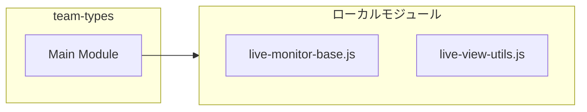

# team-types

## 概要

`team-types` モジュールのAPIリファレンス。

## インポート

```typescript
import { LiveStreamView } from './live-monitor-base.js';
import { LiveStatus } from './live-view-utils.js';
```

## エクスポート一覧

| 種別 | 名前 | 説明 |
|------|------|------|
| インターフェース | `TeamLiveItem` | Live item tracking for team member execution. |
| インターフェース | `TeamMonitorLifecycle` | Lifecycle operations for marking team member execu |
| インターフェース | `TeamMonitorPhase` | Phase tracking operations for team member executio |
| インターフェース | `TeamMonitorEvents` | Event logging operations for tracking execution ev |
| インターフェース | `TeamMonitorStream` | Stream output operations for appending stdout/stde |
| インターフェース | `TeamMonitorDiscussion` | Discussion tracking operations for multi-agent com |
| インターフェース | `TeamMonitorResource` | Resource cleanup and termination operations. |
| インターフェース | `AgentTeamLiveMonitorController` | Full monitor controller combining all capabilities |
| インターフェース | `TeamNormalizedOutput` | Normalized output structure for team member execut |
| インターフェース | `TeamParallelCapacityCandidate` | Candidate for parallel capacity allocation. |
| インターフェース | `TeamParallelCapacityResolution` | Resolution result for team parallel capacity. |
| インターフェース | `TeamFrontmatter` | Team frontmatter structure for markdown team defin |
| インターフェース | `TeamMemberFrontmatter` | Team member frontmatter for markdown parsing. |
| インターフェース | `ParsedTeamMarkdown` | Parsed team markdown file structure. |
| 型 | `TeamLivePhase` | Team execution phase during orchestration. |
| 型 | `TeamLiveViewMode` | View mode for team live monitoring interface. |

## 図解

### クラス図

```mermaid
classDiagram
  class TeamLiveItem {
    <<interface>>
    +key: string
    +label: string
    +partners: string[]
    +status: LiveStatus
    +phase: TeamLivePhase
  }
  class TeamMonitorLifecycle {
    <<interface>>
    +markStarted: itemKeystring>void
    +markFinished: itemKeystringstatuscompletedfailedsummarystringerrorstring>void
  }
  class TeamMonitorPhase {
    <<interface>>
    +markPhase: itemKeystringphaseTeamLivePhaseroundnumber>void
  }
  class TeamMonitorEvents {
    <<interface>>
    +appendEvent: itemKeystringeventstring>void
    +appendBroadcastEvent: eventstring>void
  }
  class TeamMonitorStream {
    <<interface>>
    +appendChunk: itemKeystringstreamLiveStreamViewchunkstring>void
  }
  class TeamMonitorDiscussion {
    <<interface>>
    +appendDiscussion: itemKeystringdiscussionstring>void
  }
  class TeamMonitorResource {
    <<interface>>
    +close: >void
    +wait: >Promise<void>
  }
  class AgentTeamLiveMonitorController {
    <<interface>>
  }
  class TeamNormalizedOutput {
    <<interface>>
    +summary: string
    +output: string
    +evidenceCount: number
    +hasDiscussion: boolean
  }
  class TeamParallelCapacityCandidate {
    <<interface>>
    +teamId: string
    +parallelism: number
  }
  class TeamParallelCapacityResolution {
    <<interface>>
    +teamId: string
    +approvedParallelism: number
    +approved: boolean
    +reason: string
  }
  class TeamFrontmatter {
    <<interface>>
    +id: string
    +name: string
    +description: string
    +enabled: enableddisabled
    +strategy: parallelsequential
  }
  class TeamMemberFrontmatter {
    <<interface>>
    +id: string
    +role: string
    +description: string
    +enabled: boolean
    +provider: string
  }
  class ParsedTeamMarkdown {
    <<interface>>
    +frontmatter: TeamFrontmatter
    +content: string
    +filePath: string
  }
```



### 依存関係図



## インターフェース

### TeamLiveItem

```typescript
interface TeamLiveItem {
  key: string;
  label: string;
  partners: string[];
  status: LiveStatus;
  phase: TeamLivePhase;
  phaseRound?: number;
  startedAtMs?: number;
  finishedAtMs?: number;
  lastChunkAtMs?: number;
  lastEventAtMs?: number;
  lastEvent?: string;
  summary?: string;
  error?: string;
  stdoutTail: string;
  stderrTail: string;
  stdoutBytes: number;
  stderrBytes: number;
  stdoutNewlineCount: number;
  stderrNewlineCount: number;
  stdoutEndsWithNewline: boolean;
  stderrEndsWithNewline: boolean;
  events: string[];
  discussionTail: string;
  discussionBytes: number;
  discussionNewlineCount: number;
  discussionEndsWithNewline: boolean;
}
```

Live item tracking for team member execution.
Maintains real-time state for TUI rendering.

### TeamMonitorLifecycle

```typescript
interface TeamMonitorLifecycle {
  markStarted: (itemKey: string) => void;
  markFinished: (
    itemKey: string,
    status: "completed" | "failed",
    summary: string,
    error?: string,
  ) => void;
}
```

Lifecycle operations for marking team member execution states.
Used by code that only needs to track start/finish transitions.

### TeamMonitorPhase

```typescript
interface TeamMonitorPhase {
  markPhase: (itemKey: string, phase: TeamLivePhase, round?: number) => void;
}
```

Phase tracking operations for team member execution phases.
Used by code that only needs to manage phase transitions.

### TeamMonitorEvents

```typescript
interface TeamMonitorEvents {
  appendEvent: (itemKey: string, event: string) => void;
  appendBroadcastEvent: (event: string) => void;
}
```

Event logging operations for tracking execution events.
Used by code that only needs to record events.

### TeamMonitorStream

```typescript
interface TeamMonitorStream {
  appendChunk: (itemKey: string, stream: LiveStreamView, chunk: string) => void;
}
```

Stream output operations for appending stdout/stderr chunks.
Used by code that only needs to handle output streaming.

### TeamMonitorDiscussion

```typescript
interface TeamMonitorDiscussion {
  appendDiscussion: (itemKey: string, discussion: string) => void;
}
```

Discussion tracking operations for multi-agent communication.
Used by code that only needs to track discussion content.

### TeamMonitorResource

```typescript
interface TeamMonitorResource {
  close: () => void;
  wait: () => Promise<void>;
}
```

Resource cleanup and termination operations.
Used by code that only needs to manage monitor lifecycle.

### AgentTeamLiveMonitorController

```typescript
interface AgentTeamLiveMonitorController {
}
```

Full monitor controller combining all capabilities.
Extends partial interfaces to maintain backward compatibility.
Clients should use narrower interfaces when possible.

### TeamNormalizedOutput

```typescript
interface TeamNormalizedOutput {
  summary: string;
  output: string;
  evidenceCount: number;
  hasDiscussion: boolean;
}
```

Normalized output structure for team member execution.
Used for parsing and validating member outputs.

### TeamParallelCapacityCandidate

```typescript
interface TeamParallelCapacityCandidate {
  teamId: string;
  parallelism: number;
}
```

Candidate for parallel capacity allocation.
Used in team parallel execution planning.

### TeamParallelCapacityResolution

```typescript
interface TeamParallelCapacityResolution {
  teamId: string;
  approvedParallelism: number;
  approved: boolean;
  reason?: string;
}
```

Resolution result for team parallel capacity.
Determines actual parallelism after capacity negotiation.

### TeamFrontmatter

```typescript
interface TeamFrontmatter {
  id: string;
  name: string;
  description: string;
  enabled: "enabled" | "disabled";
  strategy?: "parallel" | "sequential";
  skills?: string[];
  members: TeamMemberFrontmatter[];
}
```

Team frontmatter structure for markdown team definitions.
Used when parsing team definition files.

### TeamMemberFrontmatter

```typescript
interface TeamMemberFrontmatter {
  id: string;
  role: string;
  description: string;
  enabled?: boolean;
  provider?: string;
  model?: string;
  skills?: string[];
}
```

Team member frontmatter for markdown parsing.

### ParsedTeamMarkdown

```typescript
interface ParsedTeamMarkdown {
  frontmatter: TeamFrontmatter;
  content: string;
  filePath: string;
}
```

Parsed team markdown file structure.

## 型定義

### TeamLivePhase

```typescript
type TeamLivePhase = | "queued"
  | "initial"
  | "communication"
  | "judge"
  | "finished"
```

Team execution phase during orchestration.
Tracks the current stage of team member execution.

### TeamLiveViewMode

```typescript
type TeamLiveViewMode = "list" | "detail" | "discussion"
```

View mode for team live monitoring interface.
Extends base LiveViewMode with "discussion" mode.

---
*自動生成: 2026-02-17T21:54:59.843Z*
