# team-types

## 概要

`team-types` モジュールのAPIリファレンス。

## インポート

```typescript
// from './tui/live-monitor-base.js': LiveStreamView
// from './live-view-utils.js': LiveStatus
```

## エクスポート一覧

| 種別 | 名前 | 説明 |
|------|------|------|
| インターフェース | `TeamLiveItem` | アイテムのライブ状態を表す |
| インターフェース | `TeamMonitorLifecycle` | ライフサイクル情報を保持する |
| インターフェース | `TeamMonitorPhase` | 開始または終了をマークする |
| インターフェース | `TeamMonitorEvents` | 実行フェーズを操作する |
| インターフェース | `TeamMonitorStream` | チャンクを追加する |
| インターフェース | `TeamMonitorDiscussion` | チームの議論ログを管理します。 |
| インターフェース | `TeamMonitorResource` | モニタリングリソースを管理します。 |
| インターフェース | `AgentTeamLiveMonitorController` | エージェントチームのライブモニタリングを制御します。 |
| インターフェース | `TeamNormalizedOutput` | 正規化されたチーム出力を表します。 |
| インターフェース | `TeamParallelCapacityCandidate` | チーム並列容量候補を表します。 |
| インターフェース | `TeamParallelCapacityResolution` | 並列容量の解決結果 |
| インターフェース | `TeamFrontmatter` | チームのフロントマター |
| インターフェース | `TeamMemberFrontmatter` | チームメンバーのフロントマター |
| インターフェース | `ParsedTeamMarkdown` | チームMarkdownの解析結果 |
| 型 | `TeamLivePhase` | チームライブのフェーズ定義 |
| 型 | `TeamLiveViewMode` | チームライブの表示モード |

## 図解

### クラス図

```mermaid
classDiagram
  class TeamLiveItem {
    <<interface>>
    +key: string
    +label: string
    +partners: string
    +status: LiveStatus
    +phase: TeamLivePhase
  }
  class TeamMonitorLifecycle {
    <<interface>>
    +markStarted: itemKey_string_vo
    +markFinished: itemKey_string_stat
  }
  class TeamMonitorPhase {
    <<interface>>
    +markPhase: itemKey_string_phas
  }
  class TeamMonitorEvents {
    <<interface>>
    +appendEvent: itemKey_string_even
    +appendBroadcastEvent: event_string_void
  }
  class TeamMonitorStream {
    <<interface>>
    +appendChunk: itemKey_string_stre
  }
  class TeamMonitorDiscussion {
    <<interface>>
    +appendDiscussion: itemKey_string_disc
  }
  class TeamMonitorResource {
    <<interface>>
    +close: void
    +wait: Promise_void
  }
  class AgentTeamLiveMonitorController {
    <<interface>>
  }
  class TeamNormalizedOutput {
    <<interface>>
    +summary: string
    +output: string
    +evidenceCount: number
    +hasDiscussion: boolean
  }
  class TeamParallelCapacityCandidate {
    <<interface>>
    +teamId: string
    +parallelism: number
  }
  class TeamParallelCapacityResolution {
    <<interface>>
    +teamId: string
    +approvedParallelism: number
    +approved: boolean
    +reason: string
  }
  class TeamFrontmatter {
    <<interface>>
    +id: string
    +name: string
    +description: string
    +enabled: enabled_disabled
    +strategy: parallel_sequenti
  }
  class TeamMemberFrontmatter {
    <<interface>>
    +id: string
    +role: string
    +description: string
    +enabled: boolean
    +provider: string
  }
  class ParsedTeamMarkdown {
    <<interface>>
    +frontmatter: TeamFrontmatter
    +content: string
    +filePath: string
  }
```



### 依存関係図


## インターフェース

### TeamLiveItem

```typescript
interface TeamLiveItem {
  key: string;
  label: string;
  partners: string[];
  status: LiveStatus;
  phase: TeamLivePhase;
  phaseRound?: number;
  startedAtMs?: number;
  finishedAtMs?: number;
  lastChunkAtMs?: number;
  lastEventAtMs?: number;
  lastEvent?: string;
  summary?: string;
  error?: string;
  stdoutTail: string;
  stderrTail: string;
  stdoutBytes: number;
  stderrBytes: number;
  stdoutNewlineCount: number;
  stderrNewlineCount: number;
  stdoutEndsWithNewline: boolean;
  stderrEndsWithNewline: boolean;
  events: string[];
  discussionTail: string;
  discussionBytes: number;
  discussionNewlineCount: number;
  discussionEndsWithNewline: boolean;
}
```

アイテムのライブ状態を表す

### TeamMonitorLifecycle

```typescript
interface TeamMonitorLifecycle {
  markStarted: (itemKey: string) => void;
  markFinished: (
    itemKey: string,
    status: "completed" | "failed",
    summary: string,
    error?: string,
  ) => void;
}
```

ライフサイクル情報を保持する

### TeamMonitorPhase

```typescript
interface TeamMonitorPhase {
  markPhase: (itemKey: string, phase: TeamLivePhase, round?: number) => void;
}
```

開始または終了をマークする

### TeamMonitorEvents

```typescript
interface TeamMonitorEvents {
  appendEvent: (itemKey: string, event: string) => void;
  appendBroadcastEvent: (event: string) => void;
}
```

実行フェーズを操作する

### TeamMonitorStream

```typescript
interface TeamMonitorStream {
  appendChunk: (itemKey: string, stream: LiveStreamView, chunk: string) => void;
}
```

チャンクを追加する

### TeamMonitorDiscussion

```typescript
interface TeamMonitorDiscussion {
  appendDiscussion: (itemKey: string, discussion: string) => void;
}
```

チームの議論ログを管理します。

### TeamMonitorResource

```typescript
interface TeamMonitorResource {
  close: () => void;
  wait: () => Promise<void>;
}
```

モニタリングリソースを管理します。

### AgentTeamLiveMonitorController

```typescript
interface AgentTeamLiveMonitorController {
}
```

エージェントチームのライブモニタリングを制御します。

### TeamNormalizedOutput

```typescript
interface TeamNormalizedOutput {
  summary: string;
  output: string;
  evidenceCount: number;
  hasDiscussion: boolean;
}
```

正規化されたチーム出力を表します。

### TeamParallelCapacityCandidate

```typescript
interface TeamParallelCapacityCandidate {
  teamId: string;
  parallelism: number;
}
```

チーム並列容量候補を表します。

### TeamParallelCapacityResolution

```typescript
interface TeamParallelCapacityResolution {
  teamId: string;
  approvedParallelism: number;
  approved: boolean;
  reason?: string;
}
```

並列容量の解決結果

### TeamFrontmatter

```typescript
interface TeamFrontmatter {
  id: string;
  name: string;
  description: string;
  enabled: "enabled" | "disabled";
  strategy?: "parallel" | "sequential";
  skills?: string[];
  members: TeamMemberFrontmatter[];
}
```

チームのフロントマター

### TeamMemberFrontmatter

```typescript
interface TeamMemberFrontmatter {
  id: string;
  role: string;
  description: string;
  enabled?: boolean;
  provider?: string;
  model?: string;
  skills?: string[];
}
```

チームメンバーのフロントマター

### ParsedTeamMarkdown

```typescript
interface ParsedTeamMarkdown {
  frontmatter: TeamFrontmatter;
  content: string;
  filePath: string;
}
```

チームMarkdownの解析結果

## 型定義

### TeamLivePhase

```typescript
type TeamLivePhase = | "queued"
  | "initial"
  | "communication"
  | "judge"
  | "finished"
```

チームライブのフェーズ定義

### TeamLiveViewMode

```typescript
type TeamLiveViewMode = "list" | "detail" | "discussion"
```

チームライブの表示モード

---
*自動生成: 2026-02-18T15:54:41.533Z*
