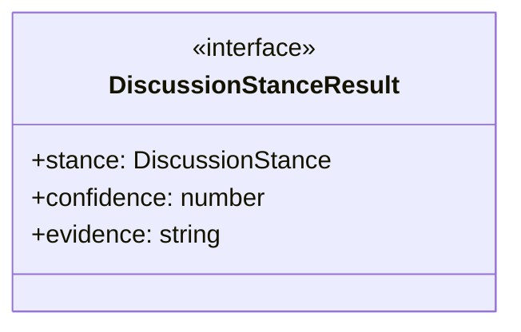
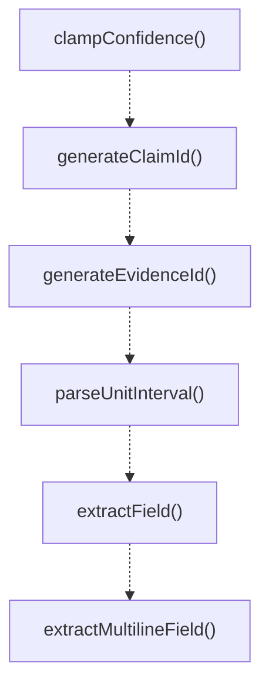

# text-parsing

## 概要

`text-parsing` モジュールのAPIリファレンス。

## エクスポート一覧

| 種別 | 名前 | 説明 |
|------|------|------|
| 関数 | `clampConfidence` | Clamp a confidence value to the valid range [0, 1] |
| 関数 | `generateClaimId` | Generate a unique claim ID for structured communic |
| 関数 | `generateEvidenceId` | Generate a unique evidence ID for structured commu |
| 関数 | `parseUnitInterval` | Parse a unit interval value from a string. |
| 関数 | `extractField` | Extract a named field from structured output text. |
| 関数 | `extractMultilineField` | Extract multiple lines for a named field. |
| 関数 | `countKeywordSignals` | Count how many keywords appear in the output text. |
| 関数 | `analyzeDiscussionStance` | Analyze the discussion stance relative to a target |
| 関数 | `extractConsensusMarker` | Extract consensus marker from discussion text. |
| インターフェース | `DiscussionStanceResult` | Result of discussion stance analysis. |
| 型 | `DiscussionStance` | Stance type for discussion analysis. |

## 図解

### クラス図



### 関数フロー



## 関数

### clampConfidence

```typescript
clampConfidence(value: number): number
```

Clamp a confidence value to the valid range [0, 1].
Invalid values default to 0.5 (neutral).

**パラメータ**

| 名前 | 型 | 必須 |
|------|-----|------|
| value | `number` | はい |

**戻り値**: `number`

### generateClaimId

```typescript
generateClaimId(): string
```

Generate a unique claim ID for structured communication tracking.
Format: claim-<timestamp>-<random>

**戻り値**: `string`

### generateEvidenceId

```typescript
generateEvidenceId(): string
```

Generate a unique evidence ID for structured communication tracking.
Format: evidence-<timestamp>-<random>

**戻り値**: `string`

### parseUnitInterval

```typescript
parseUnitInterval(raw: string | undefined): number | undefined
```

Parse a unit interval value from a string.
Handles both decimal (0.5) and percentage (50%) formats.
Returns undefined for invalid or empty input.

**パラメータ**

| 名前 | 型 | 必須 |
|------|-----|------|
| raw | `string | undefined` | はい |

**戻り値**: `number | undefined`

### extractField

```typescript
extractField(output: string, name: string): string | undefined
```

Extract a named field from structured output text.
Matches patterns like "FIELD_NAME: value" (case-insensitive).

**パラメータ**

| 名前 | 型 | 必須 |
|------|-----|------|
| output | `string` | はい |
| name | `string` | はい |

**戻り値**: `string | undefined`

### extractMultilineField

```typescript
extractMultilineField(output: string, name: string): string
```

Extract multiple lines for a named field.
Returns content from the field label until the next major label.

**パラメータ**

| 名前 | 型 | 必須 |
|------|-----|------|
| output | `string` | はい |
| name | `string` | はい |

**戻り値**: `string`

### countKeywordSignals

```typescript
countKeywordSignals(output: string, keywords: string[]): number
```

Count how many keywords appear in the output text.
Used for signal detection in member outputs.

**パラメータ**

| 名前 | 型 | 必須 |
|------|-----|------|
| output | `string` | はい |
| keywords | `string[]` | はい |

**戻り値**: `number`

### analyzeDiscussionStance

```typescript
analyzeDiscussionStance(text: string, targetMemberId: string): DiscussionStanceResult
```

Analyze the discussion stance relative to a target member.

**パラメータ**

| 名前 | 型 | 必須 |
|------|-----|------|
| text | `string` | はい |
| targetMemberId | `string` | はい |

**戻り値**: `DiscussionStanceResult`

### extractConsensusMarker

```typescript
extractConsensusMarker(text: string): string | undefined
```

Extract consensus marker from discussion text.
Looks for lines starting with "合意:" (Japanese) or "Consensus:" (English).

**パラメータ**

| 名前 | 型 | 必須 |
|------|-----|------|
| text | `string` | はい |

**戻り値**: `string | undefined`

## インターフェース

### DiscussionStanceResult

```typescript
interface DiscussionStanceResult {
  stance: DiscussionStance;
  confidence: number;
  evidence: string[];
}
```

Result of discussion stance analysis.

## 型定義

### DiscussionStance

```typescript
type DiscussionStance = "agree" | "disagree" | "neutral" | "partial"
```

Stance type for discussion analysis.
Matches StanceClassificationMode behavior in output-schema.ts.

---
*自動生成: 2026-02-18T00:15:35.772Z*
