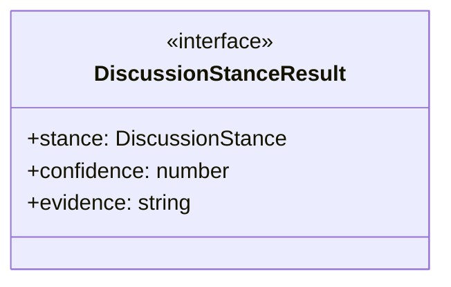
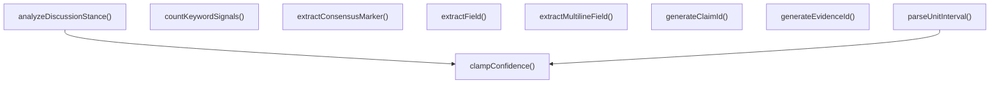

# text-parsing

## 概要

`text-parsing` モジュールのAPIリファレンス。

## エクスポート一覧

| 種別 | 名前 | 説明 |
|------|------|------|
| 関数 | `clampConfidence` | 信頼度を範囲内に収める |
| 関数 | `generateClaimId` | エビデンスIDを生成する |
| 関数 | `generateEvidenceId` | クレームIDを生成する |
| 関数 | `parseUnitInterval` | - |
| 関数 | `extractField` | - |
| 関数 | `extractMultilineField` | - |
| 関数 | `countKeywordSignals` | - |
| 関数 | `analyzeDiscussionStance` | 議論におけるメンバーの立場を解析する |
| 関数 | `extractConsensusMarker` | テキストから合意マーカーを抽出する |
| インターフェース | `DiscussionStanceResult` | 議論の立場解析結果を表すインターフェース |
| 型 | `DiscussionStance` | - |

## 図解

### クラス図



### 関数フロー



## 関数

### clampConfidence

```typescript
clampConfidence(value: number): number
```

信頼度を範囲内に収める

**パラメータ**

| 名前 | 型 | 必須 |
|------|-----|------|
| value | `number` | はい |

**戻り値**: `number`

### generateClaimId

```typescript
generateClaimId(): string
```

エビデンスIDを生成する

**戻り値**: `string`

### generateEvidenceId

```typescript
generateEvidenceId(): string
```

クレームIDを生成する

**戻り値**: `string`

### parseUnitInterval

```typescript
parseUnitInterval(raw: string | undefined): number | undefined
```

**パラメータ**

| 名前 | 型 | 必須 |
|------|-----|------|
| raw | `string | undefined` | はい |

**戻り値**: `number | undefined`

### extractField

```typescript
extractField(output: string, name: string): string | undefined
```

**パラメータ**

| 名前 | 型 | 必須 |
|------|-----|------|
| output | `string` | はい |
| name | `string` | はい |

**戻り値**: `string | undefined`

### extractMultilineField

```typescript
extractMultilineField(output: string, name: string): string
```

**パラメータ**

| 名前 | 型 | 必須 |
|------|-----|------|
| output | `string` | はい |
| name | `string` | はい |

**戻り値**: `string`

### countKeywordSignals

```typescript
countKeywordSignals(output: string, keywords: string[]): number
```

**パラメータ**

| 名前 | 型 | 必須 |
|------|-----|------|
| output | `string` | はい |
| keywords | `string[]` | はい |

**戻り値**: `number`

### analyzeDiscussionStance

```typescript
analyzeDiscussionStance(text: string, targetMemberId: string): DiscussionStanceResult
```

議論におけるメンバーの立場を解析する

**パラメータ**

| 名前 | 型 | 必須 |
|------|-----|------|
| text | `string` | はい |
| targetMemberId | `string` | はい |

**戻り値**: `DiscussionStanceResult`

### extractConsensusMarker

```typescript
extractConsensusMarker(text: string): string | undefined
```

テキストから合意マーカーを抽出する

**パラメータ**

| 名前 | 型 | 必須 |
|------|-----|------|
| text | `string` | はい |

**戻り値**: `string | undefined`

## インターフェース

### DiscussionStanceResult

```typescript
interface DiscussionStanceResult {
  stance: DiscussionStance;
  confidence: number;
  evidence: string[];
}
```

議論の立場解析結果を表すインターフェース

## 型定義

### DiscussionStance

```typescript
type DiscussionStance = "agree" | "disagree" | "neutral" | "partial"
```

---
*自動生成: 2026-02-18T18:06:17.582Z*
