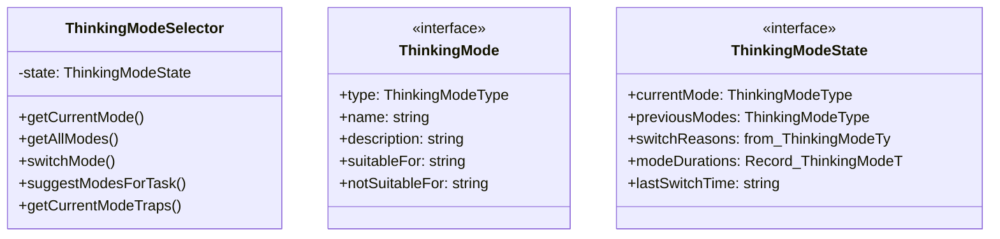

# thinking-modes

## 概要

`thinking-modes` モジュールのAPIリファレンス。

## エクスポート一覧

| 種別 | 名前 | 説明 |
|------|------|------|
| 関数 | `getThinkingModeSelector` | - |
| 関数 | `buildModeSwitchPrompt` | - |
| クラス | `ThinkingModeSelector` | 思考モード選択器 |
| インターフェース | `ThinkingMode` | - |
| インターフェース | `ThinkingModeState` | - |
| 型 | `ThinkingModeType` | - |

## 図解

### クラス図



## 関数

### getThinkingModeSelector

```typescript
getThinkingModeSelector(): ThinkingModeSelector
```

**戻り値**: `ThinkingModeSelector`

### buildModeSwitchPrompt

```typescript
buildModeSwitchPrompt(fromMode: ThinkingModeType, toMode: ThinkingModeType): string
```

**パラメータ**

| 名前 | 型 | 必須 |
|------|-----|------|
| fromMode | `ThinkingModeType` | はい |
| toMode | `ThinkingModeType` | はい |

**戻り値**: `string`

## クラス

### ThinkingModeSelector

思考モード選択器

エージェントが「今、どの思考モードを使っているか」を自覚し、
必要に応じて切り替えるためのクラス。

**重要**: どの思考モードも「正しい」ものではない。
思考モードの選択は文脈依存であり、状況に応じて使い分けることが重要。

**プロパティ**

| 名前 | 型 | 可視性 |
|------|-----|--------|
| state | `ThinkingModeState` | private |

**メソッド**

| 名前 | シグネチャ |
|------|------------|
| getCurrentMode | `getCurrentMode(): ThinkingMode` |
| getAllModes | `getAllModes(): ThinkingMode[]` |
| switchMode | `switchMode(newMode, reason): void` |
| suggestModesForTask | `suggestModesForTask(taskDescription): ThinkingMode[]` |
| getCurrentModeTraps | `getCurrentModeTraps(): string[]` |
| enterMetacognitiveMode | `enterMetacognitiveMode(reason): void` |
| getState | `getState(): ThinkingModeState` |
| getUsageStatistics | `getUsageStatistics(): {
		totalSwitches: number;
		modeDistribution: Record<ThinkingModeType, number>;
		averageDuration: number;
	}` |
| updateDuration | `updateDuration(mode): void` |

## インターフェース

### ThinkingMode

```typescript
interface ThinkingMode {
  type: ThinkingModeType;
  name: string;
  description: string;
  suitableFor: string[];
  notSuitableFor: string[];
  traps: string[];
  relatedHats: string[];
  bloomLevel: "remember" | "understand" | "apply" | "analyze" | "evaluate" | "create";
  systemType: 1 | 2 | "both";
}
```

### ThinkingModeState

```typescript
interface ThinkingModeState {
  currentMode: ThinkingModeType;
  previousModes: ThinkingModeType[];
  switchReasons: { from: ThinkingModeType; to: ThinkingModeType; reason: string; timestamp: string }[];
  modeDurations: Record<ThinkingModeType, number>;
  lastSwitchTime: string;
}
```

## 型定義

### ThinkingModeType

```typescript
type ThinkingModeType = | "intuitive" // システム1：直観的・自動的
	| "analytical" // システム2：分析的・意識的
	| "creative" // 創造的：新しいアイデアを生成
	| "critical" // 批判的：前提を疑い、反例を探す
	| "practical" // 実践的：効率的に実行
	| "metacognitive"
```

---
*自動生成: 2026-02-23T06:29:42.428Z*
