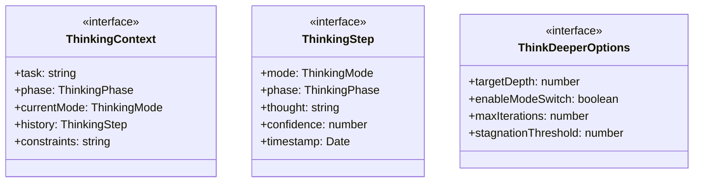

# thinking-process

## 概要

`thinking-process` モジュールのAPIリファレンス。

## エクスポート一覧

| 種別 | 名前 | 説明 |
|------|------|------|
| 関数 | `selectThinkingMode` | - |
| 関数 | `advancePhase` | - |
| 関数 | `thinkDeeper` | - |
| 関数 | `getThinkingModeDescription` | - |
| 関数 | `getThinkingPhaseDescription` | - |
| 関数 | `createThinkingContext` | - |
| 関数 | `addThinkingStep` | - |
| 関数 | `switchThinkingMode` | - |
| 関数 | `analyzeConfidenceTrend` | - |
| 関数 | `getAllThinkingModes` | - |
| 関数 | `getAllThinkingPhases` | - |
| 関数 | `getModePhaseCompatibility` | - |
| インターフェース | `ThinkingContext` | 思考コンテキスト |
| インターフェース | `ThinkingStep` | 思考ステップ |
| インターフェース | `ThinkDeeperOptions` | 思考深化オプション |
| 型 | `ThinkingMode` | 思考モード型定義 |
| 型 | `ThinkingPhase` | 思考フェーズ型定義 |

## 図解

### クラス図



### 関数フロー

```mermaid
flowchart TD
  addThinkingStep["addThinkingStep()"]
  advancePhase["advancePhase()"]
  analyzeConfidenceTrend["analyzeConfidenceTrend()"]
  countOverconfidenceKeywords["countOverconfidenceKeywords()"]
  countQualityKeywords["countQualityKeywords()"]
  countUncertaintyKeywords["countUncertaintyKeywords()"]
  createThinkingContext["createThinkingContext()"]
  deepenThought["deepenThought()"]
  estimateConfidence["estimateConfidence()"]
  getAllThinkingModes["getAllThinkingModes()"]
  getAllThinkingPhases["getAllThinkingPhases()"]
  getModePhaseCompatibility["getModePhaseCompatibility()"]
  getThinkingModeDescription["getThinkingModeDescription()"]
  getThinkingPhaseDescription["getThinkingPhaseDescription()"]
  selectThinkingMode["selectThinkingMode()"]
  switchModeOnStagnation["switchModeOnStagnation()"]
  switchThinkingMode["switchThinkingMode()"]
  thinkDeeper["thinkDeeper()"]
  createThinkingContext --> selectThinkingMode
  estimateConfidence --> countOverconfidenceKeywords
  estimateConfidence --> countQualityKeywords
  estimateConfidence --> countUncertaintyKeywords
  thinkDeeper --> deepenThought
  thinkDeeper --> estimateConfidence
  thinkDeeper --> switchModeOnStagnation
```



## 関数

### selectThinkingMode

```typescript
selectThinkingMode(context: Partial<ThinkingContext>): ThinkingMode
```

**パラメータ**

| 名前 | 型 | 必須 |
|------|-----|------|
| context | `Partial<ThinkingContext>` | はい |

**戻り値**: `ThinkingMode`

### advancePhase

```typescript
advancePhase(currentPhase: ThinkingPhase): ThinkingPhase
```

**パラメータ**

| 名前 | 型 | 必須 |
|------|-----|------|
| currentPhase | `ThinkingPhase` | はい |

**戻り値**: `ThinkingPhase`

### thinkDeeper

```typescript
thinkDeeper(initialThought: string, context: ThinkingContext, options: Partial<ThinkDeeperOptions>): ThinkingStep[]
```

**パラメータ**

| 名前 | 型 | 必須 |
|------|-----|------|
| initialThought | `string` | はい |
| context | `ThinkingContext` | はい |
| options | `Partial<ThinkDeeperOptions>` | はい |

**戻り値**: `ThinkingStep[]`

### getThinkingModeDescription

```typescript
getThinkingModeDescription(mode: ThinkingMode): string
```

**パラメータ**

| 名前 | 型 | 必須 |
|------|-----|------|
| mode | `ThinkingMode` | はい |

**戻り値**: `string`

### getThinkingPhaseDescription

```typescript
getThinkingPhaseDescription(phase: ThinkingPhase): string
```

**パラメータ**

| 名前 | 型 | 必須 |
|------|-----|------|
| phase | `ThinkingPhase` | はい |

**戻り値**: `string`

### createThinkingContext

```typescript
createThinkingContext(task: string, options: {
    phase?: ThinkingPhase;
    mode?: ThinkingMode;
    constraints?: string[];
  }): ThinkingContext
```

**パラメータ**

| 名前 | 型 | 必須 |
|------|-----|------|
| task | `string` | はい |
| options | `object` | はい |
| &nbsp;&nbsp;↳ phase | `ThinkingPhase` | いいえ |
| &nbsp;&nbsp;↳ mode | `ThinkingMode` | いいえ |
| &nbsp;&nbsp;↳ constraints | `string[]` | いいえ |

**戻り値**: `ThinkingContext`

### addThinkingStep

```typescript
addThinkingStep(context: ThinkingContext, thought: string, confidence: number): ThinkingContext
```

**パラメータ**

| 名前 | 型 | 必須 |
|------|-----|------|
| context | `ThinkingContext` | はい |
| thought | `string` | はい |
| confidence | `number` | はい |

**戻り値**: `ThinkingContext`

### switchThinkingMode

```typescript
switchThinkingMode(context: ThinkingContext, newMode: ThinkingMode): ThinkingContext
```

**パラメータ**

| 名前 | 型 | 必須 |
|------|-----|------|
| context | `ThinkingContext` | はい |
| newMode | `ThinkingMode` | はい |

**戻り値**: `ThinkingContext`

### analyzeConfidenceTrend

```typescript
analyzeConfidenceTrend(history: ThinkingStep[]): {
  trend: 'improving' | 'declining' | 'stable';
  averageConfidence: number;
  maxConfidence: number;
  minConfidence: number;
}
```

**パラメータ**

| 名前 | 型 | 必須 |
|------|-----|------|
| history | `ThinkingStep[]` | はい |

**戻り値**: `{
  trend: 'improving' | 'declining' | 'stable';
  averageConfidence: number;
  maxConfidence: number;
  minConfidence: number;
}`

### estimateConfidence

```typescript
estimateConfidence(thought: string, depth: number): number
```

思考の信頼度を推定

**パラメータ**

| 名前 | 型 | 必須 |
|------|-----|------|
| thought | `string` | はい |
| depth | `number` | はい |

**戻り値**: `number`

### countQualityKeywords

```typescript
countQualityKeywords(thought: string): number
```

品質キーワードをカウント

**パラメータ**

| 名前 | 型 | 必須 |
|------|-----|------|
| thought | `string` | はい |

**戻り値**: `number`

### countUncertaintyKeywords

```typescript
countUncertaintyKeywords(thought: string): number
```

不確実性キーワードをカウント

**パラメータ**

| 名前 | 型 | 必須 |
|------|-----|------|
| thought | `string` | はい |

**戻り値**: `number`

### countOverconfidenceKeywords

```typescript
countOverconfidenceKeywords(thought: string): number
```

過信キーワードをカウント

**パラメータ**

| 名前 | 型 | 必須 |
|------|-----|------|
| thought | `string` | はい |

**戻り値**: `number`

### switchModeOnStagnation

```typescript
switchModeOnStagnation(currentMode: ThinkingMode): ThinkingMode
```

停滞時にモードを切り替え

**パラメータ**

| 名前 | 型 | 必須 |
|------|-----|------|
| currentMode | `ThinkingMode` | はい |

**戻り値**: `ThinkingMode`

### deepenThought

```typescript
deepenThought(thought: string, mode: ThinkingMode, depth: number): string
```

思考を深化させる

**パラメータ**

| 名前 | 型 | 必須 |
|------|-----|------|
| thought | `string` | はい |
| mode | `ThinkingMode` | はい |
| depth | `number` | はい |

**戻り値**: `string`

### getAllThinkingModes

```typescript
getAllThinkingModes(): ThinkingMode[]
```

**戻り値**: `ThinkingMode[]`

### getAllThinkingPhases

```typescript
getAllThinkingPhases(): ThinkingPhase[]
```

**戻り値**: `ThinkingPhase[]`

### getModePhaseCompatibility

```typescript
getModePhaseCompatibility(mode: ThinkingMode, phase: ThinkingPhase): number
```

**パラメータ**

| 名前 | 型 | 必須 |
|------|-----|------|
| mode | `ThinkingMode` | はい |
| phase | `ThinkingPhase` | はい |

**戻り値**: `number`

## インターフェース

### ThinkingContext

```typescript
interface ThinkingContext {
  task: string;
  phase: ThinkingPhase;
  currentMode: ThinkingMode;
  history: ThinkingStep[];
  constraints: string[];
}
```

思考コンテキスト

### ThinkingStep

```typescript
interface ThinkingStep {
  mode: ThinkingMode;
  phase: ThinkingPhase;
  thought: string;
  confidence: number;
  timestamp: Date;
}
```

思考ステップ

### ThinkDeeperOptions

```typescript
interface ThinkDeeperOptions {
  targetDepth: number;
  enableModeSwitch: boolean;
  maxIterations: number;
  stagnationThreshold: number;
}
```

思考深化オプション

## 型定義

### ThinkingMode

```typescript
type ThinkingMode = | 'creative'    // 創造的：新規性追求、発散的思考
  | 'analytical'  // 分析的：論理分解、収束的思考
  | 'critical'    // 批判的：前提疑念、反例探索
  | 'practical'   // 実践的：実現可能性、効率重視
  | 'social'      // 社会的：他者視点、合意形成
  | 'emotional'
```

思考モード型定義
ド・ボノの「6つの思考帽」とブルームの分類学に基づく

### ThinkingPhase

```typescript
type ThinkingPhase = | 'problem-discovery'     // 問題発見
  | 'problem-formulation'   // 問題形成
  | 'strategy-development'  // 戦略開発
  | 'solution-evaluation'
```

思考フェーズ型定義
問題解決プロセスの段階

---
*自動生成: 2026-02-23T06:29:42.430Z*
