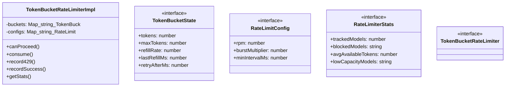

# token-bucket

## 概要

`token-bucket` モジュールのAPIリファレンス。

## エクスポート一覧

| 種別 | 名前 | 説明 |
|------|------|------|
| 関数 | `getTokenBucketRateLimiter` | シングルトンのレートリミッターを取得する。 |
| 関数 | `createTokenBucketRateLimiter` | レート制限インスタンス作成 |
| 関数 | `resetTokenBucketRateLimiter` | レート制限をリセットする |
| インターフェース | `RateLimitConfig` | - |
| インターフェース | `RateLimiterStats` | - |
| インターフェース | `TokenBucketRateLimiter` | - |

## 図解

### クラス図



## 関数

### getTokenBucketRateLimiter

```typescript
getTokenBucketRateLimiter(): TokenBucketRateLimiterImpl
```

シングルトンのレートリミッターを取得する。

**戻り値**: `TokenBucketRateLimiterImpl`

### createTokenBucketRateLimiter

```typescript
createTokenBucketRateLimiter(): TokenBucketRateLimiterImpl
```

レート制限インスタンス作成

**戻り値**: `TokenBucketRateLimiterImpl`

### resetTokenBucketRateLimiter

```typescript
resetTokenBucketRateLimiter(): void
```

レート制限をリセットする

**戻り値**: `void`

## クラス

### TokenBucketRateLimiterImpl

Token bucket rate limiter with RPM support and burst tolerance.

**プロパティ**

| 名前 | 型 | 可視性 |
|------|-----|--------|
| buckets | `Map<string, TokenBucketState>` | private |
| configs | `Map<string, RateLimitConfig>` | private |

**メソッド**

| 名前 | シグネチャ |
|------|------------|
| canProceed | `canProceed(provider, model, tokensNeeded): number` |
| consume | `consume(provider, model, tokens): void` |
| record429 | `record429(provider, model, retryAfterMs): void` |
| recordSuccess | `recordSuccess(provider, model): void` |
| getStats | `getStats(): RateLimiterStats` |
| configure | `configure(provider, model, config): void` |
| reset | `reset(provider, model): void` |
| resetAll | `resetAll(): void` |
| getBucketState | `getBucketState(provider, model): TokenBucketState | undefined` |
| getKey | `getKey(provider, model): string` |
| getConfig | `getConfig(provider, model): RateLimitConfig` |
| getOrCreateState | `getOrCreateState(key, provider, model): TokenBucketState` |
| refillTokens | `refillTokens(state): void` |
| touchState | `touchState(state): void` |
| pruneBuckets | `pruneBuckets(now): void` |
| evictOverflowIfNeeded | `evictOverflowIfNeeded(now): void` |

## インターフェース

### TokenBucketState

```typescript
interface TokenBucketState {
  tokens: number;
  maxTokens: number;
  refillRate: number;
  lastRefillMs: number;
  retryAfterMs: number;
  burstMultiplier: number;
  burstTokensUsed: number;
  lastAccessMs: number;
}
```

Token bucket state for a provider/model combination.

### RateLimitConfig

```typescript
interface RateLimitConfig {
  rpm: number;
  burstMultiplier: number;
  minIntervalMs: number;
}
```

### RateLimiterStats

```typescript
interface RateLimiterStats {
  trackedModels: number;
  blockedModels: string[];
  avgAvailableTokens: number;
  lowCapacityModels: string[];
}
```

### TokenBucketRateLimiter

```typescript
interface TokenBucketRateLimiter {
  canProceed(provider, model, tokensNeeded);
  consume(provider, model, tokens);
  record429(provider, model, retryAfterMs);
  recordSuccess(provider, model);
  getStats();
}
```

---
*自動生成: 2026-02-22T19:27:00.736Z*
