# tool-compiler-types

## 概要

`tool-compiler-types` モジュールのAPIリファレンス。

## エクスポート一覧

| 種別 | 名前 | 説明 |
|------|------|------|
| 関数 | `isToolCall` | ToolCall型ガード |
| 関数 | `isFusedOperation` | FusedOperation型ガード |
| 関数 | `isCompilationResult` | CompilationResult型ガード |
| インターフェース | `ToolCall` | 個別のツール呼び出しを表現する型 |
| インターフェース | `ToolDependency` | ツール間の依存関係を表現する型 |
| インターフェース | `DependencyNode` | 依存グラフのノード |
| インターフェース | `FusedOperation` | 融合された操作を表現する型 |
| インターフェース | `ToolGroup` | ツールグループを表現する型 |
| インターフェース | `CompilationResult` | コンパイル結果を表現する型 |
| インターフェース | `CompilationMetrics` | コンパイル時のメトリクス |
| インターフェース | `ToolExecutionResult` | 個別のツール実行結果 |
| インターフェース | `FusedExecutionResult` | 融合操作の実行結果 |
| インターフェース | `ExecutionResult` | 全体の実行結果 |
| インターフェース | `FusionConfig` | ツール融合の設定 |
| 型 | `ToolExecutorFn` | ツール実行関数の型 |
| 型 | `ProgressCallback` | 進捗コールバックの型 |

## 図解

### クラス図

```mermaid
classDiagram
  class ToolCall {
    <<interface>>
    +id: string
    +name: string
    +arguments: Record_string_unknow
    +estimatedTokens: number
  }
  class ToolDependency {
    <<interface>>
    +toolId: string
    +dependsOn: string
    +dependencyType: data_ordering_r
  }
  class DependencyNode {
    <<interface>>
    +call: ToolCall
    +dependencies: Set_string
    +dependents: Set_string
    +topologicalOrder: number
  }
  class FusedOperation {
    <<interface>>
    +fusedId: string
    +toolIds: string
    +toolCalls: ToolCall
    +dependsOnFusedIds: string
    +canExecuteInParallel: boolean
  }
  class ToolGroup {
    <<interface>>
    +groupId: string
    +groupName: string
    +toolNames: string
    +groupType: file_read_file_wr
    +fusionScore: number
  }
  class CompilationResult {
    <<interface>>
    +compilationId: string
    +originalToolCount: number
    +fusedOperationCount: number
    +fusedOperations: FusedOperation
    +toolGroups: ToolGroup
  }
  class CompilationMetrics {
    <<interface>>
    +compilationTimeMs: number
    +dependencyAnalysisTimeMs: number
    +groupingTimeMs: number
    +fusionTimeMs: number
    +averageDependencies: number
  }
  class ToolExecutionResult {
    <<interface>>
    +toolId: string
    +toolName: string
    +success: boolean
    +result: unknown
    +error: string
  }
  class FusedExecutionResult {
    <<interface>>
    +fusedId: string
    +toolResults: Map_string_ToolExecu
    +success: boolean
    +totalExecutionTimeMs: number
    +wasParallel: boolean
  }
  class ExecutionResult {
    <<interface>>
    +executionId: string
    +compilation: CompilationResult
    +fusedResults: FusedExecutionResult
    +allToolResults: Map_string_ToolExecu
    +success: boolean
  }
  class FusionConfig {
    <<interface>>
    +maxParallelism: number
    +minToolsForFusion: number
    +minTokenSavingsThreshold: number
    +fileReadPatterns: string
    +fileWritePatterns: string
  }
```



## 関数

### isToolCall

```typescript
isToolCall(value: unknown): value is ToolCall
```

ToolCall型ガード

**パラメータ**

| 名前 | 型 | 必須 |
|------|-----|------|
| value | `unknown` | はい |

**戻り値**: `value is ToolCall`

### isFusedOperation

```typescript
isFusedOperation(value: unknown): value is FusedOperation
```

FusedOperation型ガード

**パラメータ**

| 名前 | 型 | 必須 |
|------|-----|------|
| value | `unknown` | はい |

**戻り値**: `value is FusedOperation`

### isCompilationResult

```typescript
isCompilationResult(value: unknown): value is CompilationResult
```

CompilationResult型ガード

**パラメータ**

| 名前 | 型 | 必須 |
|------|-----|------|
| value | `unknown` | はい |

**戻り値**: `value is CompilationResult`

## インターフェース

### ToolCall

```typescript
interface ToolCall {
  id: string;
  name: string;
  arguments: Record<string, unknown>;
  estimatedTokens?: number;
}
```

個別のツール呼び出しを表現する型

### ToolDependency

```typescript
interface ToolDependency {
  toolId: string;
  dependsOn: string[];
  dependencyType: "data" | "ordering" | "resource";
}
```

ツール間の依存関係を表現する型

### DependencyNode

```typescript
interface DependencyNode {
  call: ToolCall;
  dependencies: Set<string>;
  dependents: Set<string>;
  topologicalOrder: number;
}
```

依存グラフのノード

### FusedOperation

```typescript
interface FusedOperation {
  fusedId: string;
  toolIds: string[];
  toolCalls: ToolCall[];
  dependsOnFusedIds: string[];
  canExecuteInParallel: boolean;
  estimatedTokenSavings: number;
  executionStrategy: "parallel" | "sequential" | "batch";
  priority: number;
}
```

融合された操作を表現する型
複数の独立したツール呼び出しを1つの操作として扱う

### ToolGroup

```typescript
interface ToolGroup {
  groupId: string;
  groupName: string;
  toolNames: string[];
  groupType: "file_read" | "file_write" | "search" | "execute" | "query" | "other";
  fusionScore: number;
  description: string;
}
```

ツールグループを表現する型
類似したツールをグループ化したもの

### CompilationResult

```typescript
interface CompilationResult {
  compilationId: string;
  originalToolCount: number;
  fusedOperationCount: number;
  fusedOperations: FusedOperation[];
  toolGroups: ToolGroup[];
  dependencyGraph: Map<string, DependencyNode>;
  totalTokenSavings: number;
  parallelizableCount: number;
  metrics: CompilationMetrics;
  warnings: string[];
  success: boolean;
  error?: string;
}
```

コンパイル結果を表現する型

### CompilationMetrics

```typescript
interface CompilationMetrics {
  compilationTimeMs: number;
  dependencyAnalysisTimeMs: number;
  groupingTimeMs: number;
  fusionTimeMs: number;
  averageDependencies: number;
  maxDependencyDepth: number;
  hasCircularDependencies: boolean;
}
```

コンパイル時のメトリクス

### ToolExecutionResult

```typescript
interface ToolExecutionResult {
  toolId: string;
  toolName: string;
  success: boolean;
  result?: unknown;
  error?: string;
  errorObject?: Error;
  executionTimeMs: number;
  tokensUsed?: number;
}
```

個別のツール実行結果

### FusedExecutionResult

```typescript
interface FusedExecutionResult {
  fusedId: string;
  toolResults: Map<string, ToolExecutionResult>;
  success: boolean;
  totalExecutionTimeMs: number;
  wasParallel: boolean;
  failedToolIds: string[];
}
```

融合操作の実行結果

### ExecutionResult

```typescript
interface ExecutionResult {
  executionId: string;
  compilation: CompilationResult;
  fusedResults: FusedExecutionResult[];
  allToolResults: Map<string, ToolExecutionResult>;
  success: boolean;
  totalExecutionTimeMs: number;
  savedTokens: number;
  savedTimeMs: number;
  errorSummary?: string;
}
```

全体の実行結果

### FusionConfig

```typescript
interface FusionConfig {
  maxParallelism: number;
  minToolsForFusion: number;
  minTokenSavingsThreshold: number;
  fileReadPatterns: string[];
  fileWritePatterns: string[];
  searchPatterns: string[];
  enableDependencyAnalysis: boolean;
  enableAutoGrouping: boolean;
  debugMode: boolean;
}
```

ツール融合の設定

## 型定義

### ToolExecutorFn

```typescript
type ToolExecutorFn = (
  toolName: string,
  args: Record<string, unknown>,
  signal?: AbortSignal
) => Promise<unknown>
```

ツール実行関数の型

### ProgressCallback

```typescript
type ProgressCallback = (
  fusedId: string,
  phase: "starting" | "executing" | "completed" | "failed",
  details?: string
) => void
```

進捗コールバックの型

---
*自動生成: 2026-02-24T17:08:02.791Z*
