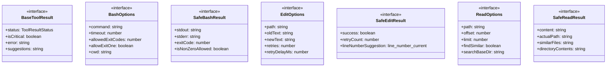
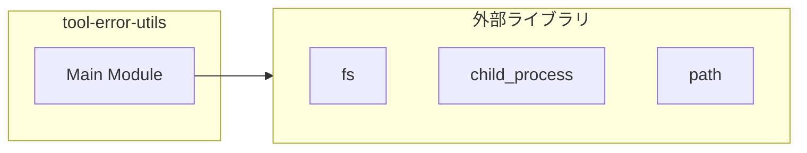
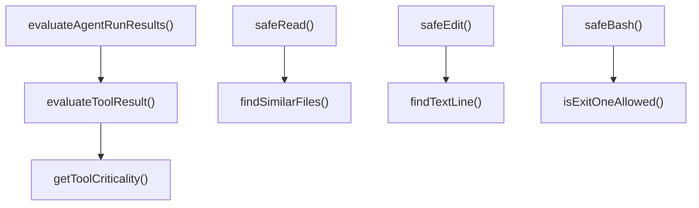
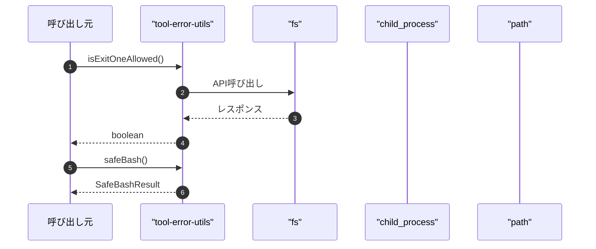

# tool-error-utils

## 概要

`tool-error-utils` モジュールのAPIリファレンス。

## インポート

```typescript
// from 'fs': existsSync, statSync, readdirSync, ...
// from 'child_process': execSync
// from 'path': basename, dirname, join, ...
```

## エクスポート一覧

| 種別 | 名前 | 説明 |
|------|------|------|
| 関数 | `isExitOneAllowed` | コマンドが exit code 1 を許容されるか判定 |
| 関数 | `safeBash` | 改善版 bash 実行 |
| 関数 | `findTextLine` | ファイル内でテキストを検索し、行番号を返す |
| 関数 | `safeEdit` | 改善版 edit 実行 |
| 関数 | `findSimilarFiles` | 類似ファイル名を検索 |
| 関数 | `safeRead` | 改善版 read 実行 |
| 関数 | `getToolCriticality` | ツール名から重要度を判定 |
| 関数 | `evaluateToolResult` | ツール実行結果を評価 |
| 関数 | `evaluateAgentRunResults` | Agent Run のツール呼び出し結果を集計評価 |
| インターフェース | `BaseToolResult` | 基本ツール結果 |
| インターフェース | `BashOptions` | safeBash のオプション |
| インターフェース | `SafeBashResult` | safeBash の結果 |
| インターフェース | `EditOptions` | safeEdit のオプション |
| インターフェース | `SafeEditResult` | safeEdit の結果 |
| インターフェース | `ReadOptions` | safeRead のオプション |
| インターフェース | `SafeReadResult` | safeRead の結果 |
| 型 | `ToolCriticality` | ツール実行の重要度レベル |
| 型 | `ToolResultStatus` | ツール実行結果の状態 |

## 図解

### クラス図



### 依存関係図



### 関数フロー



### シーケンス図



## 関数

### isExitOneAllowed

```typescript
isExitOneAllowed(command: string): boolean
```

コマンドが exit code 1 を許容されるか判定

**パラメータ**

| 名前 | 型 | 必須 |
|------|-----|------|
| command | `string` | はい |

**戻り値**: `boolean`

### safeBash

```typescript
safeBash(options: BashOptions): SafeBashResult
```

改善版 bash 実行

**パラメータ**

| 名前 | 型 | 必須 |
|------|-----|------|
| options | `BashOptions` | はい |

**戻り値**: `SafeBashResult`

### findTextLine

```typescript
findTextLine(content: string, searchText: string): number | null
```

ファイル内でテキストを検索し、行番号を返す

**パラメータ**

| 名前 | 型 | 必須 |
|------|-----|------|
| content | `string` | はい |
| searchText | `string` | はい |

**戻り値**: `number | null`

### safeEdit

```typescript
safeEdit(options: EditOptions): SafeEditResult
```

改善版 edit 実行

**パラメータ**

| 名前 | 型 | 必須 |
|------|-----|------|
| options | `EditOptions` | はい |

**戻り値**: `SafeEditResult`

### findSimilarFiles

```typescript
findSimilarFiles(targetPath: string, baseDir: string): string[]
```

類似ファイル名を検索

**パラメータ**

| 名前 | 型 | 必須 |
|------|-----|------|
| targetPath | `string` | はい |
| baseDir | `string` | はい |

**戻り値**: `string[]`

### safeRead

```typescript
safeRead(options: ReadOptions): SafeReadResult
```

改善版 read 実行

**パラメータ**

| 名前 | 型 | 必須 |
|------|-----|------|
| options | `ReadOptions` | はい |

**戻り値**: `SafeReadResult`

### getToolCriticality

```typescript
getToolCriticality(toolName: string): ToolCriticality
```

ツール名から重要度を判定

**パラメータ**

| 名前 | 型 | 必須 |
|------|-----|------|
| toolName | `string` | はい |

**戻り値**: `ToolCriticality`

### evaluateToolResult

```typescript
evaluateToolResult(toolName: string, status: "ok" | "error", errorMessage?: string): {
  isCritical: boolean;
  shouldFailAgentRun: boolean;
  downgradeToWarning: boolean;
}
```

ツール実行結果を評価

**パラメータ**

| 名前 | 型 | 必須 |
|------|-----|------|
| toolName | `string` | はい |
| status | `"ok" | "error"` | はい |
| errorMessage | `string` | いいえ |

**戻り値**: `{
  isCritical: boolean;
  shouldFailAgentRun: boolean;
  downgradeToWarning: boolean;
}`

### evaluateAgentRunResults

```typescript
evaluateAgentRunResults(results: Array<{
    toolName: string;
    status: "ok" | "error";
    errorMessage?: string;
  }>): {
  status: "ok" | "warning" | "error";
  failedCount: number;
  criticalFailureCount: number;
  warningCount: number;
  message: string;
  shouldFailAgentRun: boolean;
}
```

Agent Run のツール呼び出し結果を集計評価

**パラメータ**

| 名前 | 型 | 必須 |
|------|-----|------|
| results | `Array<{
    toolName: string;
    status: "ok" ...` | はい |

**戻り値**: `{
  status: "ok" | "warning" | "error";
  failedCount: number;
  criticalFailureCount: number;
  warningCount: number;
  message: string;
  shouldFailAgentRun: boolean;
}`

## インターフェース

### BaseToolResult

```typescript
interface BaseToolResult {
  status: ToolResultStatus;
  isCritical: boolean;
  error?: string;
  suggestions?: string[];
}
```

基本ツール結果

### BashOptions

```typescript
interface BashOptions {
  command: string;
  timeout?: number;
  allowedExitCodes?: number[];
  allowExitOne?: boolean;
  cwd?: string;
  env?: Record<string, string>;
}
```

safeBash のオプション

### SafeBashResult

```typescript
interface SafeBashResult {
  stdout: string;
  stderr: string;
  exitCode: number;
  isNonZeroAllowed?: boolean;
}
```

safeBash の結果

### EditOptions

```typescript
interface EditOptions {
  path: string;
  oldText: string;
  newText: string;
  retries?: number;
  retryDelayMs?: number;
  suggestLineNumber?: boolean;
}
```

safeEdit のオプション

### SafeEditResult

```typescript
interface SafeEditResult {
  success: boolean;
  retryCount: number;
  lineNumberSuggestion?: {
    line: number;
    currentContent: string;
  };
}
```

safeEdit の結果

### ReadOptions

```typescript
interface ReadOptions {
  path: string;
  offset?: number;
  limit?: number;
  findSimilar?: boolean;
  searchBaseDir?: string;
}
```

safeRead のオプション

### SafeReadResult

```typescript
interface SafeReadResult {
  content: string;
  actualPath: string;
  similarFiles?: string[];
  directoryContents?: string[];
}
```

safeRead の結果

## 型定義

### ToolCriticality

```typescript
type ToolCriticality = "critical" | "non-critical" | "informational"
```

ツール実行の重要度レベル

### ToolResultStatus

```typescript
type ToolResultStatus = "ok" | "warning" | "error"
```

ツール実行結果の状態

---
*自動生成: 2026-02-23T06:29:42.435Z*
