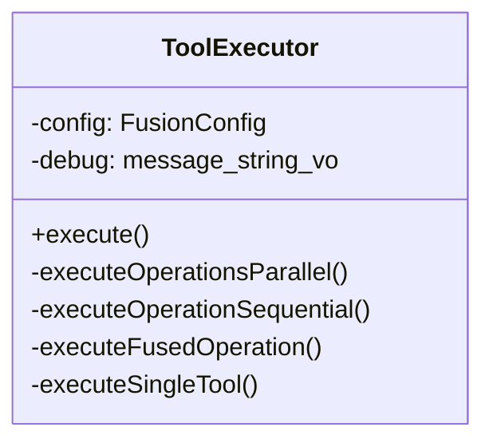
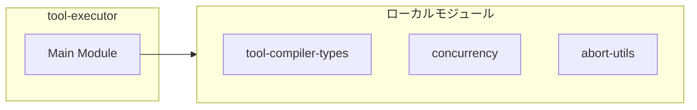
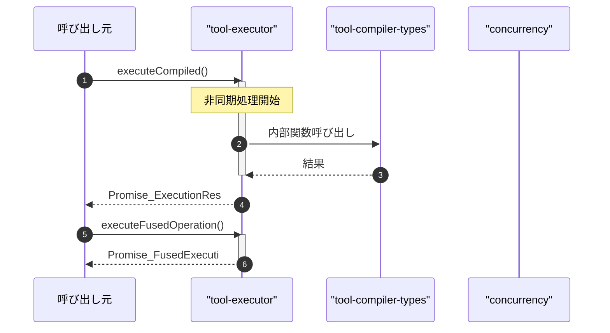

# tool-executor

## 概要

`tool-executor` モジュールのAPIリファレンス。

## インポート

```typescript
// from 'node:crypto': randomBytes
// from './tool-compiler-types.js': ToolCall, FusedOperation, CompilationResult, ...
// from './concurrency.js': runWithConcurrencyLimit
// from './abort-utils.js': createChildAbortController
```

## エクスポート一覧

| 種別 | 名前 | 説明 |
|------|------|------|
| 関数 | `executeCompiled` | コンパイル結果を実行する便利関数 |
| 関数 | `executeFusedOperation` | 単一の融合操作を実行する便利関数 |
| クラス | `ToolExecutor` | ツール実行エンジン |

## 図解

### クラス図



### 依存関係図



### シーケンス図



## 関数

### executeCompiled

```typescript
async executeCompiled(compilation: CompilationResult, executorFn: ToolExecutorFn, signal?: AbortSignal, onProgress?: ProgressCallback, config?: Partial<FusionConfig>): Promise<ExecutionResult>
```

コンパイル結果を実行する便利関数

**パラメータ**

| 名前 | 型 | 必須 |
|------|-----|------|
| compilation | `CompilationResult` | はい |
| executorFn | `ToolExecutorFn` | はい |
| signal | `AbortSignal` | いいえ |
| onProgress | `ProgressCallback` | いいえ |
| config | `Partial<FusionConfig>` | いいえ |

**戻り値**: `Promise<ExecutionResult>`

### executeFusedOperation

```typescript
async executeFusedOperation(operation: FusedOperation, executorFn: ToolExecutorFn, signal?: AbortSignal, onProgress?: ProgressCallback, config?: Partial<FusionConfig>): Promise<FusedExecutionResult>
```

単一の融合操作を実行する便利関数

**パラメータ**

| 名前 | 型 | 必須 |
|------|-----|------|
| operation | `FusedOperation` | はい |
| executorFn | `ToolExecutorFn` | はい |
| signal | `AbortSignal` | いいえ |
| onProgress | `ProgressCallback` | いいえ |
| config | `Partial<FusionConfig>` | いいえ |

**戻り値**: `Promise<FusedExecutionResult>`

## クラス

### ToolExecutor

ツール実行エンジン
融合操作の分解・実行・結果統合を行う

**プロパティ**

| 名前 | 型 | 可視性 |
|------|-----|--------|
| config | `FusionConfig` | private |
| debug | `(message: string) => void` | private |

**メソッド**

| 名前 | シグネチャ |
|------|------------|
| execute | `execute(compilation, executorFn, signal, onProgress): Promise<ExecutionResult>` |
| executeOperationsParallel | `executeOperationsParallel(operations, executorFn, signal, onProgress, allResults): Promise<FusedExecutionResult[]>` |
| executeOperationSequential | `executeOperationSequential(operation, executorFn, signal, onProgress, allResults): Promise<FusedExecutionResult>` |
| executeFusedOperation | `executeFusedOperation(operation, executorFn, signal, onProgress, allResults): Promise<FusedExecutionResult>` |
| executeSingleTool | `executeSingleTool(call, executorFn, signal): Promise<ToolExecutionResult>` |
| calculateSavedTime | `calculateSavedTime(fusedResults, originalToolCount): number` |
| buildErrorSummary | `buildErrorSummary(fusedResults): string` |
| createEmptyResult | `createEmptyResult(executionId, compilation, executionTimeMs): ExecutionResult` |
| createErrorResult | `createErrorResult(executionId, compilation, executionTimeMs, errorMessage): ExecutionResult` |
| generateId | `generateId(prefix): string` |

---
*自動生成: 2026-02-24T17:08:02.795Z*
