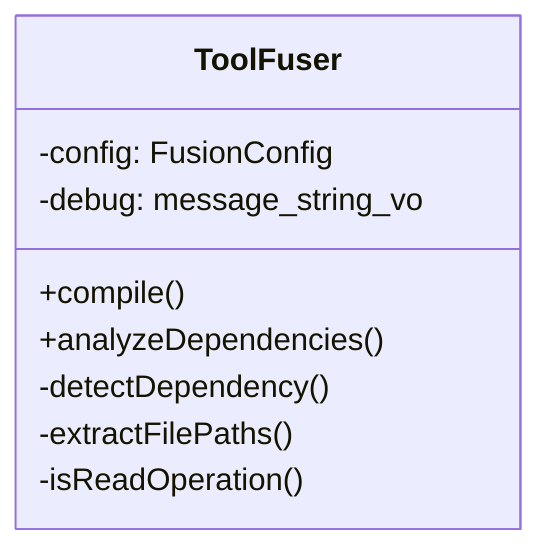
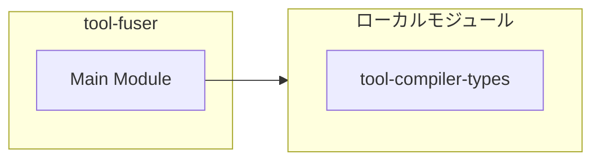
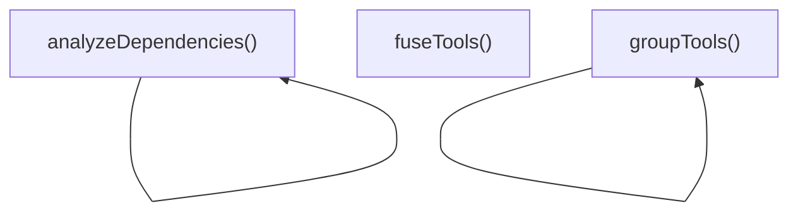
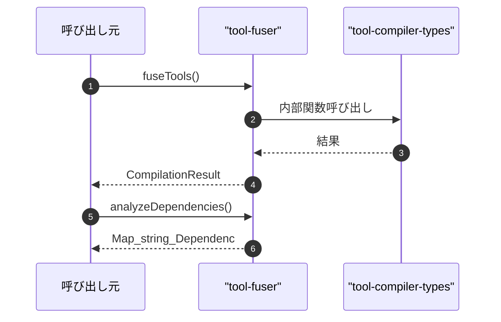

# tool-fuser

## 概要

`tool-fuser` モジュールのAPIリファレンス。

## インポート

```typescript
// from 'node:crypto': randomBytes
// from './tool-compiler-types.js': ToolCall, FusedOperation, ToolGroup, ...
```

## エクスポート一覧

| 種別 | 名前 | 説明 |
|------|------|------|
| 関数 | `fuseTools` | ツール呼び出し配列を融合する便利関数 |
| 関数 | `analyzeDependencies` | ツール呼び出し配列の依存関係を解析する便利関数 |
| 関数 | `groupTools` | ツール呼び出し配列をグループ化する便利関数 |
| クラス | `ToolFuser` | ツール融合クラス |

## 図解

### クラス図



### 依存関係図



### 関数フロー



### シーケンス図



## 関数

### dfs

```typescript
dfs(nodeId: string): boolean
```

**パラメータ**

| 名前 | 型 | 必須 |
|------|-----|------|
| nodeId | `string` | はい |

**戻り値**: `boolean`

### calculateDepth

```typescript
calculateDepth(nodeId: string, visited: Set<string>): number
```

**パラメータ**

| 名前 | 型 | 必須 |
|------|-----|------|
| nodeId | `string` | はい |
| visited | `Set<string>` | はい |

**戻り値**: `number`

### fuseTools

```typescript
fuseTools(toolCalls: ToolCall[], config?: Partial<FusionConfig>): CompilationResult
```

ツール呼び出し配列を融合する便利関数

**パラメータ**

| 名前 | 型 | 必須 |
|------|-----|------|
| toolCalls | `ToolCall[]` | はい |
| config | `Partial<FusionConfig>` | いいえ |

**戻り値**: `CompilationResult`

### analyzeDependencies

```typescript
analyzeDependencies(toolCalls: ToolCall[]): Map<string, DependencyNode>
```

ツール呼び出し配列の依存関係を解析する便利関数

**パラメータ**

| 名前 | 型 | 必須 |
|------|-----|------|
| toolCalls | `ToolCall[]` | はい |

**戻り値**: `Map<string, DependencyNode>`

### groupTools

```typescript
groupTools(toolCalls: ToolCall[]): ToolGroup[]
```

ツール呼び出し配列をグループ化する便利関数

**パラメータ**

| 名前 | 型 | 必須 |
|------|-----|------|
| toolCalls | `ToolCall[]` | はい |

**戻り値**: `ToolGroup[]`

## クラス

### ToolFuser

ツール融合クラス
類似ツールのグループ化と融合操作の生成を行う

**プロパティ**

| 名前 | 型 | 可視性 |
|------|-----|--------|
| config | `FusionConfig` | private |
| debug | `(message: string) => void` | private |

**メソッド**

| 名前 | シグネチャ |
|------|------------|
| compile | `compile(toolCalls): CompilationResult` |
| analyzeDependencies | `analyzeDependencies(toolCalls): Map<string, DependencyNode>` |
| detectDependency | `detectDependency(earlier, later): "data" | "ordering" | "resource" | null` |
| extractFilePaths | `extractFilePaths(call): string[]` |
| isReadOperation | `isReadOperation(toolName): boolean` |
| isWriteOperation | `isWriteOperation(toolName): boolean` |
| isParentPath | `isParentPath(parent, child): boolean` |
| detectCycles | `detectCycles(graph): { hasCycle: boolean; cyclePath?: string[] }` |
| groupTools | `groupTools(toolCalls): ToolGroup[]` |
| determineGroupType | `determineGroupType(toolName): ToolGroup["groupType"]` |
| getGroupDisplayName | `getGroupDisplayName(groupType, toolName): string` |
| getGroupDescription | `getGroupDescription(groupType): string` |
| calculateFusionScore | `calculateFusionScore(group): number` |
| createFusedOperations | `createFusedOperations(toolCalls, dependencyGraph): FusedOperation[]` |
| createFusedOperation | `createFusedOperation(calls, dependencyGraph): FusedOperation` |
| setFusedDependencies | `setFusedDependencies(operations, dependencyGraph): void` |
| calculateTokenSavings | `calculateTokenSavings(calls): number` |
| hasSimilarArgumentPatterns | `hasSimilarArgumentPatterns(calls): boolean` |
| topologicalSort | `topologicalSort(operations, dependencyGraph): FusedOperation[]` |
| calculateMetrics | `calculateMetrics(toolCalls, dependencyGraph, depTime, groupTime, fusionTime, totalTime): CompilationMetrics` |
| calculateTotalTokenSavings | `calculateTotalTokenSavings(operations): number` |
| createEmptyResult | `createEmptyResult(compilationId, warnings, error): CompilationResult` |
| createPassthroughResult | `createPassthroughResult(compilationId, toolCalls, warnings, error): CompilationResult` |
| generateId | `generateId(prefix): string` |

---
*自動生成: 2026-02-24T17:08:02.797Z*
