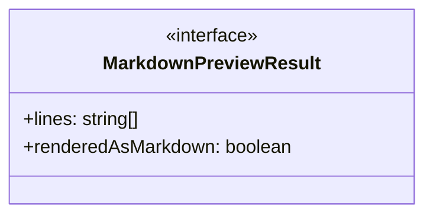
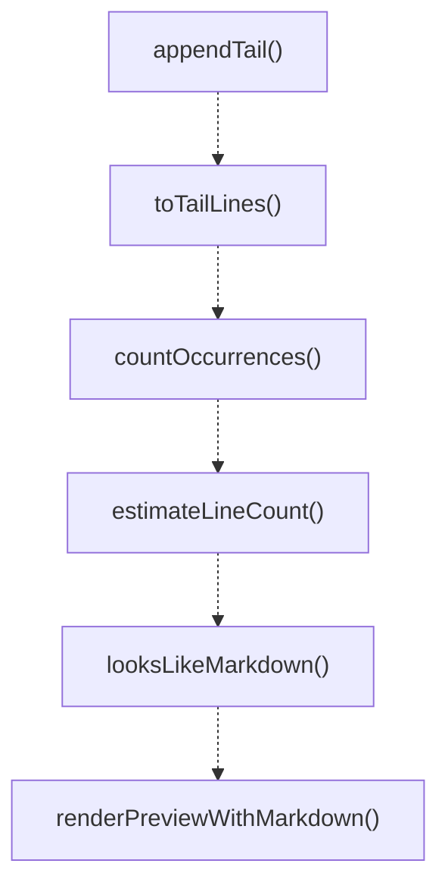
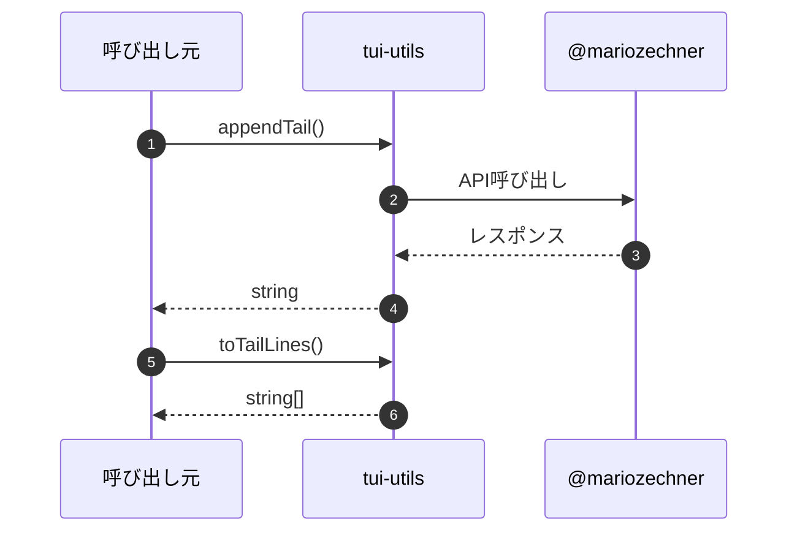

# tui-utils

## 概要

`tui-utils` モジュールのAPIリファレンス。

## インポート

```typescript
import { Markdown, getMarkdownTheme } from '@mariozechner/pi-tui';
```

## エクスポート一覧

| 種別 | 名前 | 説明 |
|------|------|------|
| 関数 | `appendTail` | Appends a chunk to the current tail string, respec |
| 関数 | `toTailLines` | Splits a tail string into lines, trims trailing wh |
| 関数 | `countOccurrences` | Counts occurrences of a target string within an in |
| 関数 | `estimateLineCount` | Estimates line count based on byte count and newli |
| 関数 | `looksLikeMarkdown` | Checks if a string looks like Markdown content. |
| 関数 | `renderPreviewWithMarkdown` | Renders text as Markdown if it looks like Markdown |
| インターフェース | `MarkdownPreviewResult` | Result type for markdown preview rendering. |

## 図解

### クラス図



### 依存関係図

```mermaid
flowchart LR
  subgraph this[tui-utils]
    main[Main Module]
  end
  subgraph external[外部ライブラリ]
    _mariozechner[@mariozechner]
  end
  main --> external
```

### 関数フロー



### シーケンス図



## 関数

### appendTail

```typescript
appendTail(current: string, chunk: string, maxLength: any): string
```

Appends a chunk to the current tail string, respecting the maximum length.
If the result exceeds maxLength, the beginning is truncated.

**パラメータ**

| 名前 | 型 | 必須 |
|------|-----|------|
| current | `string` | はい |
| chunk | `string` | はい |
| maxLength | `any` | はい |

**戻り値**: `string`

### toTailLines

```typescript
toTailLines(tail: string, limit: number): string[]
```

Splits a tail string into lines, trims trailing whitespace, and limits the number of lines.
Empty lines at the end are removed before limiting.

**パラメータ**

| 名前 | 型 | 必須 |
|------|-----|------|
| tail | `string` | はい |
| limit | `number` | はい |

**戻り値**: `string[]`

### countOccurrences

```typescript
countOccurrences(input: string, target: string): number
```

Counts occurrences of a target string within an input string.

**パラメータ**

| 名前 | 型 | 必須 |
|------|-----|------|
| input | `string` | はい |
| target | `string` | はい |

**戻り値**: `number`

### estimateLineCount

```typescript
estimateLineCount(bytes: number, newlineCount: number, endsWithNewline: boolean): number
```

Estimates line count based on byte count and newline count.

**パラメータ**

| 名前 | 型 | 必須 |
|------|-----|------|
| bytes | `number` | はい |
| newlineCount | `number` | はい |
| endsWithNewline | `boolean` | はい |

**戻り値**: `number`

### looksLikeMarkdown

```typescript
looksLikeMarkdown(input: string): boolean
```

Checks if a string looks like Markdown content.
Detects common Markdown patterns: headers, lists, code blocks, links, etc.

**パラメータ**

| 名前 | 型 | 必須 |
|------|-----|------|
| input | `string` | はい |

**戻り値**: `boolean`

### renderPreviewWithMarkdown

```typescript
renderPreviewWithMarkdown(text: string, width: number, maxLines: number): MarkdownPreviewResult
```

Renders text as Markdown if it looks like Markdown, otherwise returns plain lines.

**パラメータ**

| 名前 | 型 | 必須 |
|------|-----|------|
| text | `string` | はい |
| width | `number` | はい |
| maxLines | `number` | はい |

**戻り値**: `MarkdownPreviewResult`

## インターフェース

### MarkdownPreviewResult

```typescript
interface MarkdownPreviewResult {
  lines: string[];
  renderedAsMarkdown: boolean;
}
```

Result type for markdown preview rendering.

---
*自動生成: 2026-02-17T21:54:59.847Z*
