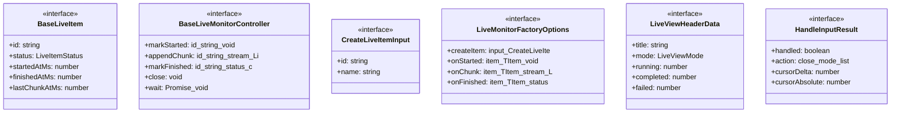
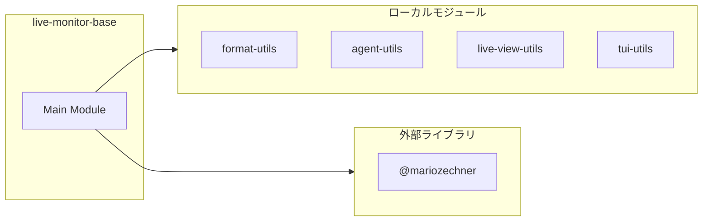
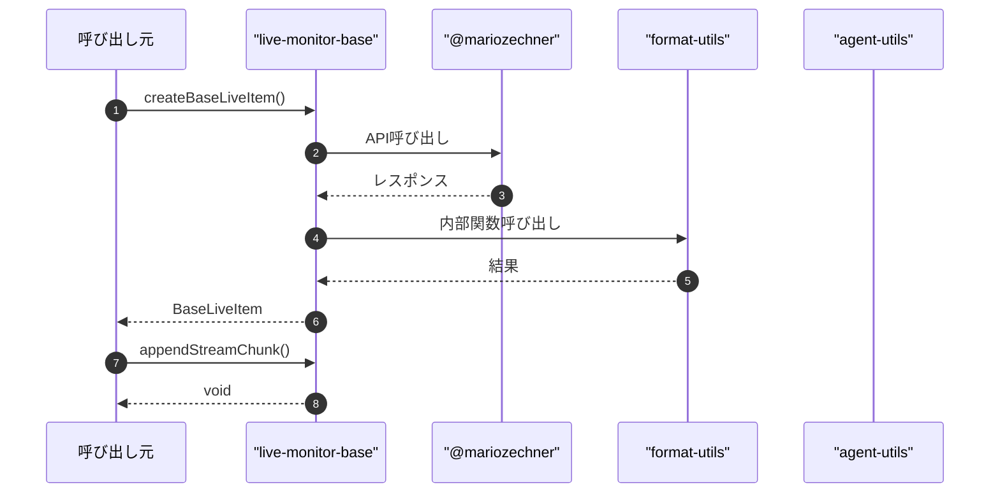

# live-monitor-base

## 概要

`live-monitor-base` モジュールのAPIリファレンス。

## インポート

```typescript
// from '@mariozechner/pi-tui': matchesKey, Key, truncateToWidth
// from '../format-utils.js': formatDurationMs, formatBytes, formatClockTime
// from '../agent-utils.js': computeLiveWindow
// from '../live-view-utils.js': getLiveStatusGlyph, getLiveStatusColor, getActivityIndicator, ...
// from './tui-utils.js': appendTail, countOccurrences, estimateLineCount, ...
```

## エクスポート一覧

| 種別 | 名前 | 説明 |
|------|------|------|
| 関数 | `createBaseLiveItem` | ライブアイテムを生成 |
| 関数 | `appendStreamChunk` | 適切なストリームにチャンクを追加する |
| 関数 | `getStreamTail` | ビューモードとストリームに基づいて末尾を取得 |
| 関数 | `getStreamBytes` | バイト数を取得する |
| 関数 | `getStreamLineCount` | 行数を取得する |
| 関数 | `renderLiveViewHeader` | ヘッダー描画（コンパクト版） |
| 関数 | `renderListKeyboardHints` | キーボード操作のヒントを描画する（コンパクト版） |
| 関数 | `renderDetailKeyboardHints` | 詳細画面のキーボード操作ヒントを描画する（コンパクト版） |
| 関数 | `renderListWindow` | リストを描画 |
| 関数 | `renderBaseListItemLine` | 単一のリストアイテム行を描画する（コンパクト版） |
| 関数 | `renderSelectedItemSummary` | 選択中アイテムの概要を描画する |
| 関数 | `renderDetailHeader` | 選択アイテムの詳細ヘッダーを描画する |
| 関数 | `renderStreamOutput` | ストリーム出力セクションを描画する |
| 関数 | `handleListModeInput` | リストモード入力を処理 |
| 関数 | `handleDetailModeInput` | - |
| 関数 | `applyInputResult` | - |
| インターフェース | `BaseLiveItem` | ライブアイテムの基底データ定義 |
| インターフェース | `BaseLiveMonitorController` | ライブモニタの基底コントローラー定義 |
| インターフェース | `CreateLiveItemInput` | ライブアイテム作成用の入力定義 |
| インターフェース | `LiveMonitorFactoryOptions` | ライブモニタファクトリのオプション定義 |
| インターフェース | `LiveViewHeaderData` | ヘッダー表示データ |
| インターフェース | `HandleInputResult` | 入力処理結果のインターフェース |
| 型 | `LiveItemStatus` | ライブアイテムの状態 |
| 型 | `LiveStreamView` | ストリーム出力種別 |
| 型 | `LiveViewMode` | ライブ表示モード種別 |

## 図解

### クラス図



### 依存関係図



### 関数フロー

```mermaid
flowchart TD
  add["add()"]
  appendStreamChunk["appendStreamChunk()"]
  applyInputResult["applyInputResult()"]
  createBaseLiveItem["createBaseLiveItem()"]
  getStreamBytes["getStreamBytes()"]
  getStreamLineCount["getStreamLineCount()"]
  getStreamTail["getStreamTail()"]
  handleDetailModeInput["handleDetailModeInput()"]
  handleListModeInput["handleListModeInput()"]
  renderBaseListItemLine["renderBaseListItemLine()"]
  renderDetailHeader["renderDetailHeader()"]
  renderDetailKeyboardHints["renderDetailKeyboardHints()"]
  renderListKeyboardHints["renderListKeyboardHints()"]
  renderListWindow["renderListWindow()"]
  renderLiveViewHeader["renderLiveViewHeader()"]
  renderSelectedItemSummary["renderSelectedItemSummary()"]
  renderStreamOutput["renderStreamOutput()"]
  getStreamLineCount --> getStreamBytes
  renderDetailHeader --> add
  renderDetailKeyboardHints --> add
  renderListKeyboardHints --> add
  renderListWindow --> add
  renderLiveViewHeader --> add
  renderSelectedItemSummary --> add
  renderStreamOutput --> add
  renderStreamOutput --> getStreamBytes
  renderStreamOutput --> getStreamLineCount
  renderStreamOutput --> getStreamTail
```



### シーケンス図



## 関数

### createBaseLiveItem

```typescript
createBaseLiveItem(input: CreateLiveItemInput): BaseLiveItem
```

ライブアイテムを生成

**パラメータ**

| 名前 | 型 | 必須 |
|------|-----|------|
| input | `CreateLiveItemInput` | はい |

**戻り値**: `BaseLiveItem`

### appendStreamChunk

```typescript
appendStreamChunk(item: BaseLiveItem, stream: LiveStreamView, chunk: string): void
```

適切なストリームにチャンクを追加する

**パラメータ**

| 名前 | 型 | 必須 |
|------|-----|------|
| item | `BaseLiveItem` | はい |
| stream | `LiveStreamView` | はい |
| chunk | `string` | はい |

**戻り値**: `void`

### getStreamTail

```typescript
getStreamTail(item: BaseLiveItem, stream: LiveStreamView, autoSwitchOnFailure: boolean): string
```

ビューモードとストリームに基づいて末尾を取得

**パラメータ**

| 名前 | 型 | 必須 |
|------|-----|------|
| item | `BaseLiveItem` | はい |
| stream | `LiveStreamView` | はい |
| autoSwitchOnFailure | `boolean` | はい |

**戻り値**: `string`

### getStreamBytes

```typescript
getStreamBytes(item: BaseLiveItem, stream: LiveStreamView): number
```

バイト数を取得する

**パラメータ**

| 名前 | 型 | 必須 |
|------|-----|------|
| item | `BaseLiveItem` | はい |
| stream | `LiveStreamView` | はい |

**戻り値**: `number`

### getStreamLineCount

```typescript
getStreamLineCount(item: BaseLiveItem, stream: LiveStreamView): number
```

行数を取得する

**パラメータ**

| 名前 | 型 | 必須 |
|------|-----|------|
| item | `BaseLiveItem` | はい |
| stream | `LiveStreamView` | はい |

**戻り値**: `number`

### renderLiveViewHeader

```typescript
renderLiveViewHeader(data: LiveViewHeaderData, width: number, theme: any): string[]
```

ヘッダー描画（コンパクト版）

**パラメータ**

| 名前 | 型 | 必須 |
|------|-----|------|
| data | `LiveViewHeaderData` | はい |
| width | `number` | はい |
| theme | `any` | はい |

**戻り値**: `string[]`

### add

```typescript
add(line: any): void
```

**パラメータ**

| 名前 | 型 | 必須 |
|------|-----|------|
| line | `any` | はい |

**戻り値**: `void`

### renderListKeyboardHints

```typescript
renderListKeyboardHints(width: number, theme: any): string[]
```

キーボード操作のヒントを描画する（コンパクト版）

**パラメータ**

| 名前 | 型 | 必須 |
|------|-----|------|
| width | `number` | はい |
| theme | `any` | はい |

**戻り値**: `string[]`

### add

```typescript
add(line: any): void
```

**パラメータ**

| 名前 | 型 | 必須 |
|------|-----|------|
| line | `any` | はい |

**戻り値**: `void`

### renderDetailKeyboardHints

```typescript
renderDetailKeyboardHints(width: number, theme: any, extraKeys?: string): string[]
```

詳細画面のキーボード操作ヒントを描画する（コンパクト版）

**パラメータ**

| 名前 | 型 | 必須 |
|------|-----|------|
| width | `number` | はい |
| theme | `any` | はい |
| extraKeys | `string` | いいえ |

**戻り値**: `string[]`

### add

```typescript
add(line: any): void
```

**パラメータ**

| 名前 | 型 | 必須 |
|------|-----|------|
| line | `any` | はい |

**戻り値**: `void`

### renderListWindow

```typescript
renderListWindow(items: T[], cursor: number, windowSize: number, renderItem: (item: T, index: number, isSelected: boolean) => string, width: number, theme: any): string[]
```

リストを描画

**パラメータ**

| 名前 | 型 | 必須 |
|------|-----|------|
| items | `T[]` | はい |
| cursor | `number` | はい |
| windowSize | `number` | はい |
| renderItem | `(item: T, index: number, isSelected: boolean) =...` | はい |
| width | `number` | はい |
| theme | `any` | はい |

**戻り値**: `string[]`

### add

```typescript
add(line: any): void
```

**パラメータ**

| 名前 | 型 | 必須 |
|------|-----|------|
| line | `any` | はい |

**戻り値**: `void`

### renderBaseListItemLine

```typescript
renderBaseListItemLine(item: BaseLiveItem & { name?: string }, index: number, isSelected: boolean, width: number, theme: any, extraMeta?: string): string
```

単一のリストアイテム行を描画する（コンパクト版）

**パラメータ**

| 名前 | 型 | 必須 |
|------|-----|------|
| item | `BaseLiveItem & { name?: string }` | はい |
| index | `number` | はい |
| isSelected | `boolean` | はい |
| width | `number` | はい |
| theme | `any` | はい |
| extraMeta | `string` | いいえ |

**戻り値**: `string`

### renderSelectedItemSummary

```typescript
renderSelectedItemSummary(items: T[], cursor: number, getItemId: (item: T) => string, getItemName: (item: T) => string | undefined, getItemStatus: (item: T) => LiveItemStatus, getItemElapsed: (item: T) => string, width: number, theme: any, extraInfo?: (item: T) => string | undefined): string[]
```

選択中アイテムの概要を描画する

**パラメータ**

| 名前 | 型 | 必須 |
|------|-----|------|
| items | `T[]` | はい |
| cursor | `number` | はい |
| getItemId | `(item: T) => string` | はい |
| getItemName | `(item: T) => string | undefined` | はい |
| getItemStatus | `(item: T) => LiveItemStatus` | はい |
| getItemElapsed | `(item: T) => string` | はい |
| width | `number` | はい |
| theme | `any` | はい |
| extraInfo | `(item: T) => string | undefined` | いいえ |

**戻り値**: `string[]`

### add

```typescript
add(line: any): void
```

**パラメータ**

| 名前 | 型 | 必須 |
|------|-----|------|
| line | `any` | はい |

**戻り値**: `void`

### renderDetailHeader

```typescript
renderDetailHeader(item: T, cursor: number, total: number, getItemId: (item: T) => string, getItemName: (item: T) => string | undefined, width: number, theme: any): string[]
```

選択アイテムの詳細ヘッダーを描画する

**パラメータ**

| 名前 | 型 | 必須 |
|------|-----|------|
| item | `T` | はい |
| cursor | `number` | はい |
| total | `number` | はい |
| getItemId | `(item: T) => string` | はい |
| getItemName | `(item: T) => string | undefined` | はい |
| width | `number` | はい |
| theme | `any` | はい |

**戻り値**: `string[]`

### add

```typescript
add(line: any): void
```

**パラメータ**

| 名前 | 型 | 必須 |
|------|-----|------|
| line | `any` | はい |

**戻り値**: `void`

### renderStreamOutput

```typescript
renderStreamOutput(item: BaseLiveItem, stream: LiveStreamView, width: number, height: number, currentLines: number, theme: any, itemId: string): string[]
```

ストリーム出力セクションを描画する

**パラメータ**

| 名前 | 型 | 必須 |
|------|-----|------|
| item | `BaseLiveItem` | はい |
| stream | `LiveStreamView` | はい |
| width | `number` | はい |
| height | `number` | はい |
| currentLines | `number` | はい |
| theme | `any` | はい |
| itemId | `string` | はい |

**戻り値**: `string[]`

### add

```typescript
add(line: any): void
```

**パラメータ**

| 名前 | 型 | 必須 |
|------|-----|------|
| line | `any` | はい |

**戻り値**: `void`

### handleListModeInput

```typescript
handleListModeInput(rawInput: string): HandleInputResult
```

リストモード入力を処理

**パラメータ**

| 名前 | 型 | 必須 |
|------|-----|------|
| rawInput | `string` | はい |

**戻り値**: `HandleInputResult`

### handleDetailModeInput

```typescript
handleDetailModeInput(rawInput: string): HandleInputResult
```

**パラメータ**

| 名前 | 型 | 必須 |
|------|-----|------|
| rawInput | `string` | はい |

**戻り値**: `HandleInputResult`

### applyInputResult

```typescript
applyInputResult(result: HandleInputResult, state: {
    cursor: number;
    itemCount: number;
    mode: LiveViewMode;
    stream: LiveStreamView;
  }): {
  cursor: number;
  mode: LiveViewMode;
  stream: LiveStreamView;
  shouldClose: boolean;
  shouldRender: boolean;
}
```

**パラメータ**

| 名前 | 型 | 必須 |
|------|-----|------|
| result | `HandleInputResult` | はい |
| state | `object` | はい |
| &nbsp;&nbsp;↳ cursor | `number` | はい |
| &nbsp;&nbsp;↳ itemCount | `number` | はい |
| &nbsp;&nbsp;↳ mode | `LiveViewMode` | はい |
| &nbsp;&nbsp;↳ stream | `LiveStreamView` | はい |

**戻り値**: `{
  cursor: number;
  mode: LiveViewMode;
  stream: LiveStreamView;
  shouldClose: boolean;
  shouldRender: boolean;
}`

## インターフェース

### BaseLiveItem

```typescript
interface BaseLiveItem {
  id: string;
  status: LiveItemStatus;
  startedAtMs?: number;
  finishedAtMs?: number;
  lastChunkAtMs?: number;
  summary?: string;
  error?: string;
  stdoutTail: string;
  stderrTail: string;
  stdoutBytes: number;
  stderrBytes: number;
  stdoutNewlineCount: number;
  stderrNewlineCount: number;
  stdoutEndsWithNewline: boolean;
  stderrEndsWithNewline: boolean;
}
```

ライブアイテムの基底データ定義

### BaseLiveMonitorController

```typescript
interface BaseLiveMonitorController {
  markStarted: (id: string) => void;
  appendChunk: (id: string, stream: LiveStreamView, chunk: string) => void;
  markFinished: (id: string, status: "completed" | "failed", summary: string, error?: string) => void;
  close: () => void;
  wait: () => Promise<void>;
}
```

ライブモニタの基底コントローラー定義

### CreateLiveItemInput

```typescript
interface CreateLiveItemInput {
  id: string;
  name?: string;
}
```

ライブアイテム作成用の入力定義

### LiveMonitorFactoryOptions

```typescript
interface LiveMonitorFactoryOptions {
  createItem: (input: CreateLiveItemInput) => TItem;
  onStarted?: (item: TItem) => void;
  onChunk?: (item: TItem, stream: LiveStreamView, chunk: string) => void;
  onFinished?: (item: TItem, status: "completed" | "failed", summary: string, error?: string) => void;
}
```

ライブモニタファクトリのオプション定義

### LiveViewHeaderData

```typescript
interface LiveViewHeaderData {
  title: string;
  mode: LiveViewMode;
  running: number;
  completed: number;
  failed: number;
  total: number;
}
```

ヘッダー表示データ

### HandleInputResult

```typescript
interface HandleInputResult {
  handled: boolean;
  action?: "close" | "mode-list" | "mode-detail" | "stream-toggle";
  cursorDelta?: number;
  cursorAbsolute?: number;
}
```

入力処理結果のインターフェース

## 型定義

### LiveItemStatus

```typescript
type LiveItemStatus = "pending" | "running" | "completed" | "failed"
```

ライブアイテムの状態

### LiveStreamView

```typescript
type LiveStreamView = "stdout" | "stderr"
```

ストリーム出力種別

### LiveViewMode

```typescript
type LiveViewMode = "list" | "detail" | "tree" | "timeline"
```

ライブ表示モード種別

---
*自動生成: 2026-02-24T17:08:02.799Z*
