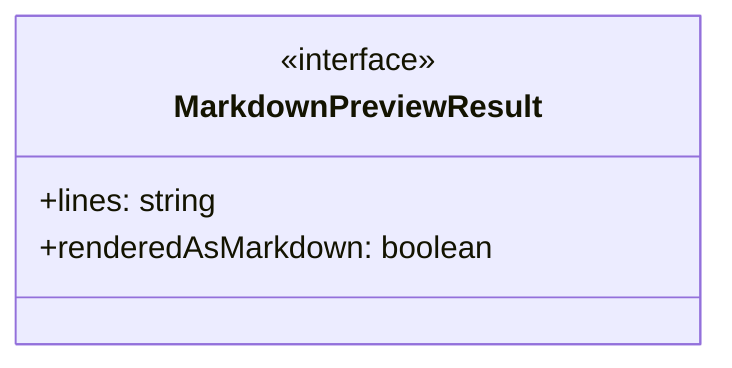
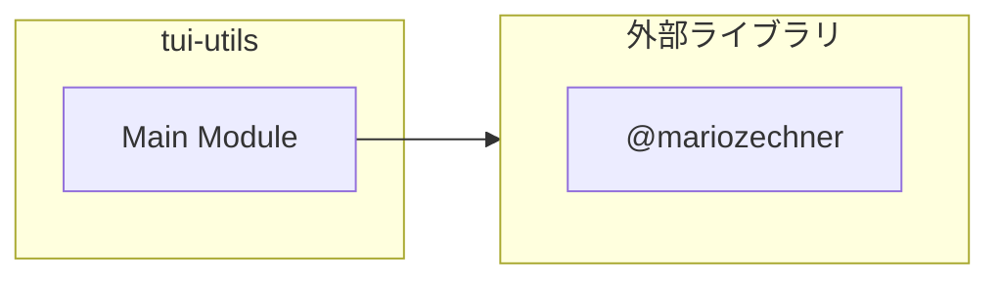
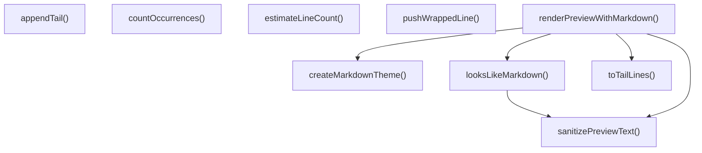
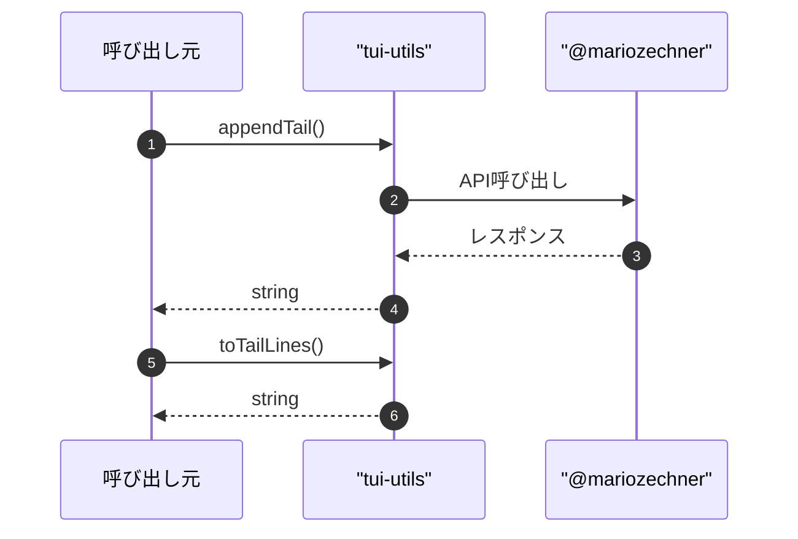

# tui-utils

## 概要

`tui-utils` モジュールのAPIリファレンス。

## インポート

```typescript
// from '@mariozechner/pi-tui': Markdown, truncateToWidth, MarkdownTheme, ...
```

## エクスポート一覧

| 種別 | 名前 | 説明 |
|------|------|------|
| 関数 | `appendTail` | チャンクを追加し長さ制御 |
| 関数 | `toTailLines` | 末尾の行を取得 |
| 関数 | `countOccurrences` | 出現回数を数える |
| 関数 | `estimateLineCount` | 行数を推定する |
| 関数 | `looksLikeMarkdown` | 行数を推定する |
| 関数 | `pushWrappedLine` | 1行テキストを幅に合わせて折り返し、出力配列へ追加する。 |
| 関数 | `renderPreviewWithMarkdown` | Markdown形式で描画 |
| インターフェース | `MarkdownPreviewResult` | Markdown描画結果 |

## 図解

### クラス図



### 依存関係図



### 関数フロー



### シーケンス図



## 関数

### sanitizePreviewText

```typescript
sanitizePreviewText(input: string): string
```

ANSIエスケープや制御文字を除去してプレビュー描画を安定化させる。
Markdownレンダラが制御シーケンスで失敗するケースを防ぐ。

**パラメータ**

| 名前 | 型 | 必須 |
|------|-----|------|
| input | `string` | はい |

**戻り値**: `string`

### appendTail

```typescript
appendTail(current: string, chunk: string, maxLength: any): string
```

チャンクを追加し長さ制御

**パラメータ**

| 名前 | 型 | 必須 |
|------|-----|------|
| current | `string` | はい |
| chunk | `string` | はい |
| maxLength | `any` | はい |

**戻り値**: `string`

### toTailLines

```typescript
toTailLines(tail: string, limit: number): string[]
```

末尾の行を取得

**パラメータ**

| 名前 | 型 | 必須 |
|------|-----|------|
| tail | `string` | はい |
| limit | `number` | はい |

**戻り値**: `string[]`

### countOccurrences

```typescript
countOccurrences(input: string, target: string): number
```

出現回数を数える

**パラメータ**

| 名前 | 型 | 必須 |
|------|-----|------|
| input | `string` | はい |
| target | `string` | はい |

**戻り値**: `number`

### estimateLineCount

```typescript
estimateLineCount(bytes: number, newlineCount: number, endsWithNewline: boolean): number
```

行数を推定する

**パラメータ**

| 名前 | 型 | 必須 |
|------|-----|------|
| bytes | `number` | はい |
| newlineCount | `number` | はい |
| endsWithNewline | `boolean` | はい |

**戻り値**: `number`

### looksLikeMarkdown

```typescript
looksLikeMarkdown(input: string): boolean
```

行数を推定する

**パラメータ**

| 名前 | 型 | 必須 |
|------|-----|------|
| input | `string` | はい |

**戻り値**: `boolean`

### createMarkdownTheme

```typescript
createMarkdownTheme(): MarkdownTheme
```

**戻り値**: `MarkdownTheme`

### passthrough

```typescript
passthrough(text: string): string
```

**パラメータ**

| 名前 | 型 | 必須 |
|------|-----|------|
| text | `string` | はい |

**戻り値**: `string`

### pushWrappedLine

```typescript
pushWrappedLine(output: string[], line: string, width: number): void
```

1行テキストを幅に合わせて折り返し、出力配列へ追加する。
ANSIカラーコードを保持したまま折り返す。

**パラメータ**

| 名前 | 型 | 必須 |
|------|-----|------|
| output | `string[]` | はい |
| line | `string` | はい |
| width | `number` | はい |

**戻り値**: `void`

### renderPreviewWithMarkdown

```typescript
renderPreviewWithMarkdown(text: string, width: number, maxLines: number): MarkdownPreviewResult
```

Markdown形式で描画

**パラメータ**

| 名前 | 型 | 必須 |
|------|-----|------|
| text | `string` | はい |
| width | `number` | はい |
| maxLines | `number` | はい |

**戻り値**: `MarkdownPreviewResult`

## インターフェース

### MarkdownPreviewResult

```typescript
interface MarkdownPreviewResult {
  lines: string[];
  renderedAsMarkdown: boolean;
}
```

Markdown描画結果

---
*自動生成: 2026-02-22T19:27:00.743Z*
