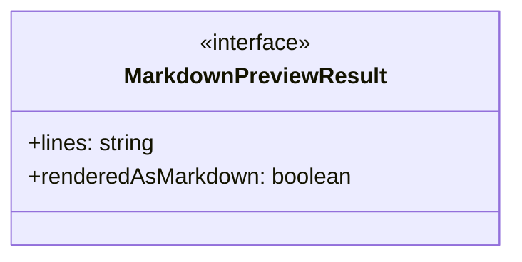
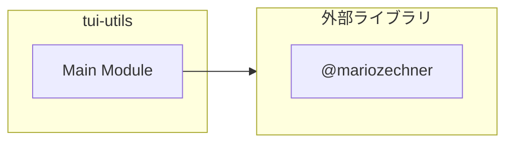
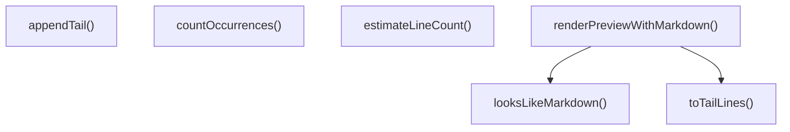
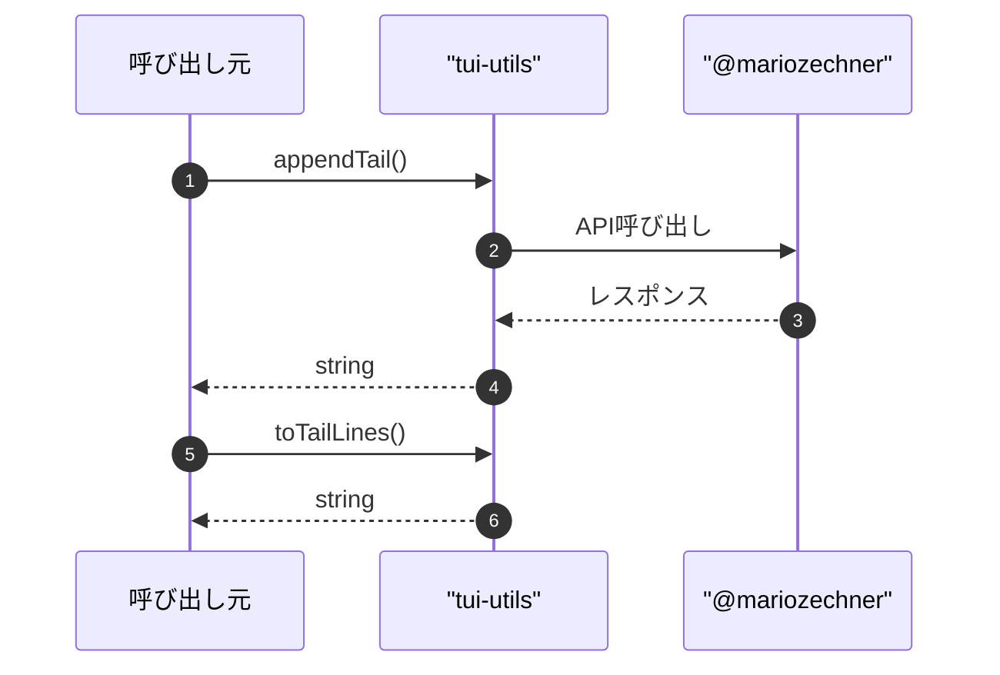

# tui-utils

## 概要

`tui-utils` モジュールのAPIリファレンス。

## インポート

```typescript
// from '@mariozechner/pi-tui': Markdown, getMarkdownTheme
```

## エクスポート一覧

| 種別 | 名前 | 説明 |
|------|------|------|
| 関数 | `appendTail` | 現在の末尾文字列にチャンクを追加し、最大長を制御する |
| 関数 | `toTailLines` | 末尾の空白除去と行数制限を行う |
| 関数 | `countOccurrences` | 文字列内の特定の文字列の出現回数を数える |
| 関数 | `estimateLineCount` | バイト数と改行数に基づき行数を推定 |
| 関数 | `looksLikeMarkdown` | Markdown形式の文字列か判定する |
| 関数 | `renderPreviewWithMarkdown` | Markdown形式でプレビューを描画する |
| インターフェース | `MarkdownPreviewResult` | マークダウンプレビューの結果を表します |

## 図解

### クラス図



### 依存関係図



### 関数フロー



### シーケンス図



## 関数

### appendTail

```typescript
appendTail(current: string, chunk: string, maxLength: any): string
```

現在の末尾文字列にチャンクを追加し、最大長を制御する

**パラメータ**

| 名前 | 型 | 必須 |
|------|-----|------|
| current | `string` | はい |
| chunk | `string` | はい |
| maxLength | `any` | はい |

**戻り値**: `string`

### toTailLines

```typescript
toTailLines(tail: string, limit: number): string[]
```

末尾の空白除去と行数制限を行う

**パラメータ**

| 名前 | 型 | 必須 |
|------|-----|------|
| tail | `string` | はい |
| limit | `number` | はい |

**戻り値**: `string[]`

### countOccurrences

```typescript
countOccurrences(input: string, target: string): number
```

文字列内の特定の文字列の出現回数を数える

**パラメータ**

| 名前 | 型 | 必須 |
|------|-----|------|
| input | `string` | はい |
| target | `string` | はい |

**戻り値**: `number`

### estimateLineCount

```typescript
estimateLineCount(bytes: number, newlineCount: number, endsWithNewline: boolean): number
```

バイト数と改行数に基づき行数を推定

**パラメータ**

| 名前 | 型 | 必須 |
|------|-----|------|
| bytes | `number` | はい |
| newlineCount | `number` | はい |
| endsWithNewline | `boolean` | はい |

**戻り値**: `number`

### looksLikeMarkdown

```typescript
looksLikeMarkdown(input: string): boolean
```

Markdown形式の文字列か判定する

**パラメータ**

| 名前 | 型 | 必須 |
|------|-----|------|
| input | `string` | はい |

**戻り値**: `boolean`

### renderPreviewWithMarkdown

```typescript
renderPreviewWithMarkdown(text: string, width: number, maxLines: number): MarkdownPreviewResult
```

Markdown形式でプレビューを描画する

**パラメータ**

| 名前 | 型 | 必須 |
|------|-----|------|
| text | `string` | はい |
| width | `number` | はい |
| maxLines | `number` | はい |

**戻り値**: `MarkdownPreviewResult`

## インターフェース

### MarkdownPreviewResult

```typescript
interface MarkdownPreviewResult {
  lines: string[];
  renderedAsMarkdown: boolean;
}
```

マークダウンプレビューの結果を表します

---
*自動生成: 2026-02-18T14:31:31.045Z*
