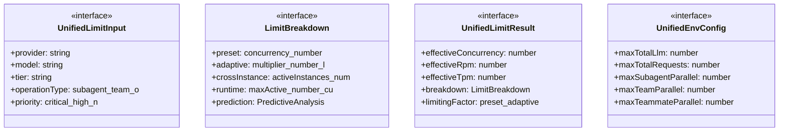
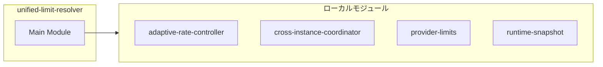
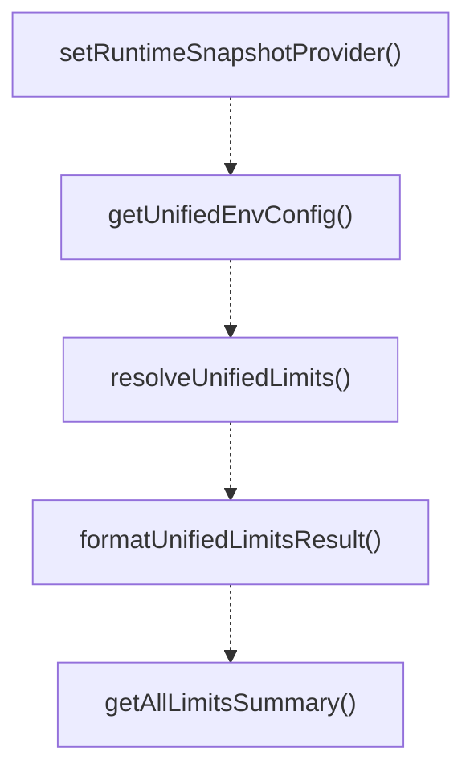
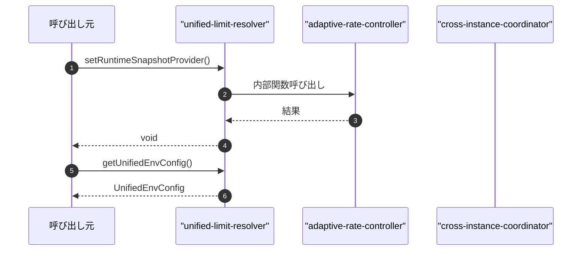

# unified-limit-resolver

## 概要

`unified-limit-resolver` モジュールのAPIリファレンス。

## インポート

```typescript
import { getEffectiveLimit, getPredictiveAnalysis, PredictiveAnalysis } from './adaptive-rate-controller.js';
import { getMyParallelLimit, getModelParallelLimit, getCoordinatorStatus... } from './cross-instance-coordinator.js';
import { resolveLimits, getConcurrencyLimit, getRpmLimit... } from './provider-limits.js';
import { IRuntimeSnapshot, RuntimeSnapshotProvider } from './interfaces/runtime-snapshot.js';
```

## エクスポート一覧

| 種別 | 名前 | 説明 |
|------|------|------|
| 関数 | `setRuntimeSnapshotProvider` | Set the runtime snapshot provider function. |
| 関数 | `getUnifiedEnvConfig` | 統合環境変数設定を取得 |
| 関数 | `resolveUnifiedLimits` | 統合制限解決のメイン関数 |
| 関数 | `formatUnifiedLimitsResult` | 制限解決結果をフォーマット |
| 関数 | `getAllLimitsSummary` | 全プロバイダーの制限サマリーを取得 |
| インターフェース | `UnifiedLimitInput` | 制限解決の入力パラメータ |
| インターフェース | `LimitBreakdown` | 各レイヤーの制限内訳 |
| インターフェース | `UnifiedLimitResult` | 制限解決の結果 |
| インターフェース | `UnifiedEnvConfig` | 統合環境変数設定 |

## 図解

### クラス図



### 依存関係図



### 関数フロー



### シーケンス図



## 関数

### setRuntimeSnapshotProvider

```typescript
setRuntimeSnapshotProvider(fn: RuntimeSnapshotProvider): void
```

Set the runtime snapshot provider function.
Called by extensions/agent-runtime.ts during initialization.

**パラメータ**

| 名前 | 型 | 必須 |
|------|-----|------|
| fn | `RuntimeSnapshotProvider` | はい |

**戻り値**: `void`

### getRuntimeSnapshot

```typescript
getRuntimeSnapshot(): IRuntimeSnapshot
```

Get runtime snapshot with fallback to default values.
Internal function used by resolveUnifiedLimits.

**戻り値**: `IRuntimeSnapshot`

### getUnifiedEnvConfig

```typescript
getUnifiedEnvConfig(): UnifiedEnvConfig
```

統合環境変数設定を取得

優先順位:
1. PI_LIMIT_* (新しい統一形式)
2. PI_AGENT_* (従来形式 - 後方互換性)
3. デフォルト値

**戻り値**: `UnifiedEnvConfig`

### resolveUnifiedLimits

```typescript
resolveUnifiedLimits(input: UnifiedLimitInput): UnifiedLimitResult
```

統合制限解決のメイン関数

制限計算チェーン:
1. プリセット制限を取得 (provider-limits)
2. 適応的調整を適用 (adaptive-rate-controller)
3. クロスインスタンス分散を適用 (cross-instance-coordinator)
4. ランタイム制約を適用 (環境変数 + 現在のアクティブ数)
5. 予測分析を追加 (オプション)

**パラメータ**

| 名前 | 型 | 必須 |
|------|-----|------|
| input | `UnifiedLimitInput` | はい |

**戻り値**: `UnifiedLimitResult`

### formatUnifiedLimitsResult

```typescript
formatUnifiedLimitsResult(result: UnifiedLimitResult): string
```

制限解決結果をフォーマット

**パラメータ**

| 名前 | 型 | 必須 |
|------|-----|------|
| result | `UnifiedLimitResult` | はい |

**戻り値**: `string`

### getAllLimitsSummary

```typescript
getAllLimitsSummary(): string
```

全プロバイダーの制限サマリーを取得

**戻り値**: `string`

## インターフェース

### UnifiedLimitInput

```typescript
interface UnifiedLimitInput {
  provider: string;
  model: string;
  tier?: string;
  operationType?: "subagent" | "team" | "orchestration" | "direct";
  priority?: "critical" | "high" | "normal" | "low" | "background";
}
```

制限解決の入力パラメータ

### LimitBreakdown

```typescript
interface LimitBreakdown {
  preset: {
    concurrency: number;
    rpm: number;
    tpm?: number;
    source: string;
    tier: string;
  };
  adaptive: {
    multiplier: number;
    learnedConcurrency: number;
    historical429s: number;
    predicted429Probability: number;
  };
  crossInstance: {
    activeInstances: number;
    myShare: number;
  };
  runtime: {
    maxActive: number;
    currentActive: number;
    available: number;
  };
  prediction?: PredictiveAnalysis;
}
```

各レイヤーの制限内訳

### UnifiedLimitResult

```typescript
interface UnifiedLimitResult {
  effectiveConcurrency: number;
  effectiveRpm: number;
  effectiveTpm?: number;
  breakdown: LimitBreakdown;
  limitingFactor: "preset" | "adaptive" | "cross_instance" | "runtime" | "env_override";
  limitingReason: string;
  metadata: {
    provider: string;
    model: string;
    tier: string;
    resolvedAt: string;
  };
}
```

制限解決の結果

### UnifiedEnvConfig

```typescript
interface UnifiedEnvConfig {
  maxTotalLlm: number;
  maxTotalRequests: number;
  maxSubagentParallel: number;
  maxTeamParallel: number;
  maxTeammateParallel: number;
  maxOrchestrationParallel: number;
  adaptiveEnabled: boolean;
  predictiveEnabled: boolean;
}
```

統合環境変数設定

---
*自動生成: 2026-02-18T00:15:35.781Z*
