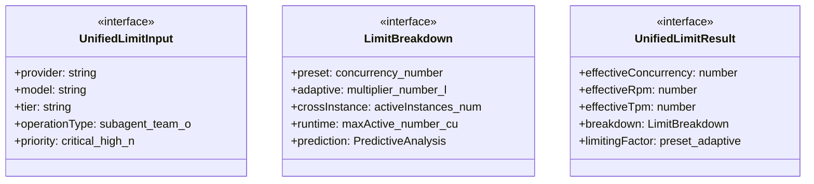
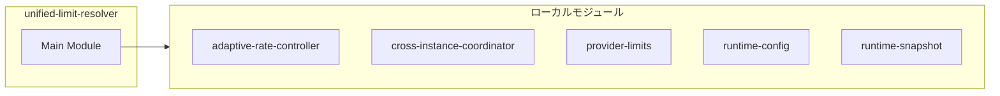
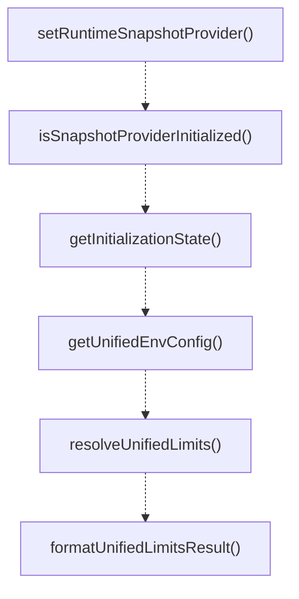
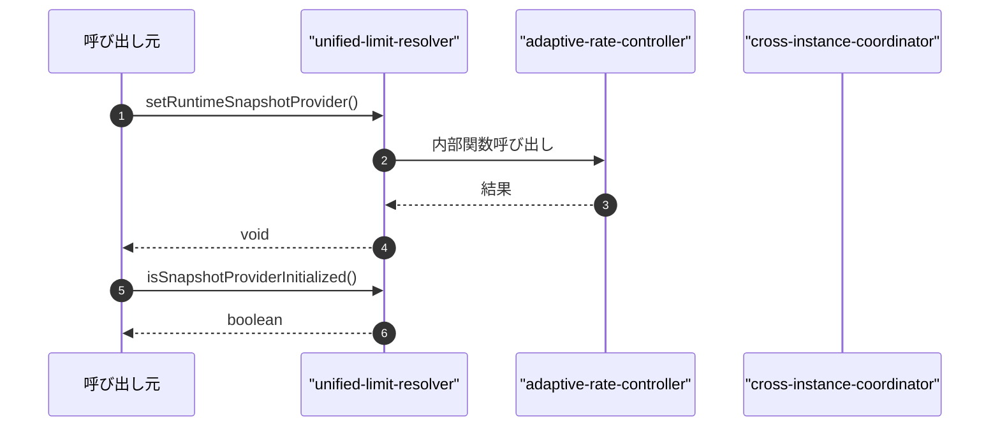

# unified-limit-resolver

## 概要

`unified-limit-resolver` モジュールのAPIリファレンス。

## インポート

```typescript
import { getEffectiveLimit, getPredictiveAnalysis, PredictiveAnalysis } from './adaptive-rate-controller.js';
import { getMyParallelLimit, getModelParallelLimit, getCoordinatorStatus... } from './cross-instance-coordinator.js';
import { resolveLimits, getConcurrencyLimit, getRpmLimit... } from './provider-limits.js';
import { getRuntimeConfig, validateConfigConsistency, RuntimeConfig } from './runtime-config.js';
import { IRuntimeSnapshot, RuntimeSnapshotProvider } from './interfaces/runtime-snapshot.js';
```

## エクスポート一覧

| 種別 | 名前 | 説明 |
|------|------|------|
| 関数 | `setRuntimeSnapshotProvider` | ランタイムスナップショットプロバイダを設定する。 |
| 関数 | `isSnapshotProviderInitialized` | ランタイムスナップショットプロバイダーが初期化済みか確認 |
| 関数 | `getInitializationState` | 初期化状態を取得する（診断用）。 |
| 関数 | `getUnifiedEnvConfig` | 統合環境設定を取得 |
| 関数 | `resolveUnifiedLimits` | 統合制限を解決する |
| 関数 | `formatUnifiedLimitsResult` | 制限解決結果を文字列としてフォーマットする |
| 関数 | `getAllLimitsSummary` | 全プロバイダーの制限サマリーを取得 |
| インターフェース | `UnifiedLimitInput` | 制限解決の入力パラメータ |
| インターフェース | `LimitBreakdown` | 各レイヤーの制限内訳 |
| インターフェース | `UnifiedLimitResult` | 制限解決の結果 |
| 型 | `UnifiedEnvConfig` | 下位互換用エイリアス。 |

## 図解

### クラス図



### 依存関係図



### 関数フロー



### シーケンス図



## 関数

### setRuntimeSnapshotProvider

```typescript
setRuntimeSnapshotProvider(fn: RuntimeSnapshotProvider): void
```

ランタイムスナップショットプロバイダを設定する。

**パラメータ**

| 名前 | 型 | 必須 |
|------|-----|------|
| fn | `RuntimeSnapshotProvider` | はい |

**戻り値**: `void`

### isSnapshotProviderInitialized

```typescript
isSnapshotProviderInitialized(): boolean
```

ランタイムスナップショットプロバイダーが初期化済みか確認

**戻り値**: `boolean`

### getInitializationState

```typescript
getInitializationState(): typeof _initializationState
```

初期化状態を取得する（診断用）。

**戻り値**: `typeof _initializationState`

### getRuntimeSnapshot

```typescript
getRuntimeSnapshot(): IRuntimeSnapshot
```

Get runtime snapshot with fallback to default values.
Internal function used by resolveUnifiedLimits.

If the snapshot provider is not initialized, logs a warning once
and returns default values (all zeros).

**戻り値**: `IRuntimeSnapshot`

### getUnifiedEnvConfig

```typescript
getUnifiedEnvConfig(): UnifiedEnvConfig
```

統合環境設定を取得

**戻り値**: `UnifiedEnvConfig`

### resolveUnifiedLimits

```typescript
resolveUnifiedLimits(input: UnifiedLimitInput): UnifiedLimitResult
```

統合制限を解決する

**パラメータ**

| 名前 | 型 | 必須 |
|------|-----|------|
| input | `UnifiedLimitInput` | はい |

**戻り値**: `UnifiedLimitResult`

### formatUnifiedLimitsResult

```typescript
formatUnifiedLimitsResult(result: UnifiedLimitResult): string
```

制限解決結果を文字列としてフォーマットする

**パラメータ**

| 名前 | 型 | 必須 |
|------|-----|------|
| result | `UnifiedLimitResult` | はい |

**戻り値**: `string`

### getAllLimitsSummary

```typescript
getAllLimitsSummary(): string
```

全プロバイダーの制限サマリーを取得

**戻り値**: `string`

## インターフェース

### UnifiedLimitInput

```typescript
interface UnifiedLimitInput {
  provider: string;
  model: string;
  tier?: string;
  operationType?: "subagent" | "team" | "orchestration" | "direct";
  priority?: "critical" | "high" | "normal" | "low" | "background";
}
```

制限解決の入力パラメータ

### LimitBreakdown

```typescript
interface LimitBreakdown {
  preset: {
    concurrency: number;
    rpm: number;
    tpm?: number;
    source: string;
    tier: string;
  };
  adaptive: {
    multiplier: number;
    learnedConcurrency: number;
    historical429s: number;
    predicted429Probability: number;
  };
  crossInstance: {
    activeInstances: number;
    myShare: number;
  };
  runtime: {
    maxActive: number;
    currentActive: number;
    available: number;
  };
  prediction?: PredictiveAnalysis;
}
```

各レイヤーの制限内訳

### UnifiedLimitResult

```typescript
interface UnifiedLimitResult {
  effectiveConcurrency: number;
  effectiveRpm: number;
  effectiveTpm?: number;
  breakdown: LimitBreakdown;
  limitingFactor: "preset" | "adaptive" | "cross_instance" | "runtime" | "env_override";
  limitingReason: string;
  metadata: {
    provider: string;
    model: string;
    tier: string;
    resolvedAt: string;
  };
}
```

制限解決の結果

## 型定義

### UnifiedEnvConfig

```typescript
type UnifiedEnvConfig = RuntimeConfig
```

下位互換用エイリアス。

---
*自動生成: 2026-02-18T07:17:30.515Z*
