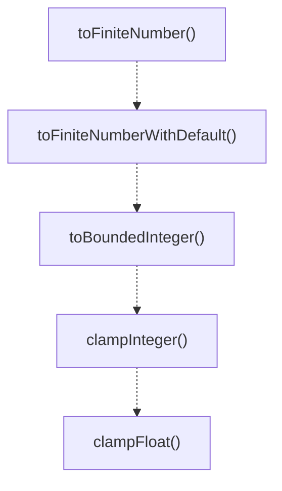

# validation-utils

## 概要

`validation-utils` モジュールのAPIリファレンス。

## エクスポート一覧

| 種別 | 名前 | 説明 |
|------|------|------|
| 関数 | `toFiniteNumber` | Converts an unknown value to a finite number. |
| 関数 | `toFiniteNumberWithDefault` | Converts an unknown value to a finite number with  |
| 関数 | `toBoundedInteger` | Validates and bounds an integer value. |
| 関数 | `clampInteger` | Clamps an integer value to the specified range. |
| 関数 | `clampFloat` | Clamps a float value to the specified range. |
| 型 | `BoundedIntegerResult` | Result type for bounded integer validation. |

## 図解

### 関数フロー



## 関数

### toFiniteNumber

```typescript
toFiniteNumber(value: unknown): number | undefined
```

Converts an unknown value to a finite number.
Returns undefined if the value is not a valid finite number.

**パラメータ**

| 名前 | 型 | 必須 |
|------|-----|------|
| value | `unknown` | はい |

**戻り値**: `number | undefined`

### toFiniteNumberWithDefault

```typescript
toFiniteNumberWithDefault(value: unknown, fallback: any): number
```

Converts an unknown value to a finite number with a default fallback.

**パラメータ**

| 名前 | 型 | 必須 |
|------|-----|------|
| value | `unknown` | はい |
| fallback | `any` | はい |

**戻り値**: `number`

### toBoundedInteger

```typescript
toBoundedInteger(value: unknown, fallback: number, min: number, max: number, field: string): BoundedIntegerResult
```

Validates and bounds an integer value.

**パラメータ**

| 名前 | 型 | 必須 |
|------|-----|------|
| value | `unknown` | はい |
| fallback | `number` | はい |
| min | `number` | はい |
| max | `number` | はい |
| field | `string` | はい |

**戻り値**: `BoundedIntegerResult`

### clampInteger

```typescript
clampInteger(value: number, min: number, max: number): number
```

Clamps an integer value to the specified range.
Uses Math.trunc to ensure integer result.

**パラメータ**

| 名前 | 型 | 必須 |
|------|-----|------|
| value | `number` | はい |
| min | `number` | はい |
| max | `number` | はい |

**戻り値**: `number`

### clampFloat

```typescript
clampFloat(value: number, min: number, max: number): number
```

Clamps a float value to the specified range.

**パラメータ**

| 名前 | 型 | 必須 |
|------|-----|------|
| value | `number` | はい |
| min | `number` | はい |
| max | `number` | はい |

**戻り値**: `number`

## 型定義

### BoundedIntegerResult

```typescript
type BoundedIntegerResult = | { ok: true; value: number }
  | { ok: false; error: string }
```

Result type for bounded integer validation.

---
*自動生成: 2026-02-17T21:54:59.849Z*
