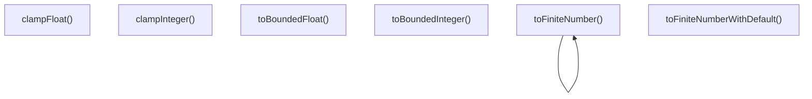

# validation-utils

## 概要

`validation-utils` モジュールのAPIリファレンス。

## エクスポート一覧

| 種別 | 名前 | 説明 |
|------|------|------|
| 関数 | `toFiniteNumber` | 有限数値を取得する |
| 関数 | `toFiniteNumberWithDefault` | 有限数値を取得する |
| 関数 | `toBoundedInteger` | 整数値の検証と範囲制限を行う |
| 関数 | `toBoundedFloat` | 浮動小数点数の検証と範囲制限を行う |
| 関数 | `clampInteger` | 整数値を指定範囲内に制限する |
| 関数 | `clampFloat` | 浮動小数点数を指定範囲内に制限する |
| 型 | `BoundedIntegerResult` | 整数値の範囲制限結果を表す型 |
| 型 | `BoundedFloatResult` | 浮動小数点数の範囲制限結果を表す型 |

## 図解

### 関数フロー



## 関数

### toFiniteNumber

```typescript
toFiniteNumber(value: unknown): number | undefined
```

有限数値を取得する

**パラメータ**

| 名前 | 型 | 必須 |
|------|-----|------|
| value | `unknown` | はい |

**戻り値**: `number | undefined`

### toFiniteNumberWithDefault

```typescript
toFiniteNumberWithDefault(value: unknown, fallback: any): number
```

有限数値を取得する

**パラメータ**

| 名前 | 型 | 必須 |
|------|-----|------|
| value | `unknown` | はい |
| fallback | `any` | はい |

**戻り値**: `number`

### toBoundedInteger

```typescript
toBoundedInteger(value: unknown, fallback: number, min: number, max: number, field: string): BoundedIntegerResult
```

整数値の検証と範囲制限を行う

**パラメータ**

| 名前 | 型 | 必須 |
|------|-----|------|
| value | `unknown` | はい |
| fallback | `number` | はい |
| min | `number` | はい |
| max | `number` | はい |
| field | `string` | はい |

**戻り値**: `BoundedIntegerResult`

### toBoundedFloat

```typescript
toBoundedFloat(value: unknown, fallback: number, min: number, max: number, field: string): BoundedFloatResult
```

浮動小数点数の検証と範囲制限を行う

**パラメータ**

| 名前 | 型 | 必須 |
|------|-----|------|
| value | `unknown` | はい |
| fallback | `number` | はい |
| min | `number` | はい |
| max | `number` | はい |
| field | `string` | はい |

**戻り値**: `BoundedFloatResult`

### clampInteger

```typescript
clampInteger(value: number, min: number, max: number): number
```

整数値を指定範囲内に制限する

**パラメータ**

| 名前 | 型 | 必須 |
|------|-----|------|
| value | `number` | はい |
| min | `number` | はい |
| max | `number` | はい |

**戻り値**: `number`

### clampFloat

```typescript
clampFloat(value: number, min: number, max: number): number
```

浮動小数点数を指定範囲内に制限する

**パラメータ**

| 名前 | 型 | 必須 |
|------|-----|------|
| value | `number` | はい |
| min | `number` | はい |
| max | `number` | はい |

**戻り値**: `number`

## 型定義

### BoundedIntegerResult

```typescript
type BoundedIntegerResult = | { ok: true; value: number }
  | { ok: false; error: string }
```

整数値の範囲制限結果を表す型

### BoundedFloatResult

```typescript
type BoundedFloatResult = | { ok: true; value: number }
  | { ok: false; error: string }
```

浮動小数点数の範囲制限結果を表す型

---
*自動生成: 2026-02-22T19:27:00.745Z*
