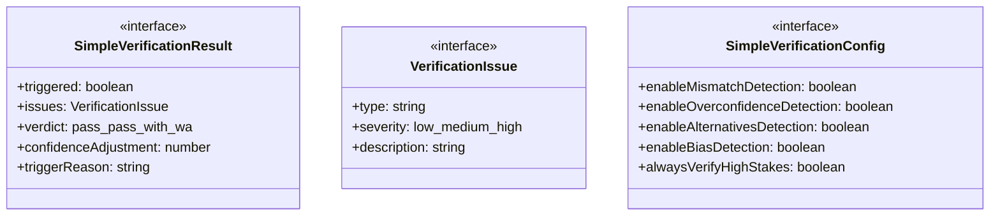
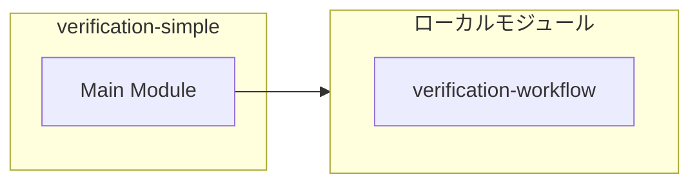
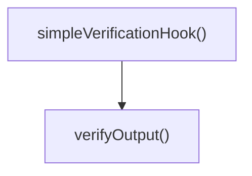
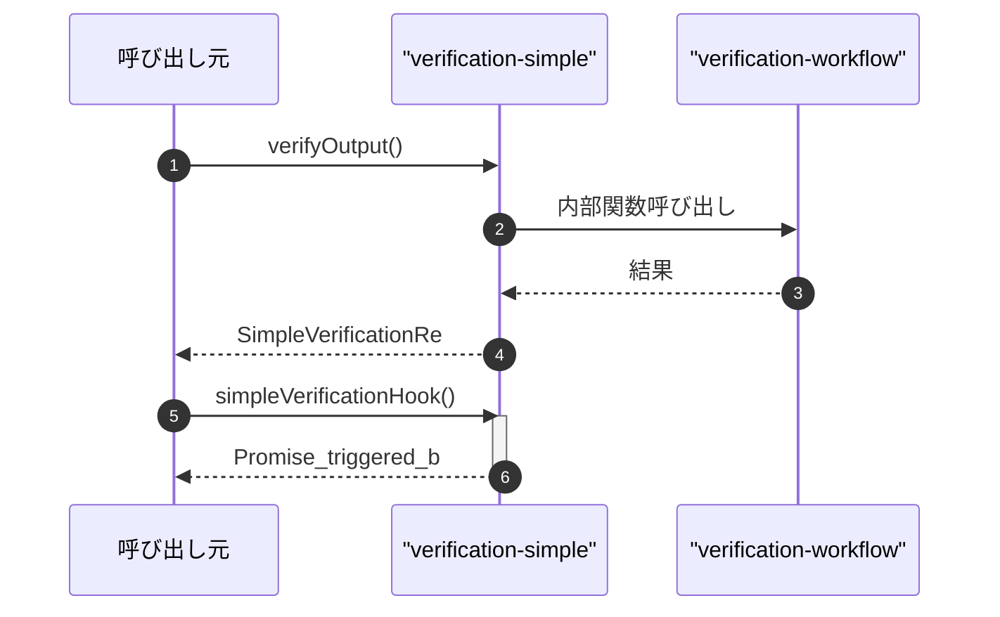

# verification-simple

## 概要

`verification-simple` モジュールのAPIリファレンス。

## インポート

```typescript
// from './verification-workflow.js': detectClaimResultMismatch, detectOverconfidence, detectMissingAlternatives, ...
```

## エクスポート一覧

| 種別 | 名前 | 説明 |
|------|------|------|
| 関数 | `verifyOutput` | 出力を簡易検証する |
| 関数 | `simpleVerificationHook` | サブエージェント/チーム実行後の簡易検証フック |
| インターフェース | `SimpleVerificationResult` | 簡易検証結果 |
| インターフェース | `VerificationIssue` | 検出された問題 |
| インターフェース | `SimpleVerificationConfig` | 簡易検証設定 |

## 図解

### クラス図



### 依存関係図



### 関数フロー



### シーケンス図



## 関数

### verifyOutput

```typescript
verifyOutput(output: string, confidence: number, context: VerificationContext, config: Partial<SimpleVerificationConfig>): SimpleVerificationResult
```

出力を簡易検証する

**パラメータ**

| 名前 | 型 | 必須 |
|------|-----|------|
| output | `string` | はい |
| confidence | `number` | はい |
| context | `VerificationContext` | はい |
| config | `Partial<SimpleVerificationConfig>` | はい |

**戻り値**: `SimpleVerificationResult`

### simpleVerificationHook

```typescript
async simpleVerificationHook(output: string, confidence: number, context: VerificationContext): Promise<{
  triggered: boolean;
  result?: SimpleVerificationResult;
  error?: string;
}>
```

サブエージェント/チーム実行後の簡易検証フック

**パラメータ**

| 名前 | 型 | 必須 |
|------|-----|------|
| output | `string` | はい |
| confidence | `number` | はい |
| context | `VerificationContext` | はい |

**戻り値**: `Promise<{
  triggered: boolean;
  result?: SimpleVerificationResult;
  error?: string;
}>`

## インターフェース

### SimpleVerificationResult

```typescript
interface SimpleVerificationResult {
  triggered: boolean;
  issues: VerificationIssue[];
  verdict: "pass" | "pass-with-warnings" | "needs-review" | "blocked";
  confidenceAdjustment: number;
  triggerReason: string;
}
```

簡易検証結果

### VerificationIssue

```typescript
interface VerificationIssue {
  type: string;
  severity: "low" | "medium" | "high";
  description: string;
}
```

検出された問題

### SimpleVerificationConfig

```typescript
interface SimpleVerificationConfig {
  enableMismatchDetection: boolean;
  enableOverconfidenceDetection: boolean;
  enableAlternativesDetection: boolean;
  enableBiasDetection: boolean;
  alwaysVerifyHighStakes: boolean;
  skipThreshold: number;
}
```

簡易検証設定

---
*自動生成: 2026-02-22T18:55:29.040Z*
