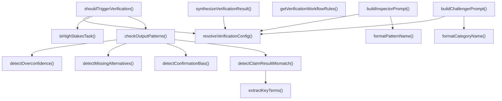

# verification-workflow

## 概要

`verification-workflow` モジュールのAPIリファレンス。

## エクスポート一覧

| 種別 | 名前 | 説明 |
|------|------|------|
| 関数 | `shouldTriggerVerification` | 検証が必要か判断 |
| 関数 | `isHighStakesTask` | 高リスクタスク判定 |
| 関数 | `resolveVerificationConfig` | 検証設定を解決 |
| 関数 | `buildInspectorPrompt` | 検査用プロンプトを構築 |
| 関数 | `buildChallengerPrompt` | 挑戦者用プロンプトを作成する |
| 関数 | `synthesizeVerificationResult` | 検証結果を統合する |
| 関数 | `getVerificationWorkflowRules` | ワークフールールを取得する |
| インターフェース | `VerificationWorkflowConfig` | 検証ワークフローの設定 |
| インターフェース | `ChallengerConfig` | チャレンジャー設定インターフェース |
| インターフェース | `InspectorConfig` | 検査者の設定 |
| インターフェース | `VerificationResult` | 検証結果を表す |
| インターフェース | `InspectorOutput` | 検査官の結果出力を表す |
| インターフェース | `DetectedPattern` | 検出されたパターンを表す |
| インターフェース | `ChallengerOutput` | 検証の結果出力を表す |
| インターフェース | `ChallengedClaim` | 挑戦された主張を表す |
| インターフェース | `VerificationContext` | 検証のコンテキスト情報 |
| 型 | `VerificationTriggerMode` | 検証トリガーのモード定義 |
| 型 | `FallbackBehavior` | フォールバック時の動作方針 |
| 型 | `ChallengeCategory` | チャレンジのカテゴリ |
| 型 | `SuspicionThreshold` | 疑わしさの閾値レベル |
| 型 | `InspectionPattern` | 検査パターン定義 |
| 型 | `VerificationVerdict` | 検証の最終判定結果 |

## 図解

### クラス図

```mermaid
classDiagram
  class VerificationWorkflowConfig {
    <<interface>>
    +enabled: boolean
    +triggerModes: VerificationTriggerM
    +challengerConfig: ChallengerConfig
    +inspectorConfig: InspectorConfig
    +fallbackBehavior: FallbackBehavior
  }
  class ChallengerConfig {
    <<interface>>
    +minConfidenceToChallenge: number
    +requiredFlaws: number
    +enabledCategories: ChallengeCategory
  }
  class InspectorConfig {
    <<interface>>
    +suspicionThreshold: SuspicionThreshold
    +requiredPatterns: InspectionPattern
    +autoTriggerOnCollapseSignals: boolean
  }
  class VerificationResult {
    <<interface>>
    +triggered: boolean
    +triggerReason: string
    +inspectorOutput: InspectorOutput
    +challengerOutput: ChallengerOutput
    +finalVerdict: VerificationVerdict
  }
  class InspectorOutput {
    <<interface>>
    +suspicionLevel: SuspicionThreshold
    +detectedPatterns: DetectedPattern
    +summary: string
    +recommendation: string
  }
  class DetectedPattern {
    <<interface>>
    +pattern: InspectionPattern
    +location: string
    +severity: low_medium_high
    +description: string
  }
  class ChallengerOutput {
    <<interface>>
    +challengedClaims: ChallengedClaim
    +overallSeverity: minor_moderate
    +summary: string
    +suggestedRevisions: string
  }
  class ChallengedClaim {
    <<interface>>
    +claim: string
    +flaw: string
    +evidenceGap: string
    +alternative: string
    +boundaryFailure: string
  }
  class VerificationContext {
    <<interface>>
    +task: string
    +triggerMode: post_subagent_pos
    +agentId: string
    +teamId: string
    +previousVerifications: number
  }
```



### 関数フロー



## 関数

### shouldTriggerVerification

```typescript
shouldTriggerVerification(output: string, confidence: number, context: VerificationContext): { trigger: boolean; reason: string }
```

検証が必要か判断

**パラメータ**

| 名前 | 型 | 必須 |
|------|-----|------|
| output | `string` | はい |
| confidence | `number` | はい |
| context | `VerificationContext` | はい |

**戻り値**: `{ trigger: boolean; reason: string }`

### checkOutputPatterns

```typescript
checkOutputPatterns(output: string, config: VerificationWorkflowConfig): { trigger: boolean; reason: string }
```

出力パターンをチェック

**パラメータ**

| 名前 | 型 | 必須 |
|------|-----|------|
| output | `string` | はい |
| config | `VerificationWorkflowConfig` | はい |

**戻り値**: `{ trigger: boolean; reason: string }`

### detectClaimResultMismatch

```typescript
detectClaimResultMismatch(output: string): { detected: boolean; reason: string }
```

CLAIM-RESULT不一致を検出
単純な単語重複ではなく、意味的な構造を分析

**パラメータ**

| 名前 | 型 | 必須 |
|------|-----|------|
| output | `string` | はい |

**戻り値**: `{ detected: boolean; reason: string }`

### extractKeyTerms

```typescript
extractKeyTerms(text: string): string[]
```

テキストから重要な用語を抽出（簡易版）

**パラメータ**

| 名前 | 型 | 必須 |
|------|-----|------|
| text | `string` | はい |

**戻り値**: `string[]`

### detectOverconfidence

```typescript
detectOverconfidence(output: string): { detected: boolean; reason: string }
```

過信を検出

**パラメータ**

| 名前 | 型 | 必須 |
|------|-----|------|
| output | `string` | はい |

**戻り値**: `{ detected: boolean; reason: string }`

### detectMissingAlternatives

```typescript
detectMissingAlternatives(output: string): { detected: boolean; reason: string }
```

代替解釈の欠如を検出

**パラメータ**

| 名前 | 型 | 必須 |
|------|-----|------|
| output | `string` | はい |

**戻り値**: `{ detected: boolean; reason: string }`

### detectConfirmationBias

```typescript
detectConfirmationBias(output: string): { detected: boolean; reason: string }
```

確認バイアスパターンを検出

**パラメータ**

| 名前 | 型 | 必須 |
|------|-----|------|
| output | `string` | はい |

**戻り値**: `{ detected: boolean; reason: string }`

### isHighStakesTask

```typescript
isHighStakesTask(task: string): boolean
```

高リスクタスク判定

**パラメータ**

| 名前 | 型 | 必須 |
|------|-----|------|
| task | `string` | はい |

**戻り値**: `boolean`

### resolveVerificationConfig

```typescript
resolveVerificationConfig(): VerificationWorkflowConfig
```

検証設定を解決

**戻り値**: `VerificationWorkflowConfig`

### buildInspectorPrompt

```typescript
buildInspectorPrompt(targetOutput: string, context: VerificationContext): string
```

検査用プロンプトを構築

**パラメータ**

| 名前 | 型 | 必須 |
|------|-----|------|
| targetOutput | `string` | はい |
| context | `VerificationContext` | はい |

**戻り値**: `string`

### buildChallengerPrompt

```typescript
buildChallengerPrompt(targetOutput: string, context: VerificationContext): string
```

挑戦者用プロンプトを作成する

**パラメータ**

| 名前 | 型 | 必須 |
|------|-----|------|
| targetOutput | `string` | はい |
| context | `VerificationContext` | はい |

**戻り値**: `string`

### synthesizeVerificationResult

```typescript
synthesizeVerificationResult(originalOutput: string, originalConfidence: number, inspectorOutput: InspectorOutput | undefined, challengerOutput: ChallengerOutput | undefined, context: VerificationContext): VerificationResult
```

検証結果を統合する

**パラメータ**

| 名前 | 型 | 必須 |
|------|-----|------|
| originalOutput | `string` | はい |
| originalConfidence | `number` | はい |
| inspectorOutput | `InspectorOutput | undefined` | はい |
| challengerOutput | `ChallengerOutput | undefined` | はい |
| context | `VerificationContext` | はい |

**戻り値**: `VerificationResult`

### formatPatternName

```typescript
formatPatternName(pattern: InspectionPattern): string
```

パターン名をフォーマット

**パラメータ**

| 名前 | 型 | 必須 |
|------|-----|------|
| pattern | `InspectionPattern` | はい |

**戻り値**: `string`

### formatCategoryName

```typescript
formatCategoryName(category: ChallengeCategory): string
```

カテゴリ名をフォーマット

**パラメータ**

| 名前 | 型 | 必須 |
|------|-----|------|
| category | `ChallengeCategory` | はい |

**戻り値**: `string`

### getVerificationWorkflowRules

```typescript
getVerificationWorkflowRules(): string
```

ワークフールールを取得する

**戻り値**: `string`

## インターフェース

### VerificationWorkflowConfig

```typescript
interface VerificationWorkflowConfig {
  enabled: boolean;
  triggerModes: VerificationTriggerMode[];
  challengerConfig: ChallengerConfig;
  inspectorConfig: InspectorConfig;
  fallbackBehavior: FallbackBehavior;
  maxVerificationDepth: number;
  minConfidenceToSkipVerification: number;
}
```

検証ワークフローの設定

### ChallengerConfig

```typescript
interface ChallengerConfig {
  minConfidenceToChallenge: number;
  requiredFlaws: number;
  enabledCategories: ChallengeCategory[];
}
```

チャレンジャー設定インターフェース

### InspectorConfig

```typescript
interface InspectorConfig {
  suspicionThreshold: SuspicionThreshold;
  requiredPatterns: InspectionPattern[];
  autoTriggerOnCollapseSignals: boolean;
}
```

検査者の設定

### VerificationResult

```typescript
interface VerificationResult {
  triggered: boolean;
  triggerReason: string;
  inspectorOutput?: InspectorOutput;
  challengerOutput?: ChallengerOutput;
  finalVerdict: VerificationVerdict;
  confidence: number;
  requiresReRun: boolean;
  warnings: string[];
}
```

検証結果を表す

### InspectorOutput

```typescript
interface InspectorOutput {
  suspicionLevel: SuspicionThreshold;
  detectedPatterns: DetectedPattern[];
  summary: string;
  recommendation: string;
}
```

検査官の結果出力を表す

### DetectedPattern

```typescript
interface DetectedPattern {
  pattern: InspectionPattern;
  location: string;
  severity: "low" | "medium" | "high";
  description: string;
}
```

検出されたパターンを表す

### ChallengerOutput

```typescript
interface ChallengerOutput {
  challengedClaims: ChallengedClaim[];
  overallSeverity: "minor" | "moderate" | "critical";
  summary: string;
  suggestedRevisions: string[];
}
```

検証の結果出力を表す

### ChallengedClaim

```typescript
interface ChallengedClaim {
  claim: string;
  flaw: string;
  evidenceGap: string;
  alternative: string;
  boundaryFailure?: string;
  severity: "minor" | "moderate" | "critical";
}
```

挑戦された主張を表す

### VerificationContext

```typescript
interface VerificationContext {
  task: string;
  triggerMode: "post-subagent" | "post-team" | "explicit" | "low-confidence" | "high-stakes";
  agentId?: string;
  teamId?: string;
  previousVerifications?: number;
}
```

検証のコンテキスト情報

## 型定義

### VerificationTriggerMode

```typescript
type VerificationTriggerMode = | "post-subagent"     // サブエージェント実行後
  | "post-team"         // チーム実行後
  | "low-confidence"    // 低信頼度時
  | "explicit"          // 明示的な要求時
  | "high-stakes"
```

検証トリガーのモード定義

### FallbackBehavior

```typescript
type FallbackBehavior = | "warn"              // 警告のみ
  | "block"             // ブロックして再実行
  | "auto-reject"
```

フォールバック時の動作方針

### ChallengeCategory

```typescript
type ChallengeCategory = | "evidence-gap"      // 証拠の欠落
  | "logical-flaw"      // 論理的欠陥
  | "assumption"        // 隠れた仮定
  | "alternative"       // 代替解釈の未考慮
  | "boundary"          // 境界条件の未考慮
  | "causal-reversal"
```

チャレンジのカテゴリ

### SuspicionThreshold

```typescript
type SuspicionThreshold = "low" | "medium" | "high"
```

疑わしさの閾値レベル

### InspectionPattern

```typescript
type InspectionPattern = | "claim-result-mismatch"    // CLAIMとRESULTの不一致
  | "evidence-confidence-gap"  // 証拠と信頼度のミスマッチ
  | "missing-alternatives"     // 代替解釈の欠如
  | "causal-reversal"          // 因果の逆転
  | "confirmation-bias"        // 確認バイアスの兆候
  | "overconfidence"           // 過信（証拠に対して高すぎる信頼度）
  | "incomplete-reasoning"
```

検査パターン定義

### VerificationVerdict

```typescript
type VerificationVerdict = | "pass"              // 検証通過
  | "pass-with-warnings" // 警告付き通過
  | "needs-review"      // 人間のレビューが必要
  | "fail"              // 検証失敗
  | "blocked"
```

検証の最終判定結果

---
*自動生成: 2026-02-18T18:06:17.594Z*
