# verification-workflow

## 概要

`verification-workflow` モジュールのAPIリファレンス。

## エクスポート一覧

| 種別 | 名前 | 説明 |
|------|------|------|
| 関数 | `shouldTriggerVerification` | 検証が必要か判断 |
| 関数 | `detectClaimResultMismatch` | CLAIM-RESULT不一致を検出 |
| 関数 | `detectOverconfidence` | 過信を検出 |
| 関数 | `detectMissingAlternatives` | 代替解釈の欠如を検出 |
| 関数 | `detectConfirmationBias` | 確認バイアスパターンを検出 |
| 関数 | `isHighStakesTask` | 高リスクタスク判定 |
| 関数 | `resolveVerificationConfig` | 検証設定を解決 |
| 関数 | `buildInspectorPrompt` | 検査用プロンプトを構築 |
| 関数 | `buildChallengerPrompt` | 挑戦者用プロンプトを作成する |
| 関数 | `synthesizeVerificationResult` | 検証結果を統合する |
| 関数 | `getVerificationWorkflowRules` | ワークフールールを取得する |
| 関数 | `runMetacognitiveCheck` | - |
| 関数 | `detectInnerFascism` | - |
| 関数 | `detectBinaryOppositions` | - |
| 関数 | `parseInferenceChain` | 推論チェーンを解析する |
| 関数 | `detectAporiaAvoidanceTemptation` | - |
| 関数 | `generateMetacognitiveSummary` | - |
| 関数 | `generateImprovementActions` | メタ認知チェック結果から改善アクションを生成する |
| 関数 | `formatActionsAsPromptInstructions` | 改善アクションを実行可能なプロンプト指示に変換する |
| 関数 | `runIntegratedMetacognitiveAnalysis` | メタ認知チェックと改善アクションを統合的に実行 |
| 関数 | `generateActionsFromDetection` | 統合検出結果から改善アクションを生成（信頼度考慮版） |
| 関数 | `analyzeThinkingMode` | 思考モードを詳細に分析する |
| 関数 | `runIntegratedThinkingAnalysis` | 思考モード分析を統合メタ認知チェックに組み込む |
| 関数 | `extractCandidates` | 正規表現で候補を抽出する |
| 関数 | `applyContextFilter` | 候補にコンテキストフィルタを適用する |
| 関数 | `generateFilterStats` | フィルタリング統計を生成 |
| 関数 | `generateLLMVerificationPrompt` | LLM判定用のプロンプトを生成する |
| 関数 | `parseLLMVerificationResponse` | LLM判定結果をパースする |
| 関数 | `runIntegratedDetection` | 統合検出を実行（パターンマッチングのみ） |
| 関数 | `runLLMEnhancedDetection` | LLM拡張メタ認知チェックを実行 |
| インターフェース | `VerificationWorkflowConfig` | 検証ワークフローの設定 |
| インターフェース | `ChallengerConfig` | チャレンジャー設定インターフェース |
| インターフェース | `InspectorConfig` | 検査者の設定 |
| インターフェース | `VerificationResult` | 検証結果を表す |
| インターフェース | `InspectorOutput` | 検査官の結果出力を表す |
| インターフェース | `DetectedPattern` | 検出されたパターンを表す |
| インターフェース | `ChallengerOutput` | 検証の結果出力を表す |
| インターフェース | `ChallengedClaim` | 挑戦された主張を表す |
| インターフェース | `VerificationContext` | 検証のコンテキスト情報 |
| インターフェース | `AporiaDetection` | アポリア検出結果 |
| インターフェース | `FallacyDetection` | 誤謬検出結果 |
| インターフェース | `MetacognitiveCheck` | メタ認知チェック結果 |
| インターフェース | `InferenceChain` | 推論チェーンを表すインターフェース |
| インターフェース | `InferenceStep` | 個別の推論ステップ |
| インターフェース | `ImprovementAction` | 改善アクションを表すインターフェース |
| インターフェース | `ThinkingModeAnalysis` | 思考モード分析結果 |
| インターフェース | `CandidateDetection` | 候補検出結果（正規表現ベース） |
| インターフェース | `LLMVerificationRequest` | LLM判定リクエスト |
| インターフェース | `LLMVerificationResult` | LLM判定結果 |
| インターフェース | `IntegratedVerificationResult` | 統合判定結果 |
| 型 | `VerificationTriggerMode` | 検証トリガーのモード定義 |
| 型 | `FallbackBehavior` | フォールバック時の動作方針 |
| 型 | `ChallengeCategory` | チャレンジのカテゴリ |
| 型 | `SuspicionThreshold` | 疑わしさの閾値レベル |
| 型 | `InspectionPattern` | 検査パターン定義 |
| 型 | `VerificationVerdict` | 検証の最終判定結果 |
| 型 | `AporiaType` | アポリアタイプ |
| 型 | `ThinkingHat` | ド・ボノの6つの思考帽子 |
| 型 | `ThinkingSystem` | カーネマンの思考システム |
| 型 | `BloomLevel` | ブルームのタキソノミー（認知領域） |

## 図解

### クラス図

```mermaid
classDiagram
  class VerificationWorkflowConfig {
    <<interface>>
    +enabled: boolean
    +triggerModes: VerificationTriggerM
    +challengerConfig: ChallengerConfig
    +inspectorConfig: InspectorConfig
    +fallbackBehavior: FallbackBehavior
  }
  class ChallengerConfig {
    <<interface>>
    +minConfidenceToChallenge: number
    +requiredFlaws: number
    +enabledCategories: ChallengeCategory
  }
  class InspectorConfig {
    <<interface>>
    +suspicionThreshold: SuspicionThreshold
    +requiredPatterns: InspectionPattern
    +autoTriggerOnCollapseSignals: boolean
  }
  class VerificationResult {
    <<interface>>
    +triggered: boolean
    +triggerReason: string
    +inspectorOutput: InspectorOutput
    +challengerOutput: ChallengerOutput
    +finalVerdict: VerificationVerdict
  }
  class InspectorOutput {
    <<interface>>
    +suspicionLevel: SuspicionThreshold
    +detectedPatterns: DetectedPattern
    +summary: string
    +recommendation: string
  }
  class DetectedPattern {
    <<interface>>
    +pattern: InspectionPattern
    +location: string
    +severity: low_medium_high
    +description: string
  }
  class ChallengerOutput {
    <<interface>>
    +challengedClaims: ChallengedClaim
    +overallSeverity: minor_moderate
    +summary: string
    +suggestedRevisions: string
  }
  class ChallengedClaim {
    <<interface>>
    +claim: string
    +flaw: string
    +evidenceGap: string
    +alternative: string
    +boundaryFailure: string
  }
  class VerificationContext {
    <<interface>>
    +task: string
    +triggerMode: post_subagent_pos
    +agentId: string
    +teamId: string
    +previousVerifications: number
  }
  class AporiaDetection {
    <<interface>>
    +type: AporiaType
    +pole1: concept_string_valu
    +pole2: concept_string_valu
    +tensionLevel: number
    +description: string
  }
  class FallacyDetection {
    <<interface>>
    +type: string
    +location: string
    +description: string
    +correction: string
  }
  class MetacognitiveCheck {
    <<interface>>
    +deconstruction: binaryOppositions_s
    +schizoAnalysis: desireProduction_st
    +eudaimonia: excellencePursuit_s
    +utopiaDystopia: worldBeingCreated_s
    +philosophyOfThought: isThinking_boolean
  }
  class InferenceChain {
    <<interface>>
    +premises: string
    +steps: InferenceStep
    +conclusion: string
    +validity: valid_invalid_u
    +gaps: string
  }
  class InferenceStep {
    <<interface>>
    +stepNumber: number
    +input: string
    +inferenceType: deductive_inducti
    +output: string
    +isValid: boolean
  }
  class ImprovementAction {
    <<interface>>
    +category: deconstruction_sc
    +priority: T1_2_3_4_5
    +issue: string
    +action: string
    +expectedOutcome: string
  }
  class ThinkingModeAnalysis {
    <<interface>>
    +primaryHat: ThinkingHat
    +detectedHats: Array_hat_ThinkingH
    +thinkingSystem: ThinkingSystem
    +system2Indicators: string
    +bloomLevel: BloomLevel
  }
  class CandidateDetection {
    <<interface>>
    +type: string
    +matchedText: string
    +location: start_number_end_nu
    +context: string
    +patternConfidence: number
  }
  class LLMVerificationRequest {
    <<interface>>
    +candidate: CandidateDetection
    +fullText: string
    +taskContext: string
    +verificationType: fallacy_binary_op
  }
  class LLMVerificationResult {
    <<interface>>
    +candidate: CandidateDetection
    +verdict: confirmed_rejecte
    +confidence: number
    +reasoning: string
    +contextualFactors: string
  }
  class IntegratedVerificationResult {
    <<interface>>
    +candidates: CandidateDetection
    +llmResults: LLMVerificationResul
    +finalVerdict: confirmed_rejecte
    +overallConfidence: number
    +method: pattern_only_llm
  }
  class ExclusionRule {
    <<interface>>
    +name: string
    +targetType: string
    +condition: RegExp
    +reason: string
    +confidenceAdjustment: number
  }
  class ContextBoostRule {
    <<interface>>
    +name: string
    +targetType: string
    +condition: RegExp
    +reason: string
    +boost: number
  }
```



### 関数フロー


### シーケンス図


## 関数

### shouldTriggerVerification

```typescript
shouldTriggerVerification(output: string, confidence: number, context: VerificationContext): { trigger: boolean; reason: string }
```

検証が必要か判断

**パラメータ**

| 名前 | 型 | 必須 |
|------|-----|------|
| output | `string` | はい |
| confidence | `number` | はい |
| context | `VerificationContext` | はい |

**戻り値**: `{ trigger: boolean; reason: string }`

### checkOutputPatterns

```typescript
checkOutputPatterns(output: string, config: VerificationWorkflowConfig): { trigger: boolean; reason: string }
```

出力パターンをチェック

**パラメータ**

| 名前 | 型 | 必須 |
|------|-----|------|
| output | `string` | はい |
| config | `VerificationWorkflowConfig` | はい |

**戻り値**: `{ trigger: boolean; reason: string }`

### detectClaimResultMismatch

```typescript
detectClaimResultMismatch(output: string): { detected: boolean; reason: string }
```

CLAIM-RESULT不一致を検出
単純な単語重複ではなく、意味的な構造を分析

**パラメータ**

| 名前 | 型 | 必須 |
|------|-----|------|
| output | `string` | はい |

**戻り値**: `{ detected: boolean; reason: string }`

### extractKeyTerms

```typescript
extractKeyTerms(text: string): string[]
```

テキストから重要な用語を抽出（簡易版）

**パラメータ**

| 名前 | 型 | 必須 |
|------|-----|------|
| text | `string` | はい |

**戻り値**: `string[]`

### detectOverconfidence

```typescript
detectOverconfidence(output: string): { detected: boolean; reason: string }
```

過信を検出

**パラメータ**

| 名前 | 型 | 必須 |
|------|-----|------|
| output | `string` | はい |

**戻り値**: `{ detected: boolean; reason: string }`

### detectMissingAlternatives

```typescript
detectMissingAlternatives(output: string): { detected: boolean; reason: string }
```

代替解釈の欠如を検出

**パラメータ**

| 名前 | 型 | 必須 |
|------|-----|------|
| output | `string` | はい |

**戻り値**: `{ detected: boolean; reason: string }`

### detectConfirmationBias

```typescript
detectConfirmationBias(output: string): { detected: boolean; reason: string }
```

確認バイアスパターンを検出

**パラメータ**

| 名前 | 型 | 必須 |
|------|-----|------|
| output | `string` | はい |

**戻り値**: `{ detected: boolean; reason: string }`

### isHighStakesTask

```typescript
isHighStakesTask(task: string): boolean
```

高リスクタスク判定

**パラメータ**

| 名前 | 型 | 必須 |
|------|-----|------|
| task | `string` | はい |

**戻り値**: `boolean`

### resolveVerificationConfig

```typescript
resolveVerificationConfig(): VerificationWorkflowConfig
```

検証設定を解決

**戻り値**: `VerificationWorkflowConfig`

### buildInspectorPrompt

```typescript
buildInspectorPrompt(targetOutput: string, context: VerificationContext): string
```

検査用プロンプトを構築

**パラメータ**

| 名前 | 型 | 必須 |
|------|-----|------|
| targetOutput | `string` | はい |
| context | `VerificationContext` | はい |

**戻り値**: `string`

### buildChallengerPrompt

```typescript
buildChallengerPrompt(targetOutput: string, context: VerificationContext): string
```

挑戦者用プロンプトを作成する

**パラメータ**

| 名前 | 型 | 必須 |
|------|-----|------|
| targetOutput | `string` | はい |
| context | `VerificationContext` | はい |

**戻り値**: `string`

### synthesizeVerificationResult

```typescript
synthesizeVerificationResult(originalOutput: string, originalConfidence: number, inspectorOutput: InspectorOutput | undefined, challengerOutput: ChallengerOutput | undefined, context: VerificationContext): VerificationResult
```

検証結果を統合する

**パラメータ**

| 名前 | 型 | 必須 |
|------|-----|------|
| originalOutput | `string` | はい |
| originalConfidence | `number` | はい |
| inspectorOutput | `InspectorOutput | undefined` | はい |
| challengerOutput | `ChallengerOutput | undefined` | はい |
| context | `VerificationContext` | はい |

**戻り値**: `VerificationResult`

### formatPatternName

```typescript
formatPatternName(pattern: InspectionPattern): string
```

パターン名をフォーマット

**パラメータ**

| 名前 | 型 | 必須 |
|------|-----|------|
| pattern | `InspectionPattern` | はい |

**戻り値**: `string`

### formatCategoryName

```typescript
formatCategoryName(category: ChallengeCategory): string
```

カテゴリ名をフォーマット

**パラメータ**

| 名前 | 型 | 必須 |
|------|-----|------|
| category | `ChallengeCategory` | はい |

**戻り値**: `string`

### getVerificationWorkflowRules

```typescript
getVerificationWorkflowRules(): string
```

ワークフールールを取得する

**戻り値**: `string`

### runMetacognitiveCheck

```typescript
runMetacognitiveCheck(output: string, context: { task?: string; currentMode?: string }): MetacognitiveCheck
```

**パラメータ**

| 名前 | 型 | 必須 |
|------|-----|------|
| output | `string` | はい |
| context | `object` | はい |
| &nbsp;&nbsp;↳ task | `string` | いいえ |
| &nbsp;&nbsp;↳ currentMode | `string` | いいえ |

**戻り値**: `MetacognitiveCheck`

### detectInnerFascism

```typescript
detectInnerFascism(output: string, context: { task?: string; currentMode?: string }): MetacognitiveCheck['schizoAnalysis']
```

**パラメータ**

| 名前 | 型 | 必須 |
|------|-----|------|
| output | `string` | はい |
| context | `object` | はい |
| &nbsp;&nbsp;↳ task | `string` | いいえ |
| &nbsp;&nbsp;↳ currentMode | `string` | いいえ |

**戻り値**: `MetacognitiveCheck['schizoAnalysis']`

### detectBinaryOppositions

```typescript
detectBinaryOppositions(output: string, context: string): MetacognitiveCheck['deconstruction']
```

**パラメータ**

| 名前 | 型 | 必須 |
|------|-----|------|
| output | `string` | はい |
| context | `string` | はい |

**戻り値**: `MetacognitiveCheck['deconstruction']`

### evaluateEudaimonia

```typescript
evaluateEudaimonia(output: string, context: { task?: string; currentMode?: string }): MetacognitiveCheck['eudaimonia']
```

**パラメータ**

| 名前 | 型 | 必須 |
|------|-----|------|
| output | `string` | はい |
| context | `object` | はい |
| &nbsp;&nbsp;↳ task | `string` | いいえ |
| &nbsp;&nbsp;↳ currentMode | `string` | いいえ |

**戻り値**: `MetacognitiveCheck['eudaimonia']`

### analyzeWorldCreation

```typescript
analyzeWorldCreation(output: string): MetacognitiveCheck['utopiaDystopia']
```

**パラメータ**

| 名前 | 型 | 必須 |
|------|-----|------|
| output | `string` | はい |

**戻り値**: `MetacognitiveCheck['utopiaDystopia']`

### assessThinkingQuality

```typescript
assessThinkingQuality(output: string, context: { task?: string; currentMode?: string }): MetacognitiveCheck['philosophyOfThought']
```

**パラメータ**

| 名前 | 型 | 必須 |
|------|-----|------|
| output | `string` | はい |
| context | `object` | はい |
| &nbsp;&nbsp;↳ task | `string` | いいえ |
| &nbsp;&nbsp;↳ currentMode | `string` | いいえ |

**戻り値**: `MetacognitiveCheck['philosophyOfThought']`

### evaluateThinkingMode

```typescript
evaluateThinkingMode(output: string, context: { task?: string; currentMode?: string }): MetacognitiveCheck['taxonomyOfThought']
```

**パラメータ**

| 名前 | 型 | 必須 |
|------|-----|------|
| output | `string` | はい |
| context | `object` | はい |
| &nbsp;&nbsp;↳ task | `string` | いいえ |
| &nbsp;&nbsp;↳ currentMode | `string` | いいえ |

**戻り値**: `MetacognitiveCheck['taxonomyOfThought']`

### detectFallacies

```typescript
detectFallacies(output: string): MetacognitiveCheck['logic']
```

**パラメータ**

| 名前 | 型 | 必須 |
|------|-----|------|
| output | `string` | はい |

**戻り値**: `MetacognitiveCheck['logic']`

### parseInferenceChain

```typescript
parseInferenceChain(output: string): InferenceChain
```

推論チェーンを解析する

**パラメータ**

| 名前 | 型 | 必須 |
|------|-----|------|
| output | `string` | はい |

**戻り値**: `InferenceChain`

### detectAporiaAvoidanceTemptation

```typescript
detectAporiaAvoidanceTemptation(aporias: AporiaDetection[], output: string): string[]
```

**パラメータ**

| 名前 | 型 | 必須 |
|------|-----|------|
| aporias | `AporiaDetection[]` | はい |
| output | `string` | はい |

**戻り値**: `string[]`

### generateMetacognitiveSummary

```typescript
generateMetacognitiveSummary(check: MetacognitiveCheck): string
```

**パラメータ**

| 名前 | 型 | 必須 |
|------|-----|------|
| check | `MetacognitiveCheck` | はい |

**戻り値**: `string`

### generateImprovementActions

```typescript
generateImprovementActions(check: MetacognitiveCheck): ImprovementAction[]
```

メタ認知チェック結果から改善アクションを生成する

**パラメータ**

| 名前 | 型 | 必須 |
|------|-----|------|
| check | `MetacognitiveCheck` | はい |

**戻り値**: `ImprovementAction[]`

### formatActionsAsPromptInstructions

```typescript
formatActionsAsPromptInstructions(actions: ImprovementAction[], maxActions: number): string
```

改善アクションを実行可能なプロンプト指示に変換する

**パラメータ**

| 名前 | 型 | 必須 |
|------|-----|------|
| actions | `ImprovementAction[]` | はい |
| maxActions | `number` | はい |

**戻り値**: `string`

### runIntegratedMetacognitiveAnalysis

```typescript
runIntegratedMetacognitiveAnalysis(output: string, context: { task?: string; currentMode?: string }): {
  check: MetacognitiveCheck;
  actions: ImprovementAction[];
  promptInstructions: string;
  summary: string;
  depthScore: number;
}
```

メタ認知チェックと改善アクションを統合的に実行

**パラメータ**

| 名前 | 型 | 必須 |
|------|-----|------|
| output | `string` | はい |
| context | `object` | はい |
| &nbsp;&nbsp;↳ task | `string` | いいえ |
| &nbsp;&nbsp;↳ currentMode | `string` | いいえ |

**戻り値**: `{
  check: MetacognitiveCheck;
  actions: ImprovementAction[];
  promptInstructions: string;
  summary: string;
  depthScore: number;
}`

### calculateDepthScore

```typescript
calculateDepthScore(check: MetacognitiveCheck): number
```

推論深度スコアを計算（内部関数）

**パラメータ**

| 名前 | 型 | 必須 |
|------|-----|------|
| check | `MetacognitiveCheck` | はい |

**戻り値**: `number`

### getConfidenceLevel

```typescript
getConfidenceLevel(confidence: number): ConfidenceLevel
```

候補検出結果から信頼度レベルを判定

**パラメータ**

| 名前 | 型 | 必須 |
|------|-----|------|
| confidence | `number` | はい |

**戻り値**: `ConfidenceLevel`

### generateActionsFromDetection

```typescript
generateActionsFromDetection(detectionResult: IntegratedVerificationResult): Array<ImprovementAction & { confidenceLevel: ConfidenceLevel }>
```

統合検出結果から改善アクションを生成（信頼度考慮版）

**パラメータ**

| 名前 | 型 | 必須 |
|------|-----|------|
| detectionResult | `IntegratedVerificationResult` | はい |

**戻り値**: `Array<ImprovementAction & { confidenceLevel: ConfidenceLevel }>`

### getActionTemplateForType

```typescript
getActionTemplateForType(type: string, matchedText: string): {
  issuePrefix: string;
  action: string;
  expectedOutcome: string;
  perspective: string;
}
```

検出タイプに応じたアクションテンプレートを取得

**パラメータ**

| 名前 | 型 | 必須 |
|------|-----|------|
| type | `string` | はい |
| matchedText | `string` | はい |

**戻り値**: `{
  issuePrefix: string;
  action: string;
  expectedOutcome: string;
  perspective: string;
}`

### mapTypeToCategory

```typescript
mapTypeToCategory(type: string): ImprovementAction['category']
```

検出タイプをカテゴリにマッピング

**パラメータ**

| 名前 | 型 | 必須 |
|------|-----|------|
| type | `string` | はい |

**戻り値**: `ImprovementAction['category']`

### analyzeThinkingMode

```typescript
analyzeThinkingMode(text: string, context: { task?: string }): ThinkingModeAnalysis
```

思考モードを詳細に分析する

**パラメータ**

| 名前 | 型 | 必須 |
|------|-----|------|
| text | `string` | はい |
| context | `object` | はい |
| &nbsp;&nbsp;↳ task | `string` | いいえ |

**戻り値**: `ThinkingModeAnalysis`

### calculateThinkingDepthScore

```typescript
calculateThinkingDepthScore(text: string, system2Score: number, bloomProgression: Record<BloomLevel, boolean>): number
```

思考の深さスコアを計算（思考分類学用）

**パラメータ**

| 名前 | 型 | 必須 |
|------|-----|------|
| text | `string` | はい |
| system2Score | `number` | はい |
| bloomProgression | `Record<BloomLevel, boolean>` | はい |

**戻り値**: `number`

### calculateDiversityScore

```typescript
calculateDiversityScore(detectedHats: Array<{ hat: ThinkingHat; evidence: string; confidence: number }>): number
```

思考の多様性スコアを計算

**パラメータ**

| 名前 | 型 | 必須 |
|------|-----|------|
| detectedHats | `Array<{ hat: ThinkingHat; evidence: string; con...` | はい |

**戻り値**: `number`

### calculateCoherenceScore

```typescript
calculateCoherenceScore(text: string): number
```

思考の一貫性スコアを計算

**パラメータ**

| 名前 | 型 | 必須 |
|------|-----|------|
| text | `string` | はい |

**戻り値**: `number`

### determineRecommendedMode

```typescript
determineRecommendedMode(task: string | undefined, currentHat: ThinkingHat, currentSystem: ThinkingSystem, currentBloom: BloomLevel, depthScore: number): { recommendedMode: string; recommendationReason: string }
```

推奨モードを決定

**パラメータ**

| 名前 | 型 | 必須 |
|------|-----|------|
| task | `string | undefined` | はい |
| currentHat | `ThinkingHat` | はい |
| currentSystem | `ThinkingSystem` | はい |
| currentBloom | `BloomLevel` | はい |
| depthScore | `number` | はい |

**戻り値**: `{ recommendedMode: string; recommendationReason: string }`

### runIntegratedThinkingAnalysis

```typescript
runIntegratedThinkingAnalysis(text: string, context: { task?: string }): {
  modeAnalysis: ThinkingModeAnalysis;
  issues: string[];
  recommendations: string[];
  overallScore: number;
}
```

思考モード分析を統合メタ認知チェックに組み込む

**パラメータ**

| 名前 | 型 | 必須 |
|------|-----|------|
| text | `string` | はい |
| context | `object` | はい |
| &nbsp;&nbsp;↳ task | `string` | いいえ |

**戻り値**: `{
  modeAnalysis: ThinkingModeAnalysis;
  issues: string[];
  recommendations: string[];
  overallScore: number;
}`

### extractCandidates

```typescript
extractCandidates(text: string, patterns: Array<{ pattern: RegExp; type: string; confidence: number }>, contextRadius: number): CandidateDetection[]
```

正規表現で候補を抽出する

**パラメータ**

| 名前 | 型 | 必須 |
|------|-----|------|
| text | `string` | はい |
| patterns | `Array<{ pattern: RegExp; type: string; confiden...` | はい |
| contextRadius | `number` | はい |

**戻り値**: `CandidateDetection[]`

### applyContextFilter

```typescript
applyContextFilter(candidates: CandidateDetection[], fullText: string): CandidateDetection[]
```

候補にコンテキストフィルタを適用する

**パラメータ**

| 名前 | 型 | 必須 |
|------|-----|------|
| candidates | `CandidateDetection[]` | はい |
| fullText | `string` | はい |

**戻り値**: `CandidateDetection[]`

### generateFilterStats

```typescript
generateFilterStats(original: number, filtered: CandidateDetection[]): {
  originalCount: number;
  filteredCount: number;
  excludedCount: number;
  avgConfidence: number;
  confidenceDistribution: { high: number; medium: number; low: number };
}
```

フィルタリング統計を生成

**パラメータ**

| 名前 | 型 | 必須 |
|------|-----|------|
| original | `number` | はい |
| filtered | `CandidateDetection[]` | はい |

**戻り値**: `{
  originalCount: number;
  filteredCount: number;
  excludedCount: number;
  avgConfidence: number;
  confidenceDistribution: { high: number; medium: number; low: number };
}`

### generateLLMVerificationPrompt

```typescript
generateLLMVerificationPrompt(request: LLMVerificationRequest): string
```

LLM判定用のプロンプトを生成する

**パラメータ**

| 名前 | 型 | 必須 |
|------|-----|------|
| request | `LLMVerificationRequest` | はい |

**戻り値**: `string`

### parseLLMVerificationResponse

```typescript
parseLLMVerificationResponse(response: string, candidate: CandidateDetection): LLMVerificationResult
```

LLM判定結果をパースする

**パラメータ**

| 名前 | 型 | 必須 |
|------|-----|------|
| response | `string` | はい |
| candidate | `CandidateDetection` | はい |

**戻り値**: `LLMVerificationResult`

### runIntegratedDetection

```typescript
runIntegratedDetection(text: string, options: {
    detectFallacies?: boolean;
    detectBinaryOppositions?: boolean;
    detectFascism?: boolean;
    detectCravings?: boolean;
    minPatternConfidence?: number;
    /** コンテキストフィルタを適用するか */
    applyFilter?: boolean;
  }): IntegratedVerificationResult
```

統合検出を実行（パターンマッチングのみ）

**パラメータ**

| 名前 | 型 | 必須 |
|------|-----|------|
| text | `string` | はい |
| options | `object` | はい |
| &nbsp;&nbsp;↳ detectFallacies | `boolean` | いいえ |
| &nbsp;&nbsp;↳ detectBinaryOppositions | `boolean` | いいえ |
| &nbsp;&nbsp;↳ detectFascism | `boolean` | いいえ |
| &nbsp;&nbsp;↳ detectCravings | `boolean` | いいえ |
| &nbsp;&nbsp;↳ minPatternConfidence | `number` | いいえ |
| &nbsp;&nbsp;↳ applyFilter | `boolean` | いいえ |

**戻り値**: `IntegratedVerificationResult`

### runLLMEnhancedDetection

```typescript
async runLLMEnhancedDetection(text: string, llmVerifyFunction: (prompt: string) => Promise<string>, context: { task?: string; skipPatternsWithHighConfidence?: boolean }): Promise<IntegratedVerificationResult>
```

LLM拡張メタ認知チェックを実行

**パラメータ**

| 名前 | 型 | 必須 |
|------|-----|------|
| text | `string` | はい |
| llmVerifyFunction | `(prompt: string) => Promise<string>` | はい |
| context | `object` | はい |
| &nbsp;&nbsp;↳ task | `string` | いいえ |
| &nbsp;&nbsp;↳ skipPatternsWithHighConfidence | `boolean` | いいえ |

**戻り値**: `Promise<IntegratedVerificationResult>`

### mapTypeToVerificationType

```typescript
mapTypeToVerificationType(type: string): LLMVerificationRequest['verificationType']
```

検出タイプを判定タイプにマッピング

**パラメータ**

| 名前 | 型 | 必須 |
|------|-----|------|
| type | `string` | はい |

**戻り値**: `LLMVerificationRequest['verificationType']`

## インターフェース

### VerificationWorkflowConfig

```typescript
interface VerificationWorkflowConfig {
  enabled: boolean;
  triggerModes: VerificationTriggerMode[];
  challengerConfig: ChallengerConfig;
  inspectorConfig: InspectorConfig;
  fallbackBehavior: FallbackBehavior;
  maxVerificationDepth: number;
  minConfidenceToSkipVerification: number;
}
```

検証ワークフローの設定

### ChallengerConfig

```typescript
interface ChallengerConfig {
  minConfidenceToChallenge: number;
  requiredFlaws: number;
  enabledCategories: ChallengeCategory[];
}
```

チャレンジャー設定インターフェース

### InspectorConfig

```typescript
interface InspectorConfig {
  suspicionThreshold: SuspicionThreshold;
  requiredPatterns: InspectionPattern[];
  autoTriggerOnCollapseSignals: boolean;
}
```

検査者の設定

### VerificationResult

```typescript
interface VerificationResult {
  triggered: boolean;
  triggerReason: string;
  inspectorOutput?: InspectorOutput;
  challengerOutput?: ChallengerOutput;
  finalVerdict: VerificationVerdict;
  confidence: number;
  requiresReRun: boolean;
  warnings: string[];
}
```

検証結果を表す

### InspectorOutput

```typescript
interface InspectorOutput {
  suspicionLevel: SuspicionThreshold;
  detectedPatterns: DetectedPattern[];
  summary: string;
  recommendation: string;
}
```

検査官の結果出力を表す

### DetectedPattern

```typescript
interface DetectedPattern {
  pattern: InspectionPattern;
  location: string;
  severity: "low" | "medium" | "high";
  description: string;
}
```

検出されたパターンを表す

### ChallengerOutput

```typescript
interface ChallengerOutput {
  challengedClaims: ChallengedClaim[];
  overallSeverity: "minor" | "moderate" | "critical";
  summary: string;
  suggestedRevisions: string[];
}
```

検証の結果出力を表す

### ChallengedClaim

```typescript
interface ChallengedClaim {
  claim: string;
  flaw: string;
  evidenceGap: string;
  alternative: string;
  boundaryFailure?: string;
  severity: "minor" | "moderate" | "critical";
}
```

挑戦された主張を表す

### VerificationContext

```typescript
interface VerificationContext {
  task: string;
  triggerMode: "post-subagent" | "post-team" | "explicit" | "low-confidence" | "high-stakes";
  agentId?: string;
  teamId?: string;
  previousVerifications?: number;
}
```

検証のコンテキスト情報

### AporiaDetection

```typescript
interface AporiaDetection {
  type: AporiaType;
  pole1: {
    concept: string;
    value: string;
    arguments: string[];
  };
  pole2: {
    concept: string;
    value: string;
    arguments: string[];
  };
  tensionLevel: number;
  description: string;
  context: string;
  resolution: 'maintain-tension' | 'acknowledge' | 'decide-with-uncertainty';
}
```

アポリア検出結果

### FallacyDetection

```typescript
interface FallacyDetection {
  type: string;
  location: string;
  description: string;
  correction: string;
}
```

誤謬検出結果

### MetacognitiveCheck

```typescript
interface MetacognitiveCheck {
  deconstruction: {
    binaryOppositions: string[];
    exclusions: string[];
    aporias: AporiaDetection[];
  };
  schizoAnalysis: {
    desireProduction: string[];
    innerFascismSigns: string[];
    microFascisms: string[];
  };
  eudaimonia: {
    excellencePursuit: string;
    pleasureTrap: boolean;
    meaningfulGrowth: string;
  };
  utopiaDystopia: {
    worldBeingCreated: string;
    totalitarianRisk: string[];
    powerDynamics: string[];
  };
  philosophyOfThought: {
    isThinking: boolean;
    metacognitionLevel: number;
    autopilotSigns: string[];
  };
  taxonomyOfThought: {
    currentMode: string;
    recommendedMode: string;
    modeRationale: string;
  };
  logic: {
    fallacies: FallacyDetection[];
    validInferences: string[];
    invalidInferences: string[];
    /** 推論チェーン解析結果 */
    inferenceChain?: InferenceChain;
  };
}
```

メタ認知チェック結果

### InferenceChain

```typescript
interface InferenceChain {
  premises: string[];
  steps: InferenceStep[];
  conclusion: string;
  validity: 'valid' | 'invalid' | 'uncertain';
  gaps: string[];
}
```

推論チェーンを表すインターフェース

### InferenceStep

```typescript
interface InferenceStep {
  stepNumber: number;
  input: string;
  inferenceType: 'deductive' | 'inductive' | 'abductive' | 'analogical' | 'unknown';
  output: string;
  isValid: boolean;
  justification?: string;
}
```

個別の推論ステップ

### ImprovementAction

```typescript
interface ImprovementAction {
  category: 'deconstruction' | 'schizoanalysis' | 'eudaimonia' | 'utopia_dystopia' | 
            'philosophy_of_thought' | 'taxonomy_of_thought' | 'logic';
  priority: 1 | 2 | 3 | 4 | 5;
  issue: string;
  action: string;
  expectedOutcome: string;
  relatedPerspective: string;
}
```

改善アクションを表すインターフェース

### ThinkingModeAnalysis

```typescript
interface ThinkingModeAnalysis {
  primaryHat: ThinkingHat;
  detectedHats: Array<{ hat: ThinkingHat; evidence: string; confidence: number }>;
  thinkingSystem: ThinkingSystem;
  system2Indicators: string[];
  bloomLevel: BloomLevel;
  bloomProgression: Record<BloomLevel, boolean>;
  depthScore: number;
  diversityScore: number;
  coherenceScore: number;
  recommendedMode: string;
  recommendationReason: string;
}
```

思考モード分析結果

### CandidateDetection

```typescript
interface CandidateDetection {
  type: string;
  matchedText: string;
  location: { start: number; end: number };
  context: string;
  patternConfidence: number;
}
```

候補検出結果（正規表現ベース）

### LLMVerificationRequest

```typescript
interface LLMVerificationRequest {
  candidate: CandidateDetection;
  fullText: string;
  taskContext?: string;
  verificationType: 'fallacy' | 'binary_opposition' | 'aporia' | 'fascism' | 'reasoning_gap';
}
```

LLM判定リクエスト

### LLMVerificationResult

```typescript
interface LLMVerificationResult {
  candidate: CandidateDetection;
  verdict: 'confirmed' | 'rejected' | 'uncertain';
  confidence: number;
  reasoning: string;
  contextualFactors: string[];
  alternativeInterpretation?: string;
}
```

LLM判定結果

### IntegratedVerificationResult

```typescript
interface IntegratedVerificationResult {
  candidates: CandidateDetection[];
  llmResults?: LLMVerificationResult[];
  finalVerdict: 'confirmed' | 'rejected' | 'uncertain' | 'skipped';
  overallConfidence: number;
  method: 'pattern-only' | 'llm-enhanced' | 'llm-only';
  summary: string;
}
```

統合判定結果

### ExclusionRule

```typescript
interface ExclusionRule {
  name: string;
  targetType: string;
  condition: RegExp;
  reason: string;
  confidenceAdjustment: number;
}
```

除外ルールの定義

### ContextBoostRule

```typescript
interface ContextBoostRule {
  name: string;
  targetType: string;
  condition: RegExp;
  reason: string;
  boost: number;
}
```

文脈ブーストルールの定義

## 型定義

### VerificationTriggerMode

```typescript
type VerificationTriggerMode = | "post-subagent"     // サブエージェント実行後
  | "post-team"         // チーム実行後
  | "low-confidence"    // 低信頼度時
  | "explicit"          // 明示的な要求時
  | "high-stakes"
```

検証トリガーのモード定義

### FallbackBehavior

```typescript
type FallbackBehavior = | "warn"              // 警告のみ
  | "block"             // ブロックして再実行
  | "auto-reject"
```

フォールバック時の動作方針

### ChallengeCategory

```typescript
type ChallengeCategory = | "evidence-gap"      // 証拠の欠落
  | "logical-flaw"      // 論理的欠陥
  | "assumption"        // 隠れた仮定
  | "alternative"       // 代替解釈の未考慮
  | "boundary"          // 境界条件の未考慮
  | "causal-reversal"
```

チャレンジのカテゴリ

### SuspicionThreshold

```typescript
type SuspicionThreshold = "low" | "medium" | "high"
```

疑わしさの閾値レベル

### InspectionPattern

```typescript
type InspectionPattern = | "claim-result-mismatch"    // CLAIMとRESULTの不一致
  | "evidence-confidence-gap"  // 証拠と信頼度のミスマッチ
  | "missing-alternatives"     // 代替解釈の欠如
  | "causal-reversal"          // 因果の逆転
  | "confirmation-bias"        // 確認バイアスの兆候
  | "overconfidence"           // 過信（証拠に対して高すぎる信頼度）
  | "incomplete-reasoning"
```

検査パターン定義

### VerificationVerdict

```typescript
type VerificationVerdict = | "pass"              // 検証通過
  | "pass-with-warnings" // 警告付き通過
  | "needs-review"      // 人間のレビューが必要
  | "fail"              // 検証失敗
  | "blocked"
```

検証の最終判定結果

### AporiaType

```typescript
type AporiaType = | 'completeness-vs-speed'      // 完全性 vs 速度
  | 'safety-vs-utility'          // 安全性 vs 有用性
  | 'autonomy-vs-obedience'      // 自律性 vs 従順さ
  | 'consistency-vs-context'
```

アポリアタイプ

### ConfidenceLevel

```typescript
type ConfidenceLevel = 'high' | 'medium' | 'low'
```

信頼度レベル

### ThinkingHat

```typescript
type ThinkingHat = 'white' | 'red' | 'black' | 'yellow' | 'green' | 'blue'
```

ド・ボノの6つの思考帽子

### ThinkingSystem

```typescript
type ThinkingSystem = 'system1' | 'system2' | 'mixed'
```

カーネマンの思考システム

### BloomLevel

```typescript
type BloomLevel = | 'remember'    // 記憶
  | 'understand'  // 理解
  | 'apply'       // 適用
  | 'analyze'     // 分析
  | 'evaluate'    // 評価
  | 'create'
```

ブルームのタキソノミー（認知領域）

---
*自動生成: 2026-02-22T19:27:00.753Z*
