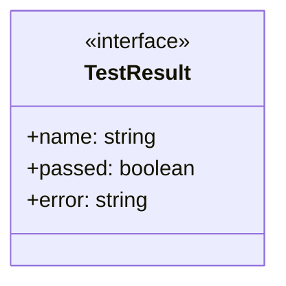
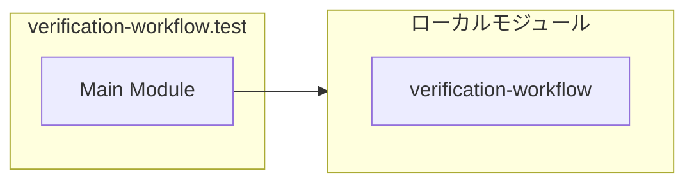

# verification-workflow.test

## 概要

`verification-workflow.test` モジュールのAPIリファレンス。

## インポート

```typescript
import { shouldTriggerVerification, isHighStakesTask, resolveVerificationConfig... } from './verification-workflow.js';
```

## エクスポート一覧

| 種別 | 名前 | 説明 |
|------|------|------|

## 図解

### クラス図



### 依存関係図



## 関数

### test

```typescript
test(name: string, fn: () => void): void
```

**パラメータ**

| 名前 | 型 | 必須 |
|------|-----|------|
| name | `string` | はい |
| fn | `() => void` | はい |

**戻り値**: `void`

### assertEqual

```typescript
assertEqual(actual: T, expected: T, message?: string): void
```

**パラメータ**

| 名前 | 型 | 必須 |
|------|-----|------|
| actual | `T` | はい |
| expected | `T` | はい |
| message | `string` | いいえ |

**戻り値**: `void`

### assertDeepEqual

```typescript
assertDeepEqual(actual: T, expected: T, message?: string): void
```

**パラメータ**

| 名前 | 型 | 必須 |
|------|-----|------|
| actual | `T` | はい |
| expected | `T` | はい |
| message | `string` | いいえ |

**戻り値**: `void`

### assertTrue

```typescript
assertTrue(value: boolean, message?: string): void
```

**パラメータ**

| 名前 | 型 | 必須 |
|------|-----|------|
| value | `boolean` | はい |
| message | `string` | いいえ |

**戻り値**: `void`

### assertFalse

```typescript
assertFalse(value: boolean, message?: string): void
```

**パラメータ**

| 名前 | 型 | 必須 |
|------|-----|------|
| value | `boolean` | はい |
| message | `string` | いいえ |

**戻り値**: `void`

### createDefaultContext

```typescript
createDefaultContext(overrides: Partial<VerificationContext>): VerificationContext
```

**パラメータ**

| 名前 | 型 | 必須 |
|------|-----|------|
| overrides | `Partial<VerificationContext>` | はい |

**戻り値**: `VerificationContext`

### restoreEnv

```typescript
restoreEnv(): void
```

**戻り値**: `void`

## インターフェース

### TestResult

```typescript
interface TestResult {
  name: string;
  passed: boolean;
  error?: string;
}
```

---
*自動生成: 2026-02-18T07:17:30.519Z*
